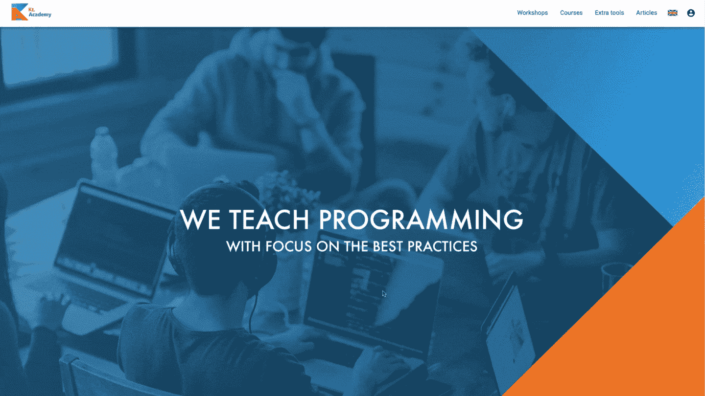

# 有效的科特林更新&来自 Kt 的新闻。学院

> 原文：<https://blog.kotlin-academy.com/effective-kotlin-updates-news-from-kt-academy-b919dd2374e2?source=collection_archive---------2----------------------->

你好卡帕头。这里是学院**👋**

稍事休息后，我们将为您带来一些新的内容和激动人心的消息！

✅:我们现在正在更新《有效的科特林》一书，并在我们的博客上发布了其中的一些内容。
✅网站上有了新的登录系统和用户资料。
✅:我们在报价中加入了专家咨询！
✅新工场来了！
面向波兰观众的✅快速信息。

尽情享受吧！

比起继承，组合更受欢迎是 OOP 的普遍规则，但是 Kotlin 更鼓励组合。
你将从文章“ [**更喜欢组合而不是继承**](https://kt.academy/article/ek-composition) ”中了解更多，该文章是由 [Marcin Moskala](https://medium.com/u/171dab54cea9?source=post_page-----b919dd2374e2--------------------------------) **撰写的“有效的科特林”一书的一部分👇**

为了使我们的网站更加直观和易于使用，我们创建了一个新的登录系统。从现在起，您只需点击两次即可登录，并在新面板中管理您的个人资料和偏好设置。

从来没有这么容易过！👇
[kt.academy](https://kt.academy/)

请记住，你现在可以为你的公司或你自己预约一次专家咨询。无论您需要一小时还是持续的支持，我们都随时准备提供帮助。

转到您感兴趣的[研讨会页面](https://kt.academy/workshop)并填写表格👇

我们一直在努力拓展我们的产品，让每个人都能找到适合自己的产品🤩

现在有几个新的工作坊你可以在我们的网站上注册:
➡️ [JavaScript 初学者](https://kt.academy/workshop/JavaScriptForBeginners)
➡️ [现代 JavaScript](https://kt.academy/workshop/modernJavaScript)
➡️[typescript](https://kt.academy/workshop/TypeScript)
➡️[Android 应用开发](https://kt.academy/workshop/AndroidApplication)

如果您对我们的任何研讨会感兴趣，只需访问我们的网站并填写适当的表格，或者如果您有任何其他具体需求，请随时通过 [konrad@kt.academy](http://konrad@kt.academy/) 联系我们的顾问或拨打电话**+48 512–442–052**。

给我们的波兰观众🇵🇱

我们正在发布文章来帮助新手**从头开始学习 JavaScript】并且我们将很快把它们出版成书！
有些是纯 JavaScript 内容，有些比较笼统，比如“如何学习编程”。你可以在我们的博客上找到它们👉【https://kt.academy/pl/article】T4。**

如果您想帮助改进此内容，请使用右侧的小聊天图标给我们留下您的评论💬或者填写文章页面底部的表格，成为我们的审稿人，⍰

此外，为了及时了解波兰语的所有内容，您可以关注我们的新 Twitter 账户— [Kt。学院 PL](https://twitter.com/ktdotacademyPL) **。**

谢谢，再见！

卡帕头。学院团队