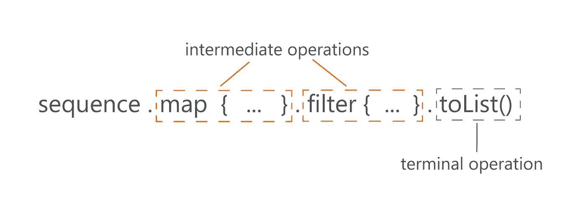
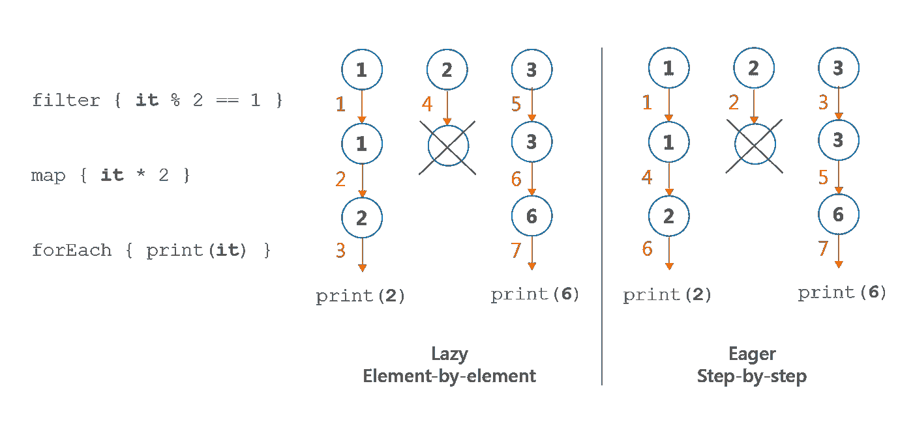
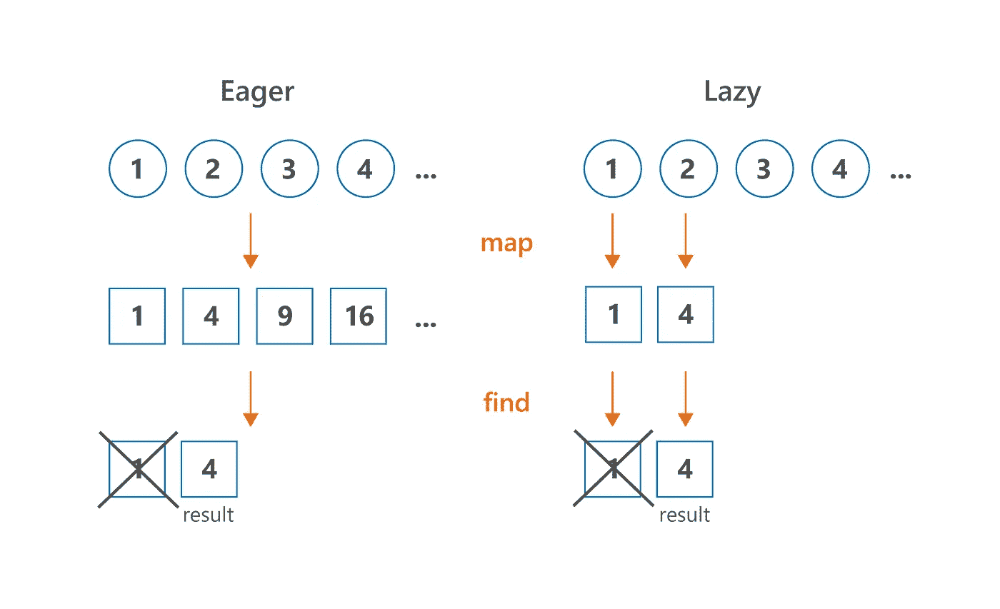
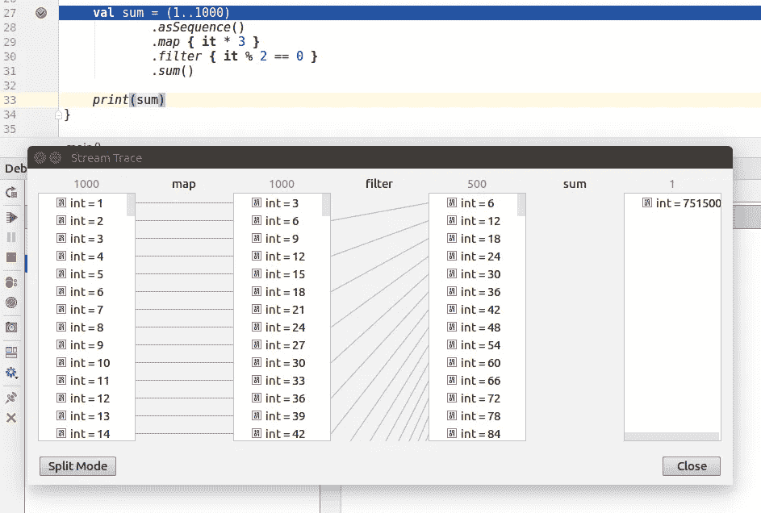

# Effective Kotlin:对于具有多个处理步骤的大集合，首选序列

> 原文：<https://blog.kotlin-academy.com/effective-kotlin-use-sequence-for-bigger-collections-with-more-than-one-processing-step-649a15bb4bf?source=collection_archive---------1----------------------->


这是[有效的科特林书](https://leanpub.com/effectivekotlin/)的一部分。

[](https://kt.academy/book)

人们经常会忽略`Iterable`和`Sequence`的区别。这是可以理解的，因为它们的定义几乎完全相同:

```
**interface** Iterable<**out** T> {
    **operator fun** iterator(): Iterator<T>
}**interface** Sequence<**out** T> {
    **operator fun** iterator(): Iterator<T>
}
```

你可以说它们之间唯一形式上的区别就是名字。虽然`Iterable`和`Sequence`与完全不同的用法相关联(具有不同的契约)，所以它们几乎所有的处理功能都以不同的方式工作。`Sequences`很懒，所以用于`Sequence`处理的中间函数不做任何计算。相反，它们返回一个新的`Sequence`,用新的操作修饰前一个。所有这些计算都在类似`toList`或`count`的终端操作中进行评估。另一方面，Iterable processing 在每一步都返回一个类似于`List`的集合。

```
public inline fun <T> Iterable<T>.filter(
   predicate: (T) -> Boolean
): List<T> {
   return filterTo(ArrayList<T>(), predicate)
}public fun <T> Sequence<T>.filter(
   predicate: (T) -> Boolean
): Sequence<T> {
   return FilteringSequence(this, true, predicate)
}
```

> `Sequence filter`是一个中间操作，所以它不做任何计算，而是用新的处理步骤修饰序列。计算在类似`toList`的终端操作中完成。

因此，集合处理操作一旦被使用就会被调用。`Sequence` 处理功能直到终端操作(返回除`Sequence`以外的其他内容的操作)才被调用。例如，对于`Sequence`，`filter`是一个中间操作，所以它不做任何计算，而是用新的处理步骤来修饰序列。计算在类似`toList`的终端操作中完成。



```
val seq = sequenceOf(1,2,3)
val filtered = seq.filter { print("f$it "); it % 2 == 1 }
println(filtered)  // FilteringSequence@...val asList = filtered.toList() // f1 f2 f3
println(asList) // [1, 3]val list = listOf(1,2,3)
val listFiltered = list
  .filter { print("f$it "); it % 2 == 1 } // f1 f2 f3
println(listFiltered) // [1, 3]
```

在 Kotlin 中，序列是惰性的，这有几个重要的优点:

*   它们保持自然的操作顺序
*   他们做最少的手术
*   它们可以是无限的
*   他们不需要在每一步都创建集合

下面就一个一个的说说那些优势吧。

[](https://learningdriven.fun/)

## 秩序很重要

由于 iterable 和 sequence 处理的实现方式不同，它们的操作顺序也不同。在序列处理中，我们获取第一个元素并应用所有操作，然后获取下一个元素，依此类推。我们将称之为逐元素或懒惰顺序。在可迭代处理中，我们采用第一个操作，并将其应用于整个集合，然后移动到下一个操作，依此类推..我们称之为循序渐进或急切订单。

```
sequenceOf(1,2,3)
       .filter { print("F$it, "); it % 2 == 1 }
       .map { print("M$it, "); it * 2 }
       .forEach { print("E$it, ") } // Prints: F1, M1, E2, F2, F3, M3, E6,listOf(1,2,3)
       .filter { print("F$it, "); it % 2 == 1 }
       .map { print("M$it, "); it * 2 }
       .forEach { print("E$it, ") } // Prints: F1, F2, F3, M1, M3, E2, E6,
```



请注意，如果我们要在没有任何集合处理函数的情况下实现这些操作，而是使用传统的循环和条件，我们将像在序列处理中一样，对元素进行逐个排序:

```
for (e in listOf(1,2,3)) {
   print("F$e, ")
   if(e % 2 == 1) {
       print("M$e, ")
       val mapped = e * 2
       print("E$mapped, ")
   }
}
// Prints: F1, M1, E2, F2, F3, M3, E6,
```

因此，在序列处理中使用的逐个元素的顺序更加自然。它还为低级编译器优化打开了大门——序列处理可以针对基本循环和条件进行优化。也许在未来，它会是。

## 序列执行最少的操作

通常，我们不需要在每一步都处理整个集合来产生结果。假设我们有一个集合，有几百万个元素，经过处理后，只需要取前 10 个。为什么要处理所有其他元素？Iterable 处理没有中间操作的概念，所以整个集合被处理，就好像它将在每个操作中被返回一样。序列不需要这样做，因此它们将执行获得结果所需的最少数量的操作。



看看这个例子，我们有几个处理步骤，我们用`find`结束我们的处理:

```
(1..10).asSequence()
   .filter { print("F$it, "); it % 2 == 1 }
   .map { print("M$it, "); it * 2 }
   .find { it > 5 }
// Prints: F1, M1, F2, F3, M3,(1..10)
   .filter { print("F$it, "); it % 2 == 1 }
   .map { print("M$it, "); it * 2 }
   .find { it > 5 }
// Prints: F1, F2, F3, F4, F5, F6, F7, F8, F9, F10, M1, M3, M5, M7, M9,
```

因此，当我们有一些中间处理步骤，并且我们的终端操作不一定需要迭代所有元素时，使用序列很可能对您的处理性能更好。所有这些看起来与标准的收集处理几乎相同。这种操作的例子有`first`、`find`、`take`、`any`、`all`、`none`或`indexOf`。

[](https://kt.academy/)

## 序列可以是无限的

感谢序列按需处理的事实，我们可以拥有无限的序列。创建无限序列的典型方法是使用像`generateSequence`或`sequence`这样的序列发生器。第一个需要第一个元素和一个指定如何计算下一个元素的函数:

```
generateSequence(1) { it + 1 }
       .map { it * 2 }
       .take(10)
       .forEach { print("$it, ") }
// Prints: 2, 4, 6, 8, 10, 12, 14, 16, 18, 20,
```

第二个提到的序列生成器——`sequence`——使用一个暂停函数(协程)按需生成下一个数字。每当我们请求下一个数字时，序列生成器就会运行，直到使用`yield`产生一个值。然后执行停止，直到我们要求另一个数字。下面是下一个斐波那契数列的无限列表:

```
val fibonacci = sequence {
   yield(1)
   var current = 1
   var prev = 1
   while (true) {
       yield(current)
       val temp = prev
       prev = current
       current += temp
   }
}print(fibonacci.take(10).toList()) 
// [1, 1, 2, 3, 5, 8, 13, 21, 34, 55]
```

请注意，无限序列在某些时候需要有限数量的元素。我们不能在无穷大上迭代。

```
print(fibonacci.toList()) // Runs forever
```

因此，我们要么需要使用类似`take`的操作来限制它们，要么需要使用不需要所有元素的终端操作，例如`first`、`find`、`any`、`all`、`none`或`indexOf`。基本上，这些操作都是序列更有效的操作，因为它们不需要处理所有的元素。尽管请注意，对于大多数这些操作，很容易陷入无限循环。`any`只能返回`true`或者永远运行。类似地,`all`和`none`只能在无限集合上返回`false`。因此，我们通常要么通过`take`限制元素的数量，要么使用`first`只要求第一个元素。

## 序列不会在每个处理步骤都创建集合

标准集合处理函数在每一步都返回一个新的集合。最常见的是一个`List`。这可能是一个优势——在每一点之后，我们都有一些东西可以使用或储存。但这是有代价的。每一步都需要创建这样的集合并用数据填充。

```
numbers
   .filter { it % 10 == 0 } // 1 collection here
   .map { it * 2 } // 1 collection here
   .sum() 
// In total, 2 collections created under the hoodnumbers
   .asSequence()
   .filter { it % 10 == 0 }
   .map { it * 2 }
   .sum() 
// No collections created
```

这是一个问题，尤其是当我们处理大的或沉重的集合时。让我们从一个极端但常见的例子开始:文件读取。文件可能有千兆字节重。在每个处理步骤中分配集合中的所有数据将是对内存的巨大浪费。这就是为什么默认情况下我们使用序列来处理文件。

举个例子，让我们分析一下芝加哥市的犯罪。这座城市，像许多其他城市一样，在互联网上共享了自 2001 年以来发生在那里的所有犯罪的数据库(你可以在 www.data.cityofchicago.org[的](http://www.data.cityofchicago.org)找到这个数据库)。该数据集目前超过 1.53 GB。假设我们的任务是找出有多少犯罪描述中有大麻。这是一个使用集合处理的简单解决方案的样子(`readLines`返回`List<String>`):

```
// BAD SOLUTION, DO NOT USE COLLECTIONS FOR 
// POSSIBLY BIG FILES
File("ChicagoCrimes.csv").readLines()
   .drop(1) // Drop descriptions of the columns
   .mapNotNull { it.split(",").getOrNull(6) } 
    // Find description
   .filter { "CANNABIS" in it } 
   .count()
   .let(::println)
```

我电脑上的结果是`OutOfMemoryError`。

```
Exception in thread "main" java.lang.OutOfMemoryError: Java heap space
```

难怪。我们创建一个集合，然后我们有 3 个中间处理步骤，总共 4 个集合。其中 3 个包含该数据文件的大部分，需要 1.53 GB，因此它们都需要消耗 4.59 GB 以上。这是对内存的巨大浪费。正确的实现应该包括使用一个序列，我们使用函数`useLines`来实现，它总是在一行上操作:

```
File("ChicagoCrimes.csv").useLines { lines ->
// The type of `lines` is Sequence<String>
   lines
       .drop(1) // Drop descriptions of the columns
       .mapNotNull { it.split(",").getOrNull(6) } 
       // Find description
       .filter { "CANNABIS" in it } 
       .count()
       .let { println(it) } // 318185
```

为了比较两种方法的效率，我做了另一个实验，通过删除我不需要的列来减小数据集的大小。通过这种方式，我实现了 CrimeData.csv 文件，其中包含相同的罪行，但大小只有 728 MB。然后我做了同样的处理。在第一个实现中，使用集合处理，大约需要 13 秒；而第二个，使用序列，大约 4.5s。正如你所看到的，对较大的文件使用序列不仅是为了内存，也是为了性能。

虽然一个集合不需要很重。事实上，在每一个步骤中，我们都在创建一个新的集合，这本身也是一种成本，当我们处理具有大量元素的集合时，这种成本就会显现出来。差别并不大——主要是因为经过许多步骤后创建的集合被初始化为预期的大小，所以当我们添加元素时，我们只需将它们放在下一个位置。这种差异仍然很大，这也是为什么我们应该**更喜欢对具有多个处理步骤**的大集合使用 Sequence 的主要原因。

我说的“大收藏”指的是很多元素和非常重的收藏。它可能是一个包含数万个元素的整数列表。它也可能是一个只有几个字符串的列表，但是每个字符串都很长，以至于它们都需要很多兆字节的数据。这些情况并不常见，但有时会发生。

对于一个处理步骤，我指的是不止一个用于集合处理的函数。所以如果你比较这两个函数:

```
fun singleStepListProcessing(): List<Product> {
   return productsList.filter { it.bought }
}fun singleStepSequenceProcessing(): List<Product> {
   return productsList.asSequence()
           .filter { it.bought }
           .toList()
}
```

您会注意到性能几乎没有差别(实际上简单的列表处理更快，因为它的`filter`函数是内联的)。虽然当您比较具有多个处理步骤的函数时，比如下面的函数，它们使用了`filter`和`map`，但是对于更大的集合来说，这种差异是显而易见的。为了看出区别，让我们比较一下 5000 种产品的典型加工与两个和三个加工步骤:

```
fun twoStepListProcessing(): List<Double> {
   return productsList
           .filter { it.bought }
           .map { it.price }
}fun twoStepSequenceProcessing(): List<Double> {
   return productsList.asSequence()
           .filter { it.bought }
           .map { it.price }
           .toList()
}fun threeStepListProcessing(): Double {
   return productsList
           .filter { it.bought }
           .map { it.price }
           .average()
}fun threeStepSequenceProcessing(): Double {
   return productsList.asSequence()
           .filter { it.bought }
           .map { it.price }
           .average()
}
```

下面你可以看到在 MacBook Pro(处理器 2.6 GHz 英特尔酷睿 i7，内存 16 GB 1600 MHz DDR3)上对 5000 个产品的平均结果`productsList`:

```
twoStepListProcessing                        81 095 ns
twoStepSequenceProcessing                    55 685 ns
twoStepListProcessingAndAcumulate            83 307 ns
twoStepSequenceProcessingAndAcumulate         6 928 ns
```

很难预测我们应该期待什么样的性能改进。根据我的观察，在包含多个步骤的典型集合处理中，对于至少几千个元素，我们可以预期大约 20–40%的性能提升。

## 什么时候序列不是更快？

在一些操作中，我们不能从序列的使用中获益，因为我们必须对整个集合进行操作。`sorted`是 Kotlin stdlib 中的一个例子(目前是唯一的例子)。`sorted`使用最佳实现:它将`Sequence`累积到`List`中，然后使用 Java stdlib 中的`sort`。缺点是，如果我们将其与在`Collection`上的相同处理进行比较，这个累加过程需要一些额外的时间(尽管如果 Iterable 不是一个`Collection`或数组，那么差异并不显著，因为它也需要被累加)。

如果`Sequence`应该有类似于`sorted`的方法，这是有争议的，因为具有要求所有元素计算下一个元素的方法的序列只是部分懒惰的(当我们需要获得第一个元素时进行评估),并且不适用于无限序列。添加它是因为它是一个受欢迎的功能，并且以这种方式使用它要容易得多。尽管 Kotlin 开发人员应该记得它的缺陷，尤其是它不能用于无限序列。

```
generateSequence(0) { it + 1 }.take(10).sorted().toList() 
// [0, 1, 2, 3, 4, 5, 6, 7, 8, 9]
generateSequence(0) { it + 1 }.sorted().take(10).toList() 
// Infinite time. Does not return.
```

`sorted`是`Collection`比`Sequence`更快的加工步骤的一个罕见例子。尽管如此，当我们执行一些处理步骤和单个排序函数(或者其他需要在整个集合上工作的函数)时，我们可以期待使用序列处理来提高性能。

```
// Benchmarking measurement result: 150 482 ns
fun productsSortAndProcessingList(): Double {
   return productsList
           .sortedBy { it.price }
           .filter { it.bought }
           .map { it.price }
           .average()
}// Benchmarking measurement result: 96 811 ns
fun productsSortAndProcessingSequence(): Double {
   return productsList.asSequence()
           .sortedBy { it.price }
           .filter { it.bought }
           .map { it.price }
           .average()
}
```

[](https://leanpub.com/effectivekotlin/c/3YYtCtqCC6a4)

## Java 流呢？

Java 8 引入了流来支持集合处理。它们的行为和外观与科特林序列相似。

```
productsList.asSequence()
       .filter { it.bought }
       .map { it.price }
       .average()productsList.stream()
       .filter { it.bought }
       .mapToDouble { it.price }
       .average()
       .orElse(0.0)
```

Java 8 流是懒惰的，在最后(终端)处理步骤中收集。Java 流和 Kotlin 序列之间的三大区别如下:

*   Kotlin 序列有更多的处理函数(因为它们被定义为扩展函数),并且它们通常更容易使用(这是因为 Kotlin 序列是在 Java 流已经被使用时设计的——例如，我们可以使用`toList()`而不是`collect(Collectors.toList())`来收集)
*   Java 流处理可以使用并行函数在并行模式下启动。当我们拥有一台拥有多个经常未使用的内核的机器时(这在当今很常见)，这可以给我们带来巨大的性能提升。尽管要小心使用，因为这个特性有已知的缺陷(问题来自他们使用的公共 join-fork 线程池。因此，一个进程可能会阻塞另一个进程。还有一个问题是单个元素处理会阻塞其他元素。点击这里了解更多:【https://dzone.com/articles/think-twice-using-java-8[。](https://dzone.com/articles/think-twice-using-java-8)
*   Kotlin 序列可用于通用模块、Kotlin/JVM、Kotlin/JS 和 Kotlin/Native 模块。Java 流只能在 Kotlin/JVM 中传输，并且只能在 JVM 版本至少为 8 时传输。

一般来说，当我们不使用并行模式时，很难给出一个简单的答案，Java 流和 Kotlin 序列哪个效率更高。我的建议是很少使用 Java 流，只在计算量大的处理中使用，这样可以从并行模式中获益。否则，使用 Kotlin stdlib 函数来获得一个可以在不同平台或公共模块上使用的同构且干净的代码。

## 科特林序列调试

Kotlin Sequence 和 Java Stream 都支持帮助我们调试每一步的元素流。对于 Java 流，它需要一个名为“Java 流调试器”的插件。Kotlin Sequences 也需要名为“Kotlin Sequence Debugger”的插件，尽管现在这个功能已经集成到 Kotlin 插件中。以下屏幕显示了每个步骤的序列处理:



## 摘要

集合和序列处理非常相似，都支持几乎相同的处理方法。然而，这两者之间有着重要的区别。序列处理更难，因为我们通常将元素保存在集合中，因此更改集合需要转换到序列，并且通常还需要转换回所需的集合。序列是懒惰的，这带来了一些重要的优势:

*   它们保持自然的操作顺序
*   他们做最少的手术
*   它们可以是无限的
*   他们不需要在每一步都创建集合

因此，它们更适合处理较重的物体或具有多个处理步骤的较大集合。Kotlin Sequence Debugger 也支持序列，它可以通过可视化元素的处理方式来帮助我们。序列不能取代经典的集合处理。您应该只在有充分理由的时候才使用它们，并且您将获得显著的性能优化。

# 有效科特林

这是关于有效科特林的第三篇文章。当我们看到兴趣，我们将出版下一部分。在卡帕头。学院我们也在研究关于这个主题的书:

[](https://leanpub.com/effectivekotlin) [## 有效科特林

### 这本书对官方的(Kotlin 和 Google 对 Kotlin 的最佳实践)和…

leanpub.com](https://leanpub.com/effectivekotlin) 

它将涵盖更广泛的主题，并深入其中的每一个问题。它还将包括 Kotlin 和 Google 团队发布的最佳实践、与我们合作的 Kotlin 团队成员的经验，以及“Kotlin 中的有效 Java”系列中涉及的主题。为了支持它并使我们更快地发布它，[使用此链接并订阅](https://leanpub.com/effectivekotlin)。

你需要 Kotlin 工作室吗？访问[我们的网站](https://kt.academy/)，看看我们能为您做些什么。

了解卡帕头最新的重大新闻。学院，[订阅时事通讯](https://kotlin-academy.us17.list-manage.com/subscribe?u=5d3a48e1893758cb5be5c2919&id=d2ba84960a)，[观察 Twitter](https://twitter.com/ktdotacademy) 并在 medium 上关注我们。

在 Twitter 上引用我，用 [@MarcinMoskala](https://twitter.com/marcinmoskala) 。使用以下链接订阅时事通讯:

[](http://eepurl.com/diMmGv)

喜欢的话记得**拍**。请注意，如果您按住鼓掌按钮，您可以留下更多的掌声。