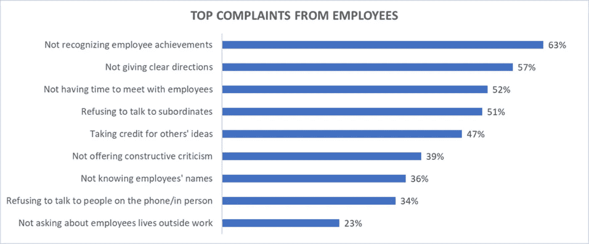
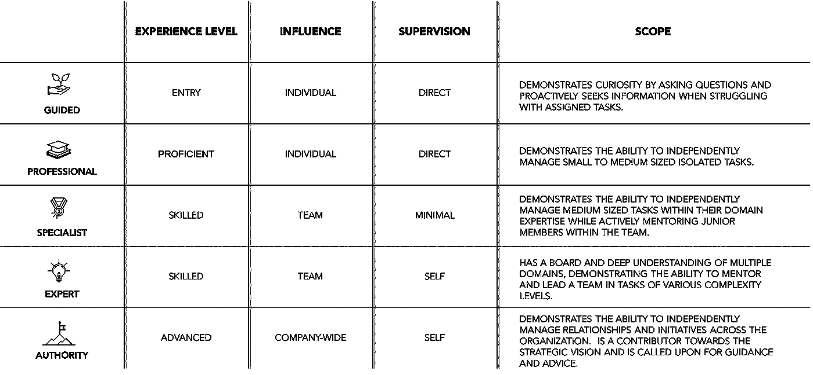

# 有效的一对一会议——揭秘。

> 原文：<https://medium.com/walmartglobaltech/effective-one-on-one-meetings-the-secret-revealed-550e8f120e18?source=collection_archive---------2----------------------->

Credit: [marrio31](https://www.istockphoto.com/photo/rational-thinking-gm840191912-136857073)

一对一会议对于在经理和员工之间建立信任和强大的沟通渠道至关重要。如果没有合适的结构，这些会议很快就会适得其反，让员工感到沮丧。如果运行有效，这些会议提供了一个讨论职业发展、成就和改进领域的论坛。

Interact/Harris Poll 对大约 1000 名美国员工进行了一项在线调查，确定了员工对经理的最大抱怨。结果:91%的人提到经理沟通挑战是争论的来源，特别是在接收建设性的反馈、获得明确的方向和安排会面时间方面。

下图突出显示了调查中的主要投诉。

Online Survey Results from Interact/Harris Poll of 1,000 U.S. Employees

看看上面的结果，有没有让你产生共鸣的？如果有，继续读。

# 游戏计划

Credit: [marrio31](https://www.istockphoto.com/photo/game-plan-gm521618038-91423225)

本文涵盖的 4 个步骤可用于提供结构并提高一对一会议的整体效率。

*对员工来说:*你将会深入了解一个建设性的一对一会议是什么样的。读完这篇文章后，如果你没有得到你所需要的支持，与你的经理进行一次坦诚的交谈，清楚地表达出你在工作中需要的反馈类型。

*对于经理:*你将深入了解如何通过设定明确的期望、定义现实的职业规划、概述可衡量的结果以及提供建设性的反馈来组织一对一的会议。你的目标是确保你和你的员工对成功的定义是一致的。

需要注意的是，员工和经理都有责任为一对一会议定下基调。通过遵循以下步骤，您将看到开放式沟通、问责制和职业发展的转变。

# **有效一对一会谈的 4 个步骤**

Credit: [marrio31](https://www.istockphoto.com/photo/new-mindset-new-results-gm866068744-143955723)

## **步骤#1:根据经验水平进行调整**

正如我在我的文章[中提到的，5 项原则保证有助于建立强大的团队文化](/walmartlabs/5-principles-guaranteed-to-help-build-a-strong-team-culture-6055ab478c56)，我谈到了角色清晰和给员工分配符合他们技能的任务的重要性。

作为经理，你的第一个行动是确定每个员工的经验水平，并清楚地阐明他们在团队中的角色和职责。

使用下表来帮助推动您的对话。

Employee Experience Table — © [The Practical Leadership Guy](http://claudejones.me)

使用这种方法将确保两件事:

*   对于当前的角色期望，以及哪些行为需要*始终如一地*展示以供下一级考虑，没有任何模糊之处。
*   从支持和执行的角度来看，它在经理和员工之间提供了一定程度的责任。

## **第二步:制定职业规划**

下一步是定义职业规划。这包括:与员工的职业目标保持一致，确定实现这些目标所需的机会，并制定一个清晰的执行计划进行监控。

为了方便这部分对话，我使用了由格雷厄姆·亚历山大、艾伦·费恩和约翰·惠特莫尔开发的成长模型。

GROW 分为四个部分:

*   **目标:** *你想要什么？*确定团队成员在职业生涯中真正想要实现的目标。
*   **现实:** *现在发生了什么？*让团队成员了解他们当前的角色和技能。
*   **选项:** *你能做什么？*为缩小目标与现实之间的差距创造多种选择。
*   **会:**你会怎么做？确定从现实走向目标的可行步骤。

使用这种模式可以进一步增强员工对经理的信任，因为他们共同投资于个人成功和职业发展目标。

谷歌鼓励他们的经理在职业对话中使用 GROW 模型。他们已经创建了一个可定制的[模板](https://rework.withgoogle.com/guides/managers-care-professionally-personally-for-team/steps/structure-career-conversations-with-grow/)，带有起始问题，您可以在下一次会议中使用。

## **第三步:勾勒出一个清晰的方法来衡量进展**

既然你已经定义了一个职业规划，并设定了一系列要实现的目标，下一步就是决定如何最好地衡量进展。这可以分为两部分:

## **成绩**

这代表“什么”。给定的任务，*实际上完成了什么*。

*   完成任务需要帮助还是独立完成？
*   从 0%-100%完成任务的百分比是多少？
*   任务是否按时高质量地完成了？

## **能力**

这代表“如何”。给定的任务，它实际上是如何完成的？

能力包括四个子类别:

*判断:*

*   决策是基于数据还是受观点驱动？
*   问题是否及时上报，以免影响项目？
*   问题是否被不必要地提交给领导层，而不是试图首先在内部解决？

*以客户为中心:*

*   是否对客户的需求有充分的了解？
*   任务是否从客户的角度实施？
*   是否根据客户影响及时处理支持请求？

*策划和改进:*

*   在开始实施之前，是否完全了解工作范围？
*   是否为每项任务定义了准确的评估？
*   是否建议了替代解决方案来帮助降低风险？

*影响与传播:*

*   想法是以一种有组织和简洁的方式传达的吗？
*   他们在团队环境中工作得好吗，或者他们倾向于孤岛式开发吗？
*   他们是愿意接受他人的观点，还是倾向于主导对话？

*适应性:*

*   是否愿意在他们的舒适区之外工作？
*   他们能很好地适应组织的变化吗？
*   他们引领变革吗？

成绩和能力都应该用来准确地衡量进展。确保事先与员工就分配的所有任务的“内容”和“方式”达成一致。这将确保对成功有一个共同的理解。

**重要提示:**根据员工的经验水平调整你的交付期望。在确定增长机会时，这对于准确评估至关重要。

## **步骤#4:提供相关反馈**

既然你已经有了衡量进展的基准，最后一步就是提供反馈。

持续反馈对于帮助员工洞察成长机会或用于强化积极行为至关重要。由 [Office Vibe](https://www.officevibe.com/) 进行的一项[研究](https://www.officevibe.com/employee-engagement-solution/employee-feedback)得出了一些关于反馈重要性的有趣数据:

*   65%的员工表示他们想要更多的反馈
*   69%的员工表示，如果他们觉得自己的努力得到了更好的认可，他们会更加努力工作
*   92%的人认为建设性反馈能有效提高绩效
*   83%的千禧一代表示，他们从经理那里得到的反馈没有意义

如你所见，员工需要反馈。实际上，员工想要*相关的*反馈。如果你在这方面感到有挑战，不要担心，给予反馈是最难掌握的技能之一。解决方案:准备和交付。

我用两种模式向员工提供建设性的反馈。

## **情境-行为-影响反馈模型**

简称为 SBI 反馈模型，这种模型只关注事实，因此个人可以理解他们行动的效果。SBI 代表:

*   情境:具体描述情境。
*   行为:描述观察到的行为；不要试图猜测行为的动机或原因。
*   影响:描述观察到的行为产生的影响。

SBI 模式非常适合将情绪排除在过程之外。使用这种反馈模式时，使用“我”的陈述和保留判断是很重要的；否则，它会破坏你给出的反馈。

## **彭德尔顿的反馈过程模型**

彭德尔顿的反馈模型鼓励接受反馈的人成为积极的参与者。它允许在过程中而不是之后进行自我反思。这种模式鼓励经理和员工之间的公开对话。

以下是要遵循的步骤:

*   检查员工是否需要并准备好反馈。
*   让员工对观察到的行为或情况给出评论/背景。
*   员工指出哪些事情进展顺利。
*   经理确认哪些事情进展顺利。
*   员工陈述可以改进的地方。
*   经理陈述了可以改进的地方。
*   员工和经理就改进行动计划达成一致。

给出有效反馈的过程可能很难操作，但是通过练习，你很快就会磨练你的技能。

# **齐心协力**

Credit: [marrio31](https://www.istockphoto.com/photo/choose-your-personality-that-matching-you-gm664968700-121094079)

使用上述步骤作为指导，在一次会议上组织下一次会议。记住，有效的沟通是关键。

以下是一些需要记住的分手技巧:

*   反馈应该是频繁和持续的。至少每月和你的员工开一次会(并坚持下去！).
*   提供建设性反馈时，提供正面和负面的例子来帮助强化预期行为。
*   反馈应该是基于“事实”的客观，而不是基于“感觉”的主观。
*   定义目标时，要具体、有针对性、可操作。这将确保需要完成的任务的清晰性和一致性。
*   要合作。给员工留出提问的时间，并确保讨论的内容一致。
*   写下来。对话结束后，记录对话。这将有助于加强讨论，并让经理和员工对任何行动项目负责。

我保证，通过一点实践，你的一对一会议将会转变为产生结果的引人入胜的建设性对话。