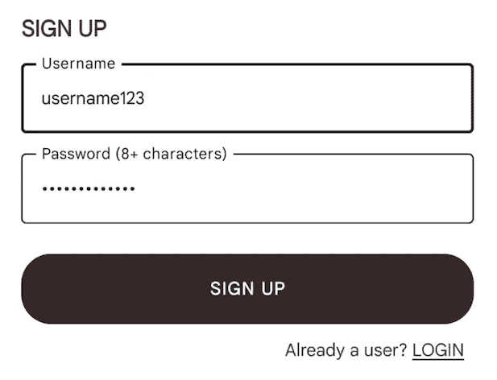
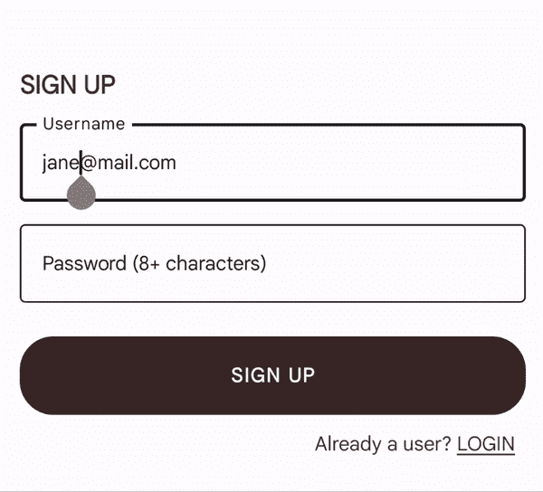
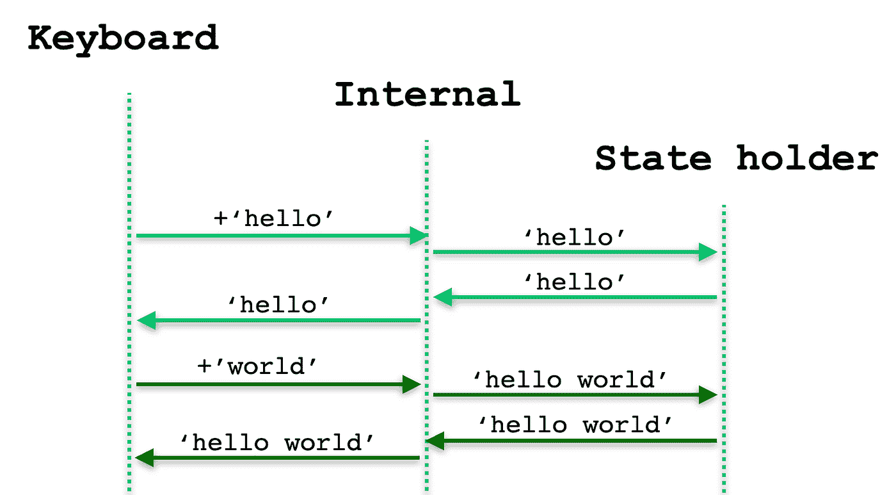
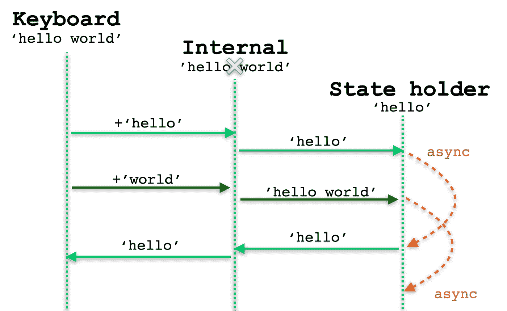
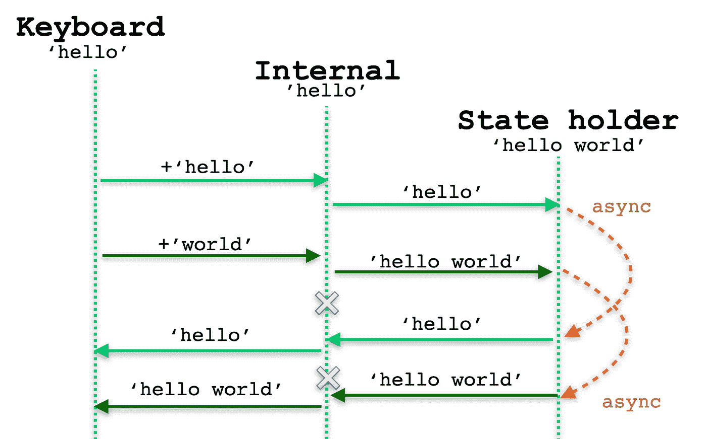
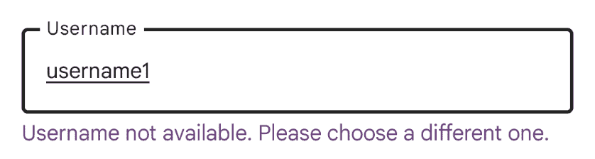
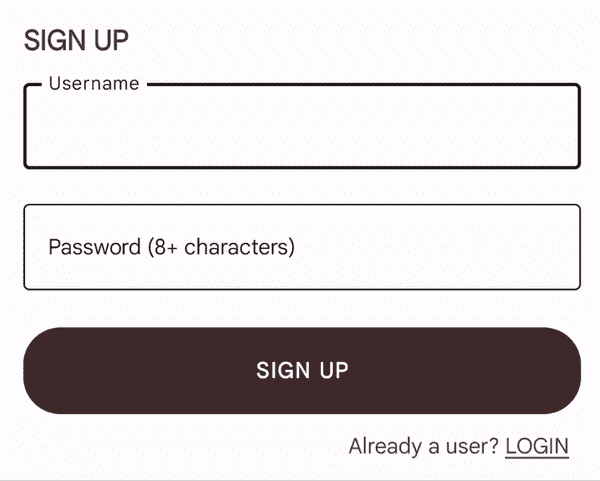

# Compose 中文本字段的有效状态管理

> 原文：<https://medium.com/androiddevelopers/effective-state-management-for-textfield-in-compose-d6e5b070fbe5?source=collection_archive---------0----------------------->

***TL；*博士**

*   *防止同步问题和意外行为:* –*避免键入和更新* `*TextField*` *状态之间的延迟/异步行为。* —*void 保持* `*TextField*` *状态使用一个反应流(例如从* `*StateFlow*` *收集使用默认调度器)* —*定义* `*TextField*` *状态变量用像* `*MutableState<String>*` *这样的 API 进行组合。*
*   *需要时将* `*TextField*` *状态提升到* `*ViewModel*` *状态，例如对* `*TextField*` *内容进行业务验证。*
*   *我们正在努力提高* `*TextField*` *的能力。检查*[*goo.gle/compose-roadmap*](http://goo.gle/compose-roadmap)*并期待未来的版本。*

假设我们必须在 Jetpack Compose 应用程序中实现一个注册屏幕，我们收到了以下设计:

*Implementing a sign up screen with two TextFields*

我们有两个`[TextField](https://developer.android.com/reference/kotlin/androidx/compose/material/package-summary#TextField(kotlin.String,kotlin.Function1,androidx.compose.ui.Modifier,kotlin.Boolean,kotlin.Boolean,androidx.compose.ui.text.TextStyle,kotlin.Function0,kotlin.Function0,kotlin.Function0,kotlin.Function0,kotlin.Boolean,androidx.compose.ui.text.input.VisualTransformation,androidx.compose.foundation.text.KeyboardOptions,androidx.compose.foundation.text.KeyboardActions,kotlin.Boolean,kotlin.Int,androidx.compose.foundation.interaction.MutableInteractionSource,androidx.compose.ui.graphics.Shape,androidx.compose.material.TextFieldColors))`组件和一个`[Button](https://developer.android.com/reference/kotlin/androidx/compose/material/package-summary#button)`。
让我们从顶部的`TextField`开始，这是用户名字段。
要在 Compose 中实现一个`TextField`，我们需要定义一个状态变量:

1.  存储显示的当前值，并传递给`TextField`值参数。
2.  每当用户在`TextField`的`onValueChange`回调中输入新文本时，就会得到更新。

当处理状态时，一个重要的事情是决定在哪里放置状态变量。在我们的例子中，我们希望对用户名执行一些业务逻辑验证，因此我们将状态提升到`ViewModel`，而不是保存在可组合函数中。有关这一点以及如何组织你的应用架构的更多信息，你可以阅读我们的[架构指南](http://d.android.com/topic/architecture)。
通过将我们的状态置于`ViewModel`中，`TextField`值将免费保存在[配置更改](https://developer.android.com/topic/libraries/architecture/saving-states)中。

考虑到这些需求，我们创建了一个可组合的注册屏幕，包含一个类似于下面的`OutlinedTextField`:

接下来，在`ViewModel`中，我们将定义状态变量并执行业务逻辑。

**目前不建议用无功流来定义** `**TextField**` **的状态变量。我们将在接下来的章节中探究原因并深入探究这些和其他陷阱，但是现在，假设我们犯了这个错误。我们错误地定义了一个类型为`[MutableStateFlow](https://kotlinlang.org/api/kotlinx.coroutines/kotlinx-coroutines-core/kotlinx.coroutines.flow/-mutable-state-flow/)`的变量`_username`来存储`TextField`状态，并通过定义不可变的后台变量`username`来公开它。**

每当用户在`TextField`上键入一个新字符时，异步方法`updateUsername`将调用一个服务来验证用户名是否可用(例如以前没有使用过)。如果验证失败，它将显示一条错误消息，要求选择不同的用户名。

# 问题

我们已经完成了用户名字段的实现。如果我们现在运行应用程序，我们应该能够测试它:

`*TextField*` *incorrect behavior as we try to edit username* [*jane@mail.com*](mailto:jane@mail.com) *into* [*jane.surname@mail.com*](mailto:jane.surname@mail.com)

当我们打字时，我们很快注意到不正确的行为:一些字母在我们打字时被跳过，一些以错误的顺序添加到输入中，整个位被复制，光标来回跳动。所有编辑操作都失败，包括删除和选择要替换的文本。显然有错误。

发生了什么，我们如何解决？

# TextField 的内部

在编写时(使用 Compose UI [1.3.0-beta01](https://developer.android.com/jetpack/androidx/releases/compose-ui#1.3.0-beta01) )，a `TextField`的实现涉及持有 3 份状态副本:

*   *IME(输入法编辑器):*为了能够执行智能操作，如建议下一个单词或替换单词的表情符号，键盘需要有当前显示文本的副本。
*   *状态保持器*由用户定义和更新，在上例中是一个`MutableStateFlow`变量。
*   *内部状态*作为控制器，保持其他两个状态同步，因此您不必手动与 IME 交互。

> 即使每个`TextField`一直有 3 个状态副本，开发人员也只管理其中一个(状态持有者),其他的都是内部的。

这三种状态在幕后是如何相互作用的？简而言之，从键盘键入的每个字符或添加的每个单词都会触发一系列步骤，这些步骤构成一个反馈循环，如下所示:

*Interactions between TextField states*

1.  一个事件从键盘输入(输入单词“ *hello* ”)，并被转发到内部控制器。
2.  内部控制器接收这个更新“hello ”,转发给状态保持器。
3.  用“hello”内容更新状态保持器，这更新了 UI，并通知内部控制器它已经接收到更新。
4.  内部控制器通知键盘。
5.  键盘得到通知，因此它可以为下一个输入事件做准备，例如，建议下一个单词。

只要这些状态副本保持同步，`TextField`就会按预期工作。

***然而，通过在打字过程中引入异步行为和竞争条件，这些副本可能会失去同步，无法恢复。错误的严重程度取决于各种因素，如引入的延迟量、键盘语言、文本内容和长度以及 IME 实现。***

如果您使用的是 [*默认调度器*](https://kotlinlang.org/api/kotlinx.coroutines/kotlinx-coroutines-core/kotlinx.coroutines/-dispatchers/-main.html) ，即使只是使用反应流来表示您的状态(例如`StateFlow`)而没有延迟也可能会导致问题，因为更新事件调度不是立即的*。*

当你开始输入时，让我们试着看看在这种情况下会发生什么。一个新的事件“hello”来自键盘，在我们更新状态和 UI 之前，我们生成了一个异步调用。然后另一个事件“世界”来自键盘。

第一个异步事件恢复，循环完成。当`TextField`内部状态收到异步“hello”时，它会丢弃之前收到的最新“hello world”。

*TextField internal state is overridden to be ‘hello’ instead of ‘hello world’*

但是在某个时候,“hello world”异步事件也会恢复。现在`TextField`持有一个无效状态，其中 3 个状态不匹配。

*TextField inconsistencies after each asynchronous process resumes*

这些意想不到的异步调用与 IME 的处理、快速打字、定时条件和操作(如替换整个文本块的删除)相结合，错误只会变得更加明显。

现在我们对动态有了更多的了解，让我们看看如何解决和避免这些问题。

# 处理 TextField 状态的最佳实践

## 避免更新状态的延迟

当`onValueChange`被调用时，立即同步更新你的`TextField`。

你可能仍然需要以某种方式过滤或修剪你的文本。同步操作可以很好地执行。例如，如果您的同步操作将输入转换为不同的字符集，请考虑使用`[visualTransformation](https://developer.android.com/reference/kotlin/androidx/compose/ui/text/input/VisualTransformation)`。您应该避免异步操作，因为它们会导致上面显示的问题。

## 使用 MutableState 表示 TextField 状态

避免使用反应流(如`StateFlow`)来表示你的`TextField`状态，因为这些结构会引入异步延迟。更喜欢用`[MutableState](https://developer.android.com/reference/kotlin/androidx/compose/runtime/MutableState)`来代替:

> 如果您仍然希望使用`StateFlow`来存储状态，请确保您使用[即时调度器](https://kotlinlang.org/api/kotlinx.coroutines/kotlinx-coroutines-core/kotlinx.coroutines/-main-coroutine-dispatcher/immediate.html)而不是[默认调度器](https://kotlinlang.org/api/kotlinx.coroutines/kotlinx-coroutines-core/kotlinx.coroutines/-dispatchers/-main.html)从流中收集状态。
> 
> 这个解决方案需要更深入的协程知识，可能会导致问题:
> *因为收集是同步的，所以当它发生时，UI 可能处于未准备好运行的状态。
> *干扰 Compose 的线程和渲染阶段，因为它假设重组发生在主线程上。

## 在哪里定义状态

如果您输入时您的`TextField`状态需要业务逻辑验证，那么将状态提升到您的`ViewModel`是正确的。如果没有，您可以使用 Composables 或 state holder 类作为事实的来源。

一般来说，你应该把你的状态放在尽可能低的地方，同时仍然被适当地拥有，这通常意味着更接近它被使用的地方。有关撰写状态的更多信息，可以查看我们的[指南](https://developer.android.com/jetpack/compose/state#managing-state) **。**

在解决这个问题时，在哪里提升状态并不重要，重要的是如何存储状态。

# 在应用中应用最佳实践

考虑到这些最佳实践，让我们对我们的`TextField`状态实现同步和异步验证。

从异步验证开始，如果用户名无效，我们希望在`TextField`下方显示一条错误消息，并且该验证是在服务器端执行的。在我们的用户界面中，它将是这样的:

Displays an error because “*username1*” is already in use

当`onValueChange`被调用时，我们将通过调用 update 方法立即更新`TextField`。然后，`ViewModel`将基于刚刚更改的值安排一个异步检查。

在`ViewModel`中，我们定义了两个状态变量:`TextField`状态的 username 变量为`MutableState`，userNameHasError 为`StateFlow`，每当用户名更新时都会被动计算。

`[snapshotFlow](https://developer.android.com/jetpack/compose/side-effects#snapshotFlow)` API 将 Compose `[State](https://developer.android.com/reference/kotlin/androidx/compose/runtime/State)`转换成一个流，这样我们就可以对每个值执行异步(挂起)操作。

因为输入可能比获得异步调用结果更快，所以我们按顺序处理事件，并使用`[mapLatest](https://kotlinlang.org/api/kotlinx.coroutines/kotlinx-coroutines-core/kotlinx.coroutines.flow/map-latest.html)`(实验性的)在新事件到来时取消未完成的调用，以避免浪费资源或显示不正确的状态。出于同样的原因，我们还可以添加一个反跳方法(异步调用之间的延迟)。

> *请注意，我们正在使用实验性的* `[*collectAsStateWithLifecycle*](https://developer.android.com/jetpack/androidx/releases/lifecycle#2.6.0-alpha01)` *API 收集错误验证流，这是在 Android Compose 中收集流的推荐方法。要阅读更多关于这个 API 的内容，你可以查看 Jetpack Compose *博客文章中的* [安全消费流。](/androiddevelopers/consuming-flows-safely-in-jetpack-compose-cde014d0d5a3)*

现在我们想添加一个同步验证来检查输入是否包含无效字符。我们可以使用`[derivedStateOf()](https://developer.android.com/jetpack/compose/side-effects#derivedstateof)` API，它是同步的，每次用户名改变时都会触发 lambda 验证。

`derivedStateOf()`创建一个新的`State`，当这个值在`true`和`false`之间变化时，读取`userNameHasLocalError`的 composables 将重新组合。
我们带验证的完整用户名实现字段如下所示:

Username field implementation with a sync and async error

# 规划文本字段

目前，我们正在努力改进`TextField` API，它仍然是我们的优先任务之一。

撰写[路线图](http://goo.gle/compose-roadmap)反映了团队在多个方面正在做的工作，在这种情况下*文本编辑改进*和*键盘输入*是与这些 API 相关的工作。因此，请密切关注它以及 Compose 未来版本中的发行说明。

*感谢 Jetpack 撰写文本团队的* [*肖恩·麦克奎蓝*](https://twitter.com/objcode) *和* [*扎克·克利普斯坦*](https://twitter.com/zachklipp) *和 DevRel 团队的* [*曼努埃尔·维森特·Vivo*](https://twitter.com/manuelvicnt)*[*弗洛里纳·芒特内斯库*](https://twitter.com/FMuntenescu) *的建议和透彻的评论。**