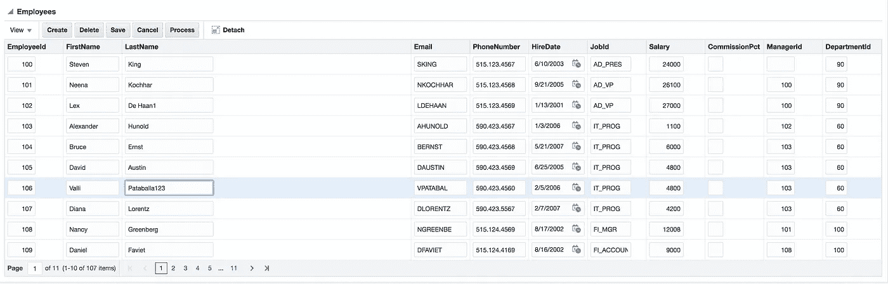
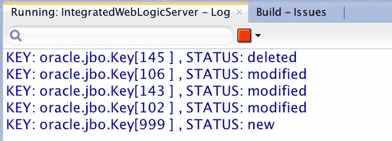
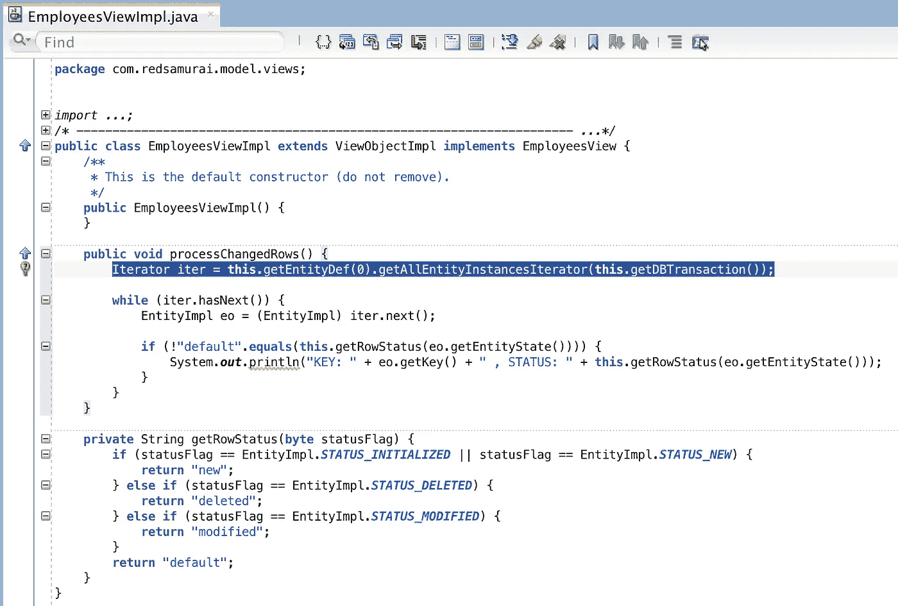

# 在 ADF BC API 中获取已更改行的有效方法

> 原文：<https://medium.com/oracledevs/effective-way-to-get-changed-rows-in-adf-bc-api-94a861840044?source=collection_archive---------6----------------------->

您是否想过如何在不遍历整个行集的情况下获取事务中所有已更改的行？事实证明，使用 ADF BC API 方法非常简单—*getAllEntityInstancesIterator*，它被调用用于附加到当前 VO 的实体定义。

方法工作得很好，它从不同的行集页返回更改的行，而不仅仅是从当前的。在我的实验中，我更改了第一页中的几行:

第五页有几行。我还删除了行并创建了一个:

方法返回有关所有已更改行以及已删除行和新行的信息:

在 VO Impl 类中使用*getAllEntityInstancesIterator*方法的示例。这种方法有助于获取当前事务中所有已更改的行，非常方便:

示例应用程序源代码可在 [GitHub](https://github.com/abaranovskis-redsamurai/ADFChangedRowProcessingApp) 上获得。

*原载于 2018 年 5 月 29 日*[*andrejusb.blogspot.com*](http://andrejusb.blogspot.com/2018/05/effective-way-to-get-changed-rows-in.html)*。*