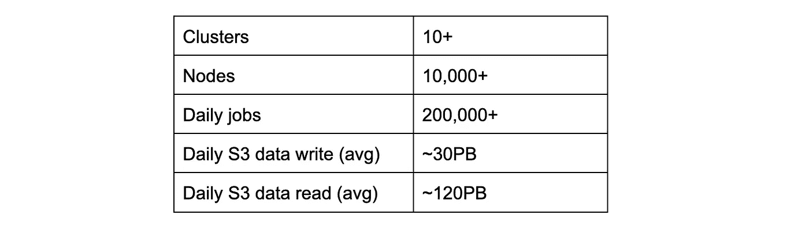
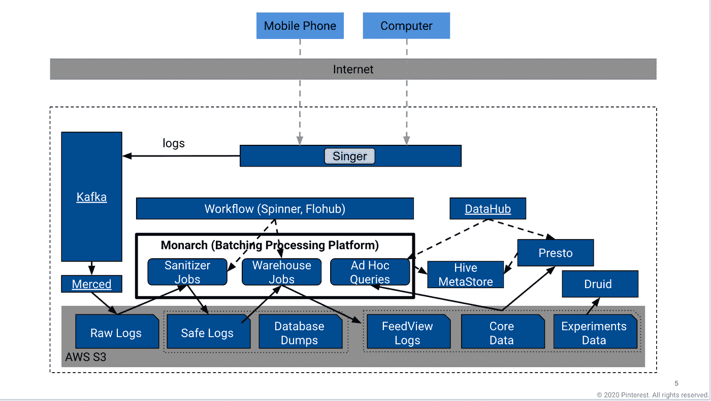
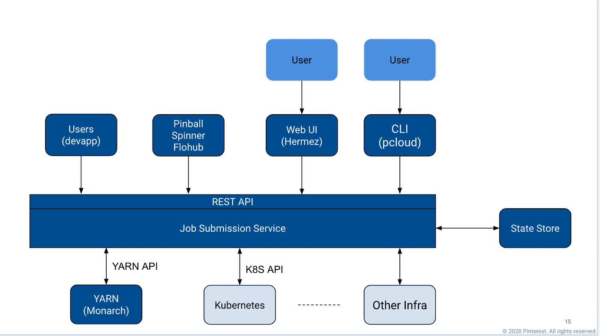
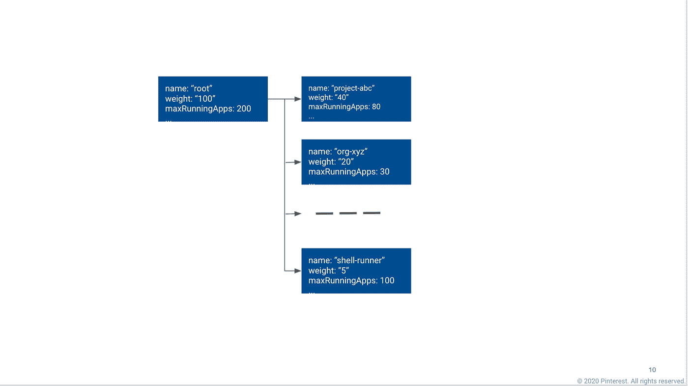
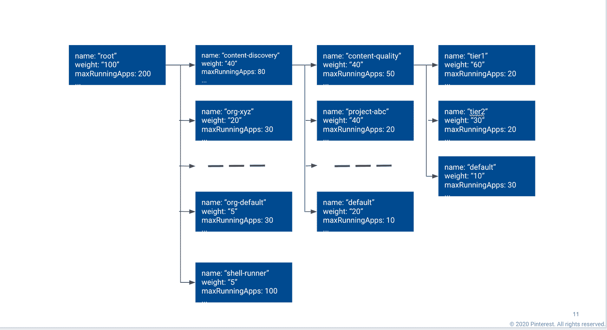
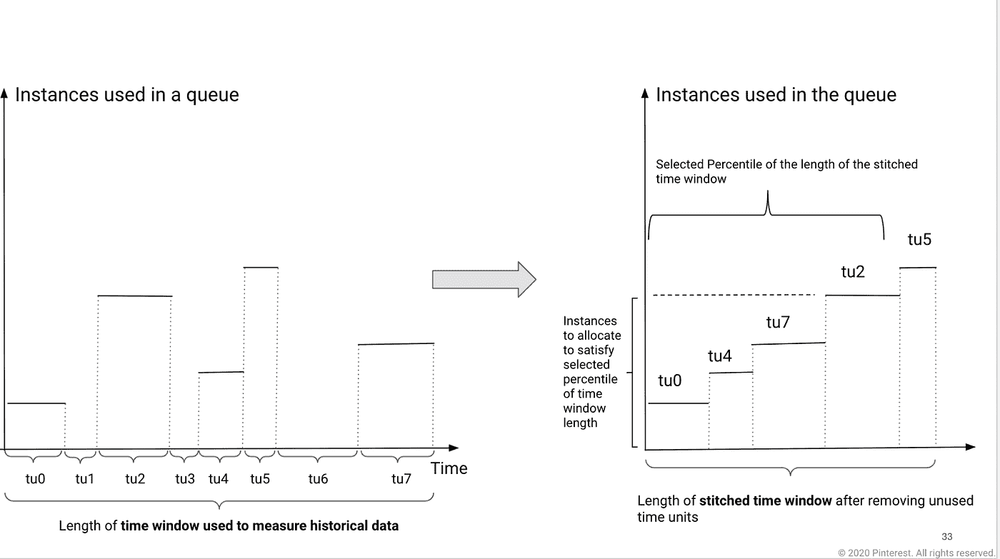
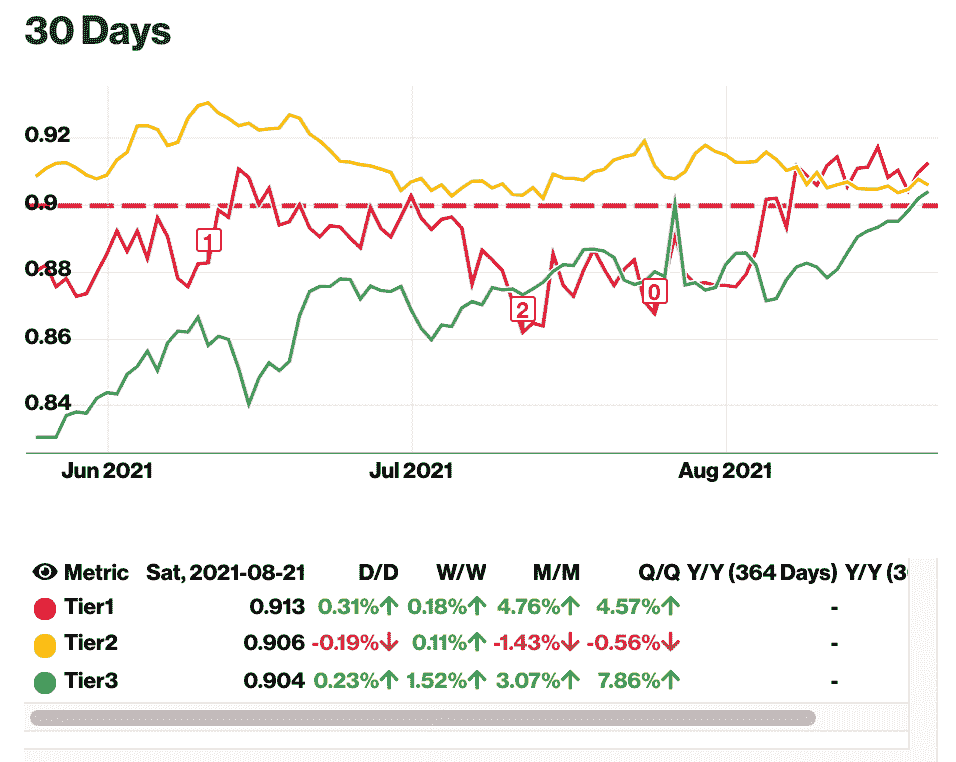

# Pinterest 批处理平台的高效资源管理

> 原文：<https://medium.com/pinterest-engineering/efficient-resource-management-at-pinterests-batch-processing-platform-61512ad98a95?source=collection_archive---------0----------------------->

张永军|软件工程师；张昂|工程经理；王绍文|软件工程师，批处理平台团队

*本文于 2021 年 12 月 3 日更新。*

Pinterest 的批处理平台 monitor 运行着该公司的大部分批处理工作流。在表 1 所示的规模下，重要的是管理平台资源以提供[服务质量](https://en.wikipedia.org/wiki/Quality_of_service) (QoS)，同时实现成本效益。本文将分享我们如何做到这一点以及未来的工作。

Table 1: Scale of Monarch Batch Processing Platform

# 君主简介

图 1 从高层次上展示了 Pinterest 的数据系统。当用户在他们的移动或桌面设备上使用 Pinterest 应用程序时，他们会生成各种日志，并通过 [Singer](https://github.com/pinterest/singer) + Kafka(参见[Pinterest](/pinterest-engineering/scalable-and-reliable-data-ingestion-at-pinterest-b921c2ee8754)的可伸缩且可靠的数据摄取)将这些日志摄取到我们的系统中，并将结果数据存储到 S3。然后，通过各种工作流(如清理、分析和机器学习数据准备)对数据进行处理和分析。工作流的结果通常会存储回 S3。基本上有两种类型的处理平台:批处理和流。这个博客是关于名为 monitor 的批处理平台的。更多关于流媒体平台的信息，请参见本[博客](/pinterest-engineering/unified-flink-source-at-pinterest-streaming-data-processing-c9d4e89f2ed6)。

作为内部大数据平台，monitor 提供基础设施、服务和工具，帮助用户大规模开发、构建、部署批处理应用程序并进行故障诊断(主要以工作流的形式)。monitor 由 20 多个完全利用 [AWS EC2](https://aws.amazon.com/ec2/?ec2-whats-new.sort-by=item.additionalFields.postDateTime&ec2-whats-new.sort-order=desc) 构建在云中的 [Hadoop 纱线](https://hadoop.apache.org/docs/current/hadoop-yarn/hadoop-yarn-site/YARN.html)集群组成，我们使用 EC2 提供的许多不同的实例类型。我们在集群中使用的实际 EC2 实例类型取决于其工作负载；一些群集在计算方面更优化，而另一些群集则有更多的内存或磁盘容量。

用户工作流可以通过作业提交服务(Job Submission Service，或 JSS)从 Spinner(基于 Airflow 构建的内部工作流平台)和其他基于 UI 的工作流编排工具提交给 Monarch(参见图 2)。用户工作流源代码通常指定工作流应该在其中运行的集群和队列。

Figure 1\. Pinterest Data System and the Batch Processing Platform (Monarch).

Figure 2\. Pinterest Job Submission Service. See more description in the text.

# 资源管理挑战

Hadoop YARN 用于管理集群资源和任务调度。集群资源表示为队列树。集群的所有资源，或者集群拥有的所有 EC2 实例，被表示为树的“根”,树的叶节点是应用程序运行的地方。队列的权重配置决定了分配给它的资源量。同一父节点的子节点共享分配给父节点的资源。子节点获得多少资源取决于该子节点的权重与所有同级节点的权重之和的比值。通过设置节点权重，我们可以控制分配给任何给定队列的 EC2 实例的数量。YARN 支持多个调度器，Monarch 中使用的是公平调度器。

Figure 3\. YARN’s resource allocation: Tree of Queues of Ad hoc Structure.

使用队列树来表示资源分配的目的是实现在不同队列中运行的工作流之间的资源隔离。然而，Monarch 最初没有一致的队列结构，如图 3 所示。一些队列被分配给特定的项目，一些队列被分配给组织，还有一些队列被分配给特定优先级的工作流。因此，在同一队列中运行的不同工作流之间存在严重的干扰，更关键的工作流通常会受到非关键工作流的影响。

干扰主要有两个原因:

1.  在同一队列中运行的工作流被同等对待。由于没有优先级的概念，调度程序无法将更多的资源分配给更关键的工作流。
2.  有一个参数 maxRunningApps 来控制在一个给定的队列中可以同时运行多少个应用程序。这防止了太多的应用程序竞争资源，在这种情况下，没有应用程序可以取得良好的进展。但是，如果先提交优先级较低的工作流，并使 maxRunningApps 达到饱和，那么随后提交的关键工作流可能会在很长一段时间内无法调度。

为了解决这些问题，我们引入了工作流分层，并相应地更改了要分层的资源分配队列。

# 工作流分层和分层队列结构

Monarch 上的工作负载通常以工作流的形式出现。工作流被表示为多个作业的有向无环图( [DAG](https://airflow.apache.org/docs/apache-airflow/stable/concepts/dags.html) )来处理输入数据并生成输出。同一工作流中的作业并行或顺序运行，具体取决于它们之间是否存在依赖关系。我们采取了两个主要步骤来为工作流提供 QoS，同时实现成本效益。

首先，我们添加了分层来区分关键工作流和非关键工作流。关键工作流通常对完成时间有更高的要求。我们决定将工作流分为三层:第 1 层、第 2 层和第 3 层(第 1 层的重要性最高)。然后，我们与用户团队合作，定义在 Monarch 平台上运行的所有工作流的分层和运行时[服务级别目标](https://en.wikipedia.org/wiki/Service-level_objective) (SLO)。

其次，我们改变了所有集群的资源队列结构，使其具有分层、项目和组织的概念。假设每个工作流都与一个项目相关联，每个项目都属于一个团队，而每个团队都属于一个更大的组织，我们决定创建一个三级的队列结构:组织、项目和层。参见图 4 中的示例(出于历史原因，使用“default”代替 tier3)。

Figure 4\. Hierarchical Queues with Organization, Project and Tiering.

一些最重要的队列配置是:

*   权重:队列的权重决定了分配给它的资源量。同一父节点的子节点基于其权重的相对比率来共享父节点的资源。
*   MaxRunningApps:队列中可以并发运行的应用程序的最大数量。这可以防止在有限资源的同一个队列中运行太多的应用程序，这意味着没有应用程序可以取得很好的进展。
*   抢占:

1.  **抢占:**是否启用抢占
2.  **fairsharepoemptiontimeout**:在尝试抢占容器以从其他队列获取资源之前，队列低于其公平份额阈值的秒数。
3.  **fairsharepointionthreshold**:队列的公平份额抢占阈值。如果队列等待 fairSharePreemptionTimeout 而没有接收到 fairsharepoemptionthreshold * fair share 资源，则允许抢占容器以从其他队列获取资源。
4.  **allowPreemptionFrom** :决定是否允许调度程序从队列中抢占资源。

我们将第 1 层队列配置为不允许抢占，并将 fairSharePreemptionTimeout 参数配置为比第 2 层和第 3 层队列更小的值，将 fairSharePreemptionThreshold 参数配置为更大的值。这允许第 1 层队列在没有获得公平的资源份额时更快地获得资源。

因为 Monarch 有许多集群，并且在不同集群上运行的工作流可能会随时改变，所以手动创建队列结构是不实际的，也是没有效率的。我们开发了一个工具，可以分析集群上工作流的历史数据，生成队列结构，并自动和定期更新设置。

除了上面描述的抢占配置之外，两个最重要的配置是队列权重和 maxRunningApps。在下一节中，我们将分享关于我们用来生成这些设置的算法的更多细节。

# 资源分配算法

队列中运行的工作流在不同的时间有不同的要求。为了保证关键工作流的服务质量，我们设计了一种基于历史运行数据的队列权重分配算法，即百分位数算法。

Figure 5\. The Percentile Resource Allocation Algorithm.

该算法查看最近时间窗口(如 30 天)内的历史运行数据，以了解给定队列需要多少资源。下面是它的功能:

*   步骤 1:队列可能在某些时候被使用，而在其他时候可能是空的。使用队列时，有时会使用 X 个 EC2 实例，有时会使用 Y 个 EC2 实例。该算法将时间窗分成**个时间单位**；每个单元是一个时间跨度，其中使用了*相同*数量的 EC2 实例。时间单位表示为<时间长度，实例化为>。(参见图 5 的左侧)
*   第 2 步:排除队列空闲的时间单元，按照时间单元中使用的实例数量(见图 5 的右侧)从最小到最大对时间单元进行排序。
*   步骤 3:确定分配给队列的最小实例数，以确保满足预先指定的时间长度百分比阈值。这个阈值意味着，给定队列正在使用的总时间单位长度(TTIU ),分配的资源需要足以满足 TTIU 的百分比。例如，对于在 30 天的窗口内总共使用了 240 小时(其他时间空闲)的第 1 层队列，我们希望保证 95%的时间都有资源，因此是 228 小时。该算法找出在步骤 2 的排序结果中使用的实例数。例如，tu0 + tu4 + tu7 + tu2 大约占整个使用时间长度的 95%,那么 tu2 中使用的实例数就是要分配给该队列的实例数。如果我们要分配 tu5 中使用的实例数量，它比 tu2 中使用的多，这可能会造成浪费，因为 tu5 只占队列总使用时间的 5%。

上面的 95%阈值只是一个例子。我们评估了不同层的资源使用情况，并根据这些工作流使用的群集和资源的大小提出了不同的阈值。当不同层使用的资源百分比发生变化时，阈值也会不时地进行调整。

有几个原因使我们不必保证给定的 tier1/tier2 队列在高峰使用时间所需的 100%的资源，从而避免浪费。

1.  工作流分层大致分布如下:约 10%的工作流属于第 1 层，20–30%属于第 2 层，60–70%属于第 3 层。
2.  并非所有队列同时都很忙，并且纱线调度器允许工作流使用其他队列中的可用资源。
3.  更高层的队列可以更快地抢占资源。

我们通过一个称为使用率/容量比的指标来衡量队列的资源余量。队列的容量是分配给队列的实例数乘以测量的时间窗口长度。使用量以纱线为例-小时来衡量。例如，如果队列在 Y 小时内使用 X 个实例，则资源使用量为 X * Y 实例-小时。此外，我们还以类似的方式测量 vcore-hours 和内存-小时使用率/容量比，以了解 vcore 和内存资源使用率的平衡程度。请注意，纱报告了 vcore-小时和内存-小时，我们在这里使用优势资源(DR)方法来计算实例-小时。

该算法确保从第 1 层到第 3 层队列的百分比阈值按降序设置，同时还确保使用率/容量比率按升序设置。这意味着第 1 层的头房最大，第 2 层次之，第 3 层最小。

资源分配算法还会查看历史运行数据，以确定 maxRunningApps 设置，并为每个队列设置一些余量的配置。

# 与自动缩放相比

自动扩展是另一种在云中节省成本的常见方法，在需要时扩展集群，在高峰需求过去时缩减。因为云提供商通常对按需容量收取比[保留实例](https://aws.amazon.com/ec2/pricing/reserved-instances/)高得多的费用，用户通常保留总是需要的容量，并使用按需实例进行自动缩放。

自动缩放在 Pinterest 的在线服务中效果很好，但我们发现它在批处理中不太经济，原因如下:

1.  来自大规模批处理的任务可能会运行数小时，这两种缩小集群的方案都是浪费。适度地缩减规模并等待正在运行的任务完成(即在终止实例之前清空它们)可能会浪费大量的资源，因为实例可能没有得到充分利用。即使任务仍在实例上运行，通过强制终止实例进行缩减也意味着浪费未完成的计算(以及相关作业更长的运行时间),并且需要额外的资源来重新运行终止的任务。
2.  为了使使用按需实例的自动扩展在与保留实例相比时具有经济意义，我们估计对于某些实例类型，使用按需实例的集群的峰值消耗时间百分比将需要小于 30%。考虑到缩小规模所需的时间，这个比例会小得多。然而，很难控制这个百分比，如果百分比越高，资源就越容易被浪费。
3.  在 Pinterest 的大数据处理规模下，使用自动缩放将需要在高峰时段获取数百个或更多所需实例类型的实例，这并不总是可能的。无法获得足够的资源来运行关键工作流可能会对业务造成重大影响。

通过利用上述资源分配算法和工作流分层，我们能够利用良好的保留实例定价，同时仍然保证在需要时为关键工作流提供足够的资源。

请注意，在本博客中，我们关注的是生产工作流，而不是临时工作负载，例如来自 [Querybook](/pinterest-engineering/open-sourcing-querybook-pinterests-collaborative-big-data-hub-ba2605558883) 的 Spark SQL 查询或来自 Jupyter 笔记本的 PySpark 作业。在临时集群中，我们确实利用了带有 [Spot 实例](https://aws.amazon.com/ec2/spot/?cards.sort-by=item.additionalFields.startDateTime&cards.sort-order=asc)的自动缩放，因为高峰使用在工作日只持续 2-3 个小时。

# 工作流性能监控

为工作流分配资源时，运行时 SLO 是一个需要考虑的重要因素。例如，如果工作流使用 X 个实例-小时资源，并且运行时 SLO 是 12 小时，那么运行此工作流所需的实例数是 X / 12。

随着资源分配的生效，我们需要一种方法来监控整个工作流运行时的性能。我们开发了一个仪表板来显示各层工作流在不同集群中的表现。

在一定大小的时间窗口内，对于任何给定的工作流，如果它运行 X 次，并且 Y 次运行符合 SLO，则其 SLO 成功率被定义为 Y/X。对于任何给定的工作流，如果这个比率是 100%是理想的，但是由于许多原因，这是不可行的。作为折衷方案，我们将工作流定义为 SLO 成功，如果其 SLO 成功率不低于 90%。

如前所述，我们将工作流分为三个级别。对于每一层的工作流，我们都要衡量在 SLO 获得成功的工作流的百分比。我们的目标是使这一比例高于 90%。

图 6 是衡量 30 天时间窗口性能的仪表板快照。在项目之前，tier1 工作流的成功率在 70%左右。目前，该比例已提高至并稳定在 90%左右。虽然我们试图让大多数第 1 层工作流取得成功，但其他层的相同指标并没有被牺牲太多，因为它们没有那么严格的 SLO 要求。

Figure 6\. Workflow performance monitoring: runtime SLO success ratio of each tier.

# 群集资源使用情况监控

工作流要求不是静态的，可能会不时发生变化。根据以下指标为每个群集完成每日报告:

1.  总计、第 1 层、第 2 层和第 3 层的使用率/容量比(包括实例、vcore、内存)
2.  群集中运行的所有第 1 层、第 2 层和第 3 层工作流的数量(可能会有新的工作流加入，或者对现有工作流进行重新分层和 SLO 更改)

根据这些指标，我们可以确定群集是被过度利用还是利用不足，并采取措施向群集添加更多资源(自然增长)、缩小群集以节省成本或保持不变。

# 跨集群路由和负载平衡

如前所述，不同的工作流有不同的资源需求，有些需要更多的内存，有些需要更多的 CPU，有些需要更多的磁盘 IO 或存储。他们的需求可能会随着时间而改变。此外，随着时间的推移，一些群集可能会变满，而另一些群集可能会利用不足。通过监控资源消耗，我们可以为工作流找到比当前更好的主集群。要求用户更改他们的源代码来移动工作流是一个繁琐的过程，因为当我们移动工作流时，我们还必须调整资源分配。

我们开发了跨集群路由(CCR)功能，无需用户更改设置即可更改工作流的目标集群。为了实现这一点，我们在 JSS 组件中添加了工具逻辑，可以根据需要将作业重定向到另一个集群。

我们还开发了一个工作流来定期分析集群使用情况，并选择候选工作流移动到其他集群，以不断提高负载平衡和成本效率。

要启用重定向作业，我们需要使用上述算法在目标集群上进行资源分配更改。为了实现这一点，我们自动化了资源分配流程，只需单击一个按钮(触发工作流)，即可在一个步骤中完成资源分配和配置作业重定向。

# 当前和未来的工作

在撰写本文时，我们的指标表明一个相当大的集群的 vcore 和内存使用不平衡，因此浪费了大量 vcore。我们正在努力将这个集群分成两个具有 CCR 支持的不同实例类型的集群，并将在原始集群上运行的工作流迁移到其中一个集群中。我们希望通过这一改变，我们不仅能够更可靠地运行应用程序，还能节省大量成本。

我们的集群位于不同的[可用性区域](https://docs.aws.amazon.com/AWSEC2/latest/UserGuide/using-regions-availability-zones.html#concepts-availability-zones)。当一个区域出现问题时，我们可以利用 CCR 功能将关键工作流转移到不同区域中的另一个集群。我们正在努力使这一过程更加顺利。

我们还在考虑当目标集群上的当前负载满时，在运行时动态地将作业路由到不同的集群。

# 确认

感谢批处理平台团队的郭恒哲、波格丹一世·皮西卡和桑迪普·库马尔，他们帮助我们进一步改进了实施。感谢 Soam Acharya、Jooseong Kim 和 Hannah Chen 推动工作流分层。感谢朱成金、威廉·汤姆、索姆·阿查里亚、王春燕一路上的讨论和支持。感谢工作流团队、我们的平台用户团队的反馈和支持。

*要在 Pinterest 了解更多工程知识，请查看我们的* [*工程博客*](https://medium.com/pinterest-engineering) *，并访问我们的*[*Pinterest Labs*](https://www.pinterestlabs.com?utm_source=medium&utm_medium=blog-article&utm_campaign=zhang-et-al-october-14-2021)*网站。要查看和申请空缺职位，请访问我们的* [*职业*](https://www.pinterestcareers.com?utm_source=medium&utm_medium=blog-article&utm_campaign=zhang-et-al-october-14-2021) *页面。*