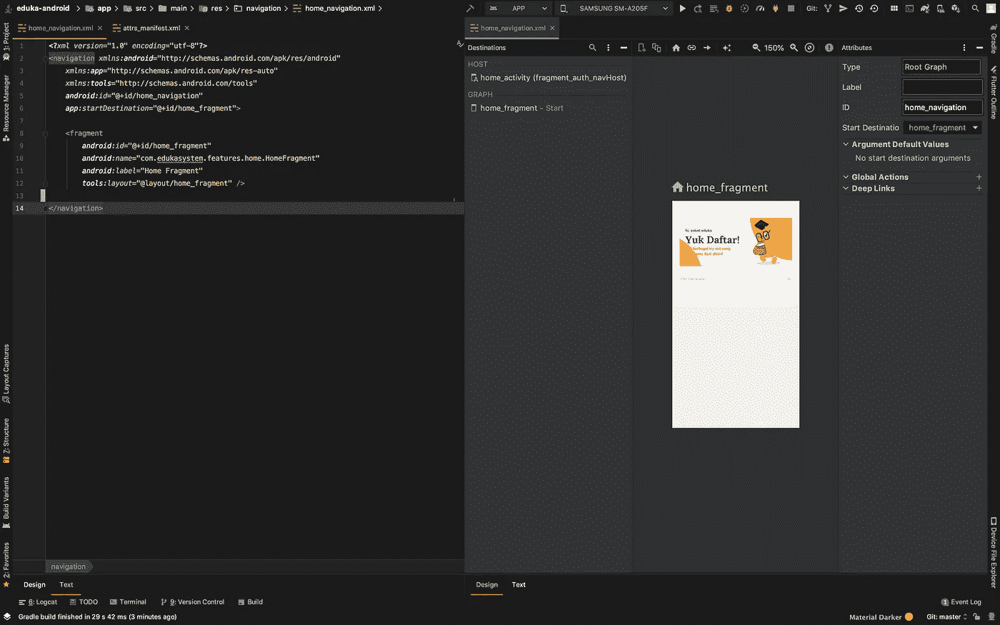

# Eksplorasi Android Jetpack Navigation — Part 1

> 原文：<https://medium.easyread.co/eksplorasi-android-jetpack-navigation-bagian-1-b9fca9367f83?source=collection_archive---------4----------------------->

## Salah satu Library yang termasuk ke dalam Android Jetpack

Photo by [Deanna Ritchie](https://unsplash.com/@deannaritchie?utm_source=medium&utm_medium=referral) on [Unsplash](https://unsplash.com?utm_source=medium&utm_medium=referral)

*Assalaamu’alaykum guys.*

Pada bagian pertama ini saya akan menjelaskan sedikit mengenai *library* Android yang bisa digunakan untuk mengatur alur perpindahan halaman di dalam aplikasi Android. *Library* yang dimaksud yaitu [**Navigation**](https://developer.android.com/guide/navigation) . *Library* ini pertama kali diperkenalkan pada perhelatan [**Google IO**](https://www.youtube.com/watch?v=8GCXtCjtg40) pada tahun 2018\. Navigation termasuk ke dalam bagian [**Android Jetpack**](https://developer.android.com/jetpack) , dimana Android Jetpack sendiri merupakan sekumpulan *library* , *tools* , dan *guidelines* bagi para *developer* Android untuk membangun aplikasi android dengan mudah dan terarah.

# Apa itu Navigation?

> Navigation refers to the interactions that allow users to navigate across, into, and back out from the different pieces of content within your app.

*Navigation* merupakan komponen arsitektur yang memudahkan dalam hal mengatur navigasi antar halaman pada aplikasi. *Library* ini sangat mendukung dan memudahkan bagi para praktisi ***“Single Activity Multi Fragments”*** dalam membuat sebuah aplikasi android. Atau bisa juga dilakukan melalui pendekatan lain seperti *scoping* atau pengelompokan halaman berdasarkan tema produk yang nantinya akan saya contohkan bersamaan dengan beberapa tutorialnya dalam tulisan ini.

# Komponen Navigation

Didalam Navigation terdapat 3 komponen utama yang harus diketahui apabila ingin menggunakan *library* ini. Diantaranya adalah:

## NavGraph

*   [**NavGraph**](https://developer.android.com/reference/kotlin/androidx/navigation/NavGraph) adalah sebuah koleksi dari destinasi-destinasi yang diwakili oleh fragment yang unik. Artinya setiap destinasi memiliki id yang dibutuhkan untuk berpindah dari dan ke suatu tujuan.

Untuk membuat sebuah NavGraph kita harus membuatnya dengan sebuah file XML khusus untuk mendefinisikasnnya. Caranya mudah cukup **klik kanan folder res > New > Android Resource Directory > resource type (pilih navigation) > masukkan nama file > OK.**

Contoh dari sebuah NavGraph dapat kalian lihat seperti gambar dibawah ini.

NavGraph diwaliki oleh sebuah file XML untuk mendefinisikannya

Properti NavGraph seperti gambar diatas perlu diketahui fungsinya masing-masing. Berikut sedikit penjelasan pada setiap propertinya:

1.  **< navigation/ >** merupakan *root* dari sebuah *NavGraph* yang bertindak sebagai *wrapper* untuk destinasi-destinasi yang diwakili oleh *view fragment* .
2.  **< id >** merupakan tanda pengenal bagi sebuah destinasi yang diperlukan untuk menentukan *fragment* mana yang akan ditampilkan pertama kali dan digunakan juga oleh *NavController* untuk mengatur navigasi.
3.  **< startDestination >** merupakan properti untuk menentukan *fragment* mana yang pertama kali akan ditampilkan pada layar.
4.  **< name >** hanya merupakan *title* yang diberikan pada *fragment* dan pada setiap *fragment* harus bersifat unik dan *Java-Style naming* contohnya **“com.lorem.ipsum.HomeFragment”** . Secara otomatis IDE akan mengisikan *full path* dengan dimasukkannya kata kunci. Selanjutnya IDE akan menampilkan dialog pemilihan *full path* dari destinasi-destinasi.
5.  **< label >** bertujuan sebagai label *TAG* juga digunakan untuk *INTENT-FILTER* .
6.  **< tools:layout >** merupakan properti bantuan untuk memasangkan atau menandakan *layout* pada *fragment* yang sesuai.

## NavHost

*   [**NavHost**](https://developer.android.com/reference/kotlin/androidx/navigation/NavHost.html) merupakan sebuah *host* atau *container* untuk navigasi. Bentuk asli dari *NavHost* sendiri adalah *interface* dengan isi balikan berupa *NavController* .

## NavController

*   **NavController** merupakan sebuah pengelola/ *controller* untuk destinasi yang berasosiasi dengan sebuah NavHost. *NavController* akan menggunakan **id** yang telah didefinisikan pada *NavGraph* untuk mengelola perpindahan antar *fragment* .

Mungkin cukup sekian sedikit teori dari *library* ini. Beberapa referensi tambahan dibawah mungkin bisa lebih membantu kamu untuk mendalami ilmu tentang *library* Navigation.

Sampai bertemu pada bagian berikutnya. Insyaallah…

 [## androidx.navigation | Android Developers

### Returns a Lazy delegate to access the Activity's extras as an Args instance. It is strongly recommended that this…

developer.android.com](https://developer.android.com/reference/kotlin/androidx/navigation/package-summary)  [## 导航|安卓开发者

### 导航指的是允许用户在不同部分之间来回导航的交互…

developer.android.com](https://developer.android.com/guide/navigation)