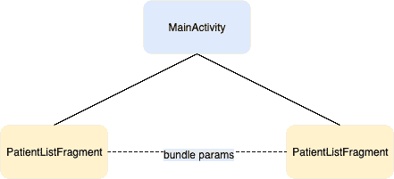
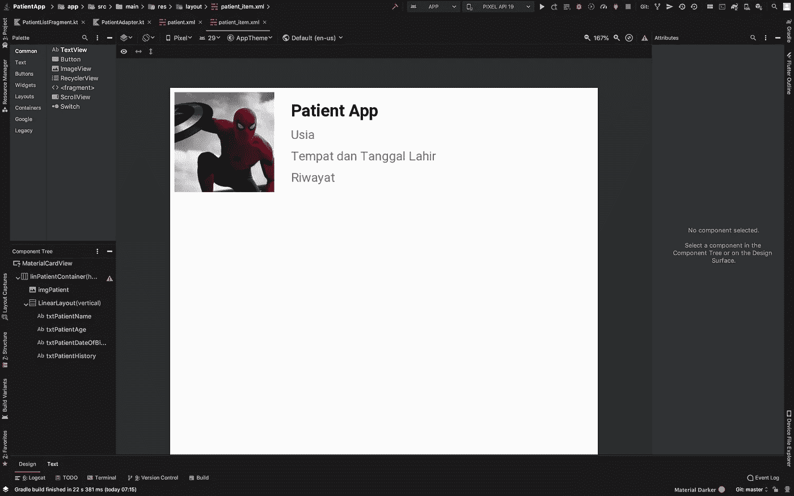
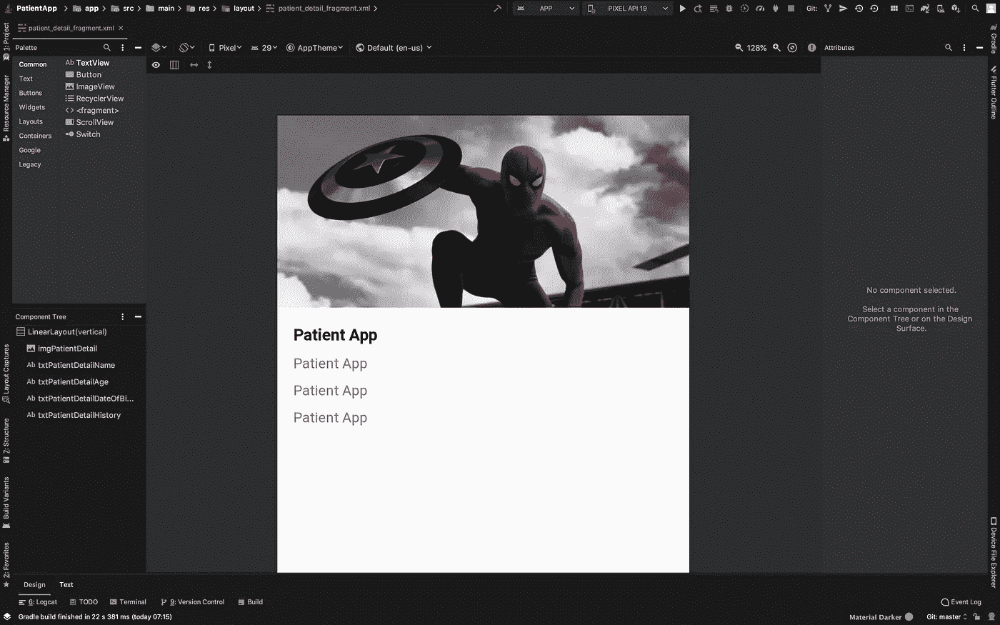
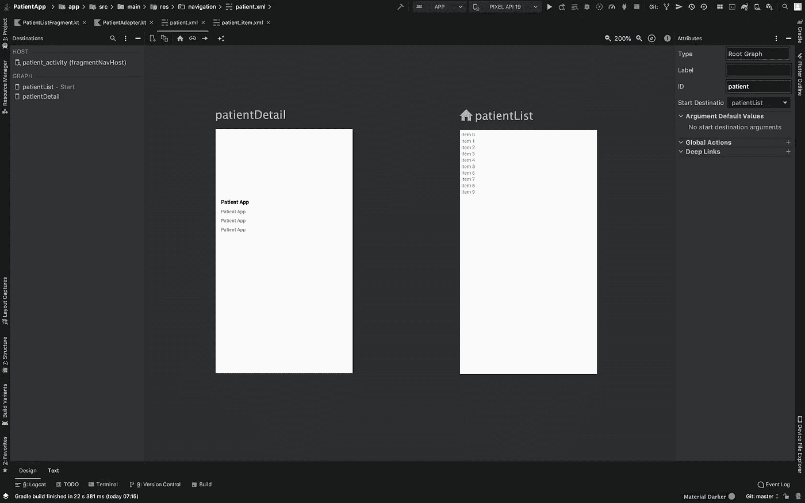

# Eksplorasi Android Jetpack Navigation — Part 2

> 原文：<https://medium.easyread.co/eksplorasi-android-jetpack-navigation-bagian-2-penggunaan-navigasi-dan-bundle-fe08f269e2f6?source=collection_archive---------6----------------------->

## Bagaimana menggunakan Navigasi dan Bundle pada Navigation


Photo by [Thanh Soledas](https://unsplash.com/@thanhsoledas?utm_source=medium&utm_medium=referral) on [Unsplash](https://unsplash.com?utm_source=medium&utm_medium=referral)

*Assalaamu’alaykum bro* .

Setelah [sebelumnya](https://medium.com/@irfanirawansukirman/eksplorasi-android-jetpack-navigation-bagian-1-b9fca9367f83) kita membahas dasar-dasar dari *library* *Navigation* , kali ini kita akan mencoba membuat sebuah aplikasi sederhana yang terdiri dari halaman daftar pasien dan halaman detail informasi dari pasien menggunakan *library* ini.

Berikut skema dari aplikasi yang akan dibuat:



Patient App Diagram Flow

# Step 0— Mempersiapkan Dependencies

```
implementation "androidx.navigation:navigation-fragment-ktx:2.1.0"
implementation "androidx.navigation:navigation-ui-ktx:2.1.0"
implementation "androidx.recyclerview:recyclerview:1.0.0"
implementation "com.squareup.picasso:picasso:2.71828"
```

*   **navigation-fragment-ktx dan navigation-ui-ktx** : adalah library akan digunakan untuk proses navigasi antar halaman.
*   **recyclerview** : adalah library yang digunakan untuk membuat daftar pasien.
*   **picasso** : adalah library yang digunakan untuk menampilkan gambar pasien.

# Step 1 — Membuat Halaman Root

## PatientActivity Class

```
*class* PatientActivity : AppCompatActivity() {

    *override fun* onCreate(*savedInstanceState*: Bundle?) {
        *super*.onCreate(*savedInstanceState*)
        setContentView(R.layout.*patient_activity*)
    }
}
```

Pada kelas ini tidak ada penambahan kode sama sekali karena semua pengelolaan navigasi dilakukan oleh *Navigation Controller* yang sebelumnya. Kita hanya perlu mendefinisikan semua *fragment* melalui *Navigation Graph* (navigation XML) dan navigasinya sendiri dilakukan pada kelas *fragment* . Sehingga secara *default* kode yang terlulis pada kelas *Activity* hanya seperti kode diatas.

# Step 2 — Membuat Adapter Daftar Pasien

## Patient Item (XML)

```
<com.google.android.material.card.MaterialCardView *xmlns:android*="http://schemas.android.com/apk/res/android"
    *xmlns:app*="http://schemas.android.com/apk/res-auto"
    *xmlns:tools*="http://schemas.android.com/tools"
    *android:layout_width*="match_parent"
    *android:layout_height*="wrap_content"
    *android:layout_margin*="4dp"
    *app:cardBackgroundColor*="@android:color/white"
    *app:cardCornerRadius*="8dp">

    <LinearLayout
        *android:id*="@+id/linPatientContainer"
        *android:layout_width*="match_parent"
        *android:layout_height*="wrap_content"
        *android:foreground*="?selectableItemBackground"
        *android:clickable*="true"
        *android:focusable*="true"
        *android:orientation*="horizontal">

        <ImageView
            *android:id*="@+id/imgPatient"
            *android:layout_width*="96dp"
            *android:layout_height*="96dp"
            *android:adjustViewBounds*="true"
            *android:contentDescription*="@string/app_name"
            *android:scaleType*="centerCrop"
            *tools:src*="@drawable/img_spiderman" />

        <LinearLayout
            *android:layout_width*="0dp"
            *android:layout_height*="wrap_content"
            *android:layout_gravity*="center_vertical"
            *android:layout_marginStart*="16dp"
            *android:layout_weight*="1"
            *android:orientation*="vertical">

            <TextView
                *android:id*="@+id/txtPatientName"
                *android:layout_width*="wrap_content"
                *android:layout_height*="wrap_content"
                *android:textColor*="@android:color/black"
                *android:textSize*="16sp"
                *android:textStyle*="bold"
                *tools:text*="@string/app_name" />

            <TextView
                *android:id*="@+id/txtPatientAge"
                *android:layout_width*="wrap_content"
                *android:layout_height*="wrap_content"
                *android:layout_marginTop*="4dp"
                *android:textSize*="12sp"
                *tools:text*="Usia" />

            <TextView
                *android:id*="@+id/txtPatientDateOfBirth"
                *android:layout_width*="wrap_content"
                *android:layout_height*="wrap_content"
                *android:layout_marginTop*="4dp"
                *android:textSize*="12sp"
                *tools:text*="Tempat dan Tanggal Lahir" />

            <TextView
                *android:id*="@+id/txtPatientHistory"
                *android:layout_width*="wrap_content"
                *android:layout_height*="wrap_content"
                *android:layout_marginTop*="4dp"
                *android:textSize*="12sp"
                *tools:text*="Riwayat" />
        </LinearLayout>

    </LinearLayout>

</com.google.android.material.card.MaterialCardView>
```

Hasil kode diatas akan nampak hasilnya seperti pada gambar dibawah ini.



UI Patient Item

## Patient Adapter Class

```
*class* PatientAdapter(*private val* patientList: *List*<Patient>,
                     *private val* patientItemListener: *PatientItemListener*) :
    RecyclerView.Adapter<PatientAdapter.ItemHolder>() {

    *override fun* onCreateViewHolder(*parent*: ViewGroup, *viewType*: Int): ItemHolder {
        *return* ItemHolder(
            LayoutInflater.from(*parent*.*context*).inflate(
                R.layout.*patient_item*,
                *parent*,
                *false* )
        )
    }

    *override fun* getItemCount() = patientList.size

    *override fun* onBindViewHolder(*holder*: ItemHolder, *position*: Int) {
        *holder*.bindItem(patientList[*position*], patientItemListener)
    }

    *class* ItemHolder(*private val* view: View) : RecyclerView.ViewHolder(*view*) {
        *fun* bindItem(*patient*: Patient, *patientItemListener*: *PatientItemListener*) {
            view.*apply* **{** patient.*run* **{** Picasso.get().load(imageUrl).into(imgPatient)
                    txtPatientName.*text* = name
                    txtPatientAge.*text* = age
                    txtPatientDateOfBirth.*text* = dateOfBirth
                    txtPatientHistory.*text* = history
                    linPatientContainer.setOnClickListener **{** patientItemListener.onPatientSelected(patient)
                    **}
                }
            }** }
    }
}
```

Pada halaman kelas *adapter* diatas, selain untuk melakukan *render* UI juga dilakukan pemetaan data ke *view* serta memasang sebuah interface listener yang gunanya untuk menampung data pasien yang terpilih dan membawanya ke halaman PatientListFragment. Nantinya data tersebut akan dibawa oleh *bundle* sebagai *arguments* ke halaman detail pasien.

# Step 3— Membuat Halaman Daftar Pasien

## Data Class Patient

```
*data class* Patient(
    *val* name: String,
    *val* age: String,
    *val* dateOfBirth: String,
    *val* history: String,
    *val* imageUrl: String
)
```

*data class Patient* berfungsi sebagai *bussiness logic* yang akan menampung semua data pasien yang akan ditampilkan kedalam aplikasi.

## Patient Item Listener

```
*interface PatientItemListener* {
    *fun* onPatientSelected(*patient*: Patient)
}
```

*Interface PatientItemListener* berfungsi sebagai *handler item* ketika pengguna memilih satu pasien yang terlihat pada aplikasi dan membawa data yang terseleksi ke helaman *PatientListFragment Class.*

## PatientListFragment Class

```
*class* PatientListFragment : Fragment(), *PatientItemListener* {

    *override fun* onPatientSelected(*patient*: Patient) {
        *patient*.*run* **{** *val* bundle = *bundleOf*(
                PATIENT_NAME *to* name,
                PATIENT_AGE *to* age,
                PATIENT_DATE_OF_BIRTH *to* dateOfBirth,
                PATIENT_HISTORY *to* history,
                PATIENT_IMAGE *to* imageUrl
            )
            *findNavController*().navigate(R.id.*patientDetail*, bundle)
        **}** }

    *override fun* onCreateView(
        *inflater*: LayoutInflater,
        *container*: ViewGroup?,
        *savedInstanceState*: Bundle?
    ): View? {
        *return inflater*.inflate(R.layout.*patient_fragment*, *container*, *false*)
    }

    *override fun* onViewCreated(*view*: View, *savedInstanceState*: Bundle?) {
        *super*.onViewCreated(*view*, *savedInstanceState*)
        setupPatientList()
    }

    *private fun* setupPatientList() {
        recyclerPatient.*apply* **{** *layoutManager* = LinearLayoutManager(requireContext())
            *adapter* = PatientAdapter(getPatientList(), *this*@PatientListFragment)
        **}** }

    *private fun* getPatientList() = *mutableListOf*<Patient>().*apply* **{** *var* index = 0
        *while* (index < 30) {
            add(
                Patient(
                    "Iskandar",
                    "32 tahun",
                    "Bandung, 11/12/13",
                    "Demam dan muntaber",
                    "https://i.gzn.jp/img/2019/08/23/android-10/00.png"
                )
            )
            index++
        }
    **}** *companion object* {
        *const val* PATIENT_NAME = "PATIENT_NAME"
        *const val* PATIENT_AGE = "PATIENT_AGE"
        *const val* PATIENT_DATE_OF_BIRTH = "PATIENT_DATE_OF_BIRTH"
        *const val* PATIENT_HISTORY = "PATIENT_HISTORY"
        *const val* PATIENT_IMAGE = "PATIENT_IMAGE"
    }

}
```

## Full Implementation PatientListFragment Class

```
*data class* Patient(
    *val* name: String,
    *val* age: String,
    *val* dateOfBirth: String,
    *val* history: String,
    *val* imageUrl: String
)

*interface PatientItemListener* {
    *fun* onPatientSelected(*patient*: Patient)
}

*class* PatientListFragment : Fragment(), *PatientItemListener* {

    *override fun* onPatientSelected(*patient*: Patient) {
        *patient*.*run* **{** *val* bundle = *bundleOf*(
                PATIENT_NAME *to* name,
                PATIENT_AGE *to* age,
                PATIENT_DATE_OF_BIRTH *to* dateOfBirth,
                PATIENT_HISTORY *to* history,
                PATIENT_IMAGE *to* imageUrl
            )
            *findNavController*().navigate(R.id.*patientDetail*, bundle)
        **}** }

    *override fun* onCreateView(
        *inflater*: LayoutInflater,
        *container*: ViewGroup?,
        *savedInstanceState*: Bundle?
    ): View? {
        *return inflater*.inflate(R.layout.*patient_fragment*, *container*, *false*)
    }

    *override fun* onViewCreated(*view*: View, *savedInstanceState*: Bundle?) {
        *super*.onViewCreated(*view*, *savedInstanceState*)
        setupPatientList()
    }

    *private fun* setupPatientList() {
        recyclerPatient.*apply* **{** *layoutManager* = LinearLayoutManager(requireContext())
            *adapter* = PatientAdapter(getPatientList(), *this*@PatientListFragment)
        **}** }

    *private fun* getPatientList() = *mutableListOf*<Patient>().*apply* **{** *var* index = 0
        *while* (index < 30) {
            add(
                Patient(
                    "Iskandar",
                    "32 tahun",
                    "Bandung, 11/12/13",
                    "Demam dan muntaber",
                    "https://i.gzn.jp/img/2019/08/23/android-10/00.png"
                )
            )
            index++
        }
    **}** *companion object* {
        *const val* PATIENT_NAME = "PATIENT_NAME"
        *const val* PATIENT_AGE = "PATIENT_AGE"
        *const val* PATIENT_DATE_OF_BIRTH = "PATIENT_DATE_OF_BIRTH"
        *const val* PATIENT_HISTORY = "PATIENT_HISTORY"
        *const val* PATIENT_IMAGE = "PATIENT_IMAGE"
    }

}
```

# Step 4— Membuat Halaman Detail Pasien

Setelah berhasil membuat halaman daftar pasien yang ditulis pada kelas PatientListFragment. Maka selanjutnya adalah membuat sebuah halaman yang berisikan detail informasi dari seorang pasien.

## Patient Detail Fragment (XML)

```
<?*xml version*="1.0" *encoding*="utf-8"?>
<LinearLayout *xmlns:android*="http://schemas.android.com/apk/res/android"
    *xmlns:tools*="http://schemas.android.com/tools"
    *android:layout_width*="match_parent"
    *android:layout_height*="match_parent"
    *android:orientation*="vertical">

    <ImageView
        *android:id*="@+id/imgPatientDetail"
        *android:layout_width*="match_parent"
        *android:layout_height*="192dp"
        *android:adjustViewBounds*="true"
        *android:scaleType*="centerCrop"
        *android:contentDescription*="@string/app_name"
        *tools:src*="@drawable/img_spiderman"/>

    <TextView
        *android:id*="@+id/txtPatientDetailName"
        *android:layout_width*="wrap_content"
        *android:layout_height*="wrap_content"
        *android:layout_marginStart*="16dp"
        *android:layout_marginTop*="16dp"
        *android:textColor*="@android:color/black"
        *android:textSize*="16sp"
        *android:textStyle*="bold"
        *tools:text*="@string/app_name" />

    <TextView
        *android:id*="@+id/txtPatientDetailAge"
        *android:layout_width*="wrap_content"
        *android:layout_height*="wrap_content"
        *android:layout_marginStart*="16dp"
        *android:layout_marginTop*="8dp"
        *tools:text*="@string/app_name" />

    <TextView
        *android:id*="@+id/txtPatientDetailDateOfBirth"
        *android:layout_width*="wrap_content"
        *android:layout_height*="wrap_content"
        *android:layout_marginStart*="16dp"
        *android:layout_marginTop*="8dp"
        *tools:text*="@string/app_name" />

    <TextView
        *android:id*="@+id/txtPatientDetailHistory"
        *android:layout_width*="wrap_content"
        *android:layout_height*="wrap_content"
        *android:layout_marginStart*="16dp"
        *android:layout_marginTop*="8dp"
        *tools:text*="@string/app_name" />
</LinearLayout>
```

Hasil kode diatas akan nampak hasilnya seperti pada gambar dibawah ini.



UI Patient Detail Fragment

## PatientDetailFragment Class

```
*class* PatientDetailFragment : Fragment() {

    *override fun* onCreateView(
        *inflater*: LayoutInflater,
        *container*: ViewGroup?,
        *savedInstanceState*: Bundle?
    ): View? {
        *return inflater*.inflate(R.layout.*patient_detail_fragment*, *container*, *false*)
    }

    *override fun* onViewCreated(*view*: View, *savedInstanceState*: Bundle?) {
        *super*.onViewCreated(*view*, *savedInstanceState*)
        setupPatientData()
    }

    *private fun* setupPatientData() {
        *arguments*?.*let* **{** txtPatientDetailName.*text* = *it*.getString(*PATIENT_NAME*)
            txtPatientDetailAge.*text* = *it*.getString(*PATIENT_AGE*)
            txtPatientDetailDateOfBirth.*text* = **it**.getString(*PATIENT_DATE_OF_BIRTH*)
            txtPatientDetailHistory.*text* = **it**.getString(*PATIENT_HISTORY*)
            Picasso.get().load(*it*.getString(*PATIENT_IMAGE*)).into(imgPatientDetail)
        **}** }
}
```

Pada kelas PatientDetailFragment diatas terdapat fungsi **setupPatientData()** yang bertugas untuk melakukan pemetaan data ke UI berdasarkan *arguments* yang telah dikirim dari halaman daftar pasien sebelumnya.

# Step 5 — Membuat Navigation Graph

```
<navigation *xmlns:android*="http://schemas.android.com/apk/res/android"
    *xmlns:app*="http://schemas.android.com/apk/res-auto"
    *xmlns:tools*="http://schemas.android.com/tools"
    *android:id*="@+id/patient"
    *app:startDestination*="@id/patientList">

    <fragment
        *android:id*="@+id/patientList"
        *android:name*="com.irfanirawansukirman.patientapp.PatientListFragment"
        *android:label*="Patient List"
        *tools:layout*="@layout/patient_fragment" />

    <fragment
        *android:id*="@+id/patientDetail"
        *android:name*="com.irfanirawansukirman.patientapp.PatientDetailFragment"
        *android:label*="Patient Detail Fragment"
        *tools:layout*="@layout/patient_detail_fragment" />

</navigation>
```

Hasil kode diatas akan nampak hasilnya seperti pada gambar dibawah ini.



Navigation Graph Patient

# Step 6— bundleOf Sebagai Kurir Data

```
*override fun* onPatientSelected(*patient*: Patient) {
    *patient*.*run* **{** *val* bundle = *bundleOf*(
            PATIENT_NAME *to* name,
            PATIENT_AGE *to* age,
            PATIENT_DATE_OF_BIRTH *to* dateOfBirth,
            PATIENT_HISTORY *to* history,
            PATIENT_IMAGE *to* imageUrl
        )
        *findNavController*().navigate(R.id.*patientDetail*, bundle)
    **}** }
```

Pada kode diatas, bundle akan bekerja untuk menampung data pasien yang terpilih. Lalu dilakukan pemetaan *value* berdasarkan *key* ( *Key-Value Pair* ). Setelah itu, untuk melakukan navigasi ke halaman detail pasien menggunakan extension function findNavController() dan membawa parameter *arguments (bundle)* ke halaman detail pasien.

Nah, hasil akhir dari aplikasi ini dapat dilihat pada video berikut ini:

*Alhamdulillah* . Kita telah menyelesaikan tutorial pada kesempatan ini. *Source code* bisa kalian dapatkan [disini](https://github.com/irfanirawansukirman/patient-app) . Sesi selanjutnya saya akan coba bagikan tutorial bagaimana cara melakukan navigasi menggunakan < *action* > serta menambahkan animasi ketika transisi pada setiap halaman Insyaallah. Sekian dan semoga bermanfaat.

*Wassalaamu’alaykum Warahmatullahi Wabarakatuh* …