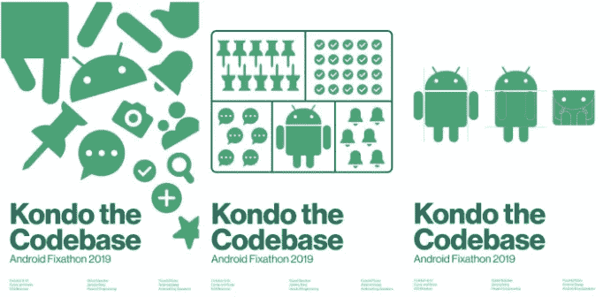

# 精彩的 Fixathon

> 原文：<https://medium.com/pinterest-engineering/el-fant%C3%A1stico-fixathon-c550b959936d?source=collection_archive---------4----------------------->

作者:Grey Sköld | Android 工程师

这篇文章最初发表在 英语;Read the English version [here](/pinterest-engineering/the-fantastic-fixathon-a950382de0d1)

Pinterest 的工程师总是专注于为产品做最好的事情,但在一个干净,维护良好,相对无错误的代码库中工作,将工程任务从“仅仅是工作”转变为灵活的机会。我们也丰富自己作为工程师,无论是在技术上还是在其他方面,当我们花时间向我们的同事学习。虽然我们可能会偶尔或在场外举办派对,但没有什么能像 Fixathon 那样将社区建设和产品改进结合起来!

# 什么是 Fixathon?

典型的固定马拉松在 Pinterest 上持续三天。特定团队或平台的工程师将他们的时间用于围绕核心主题创建的任务,以改进代码库。改进可以包括删除错误,删除代码债务,添加新的 lint 规则,转换表面以使用最新技术等等。Fixathon 是一个分享新发现和想法的机会,突出特别有影响力的贡献,最重要的是,聚在一起吃饭!

# 关于 Runbook Fixathon

## 观察机会

在计划修复马拉松之前,我们首先评估我们的代码库中的哪些区域有足够的改进机会,以证明在我们的核心计划之外花费几天时间是合理的。此外,我们需要 Fixathon 让大多数工程师参与到赛事中。该方法可以包括重写遗留代码,更新新的编程语言,升级到最新的 API 等等。目标是产生一组足够大的项目,以便整个团队以可持续的方式帮助解决现有问题,并提高未来开发人员的速度。

## 创建一个委员会

早期的 Fixathons 通常只由少数具有可用周期的工程师组织。这被证明是无效的,并没有导致大多数与会者值得的成功事件。随着时间的推移,我们发现一个由六到八名工程师组成的委员会能够很好地代表整个工程团队并计划成功的活动。拥有一个更大的委员会来委托活动规划中涉及的各种任务(不可避免地有足够的任务),我们的 Fixathons 不会受到少数工程师有限带宽的阻碍。

## 决定日期

开始计划餐点和主题是令人兴奋的,但我们的首要任务是在公司日历上有一个可用的日期和地点。我们正在寻找一个足够远的日期块,以便经理和 IC 可以计划活动,并且不要太靠近其他公司活动,项目的关键时间或假日。一旦我们选择了日期,我们选择了最接近大多数与会者的办公室位置。我们意识到,人们的工作空间事件越接近,出勤率就越高。

## 准备一个计划

一旦我们建立了日期和地点,委员会成员就可以把他们的活动组织者的袋子,并决定主题,食物,奖品,礼品,所需的额外设备,最重要的是,预算。

● 根据我们确定的项目区域,**我们选择了一个主题**,用于 Fixathon 的其他方面(例如海报,奖品,JIRA 标签等)。页:1。去年,我们的主题是*Kondo the Kodebase。*

● 我们选择了**食品和饮料**,确保考虑到参与者的饮食限制。

● 我们提名**奖项**来提供(例如*对绘图员*的影响更大、*对开发人员的影响更大*和*Fixathon Favorite*)。甚至在去年,我们的一位工程师在钩子上编织了 Android 奖杯!

● 为了鼓励参观(并利用 FOMO 的力量),我们定义了**礼物**给所有为 Fixathon 做出贡献的人(之前的礼物包括帽子和毛衣)。

● 然后,我们考虑我们需要的**设备(例如,开发所需的显示器,键盘和不同的电缆),并尽快让我们的 IT 部门帮助我们提供额外的资源。**

●最后,我们通过同意**估计预算***合理*得出所有有趣的结论。

Gorro para perro certificado™ y premios de crochet para 3 ingenieros afortunados

## 它代表了兴奋

一旦我们制定了计划,我们就会用剩下的时间让每个人都知道下一个 Fixathon。

●财务部门批准 Fixathon 预算后,我们通过电子邮件向所有潜在与会者发送活动详情,并在团队会议上亲自宣布日期。

● 我们建立了一个每月例程,通过邮件不断提醒经理他们的 IC 所需的时间承诺,以确保经理有机会在活动之前在他们的计划中分配时间。

● 当我们接近日期时,我们会在办公室张贴海报,以激发热情,并为忽视我们之前沟通的人增加知名度。

最后,我们添加了最后的点击,例如用于跟踪工作的 JIRA 过滤器,Slack Fixathon 频道,与会者的每日时间表,Google 投票调查以及活动的官方仪式大师。现在剩下的就是为有史以来最好的固定马拉松做准备!

Carteles promocionales

# Fixathon 之后

当活动结束时,我们拍摄了团队的照片,清理了空间,并帮助委员会收集了突出我们工作的数据,以便与公司其他人分享。最后剩下的就是享受球队的回忆。

Otro Fixathon para los libros de historia

在 Pinterest,Fixathon 是开发人员互动的另一个机会,并致力于提高代码库的运行状况和开发人员的速度。这也是与我们周围的不同群体进行社交,并与其他热衷于为我们的开发人员和用户提供卓越体验的人建立联系的时刻。

我们希望这将鼓励您组织自己的 Fixathons,并投资建立更强大的开发者社区。

*特别感谢 Helen Fu 编织奖项,AJ Oxendine 设计海报,Toffee 设计帽子,以及所有让 Fixathon 成为可能的 Android 团队成员。(T1 )*

*我们正在构建世界上第一个视觉发现引擎。全球有超过 4.75 亿人使用 Pinterest 来梦想,计划和准备他们想要做的事情。*[*加入我们的团队!(T6) (T7)*](https://careers.pinterest.com/careers)