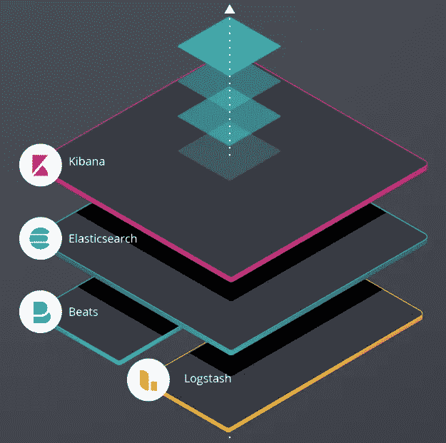

# 弹性搜索:快速、实时地存储、搜索和分析大量数据

> 原文：<https://medium.com/version-1/elasticsearch-store-search-and-analyse-large-volumes-of-data-quickly-and-in-real-time-234da6aeae5a?source=collection_archive---------0----------------------->

**Elastic stack**(也称为 ELK stack)是一个令人难以置信的令人印象深刻的三种开源技术的集合——T2 E 弹性搜索、 **L** ogstash 和 **K** ibana。Elasticsearch 是一个搜索和分析引擎。 **Kibana** 更像是一个数据可视化服务，让你使用各种图形和图表来可视化你从 Elasticsearch 得到的数据…