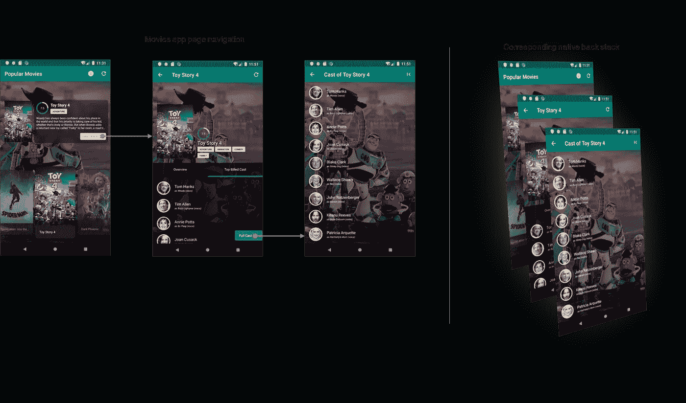
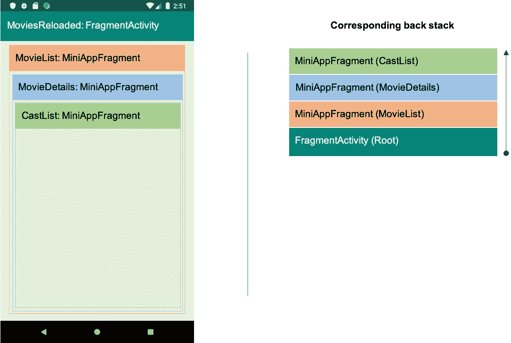
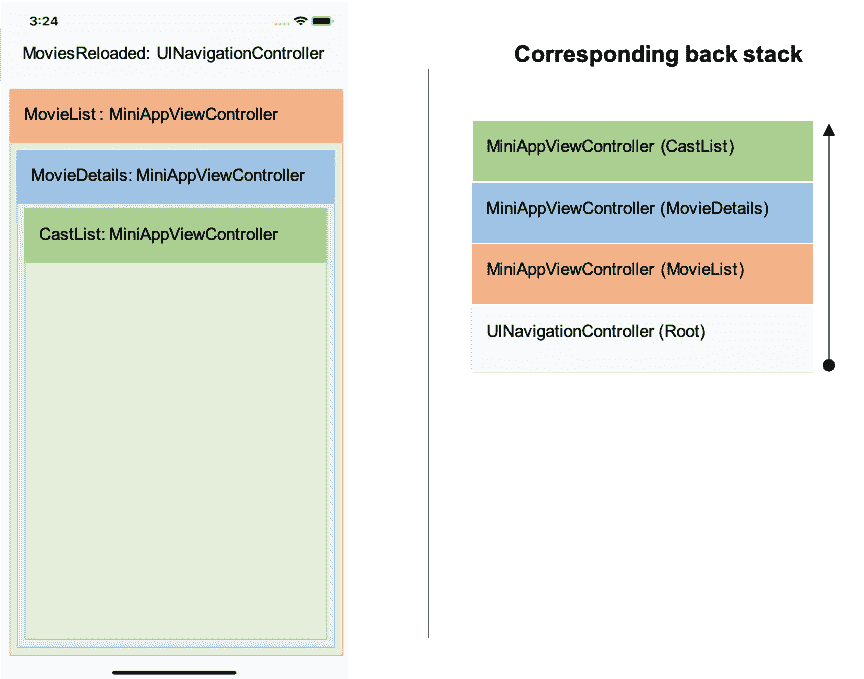

# 电极自然导航

> 原文：<https://medium.com/walmartglobaltech/electrode-native-navigation-576297fbcb3d?source=collection_archive---------3----------------------->

今天的移动技术环境带来了无数可以构建应用程序的开发平台，每种平台都有自己的优缺点。React Native 在该领域仍然是一个相对较新的领域，这带来了自己的一系列挑战。电极原生平台于 2017 年发布，以帮助克服这些挑战，允许原生和 React 原生应用的更无缝集成。

在电极原生平台的开发过程中，一个主要的关注点总是围绕着对整个应用程序导航的支持；无论任何给定页面的内容是用本地语言编写的，还是用 React Native 开发的，还是两者的结合。

考虑到 React Native 可以创建的应用程序的灵活性和复杂性，有许多不同的导航用例需要考虑，包括:

1.  集成的 React 本地应用启动应用的本地部分。
2.  原生代码启动集成的 React 原生应用程序——在沃尔玛，我们有许多最初被开发为完全原生的应用程序，现在希望加入新的 React 原生功能。
3.  一个 React 本机应用导航到另一个 React 本机应用中的页面。电极原生是围绕父原生应用程序中的多个不同的 React 原生应用程序的概念构建的，因此这一直是一个不可或缺的需求。
4.  以这样一种方式执行 A/B 测试的能力，即特性可以在它们的 React 本地版本和本地版本之间进行比较。任何像沃尔玛这样的公司都必须确保在发布任何新功能之前进行适当的 A/B 测试，始终首先考虑客户的需求。

为了解决这些问题，我们开发了电极原生导航( **ern-navigation** )，这是电极原生团队的一个新导航框架。

# 介绍

导航是任何应用程序的核心特性；谷歌和苹果都继续投入大量精力来简化他们的本地导航架构。该项目的主要目标是让 React 本地应用程序开发人员能够使用本地组件和原理进行导航。通过这样做，我们能够创建可重用的、本地友好的页面和应用程序。

在电极本地导航的开发过程中，我们专注于以下核心原则:

1.  我们必须消除 React 本机应用程序维护其后台堆栈的需要，并利用本机框架提供的所有功能来管理导航队列。
2.  我们必须确保页面和应用程序之间的所有转换都使用相同的动画，无论这些页面是使用本地架构还是 React 本地架构构建的。
3.  我们必须允许自定义布局——这包括混合了本地和 React 本地内容的布局。
4.  我们必须使用完全在 React 本机端管理的本机导航栏(这对于希望在其本机应用程序中包含 React 本机组件的现有应用程序很有帮助)。
5.  无论是在独立的 React 本地应用程序内部运行，还是作为集成的本地应用程序的一部分运行，我们都必须有相同的导航实现。

**什么是电极原生？**

在我们进入电极原生导航之前，有必要了解什么是电极原生，以及我们为什么创建这个框架。电极原生允许将多个微型应用程序(React 原生应用程序)组合到单个容器中。容器完全由电极原生平台生成，并打包为 Android 的 AAR 库和 iOS 的框架(这些库类似于 Android 和 iOS 开发者熟悉的标准第三方库)。

**为什么我们没有使用现有的 React 原生导航框架？**

有许多 React 本机导航框架可供选择，它们在单个 React 本机应用程序中提供了出色的导航支持，只需要最少的本机集成。开发电极本地导航主要是为了支持:

1.  一种混合的应用程序开发方法，其中多个微型应用程序构建到一个库中，并与一个更大的本机应用程序集成。
2.  具有多个页面的单个 React 本机应用程序—没有现有的本机应用程序—需要一个导航框架。
3.  一种允许本机和 React 本机页面共存的应用程序架构，使本机和 React 本机开发人员都能够在应用程序的开发生命周期中做出贡献。

# 电极自然导航

Eelectrode Native Navigation(**ern-Navigation**)遵循手机导航的核心原则。任何流都有一个起始页(它的根)和一个结束页，用户在这里完成流，并返回到该流的根。考虑我们在 React Native 中使用电极本地导航开发的`MovieApp`的以下示例

这里，用户从`Movie List`页面(它的根)开始。点击任何一部电影的`details`按钮，用户就会进入一个`Movie Details`页面，里面有关于这部电影的更多细节。从那里，用户可以导航到`Cast List`页面，查看参与所选电影的演员名单。



> 在典型的 React 本地应用程序中，我们注册根组件；这允许本地 Activity(Android)/view controller(iOS)在启动时加载该组件。从那里，导航的责任被移交给 React 本机应用程序。这样做将本机应用程序从用户流中分离出来。

让我们以上面的简单例子`MovieApp`为例，深入了解电极原生导航在幕后是如何工作的。

**反应原生**

通过**电极本地导航**，我们在应用注册表中注册每个页面，以允许本地应用根据需要在`Activity`或`ViewController`中加载任何 React 本地页面。下面是如何使用我们的`AppNavigator`为`MovieApp`注册组件。

**索引. js**

`AppNavigator`注册所有 React 本地页面组件，允许本地应用程序根据需要以任何顺序加载它们。如果您独立运行 MiniApp，它将启动初始屏幕(在本例中为`MovieList`)。

现在，让我们看看`MovieList`组件，看看它是如何导航到`MovieDetails`页面的

`MovieList`组件扩展了电极本地导航的`Component`类，后者又扩展了`React.Component`。`navigationOptions`允许任何 React 本地组件控制本地导航栏，如果他们选择这样做的话，这在从更大的本地应用程序内部使用 MiniApp 时是有益的。

`onNavButtonPress(buttonId)`覆盖允许`MovieList`组件监听并响应导航栏按钮点击。

最后，让我们看看页面导航是如何工作的。当用户点击 **View Details** 按钮时，组件调用`navigateInternal(…)`下一个页面的名称和所需的道具。这个调用将通过电极本机桥发送到本机处理程序进行处理。

```
onDetailPress={() => this.navigateInternal('MovieDetails', { movie: movies[activeMovieIndex], configuration, genres })}
```

现在，让我们看看本机实现如何处理这些导航调用。

**安卓**

本机应用程序启动一个`FragmentActivity`并加载带有`MovieList`组件的第一个`Fragment`。点击**查看详情**按钮，启动对`MovieDetails`页面的导航调用。本机实现通过启动一个新的带有`MovieDetails`视图的`Fragment`实例来处理这个请求，如此处所示:



运动活动性(碎片活动性)

r .布局.活动 _ 主要

当启动`MovieListActivity`时，`ElectrodeBaseActivity`的`onCreate()`方法将创建一个`ElectrodeReactFragmentDelegate`的实例，并将`Fragment`实例加载到在`activity_main.xml`资源文件中定义的`fragment_container`中。

如果您需要处理 React Native 发起的导航请求,`MiniAppNavFragment`也可以覆盖`navigate(Route route)`。

如果`navigate(Route route)`没有被`Activity`或`Fragment`覆盖，它会返回到默认行为，其中会创建一个新的`MiniAppNavFragment`实例，并加载指定的 React 本地组件。

这种设计使得 React 本机组件很容易被 Android 开发人员使用到预先存在的本机应用程序中。

> 每当创建一个 MiniApp 时，Electrode Native 会自动生成此代码。这消除了 React 本地开发人员学习编写任何集成代码来独立运行 MiniApp 的需要。

**iOS**

类似地，对于 iOS，`UINavigationController`将首先在`MiniAppViewController`中托管根组件；来自 React Native 的每个后续的`navigate()`调用将创建一个新的`MiniAppViewController`并在其中加载请求的 React Native 视图组件。



movielistview controller(UINavigationController)

当`MovieListViewController`启动后，`viewDidLoad()`会将控制权委托给`ENNavigationDelegate`以启动一个新的`MiniAppViewController`，以`rootComponent`为视图。

MiniAppViewController

您总是可以扩展`MiniAppViewController`来创建一个定制的`ViewController`并根据您的需求覆盖任何方法。例如，要定制一个`navigate()`呼叫，您可以覆盖您的`CustomViewController`中的`handleNavigateRequestWithPath`功能。

您也可以选择通过覆盖它的`navigateWithRoute`方法在`MovieListViewController`级别上处理这个覆盖。

在没有任何覆盖的情况下，将执行默认实现，启动一个新的`MiniAppViewController`实例，其中包含给定的 React 本地组件视图。

谁在使用 ern-navigation？

沃尔玛的在线杂货应用程序是**电极本机导航**框架的最大消费者，目前超过 90%的应用程序使用 React Native。此外，Walmart.com、加拿大沃尔玛、沃尔玛杂货店的许多应用程序以及其他面向沃尔玛员工的内部应用程序都在使用这个框架。

# **学分**

这篇文章，以及**电极原生导航**框架，是由 WalmartLabs 电极原生团队的工程师们设计和编写的——[**Adam Sharp**](https://www.linkedin.com/in/adam-sharp-4b61947b/)，[**Deepu Eswarath Ganapathiyadan**](https://www.linkedin.com/in/deepueg/)，以及[**Lianci Liu**](https://www.linkedin.com/in/lianci-liu/)——在[**Richard Mercille**](https://www.linkedin.com/in/richard-mercille-a769413/)(*you '下*

特别感谢整个 Electrode Native 团队和所有不同的沃尔玛应用团队的支持，他们一路上都在帮助我们——给了我们一些真正漫长的夜晚和可怕的偏头痛——我们是真心诚意的。

**进一步参考**:

[](https://github.com/electrode-io/ern-navigation) [## 电极自然导航

### node . js > = 8 NPM > = 3.0 Android Studio(适用于 Android 应用程序)Xcode >= 10(适用于 iOS 应用程序)一个电极本机 miniapp $ npm…

github.com](https://github.com/electrode-io/ern-navigation) [](http://www.electrode.io/site/native.html) [## 电极自然

### 有了电极原生，开发人员可以使用 React 在用 JavaScript 编写的跨平台组件上无缝工作…

www.electrode.io](http://www.electrode.io/site/native.html) [](https://github.com/electrode-io/movies-reloaded-miniapp) [## 电影加载的迷你应用

### 任何对使用电极感兴趣的本地人。这是用💙在沃尔玛实验室。ern 平台使用 0.37.0(或…

github.com](https://github.com/electrode-io/movies-reloaded-miniapp) [](/walmartlabs/a-new-beginning-for-react-native-at-walmartlabs-online-grocery-c30b27db57d3) [## 沃尔玛超市网上杂货店 React Native 的新开始

### 大约两年前，我们推出了第一个 React Native (RN)页面，现在我们接近拥有 90%的沃尔玛杂货店…

medium.com](/walmartlabs/a-new-beginning-for-react-native-at-walmartlabs-online-grocery-c30b27db57d3)