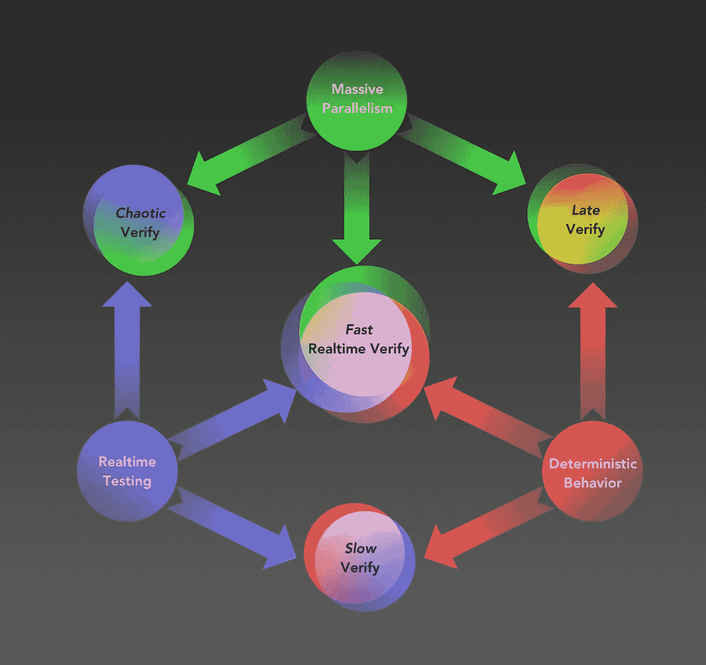
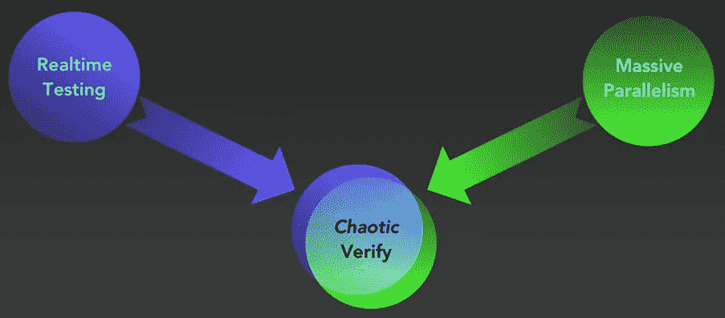
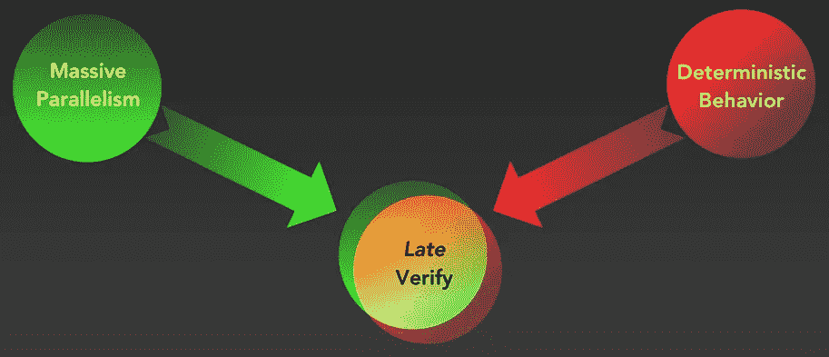
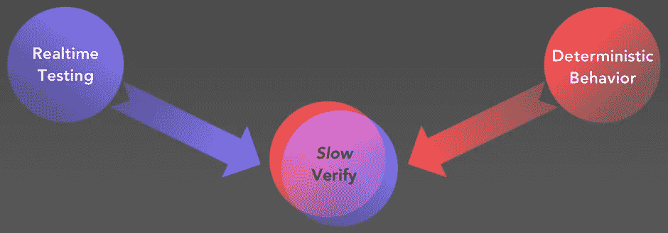

# 成功的大规模自动化测试的要素

> 原文：<https://medium.com/walmartglobaltech/elements-of-successful-massive-scale-automated-testing-f071c17f2907?source=collection_archive---------1----------------------->

仅仅提到“前端自动化测试”这个术语就足以让一个经验丰富的 web 开发人员不寒而栗。远程驱动网络浏览器是一门不精确的科学。它昂贵、缓慢，并且充满了破坏交易的不稳定性。与此同时，我们仍然希望在将我们的应用和网站部署到生产或应用商店之前，验证它们是否工作正常。事实上，忘记部署吧——部署已经太迟了。我们希望在合并代码之前能够完全验证我们的代码，以最小化我们的影响。

在合并之前进行验证，对于那些从事主分支或开发分支受单元测试保护的项目的人来说，应该是很熟悉的。开发人员喜欢单元测试，因为它们:

*   快速执行，
*   是完全隔离的，只受提交更改的影响，
*   和在代码合并之前运行。

大多数基于协议(如 Selenium、Appium 等)的测试套件不具备这些特征。它们通常以服务器部署的代码为目标，受许多随机环境因素的影响，运行缓慢，并且在代码合并后很久才被触发。

自动化 UI 测试简直糟透了。我们以巨大的时间或计算资源成本获得了非常低的信息价值。高价值的潜力是存在的，但是典型的过程被打破了。我们如何解决这个问题？

## 拖延的代价:航行于红海

当我们第一次在 WalmartLabs 开始调查这个问题时，我们通过 Selenium 运行了成千上万的客户流，但在这个过程中为时已晚，经常导致测试矩阵充满失败。我们亲切地称之为“**红色海洋**”。

当回归被发现的时候，它们已经存在了几个小时到几天，与其他的 bug 混杂在一起，导致了无数的失败。然后，bug 的生命周期经历了一个痛苦的过程:重新测试、质量工程师的调查、吉拉的罚单，然后开发人员努力重现并确定问题。

这似乎是显而易见的，但在软件开发团队的过程中经常没有考虑到:代码编写后运行的测试越晚，丢失的信息就越多，从坏代码中恢复的代价就越大。

欣赏单元测试效用的团队矛盾地将自动化 UI 测试视为“集成测试”活动，在代码合并后很久才完成。将集成测试拖到游戏后期是一个代价极其高昂的错误，因为以客户为中心的测试(执行真实客户行为的测试)揭示了单元测试没有的*整个回归类别*。

解决这个问题的唯一方法是在合并代码之前*运行测试——包括自动化 UI 测试。*

## 实时测试圣杯:快速实时验证

Elements of fast realtime verify

如今，WalmartLabs 测试自动化流程依赖于三个基本假设:

*   **大规模并行**:测试由数百甚至数千个工作人员(虚拟机、浏览器或设备)并行运行。
*   **“实时”测试**:在合并代码之前，尽可能快地、尽可能频繁地运行测试，并且在合并代码之前总是绿色的。实际上，这意味着在每次提交 pull 请求时触发测试，并且不允许代码被合并，除非那个提交是绿色的。
*   **确定性行为**:整个测试堆栈都是确定性的。这意味着完全模拟的服务器、完全可预测的数据库条目、对终端行为的完全控制，以及对随机应用行为的精细控制(例如:促销飞出)。

结果是快速实时验证，如上图所示，这是我们基本假设的理想组合。在每一次 PR 和随后的 PR 提交中，我们使用完全确定的模拟应用程序后端，乘以一系列浏览器或设备，运行大规模并行自动化 UI 测试。

这是相当雄心勃勃的。有没有更简单的方法可以达到同样的效果？碰巧的是，对这三个基本假设做出妥协会产生过程，其中一些过程起初看起来有用，但以破坏交易的方式失败了。

Chaotic Verify: a high performance code verification process mired in uncertainty

## 混沌验证

根据我们的经验，团队发现快速实时验证中最难复制的部分是确定性。用一个令人信服的可以独立运行的 mock 来修改现有的应用程序并不容易。然而，不这样做的代价也很高:即使有大规模并行，在 PRs 中运行测试也会产生不可预测的结果，这实际上会让开发人员的日子很难过。对团队之外的外部服务或模块的更改意味着开发人员可以看到与其更新无关的测试失败。**混乱的验证**模式侵蚀了对 CI 基础设施和测试工具本身的信任。

Late Verify: a high performance verification strategy executed too long after regressions have crept into code

## 延迟验证

虽然许多开发团队对在每个 PR 上运行大规模自动化套件的想法感到满意，但有些团队并不满意。这些团队更喜欢在后期的“集成”阶段运行 UI 测试。这种妥协允许回归悄悄进入代码库，并在很长一段时间内不被发现。当它们被发现时，回归恢复的成本会显著增加。很容易理解为什么我们称这种形式的验证为“**后期验证**”。

## 慢速验证

省去大量的并行性给了我们非常可靠，但也是缓慢的验证。如果我们有一个小的应用程序，或者 UI 测试运行得非常快，或者支持的客户环境(浏览器、版本、设备等)非常少，这可能是一个可以接受的折衷。如果您的扩展预算很小，这可能是您唯一的选择。另一方面，即使是中等规模的应用程序的自动化 UI 测试也要花费很多时间，尤其是在许多客户环境中进行测试的时候。当验证一个 PR 需要很长时间时，开发人员开始忽略结果并合并代码而不等待。如果验证被认为是“永远”进行的，开发人员将开始反对自动化测试。 **Slow Verify** 强调了为什么可用性和便利性是大规模测试自动化的关键元素:开发人员的接受度对于选择一个经得起时间考验的工作流至关重要。

## 绿色很便宜，红色很贵

为了让自动化 UI 测试向开发人员提供有用的信息，它必须在代码合并之前运行，必须是完全确定的，并且必须运行得非常快。移除这些难题中的任何一个都会导致开发团队感到沮丧，浪费时间和金钱。

大规模自动化测试只有在永远不被允许陷入“红色海洋”的情况下才能正常工作。当一个测试套件被允许进入这种状态时，在自动化基础设施上花费大量的金钱突然看起来非常愚蠢。**以失败测试为主的自动化基础设施极其昂贵，而运行大多数通过测试的相同基础设施是相对明智的投资**。这一指导原则告知了 WalmartLabs 如何组织其测试基础设施，以及我们如何编写自动化工具来智能地利用时间和硬件。

## 工具

到目前为止，我们没有提到任何特定的工具。在创建有效的测试自动化过程中，本文中描述的工作流模式比所选择的特定软件更重要。

也就是说，我们一直在努力开发一个工具集，使我们能够在内部实现快速实时验证，它采用了 Github、Jenkins、Docker 和我们的 [TestArmada 套件](https://github.com/TestArmada)，包括 [Magellan](https://github.com/TestArmada/magellan) 。

## 结论

我们不再害怕大量自动化前端测试的前景，你也不应该害怕。事实上，我们确保我们的前端测试集在深度和全面性上有所增长。这为我们的开发人员提供了对问题点的洞察，并在他们部署时增加了他们的信心。

敬请关注我们如何在@WalmartLabs 实施这些关键要素的一系列深度探讨，以及这些要素如何融入我们的持续交付渠道。