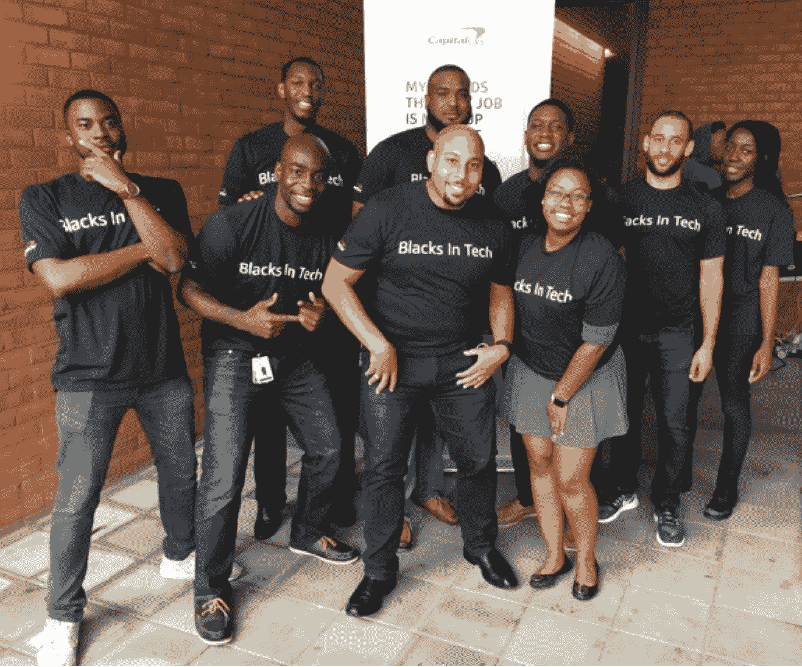
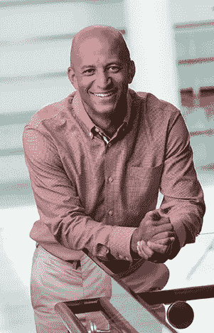

# 提升黑人在科技领域的地位

> 原文：<https://medium.com/capital-one-tech/elevating-blacks-in-tech-12545eb7d8a2?source=collection_archive---------0----------------------->

*Mark Mathewson，国际管理副总裁&小型企业技术，Capital One*

技术的魅力在于如何应用它来解决我们面临的每一个独特挑战，从而让人们的生活变得更美好。我们的家人、朋友、客户和同事都有和我们一样细微而独特的问题和观点。这意味着我们有无限的机会为了更大的利益以有意义和有利可图的方式应用技术。

然而，定制解决方案需要独特的构建者和多面的团队，他们将挑战彼此的观点，并为广泛而活跃的受众带来创意。我们都可以说出改变游戏规则的技术，这些技术改善了我们的生活，其中许多来自一个不能完全代表它所服务的人们的技术行业。想象一下，如果那些制造我们所依赖的产品的人只代表了我们社会中很小的一部分，我们会错过多少机会和增长潜力。

*Mark Mathewson, Managing Vice President, International & Small Business Technology, Capital One*

在我的职业生涯中，我构建了影响许多人的伟大解决方案，但这并不是我一个人完成的。我有支持我的导师，强大的同事网络，多样化的员工和合作伙伴。我亲眼目睹了多元化团队如何推动业务成果。如果我们作为一个行业知道这是真的——并且看到商业案例通过一次又一次的研究得到证明，就像美国全国企业董事协会的[文化作为企业资产](https://www.nacdonline.org/files/NACD%20BRC%20Culture%20as%20Corporate%20Asset.pdf)研究中的这些发现——为什么建设和授权多元化的员工队伍不是每个技术领导者的首要任务？

> 我相信部分原因是因为处理多样性真的很难。这很复杂，因为多样性本身是交叉的。一个 LBGT 黑人女性的经历可能在某些方面与一个异性恋黑人男性相似，但在其他方面则不同。有无限多的复杂变量促成了这一挑战，但这正是它有趣和值得解决的地方。

我相信部分原因是因为处理多样性真的很难。这很复杂，因为多样性本身是交叉的。一个 LBGT 黑人女性的经历可能在某些方面与一个异性恋黑人男性相似，但在其他方面则不同。有无限多的复杂变量促成了这一挑战，但这正是它有趣和值得解决的地方。在这个领域，我最喜欢的一件事就是不断被聪明人所包围和激励，他们不会回避困难的问题，而是奔向困难的问题。

一个人或一个团队或一个公司能解决这个挑战吗？不。但是每个人都能找到移动针头的方法。我很幸运，在我的职业生涯中，有榜样告诉我如何为他人带来改变，最近我在 Capital One 开展了一项新的活动:领导我们的黑人科技项目。

随着我们作为一家科技公司的不断发展，我们设计了 Blacks in Tech (BIT ),以加强我们对庆祝和增加黑人工程师和领导者代表性的关注。在六个多月前正式启动后，我们的项目团队一直忙于在我们的 black engineering associates 基地内围绕招聘、发展和内部社区建设这三个领域制定和交付短期和长期计划。我对我们在如此短的时间内取得的进步感到鼓舞，包括:

*   与我们的专业招聘团队合作开发新的渠道和人才来源
*   与我们的校园招聘团队合作，开展更多多元化招聘活动，包括赞助 [HBCU@SXSW](http://hbcuatsxsw.co/)
*   制定计划，建立我们的黑色编码网络
*   规划由 BIT 发起的社区参与计划
*   确定并开始填补 BIT 开发产品的空白，包括与 [/dev/color](https://www.devcolor.org/) 建立合作伙伴关系

我对我们在招聘方面取得的有意义的进展感到特别兴奋。随着我们向更广泛的人才来源敞开大门，并集中精力让 Capital One 成为顶级黑人技术人才的目的地，我们对早期结果感到鼓舞。

我对黑人在技术领域已经取得的成就感到兴奋，只有我知道我们在未来能够取得的成就才能超越这种兴奋——在 Capital One 和更远的地方。虽然我很现实，解决技术平等是一个世代的挑战，不会在一夜之间发生，但在我们继续推动有意义的变化时，我很幸运能与所有种族和性别的许多人一起工作，这让我感到鼓舞。

**有兴趣继续对话吗？加入我和我的小组成员西莉亚·爱德华兹·卡拉姆(Celia Edwards Karam)、劳伦·州(Lauren States)和罗德尼·桑普森(Rodney Sampson)参加我们的小组“** [**【提升科技领域的黑人**](https://schedule.sxsw.com/2018/events/PP80758) **”。去不了奥斯汀了？在 Twitter 上关注@CapitalOneTech 和#CapitalOneHouse。**

这些是作者的观点。除非本帖中另有说明，否则 Capital One 不属于所提及的任何公司，也不被其认可。使用或展示的所有商标和其他知识产权都是其各自所有者的所有权。本文为 2018 首都一。