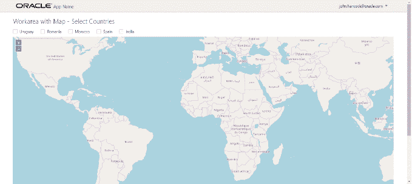

# 在 Oracle JET 中嵌入 OpenLayers 以实现高级地图和 GIS 风格的用户界面

> 原文：<https://medium.com/oracledevs/embedding-openlayers-in-oracle-jet-for-advanced-maps-and-gis-style-user-interfaces-1972f01f42c?source=collection_archive---------0----------------------->

Oracle JET 是用于创建富 web 应用程序的工具包。许多应用将具有与位置相关的方面。这种应用程序可以从高级地图功能中受益，这些功能用于在地图中呈现数据，允许用户与地图进行交互，以便制定查询、导航到相关细节或操作数据。OpenLayers 是用于在 web 应用程序中处理地图的最著名的开源 JavaScript 库之一。它提供了一个 API 来构建丰富的基于 web 的地理应用程序，类似于 Google Maps 和 Bing Maps。OpenLayers 合作良好的地理数据提供商之一是开放街道地图([OSM](http://wiki.openstreetmap.org/wiki/Main_Page))——也是完全开源的。

在本文中，我将报告我在 Oracle JET 中集成 OpenLayers 和 OSM 的第一步。在几个简单的步骤中，我将创建如下图所示的 JET 应用程序——一个 JET 复选框集和一个 OpenLayers 地图的混合，在该复选框集中可以选择国家，该 OpenLayers 地图通过 JavaScript 操作来显示(和隐藏)所选择(和取消选择)的国家的标记。



本文将为您在 JET 中使用 OpenLayers 提供一个起点。本文的源代码可以从 GitHub 下载:【https://github.com/lucasjellema/jet-and-openlayers】T2。

步骤:

*   创建新的 JET 应用程序(例如使用 JET CLI)
*   下载 OpenLayers 发行版并添加到 JET 应用程序的文件夹中
*   为 OpenLayers 库配置 JET 应用程序
*   将 DIV 作为地图容器添加到 HTML 文件中
*   添加 JavaScript 代码来初始化和操作 ViewModel JS 文件的映射

更详细地说:

# 1.创建新的 Oracle JET 应用程序

例如，遵循 Oracle JET 网页上描述的步骤:[http://www . Oracle . com/Web folder/tech network/JET/global get started . html](http://www.oracle.com/webfolder/technetwork/jet/globalGetStarted.html)

使用

```
ojet create projectname
```

创建新的 JET 应用程序

# 2.下载 OpenLayers 发行版并添加到 JET 应用程序中

从 https://github.com/openlayers/openlayers/releases/[下载 OpenLayers 发行版——一个包含 OpenLayers (4.x)的 JavaScript 和 CSS 文件的 zip 文件](https://github.com/openlayers/openlayers/releases/)

在 JET 应用程序的 js/libs 目录中，创建一个新目录 *openlayers* ，并向其中添加新库和任何附带文件。


# 3.为 OpenLayers 库配置 JET 应用程序

在 *js* 目录中，更新*js/main-release-paths . JSON*文件以包含新的库。

```
"ol": "libs/openlayers/ol-debug"
, "olcss": "libs/openlayers/ol.css" 
}
```

在您的 RequireJS 引导文件中，通常是 *main.js* ，在路径映射部分添加一个到新文件的链接，并在 *require()* 定义中包含新库。

```
paths: //injector:mainReleasePaths { ... 
'ol': 'libs/openlayers/ol-debug' 
} //endinjector
```

在同一个文件中，为 OpenLayers 添加一个 Shim 配置

```
// Shim configurations for modules that do not expose AMD shim: { 'jquery': { exports: ['jQuery', '$'] } ,'ol': { exports: ['ol'] } } }
```

最后，将模块*‘ol’*添加到调用中，要求 ad 作为回调函数中的参数(如果要对该模块进行特殊初始化的话):

```
require(['ojs/ojcore', 'knockout', 'appController','ol', 'ojs/ojknockout', 'ojs/ojbutton', 'ojs/ojtoolbar', 'ojs/ojmenu','ojs/ojmodule'], function (oj, ko, app, ol) { // this callback gets executed when all required modules are loaded ...
```

现在，要在 JET 应用程序的视图中实际包含地图:

# 4.将 DIV 作为地图容器添加到 HTML 文件中

该视图包含一个 DIV，它将作为地图的容器。它还包含一个复选框集，其中包含五个不同国家的复选框。复选框集是绑定到 ViewModel 的数据；选择状态的任何变化都将触发事件监听器。此外，ViewModel 中的 *currentCountries* 变量会随着用户的任何更改而更新。

```
<link rel="stylesheet" href="https://cdnjs.cloudflare.com/ajax/libs/openlayers/4.6.4/ol-debug.css" /> 
<h2>Workarea with Map - Select Countries</h2> 
<div id="div1"> 
<oj-checkboxset id="countriesCheckboxSetId" labelled-by="mainlabelid" class="oj-choice-direction-row" value="{{currentCountries}}" on-value-changed="[[selectionListener]]"> 
<oj-option id="uruopt" value="uy">Uruguay</oj-option> <oj-option id="romopt" value="ro">Romania</oj-option> <oj-option id="moropt" value="ma">Morocco</oj-option> <oj-option id="spaopt" value="es">Spain</oj-option> <oj-option id="indopt" value="in">India</oj-option> 
</oj-checkboxset> 
<br/> 
</div> 
<div id="map2" class="map"></div>
```

# 5.添加 JavaScript 代码来初始化和操作 ViewModel JS 文件的映射

在 workArea.js 中添加 OpenLayers 依赖项:

```
define( ['ojs/ojcore', 'knockout', 'jquery', 'ol', 'ojs/ojknockout', 'ojs/ojinputtext', 'ojs/ojbutton', 'ojs/ojlabel', 'ojs/ojcheckboxset'], function (oj, ko, $, ol) {
 'use strict'; function WorkAreaViewModel() { 
var self = this;
```

下面的代码定义了一个 country map——五个元素(五个国家各一个)的集合，包含每个国家的经度和纬度，以及显示名称和国家代码(也是地图中的键)。随后，为每个国家创建一个 OpenLayers *特征*，并从 countryMap 元素中引用以备后用。

```
self.currentCountries = ko.observableArray([]); 
self.countryMap = {}; 
self.countryMap['in'] = { "place_id": "177729185", "licence": "Data © OpenStreetMap contributors, ODbL 1.0\. http://www.openstreetmap.org/copyright", "osm_type": "relation", "osm_id": "304716", "boundingbox": ["6.5546079", "35.6745457", "68.1113787", "97.395561"], "lat": "22.3511148", "lon": "78.6677428", "display_name": "India", "class": "boundary", "type": "administrative", "importance": 0.3133568788165, "icon": "http://nominatim.openstreetmap.org/images/mapicons/poi_boundary_administrative.p.20.png", "address": { "country": "India", "country_code": "in" } }; self.countryMap['es'] = { "place_id": "179962651", "licence": "Data © OpenStreetMap contributors, ODbL 1.0\. http://www.openstreetmap.org/copyright", "osm_type": "relation", "osm_id": "1311341", "boundingbox": ["27.4335426", "43.9933088", "-18.3936845", "4.5918885"], "lat": "40.0028028", "lon": "-4.003104", "display_name": "Spain", "class": "boundary", "type": "administrative", "importance": 0.22447060272487, "icon": "http://nominatim.openstreetmap.org/images/mapicons/poi_boundary_administrative.p.20.png", "address": { "country": "Spain", "country_code": "es" } }; self.countryMap['ma'] = { "place_id": "217466685", "licence": "Data © OpenStreetMap contributors, ODbL 1.0\. http://www.openstreetmap.org/copyright", "osm_type": "relation", "osm_id": "3630439", "boundingbox": ["21.3365321", "36.0505269", "-17.2551456", "-0.998429"], "lat": "31.1728192", "lon": "-7.3366043", "display_name": "Morocco", "class": "boundary", "type": "administrative", "importance": 0.19300832455819, "icon": "http://nominatim.openstreetmap.org/images/mapicons/poi_boundary_administrative.p.20.png", "address": { "country": "Morocco", "country_code": "ma" } } self.countryMap['ro'] = { "place_id": "177563889", "licence": "Data © OpenStreetMap contributors, ODbL 1.0\. http://www.openstreetmap.org/copyright", "osm_type": "relation", "osm_id": "90689", "boundingbox": ["43.618682", "48.2653964", "20.2619773", "30.0454257"], "lat": "45.9852129", "lon": "24.6859225", "display_name": "Romania", "class": "boundary", "type": "administrative", "importance": 0.30982735099944, "icon": "http://nominatim.openstreetmap.org/images/mapicons/poi_boundary_administrative.p.20.png", "address": { "country": "Romania", "country_code": "ro" } }; self.countryMap['uy'] = { "place_id": "179428864", "licence": "Data © OpenStreetMap contributors, ODbL 1.0\. http://www.openstreetmap.org/copyright", "osm_type": "relation", "osm_id": "287072", "boundingbox": ["-35.7824481", "-30.0853962", "-58.4948438", "-53.0755833"], "lat": "-32.8755548", "lon": "-56.0201525", "display_name": "Uruguay", "class": "boundary", "type": "administrative", "importance": 0.18848351906936, "icon": "http://nominatim.openstreetmap.org/images/mapicons/poi_boundary_administrative.p.20.png", "address": { "country": "Uruguay", "country_code": "uy" } }; for (const c in self.countryMap) { 
  // create a feature for each country in the map   var coordinates = ol.proj.transform([1 * self.countryMap.lon, 1 *   self.countryMap.lat], 'EPSG:4326', 'EPSG:3857'); 
  var featurething = new ol.Feature({ name: self.countryMap.display_name, geometry: new ol.geom.Point(coordinates) }); 
  self.countryMap.feature = featurething; 
}
```

然后添加代码来初始化地图本身——在 DOM 准备就绪时执行

```
$(document).ready ( // when the document is fully loaded and the DOM has been initialized 
// then instantiate the map 
function () { 
initMap(); 
}) 
function initMap() { 
self.elem = document.getElementById("text-input"); 
self.map = new ol.Map({ 
  target: 'map2'
, layers: [ new ol.layer.Tile({ source: new ol.source.OSM() }) ]
, view: new ol.View({ center: ol.proj.fromLonLat([-2, -5]), zoom: 3 }) }); 
}
```

并且 DIV 目标容器可用:

还要添加 selectionListener 的代码，以便在选择或取消选择国家时执行。
这段代码为当前选择的每个国家添加了 OpenLayers *特性*。接下来，构建一个包含这些特征的*层*，并有一个特定的样式(带大 X 的红圈)与之关联。最后，将该图层添加到地图中，以便在网页中显示要素。

```
// triggered whenever a checkbox is selected or deselected self.selectionListener = function (event) { console.log("Country Selection Changed"); var vectorSource = new ol.source.Vector({}); // to hold features for currently selected countries for (var i = 0; i < self.currentCountries().length; i++) { // add the feature to the map for each currently selected country vectorSource.addFeature(self.countryMap[self.currentCountries()[i]].feature); }//for var layers = self.map.getLayers(); // remove the feature layer from the map if it already was added if (layers.getLength() > 1) { self.map.removeLayer(layers.item(1)); } //Create and add the vector layer with features to the map // define the style to apply to these features: bright red, circle with radius 10 and a X as (text) content var vector_layer = new ol.layer.Vector({ source: vectorSource ,style: function(feature) { var style = new ol.style.Style({ image: new ol.style.Circle({ radius: 10, stroke: new ol.style.Stroke({ color: '#fff' }), fill: new ol.style.Fill({ //color: '#3399CC' // light blue color: 'red' // light blue }) }), text: new ol.style.Text({ text: "X", fill: new ol.style.Fill({ color: '#fff' }) }) }); return style; } } ) self.map.addLayer(vector_layer); }//selectionListener }
```

# 参考

GitHub 回购中的源代码:[https://github.com/lucasjellema/jet-and-openlayers](https://github.com/lucasjellema/jet-and-openlayers)

Enno Schulte (Virtual7)关于将 Socket.io 作为第三方库添加到 JET 3.x 应用程序的博客文章:[http://www . virtual 7 . de/blog/2017/07/Oracle-JET-3-add-third-party-libraries-example-socket-io/](http://www.virtual7.de/blog/2017/07/oracle-jet-3-add-third-party-libraries-example-socket-io/)

关于向 JET 4.0 添加第三方库的文档:[https://docs . Oracle . com/middleware/JET 410/JET/developer/GUID-EC 40 df3 c-57FB-4919-A066-73e 573d 66 b 67 . htm # JETDG-GUID-EC 40 df3 c-57FB-4919-A066-73e 573d 66 b 67](https://docs.oracle.com/middleware/jet410/jet/developer/GUID-EC40DF3C-57FB-4919-A066-73E573D66B67.htm#JETDG-GUID-EC40DF3C-57FB-4919-A066-73E573D66B67)

OJET Docs 复选框集—[http://www . Oracle . com/web folder/tech network/jet/jsdocs/OJ . ojcheckboxset . html](http://www.oracle.com/webfolder/technetwork/jet/jsdocs/oj.ojCheckboxset.html)

*原载于 2018 年 1 月 1 日*[*technology . amis . nl*](https://technology.amis.nl/2018/01/01/embedding-openlayers-in-oracle-jet-for-advanced-maps-and-gis-style-user-interfaces/)*。*