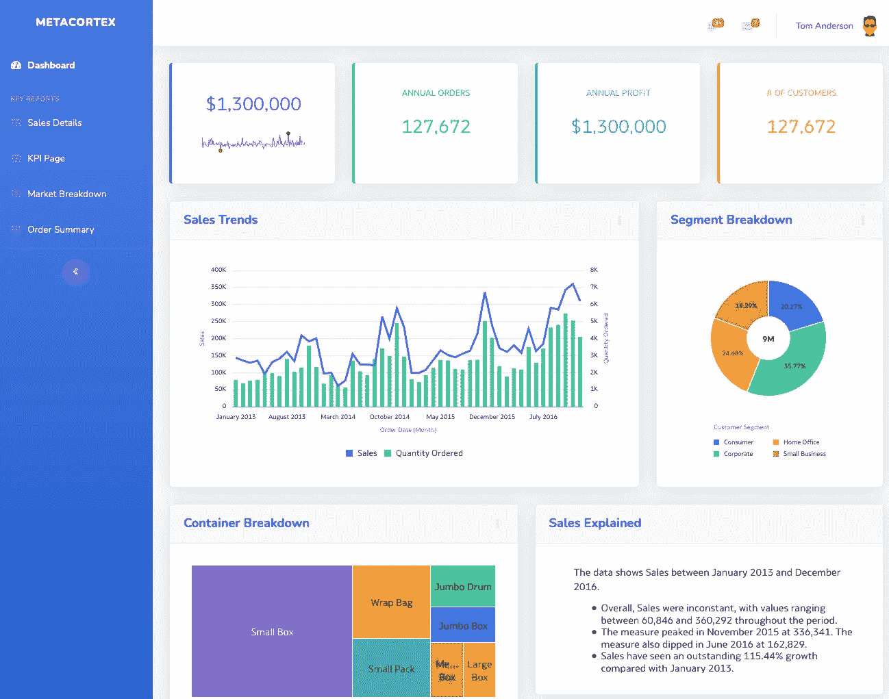
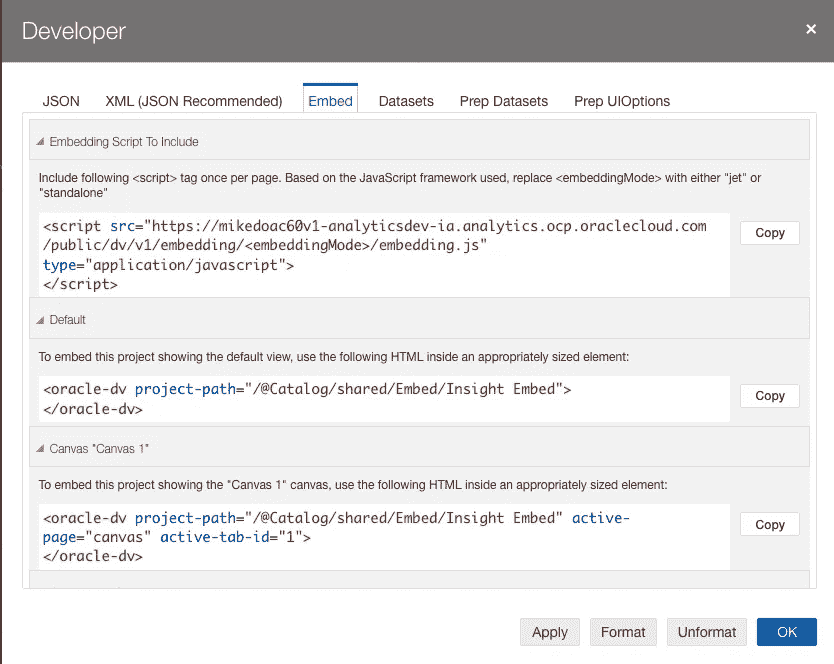
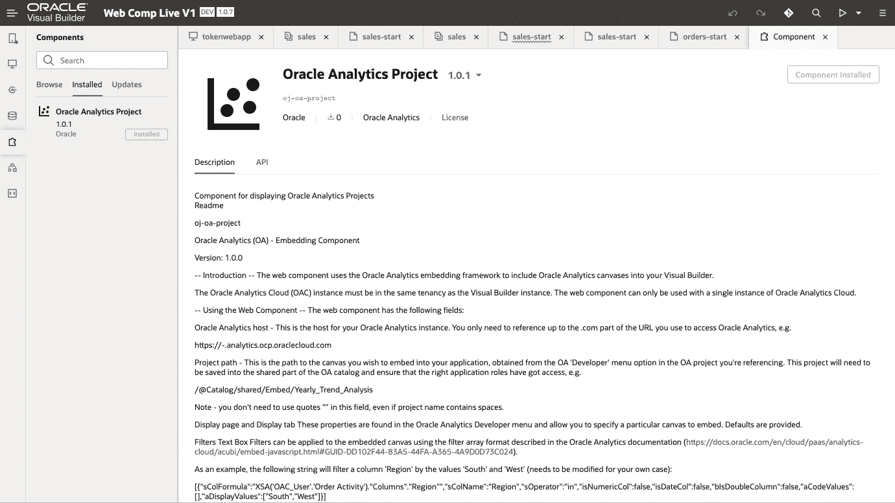
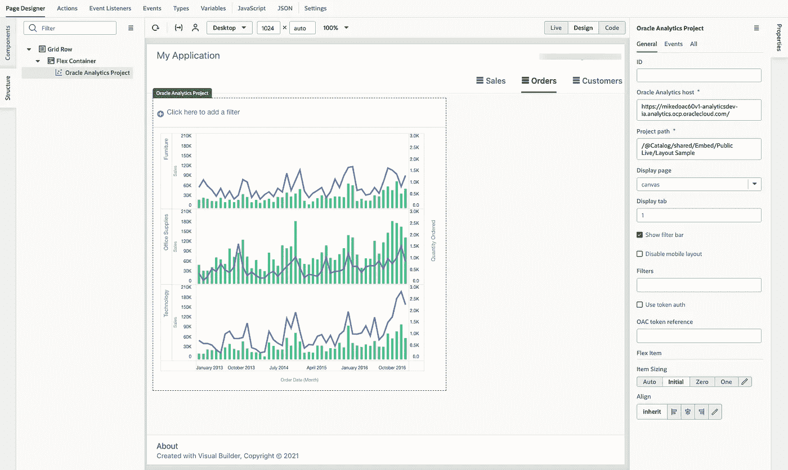

# 嵌入 Oracle 分析—有哪些选项？

> 原文：<https://medium.com/oracledevs/embedding-oracle-analytics-what-are-the-options-47f4a6c86851?source=collection_archive---------0----------------------->

# **简介**

在相关的地方嵌入分析可以增加“上下文”的价值。例如，在审查和批准费用的应用程序中嵌入对典型业务支出的分析可以节省时间和资源。嵌入还可以用于构建定制的 web 或移动分析应用程序，或者在企业门户或网站上分享见解。



Custom App Built with Embedded Oracle Analytics, HTML, CSS and JavaScript

# **嵌入 Oracle Analytics 的选项**

[Oracle Analytics](https://www.oracle.com/business-analytics/) 提供了许多嵌入洞察力的选项。这些包括使用 iFrames 或 JavaScript 嵌入框架，提供更大的灵活性和对嵌入内容的编程控制，并有利于定制的应用程序。由于嵌入通常包括来自“外部”源的内容，因此根据跨来源资源共享( [CORS](https://developer.mozilla.org/en-US/docs/Web/HTTP/CORS) )标准，需要在相关应用程序中输入“安全域”。Oracle Analytics 还提供了使用'[虚拟 URL](https://www.ateam-oracle.com/post/deploying-a-vanity-url-for-oracle-analytics)的能力，这在处理跨域嵌入场景时也很有用。

# **内嵌 iframe**

iFrame 是一种在应用程序或网页中嵌入外部内容的方式。这是嵌入分析的最简单的方法，在 iFrame 'src '参数中引用分析项目的 URL。

用于引用分析项目的 URL 将如下所示:

```
https://<OracleAnalyticsInstance>-ia.analytics.ocp.oraclecloud.com/ui/dv/?pageid=visualAnalyzer&reportmode=presentation&reportpath=<PathToProject>
```

这种方法也可用于将分析嵌入到应用程序中，该应用程序可能使用与 Oracle Analytics 不同的技术或框架，方法是将分析内容沙箱化。嵌入来自 Oracle Analytics 的“经典”内容时也使用 iFrame 方法，如[仪表板和报表](https://docs.oracle.com/en/cloud/paas/analytics-cloud/acubi/embed-iframes.html)。

# **嵌入 Oracle Analytics JavaScript 框架**

Oracle Analytics [数据可视化](https://www.oracle.com/business-analytics/analytics-platform/) (DV)是使用名为 [Oracle JET](https://www.oracle.com/webfolder/technetwork/jet/index.html) 的 JavaScript 工具包构建的。因此，Oracle Analytics 提供了一个嵌入分析的框架，可以适用于需要更多编程控制的定制应用程序或场景。

[嵌入框架](https://docs.oracle.com/en/cloud/paas/analytics-cloud/acubi/embed-javascript-embedding-framework.html)由一个 JavaScript 文件‘embedding . js’组成，该文件包含所有必需的库和一个标签'< oracle-dv >'，该标签用于 HTML 并引用要嵌入的内容，此外还提供控制嵌入视图或应用过滤器的各种选项。每个分析项目都从“开发人员”菜单中提供了用于嵌入的相关参考。



Oracle Analytics Developer Menu with Embedding References

Developer 菜单提供了 embedding.js 库的特定于实例的链接，该库必须在嵌入分析的页面的 HTML 中使用(不要在本地下载该文件，因为它会定期更新)。<embeddingmode>有两个选项，取决于你是否使用 Oracle JET。如果您没有使用 Oracle JET，您可以使用 embdding.js 的“独立”链接，这将提供您对所需库的 HTML 访问。</embeddingmode>

<oracle-dv>标签被添加到 HTML 中的</oracle-dv>

标签中(如果在应用程序或网页上看不到任何分析，请确保使用特定的“样式”)。最后，需要引用所需的库并应用绑定，因为 Oracle Analytics 使用 [require.js](https://requirejs.org) 进行依赖管理，使用 [Knockout](https://knockoutjs.com) 。

以下是生成的 HTML 的示例:

```
<!DOCTYPE html>
<html dir="ltr">
<head><meta http-equiv="Content-Type" content="text/html; charset=utf-8"><title>Embedded Oracle Analytics Project Example</title><script src="https://<instance>.analytics.ocp.oraclecloud.com/public/dv/v1/embedding/<embedding mode>/embedding.js" type="application/javascript">
</script></head>
<body>
<h1>Embedded Oracle Analytics Project</h1>
<div style="border:1px solid black;position: absolute; width: calc(100% - 40px); height: calc(100% - 120px)" ><!-- The following tag is the tag that will embed the specified project. --><oracle-dv
project-path="<project path>"
active-page="canvas"
active-tab-id="1">
</oracle-dv></div><!-- Apply Knockout bindings after DV project is fully loaded.  This should be executed in a body onload handler or in a <script> tag after the <oracle-dv> tag. --><script>
requirejs(['knockout', 'ojs/ojcore', 'ojs/ojknockout', 'ojs/ojcomposite', 'jet-composites/oracle-dv/loader'], function(ko) {
ko.applyBindings();
});</script>
</body>
</html>
```

你可以在这里和这里获得更多关于这种嵌入方法[的信息和例子。](https://insight2action.medium.com/oracle-analytics-cloud-developer-experience-fe510b5507e9)

# **嵌入到 Oracle Visual Builder 中**

Oracle [Visual Builder](https://www.oracle.com/uk/application-development/visual-builder/) 是一款低代码应用程序开发工具，它利用 Oracle JET UI 组件来提供构建 web 和移动应用程序的方法。Visual Builder 是一个可扩展的平台，Oracle Analytics 在 Visual Builder exchange 中提供了一个 [web 组件](/oracledevs/visual-builder-component-for-embedding-oracle-analytics-part-1-6de32b327d08)，可以轻松地将 Oracle Analytics 中的内容嵌入到 Visual Builder 应用程序中(在 VB exchange 中搜索“Analytics”或“oj-oa-project”)。



Oracle Analytics Embedding Web Component in Visual Builder Exchange

在将分析组件安装到 Visual Builder 应用程序时，它将出现在组件列表中，并且可以拖到应用程序页面上。分析组件在 Visual Builder 应用程序的上下文中管理前面描述的 JavaScript 嵌入框架的组件，并通过提供属性字段和复选框来定制用于分析嵌入的所需选项，从而简化该过程。



Using the Oracle Analytics Embedding Web Component in a Visual Builder Application

# **总结**

这个博客提供了嵌入 Oracle Analytics 的各种选项的快速浏览。使用引用分析内容 URL 的 iFrames 是在应用程序或网页的上下文中嵌入 analytics insight 的快速方法。对于更加程序化的嵌入方法，JavaScript 嵌入框架提供了更大的灵活性和控制力。对于构建分析应用程序的低代码/无代码方法，Visual Builder exchange 中的 analytics web 组件提供了一种简单的嵌入方法。