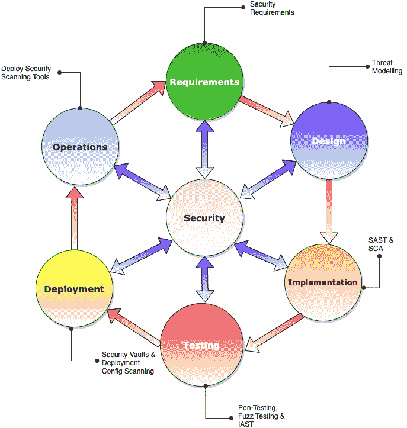
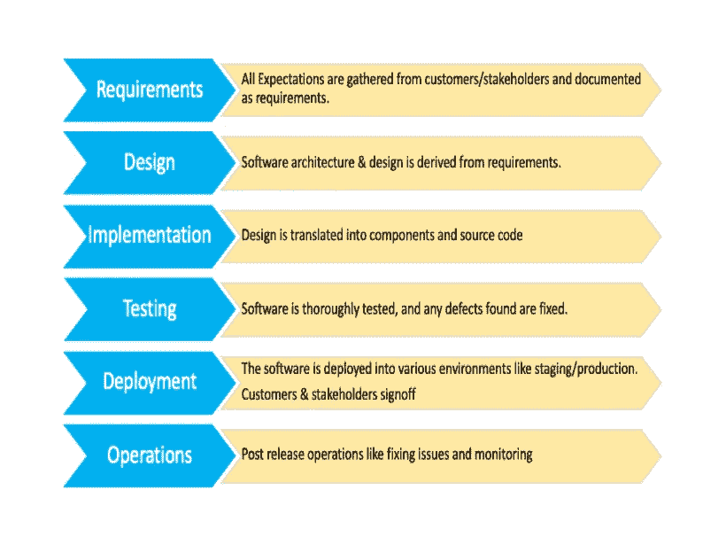

# 将安全性嵌入软件开发生命周期

> 原文：<https://medium.com/walmartglobaltech/embedding-security-into-software-development-life-cycle-9084169ebbc7?source=collection_archive---------2----------------------->

## 如何构建最安全的软件？

答案在于如何将安全性无缝嵌入软件开发生命周期 **(SDLC)** 。

让我们想象一下这样一种情况，一家公司雇佣有才华的工程师来扩展它的在线业务，并用最好的可用技术来构建软件。该软件上线几天后，媒体报道出现了严重的数据泄露。黑客窃取了客户的详细信息，包括支付卡的详细信息，这可能会给公司造成严重的财务和声誉损失。工程团队开始了详细的分析，发现攻击者利用了实现用户身份验证的缺陷，并能够窃取数据。该团队还发现客户数据被加密；但是，加密的密钥并不安全。因此，每个人都开始想知道哪里出了问题。进一步的分析表明，用户身份验证缺陷是由糟糕的设计造成的。由于不正确的部署和机密管理策略，密钥被暴露。虽然提到的情景是假设的，但威胁是真实的。

让我们重温一下将安全性嵌入 SDLC 的想法。下图突出显示了 SDLC 的各个阶段，每个阶段都对应于安全活动。

SDLC Cycle with Integrated Security in each phase

在我们深入研究 SDLC 的安全部分之前，让我们回忆一下 SDLC 包括哪些活动？下图简要总结了 SDLC 流程。

SDLC Stages

安全性是任何软件的重要组成部分，但在软件开发过程中却经常被忽视。组织应该创建一个安全的软件开发生命周期(SDLC)过程，其中安全被**自然地**结合到 SDLC 的每个阶段。这可以通过在每个阶段添加安全检查点来实现，并确保安全性是 SDLC 中每个阶段的一部分。创建一个安全的 SDLC 流程需要组织的专门努力和支出，但从长远来看会产生很高的 **ROI** (投资回报)。这样做的好处是，开发的软件不会有严重的安全威胁和漏洞。它不太可能有潜在的攻击媒介，帮助组织节省时间和精力，最重要的是，保护客户对企业的信任。

通过**自动化**将安全性嵌入 SDLC 是比手动安全性流程更好的方法。自动化确保安全无缝地成为 SDLC 的一部分。它有助于引入安全治理过程，该过程可以强制开发人员将安全性作为软件开发的一部分来实现。安全 SDLC 的目标应该是限制已部署软件中的漏洞。

让我们回顾一下每个阶段，看看可以使用什么安全工具或方法将安全流程集成到 SDLC 中。

**需求收集&分析阶段**:在需求收集阶段需要考虑安全性。该软件能抵御安全攻击吗？发生安全事件时，软件恢复的速度有多快？什么样的检查点和安全技术可以保护软件免受攻击者的攻击，而不会给正版用户带来太多麻烦？对这类问题的回答导致在初始阶段定义安全需求。

需求文档应该有关于安全需求的强制性部分。本节要求客户和利益相关者在 SDLC 流程的最早期就开始考虑安全性，而不是事后才考虑安全性。

**设计阶段:**软件中发现的大多数漏洞都是由糟糕的设计、不正确的技术选择以及在设计阶段对安全性关注不够造成的。

[威胁建模](https://en.wikipedia.org/wiki/Threat_model)是设计安全系统的重要过程。它的基础是识别威胁，以便制定缓解措施。在理想的场景中，一旦软件架构就位，就应该进行威胁建模。越早发现潜在的攻击，就越能节省时间和成本来设计解决方案。但是并不是所有的场景都是理想的，也不是所有的软件在设计阶段都经历了威胁建模评估。威胁建模也可以在后期完成，这仍然可以发现系统中的潜在缺陷。有许多工具可以帮助执行[威胁建模](https://www.toolbox.com/security/vulnerability-management/articles/top-10-threat-modeling-tools-2020/)。

**实施阶段:**在实施阶段，技术特定的安全指南和安全代码审查应该是重点。自动化代码安全扫描的工具称为安全代码分析工具，也称为**静态应用安全测试** **(SAST)** 工具。 [SAST](https://www.g2.com/categories/static-application-security-testing-sast) 工具执行自动化安全代码审查。检查和分析应用程序代码以发现安全漏洞，而无需实际执行代码。

软件应用建立在开源代码和库的基础上。开发人员不仅要对他们编写的代码负责，还要负责选择安全且没有漏洞的开源和第三方库。**软件组合分析(SCA)** 工具帮助开发人员缓解开源和第三方库、容器映像和注册表中的安全漏洞。 [SCA 工具](https://www.trustradius.com/software-composition-analysis)也可以扫描开源许可合规数据并提供相关建议。组织可以定义可接受的安全基准，如批准的基本映像、操作系统和基本安全配置。安全基线组件确保相同的漏洞不会扩散到组织中的多个产品。

SAST 和 SCA 工具可以集成到 **CICD** (持续集成和持续部署)管道中，以确保在 SDLC 的早期阶段解决安全漏洞。因此，组织可以在软件进入测试和部署阶段之前应用强制策略来解决安全问题。

测试阶段:在测试阶段，开发人员和测试人员可以检查应用软件的安全漏洞。在此阶段，有多种技术可以执行安全性测试。

*   **渗透测试(Pen Testing):** 测试人员检查应用程序、网络或计算机系统，寻找攻击者可能利用的漏洞。这可以是一个手动过程，也可以是手动测试和使用**动态应用安全测试(DAST)** 工具的组合。DAST 工具可以帮助自动化测试，但也会产生不可利用的假阳性结果，因此可能仍然需要开发人员或测试人员来确认每个发现。
*   **模糊测试:**通过向应用程序故意发送格式错误的输入来发现漏洞。模糊化工具可以通过创建畸形的输入、将输入传递给目标软件并检测应用程序故障来自动完成这一过程。
*   **交互式应用安全测试(IAST):** 将 DAST SAST 与运行时组件相结合，运行时组件可以与应用运行时相结合(例如，与服务器端 JVM 相结合)。当应用程序由自动化测试或人工测试运行时，IAST 工具分析代码的安全漏洞。当部署在具有自动化功能测试运行的测试环境中时，IAST 工作得更好。

一些最流行的 SAST/DAST 工具和它们的比较可以在这里找到。

**部署阶段:**部署阶段可以在加强软件的安全状态方面起到至关重要的作用。从安全角度来看，在云环境上部署带来了额外的挑战。应用程序配置参数，如数据库参数、私有证书或任何类型的与部署相关的敏感配置参数，应始终存储在**机密管理工具**中，如密钥库中，在运行时可供应用程序使用。云环境使用部署配置代码。容器环境使用的图像可能存在安全漏洞。有一些安全工具可以扫描部署配置文件和容器映像，查找任何漏洞、恶意软件和敏感数据。此类工具应配置为 CI/CD 管道的一部分，可以扫描并自动阻止部署—从安全角度来看，这可能有风险。

**运营和维护:**发布后的活动包括安全工程师执行安全监控、安全测试、事件响应等。持续监控、分析安全事件、将特定事件与安全威胁相关联，并采取措施降低风险。有安全扫描工具可以扫描应用程序或网络的漏洞。这些工具能够执行持续的安全扫描，并在发现任何威胁时发出通知。这里有几个这样的[安全扫描仪的例子。](https://resources.whitesourcesoftware.com/blog-whitesource/web-vulnerability-scanners)请注意，安全扫描仪的使用应符合道德规范。未经基础设施和应用程序所有者的许可，切勿使用这些扫描仪。

安全链条中最薄弱的一环是人类。我们可以把这句话扩展为:开发人员可能成为 SDLC 安全性的最薄弱环节。因此，定期为开发人员提供安全意识和培训计划是非常重要的。预先警告的开发者是预先武装的开发者。

**结论:**在 SDLC 中采用安全性是当务之急。数据泄露会导致市场声誉受损、股票价值下跌、客户关系恶化和销售额下降。将安全性嵌入 SDLC 的每个阶段可以及时防止大多数安全漏洞，保护组织免受多次网络攻击。

如果您想进一步了解，请查看微软的 [secure SDLC practices。](https://www.microsoft.com/en-us/securityengineering/sdl/practices)

**致谢:**我要感谢我的同事 Eric Goldman、Murali Segu、Oscar Blass 和 Sureshkumar Thangavel 仔细阅读了这篇博客并提出了改进建议。