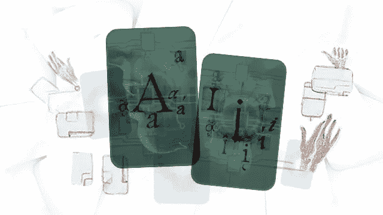

# 嵌入 Tribuo ML 库作为 JUnit 扩展

> 原文：<https://medium.com/oracledevs/embedding-tribuo-ml-library-as-a-junit-extension-7541f843d1ea?source=collection_archive---------0----------------------->



Alina Constantin / Better Images of AI / Handmade A.I / CC-BY 4.0

在这个思想实验中，我们在一个定制的 JUnit 扩展中利用 Tribuo 来了解使用机器学习(ML)来潜在地获得对给定服务或产品有用的质量保证(QA)洞察的可行性。

JUnit ，JVM 上最流行的测试框架，是一个模块化和可扩展的测试框架。JUnit 提供了一些扩展点来挂钩到它的生命周期中，并向它添加定制的特性。

Tribuo 是一个开源的机器学习 Java 库，提供分类、回归、聚类等工具。

出于本文的目的，我将假设读者熟悉 JUnit 扩展模型。如果您有兴趣了解更多关于 JUnit 扩展模型以及如何创建自定义扩展的信息，您可以参考 InfoQ 上的[我的文章](https://www.infoq.com/articles/deep-dive-junit5-extensions/)。此外，我还将假设读者熟悉 ML 概念。

假设我们有一个单元测试来验证返回 base64 编码字符串的哈希函数。它通常看起来像这样:

```
public class HashUtilsTest { @Test
  public void validHashTest() {
    var valueToHash = "JUnit with Tribuo is fun";
    var actualHash = HashUtils.hash(valueToHash);
    ...
    assertEquals(expectedHash, actualHash);
  }
}
```

现在让我们假设底层的散列函数已经被改变，它仍然执行工作，但是运行时间更长了。因为函数仍然产生正确的散列，所以单元测试继续通过。然而，更长的时间可能会被忽视。

我们可以构建一个定制的 JUnit [扩展](https://github.com/udaychandra/junit-tribuo/blob/main/src/main/java/io/github/udaychandra/jt/JTExtension.java)来计算执行一个测试类所花费的总时间，并运行 Tribuo 的异常检测 ML 模型来发现测试执行期间的任何异常。为了做到这一点，扩展一直在 CSV 文件中记录计时数据。为了简单起见，所有记录的数据都被天真地解释为`EXPECTED`观察。Java 的内置文件方法可以用来实现这一点:

```
var csvPath = ...
var time = ...
Files.writeString(
    csvPath,
    time + ",EXPECTED\n",
    StandardCharsets.UTF_8,
    StandardOpenOption.APPEND
);
```

一旦记录了足够的数据，扩展就会构建一个 ML 模型，并在测试运行时使用它来发现任何不寻常的观察结果。Tribuo 的[强类型类](https://tribuo.org/learn/4.2/docs/packageoverview.html#anomaly-detection)可用于实现这一点，如以下示例代码所示:

```
var oneClass = new SVMAnomalyType(SVMAnomalyType.SVMMode.ONE_CLASS); 
var params = new SVMParameters<>(oneClass, KernelType.RBF);
params.setGamma(MODEL_GAMMA);
params.setNu(MODEL_NU);var trainer = new LibSVMAnomalyTrainer(params);
var model = trainer.train(trainingDataset);var newRow = Map.of(
    "name", clazz.getName(),
    "duration", String.valueOf(durationInSec)
);
var headers = java.util.List.copyOf(newRow.keySet());
var row = new ColumnarIterator.Row(trainingDataset.size(), headers, newRow);
var example = sRowProcessor.generateExample(row,false).get();prediction = model.predict(example);// This is where you would generate an actual report.
System.out.println(example);
System.out.println(prediction);
```

我们所要做的就是在我们的测试类中使用这个新的扩展，如下所示:

```
@AnomalyDetector
public class HashUtilsTest { @Test
  public void validHashTest() {
    ...
    assertEquals(expectedHash, actualHash);
  }
}
```

在上面的例子中，假设成功运行测试通常需要 0.5-1 秒。但是，在哈希函数发生变化后，现在只需 3 秒钟就可以成功运行测试。这可能会导致潜在的性能退化(当然，这是一种过度简化)。如果经过训练的模型工作正常，那么这种不寻常的行为现在应该被标记为问题。

当测试类运行的时间符合预期时，我们从模型的预测中看到类似这样的东西:

```
Prediction(maxLabel=(EXPECTED,...
```

当模型检测到异常时，我们会看到这样的情况:

```
Prediction(maxLabel=(ANOMALOUS,...
```

这只是一个开始。在测试框架中利用 ML 来自动分析测试并提供更好的 QA 可能会有更有用的应用。感谢像 JUnit 和 Tribuo 这样优秀的开源库，我们可以很容易地探索这样的用例！

你可以在 [GitHub](https://github.com/udaychandra/junit-tribuo) 上查看实验代码。

## 加入对话！

如果你对甲骨文开发人员在他们的自然栖息地发生的事情感到好奇，来加入我们的[公共休闲频道](https://oracledevrel.slack.com/join/shared_invite/zt-uffjmwh3-ksmv2ii9YxSkc6IpbokL1g#/shared-invite/email)！我们不介意成为你的鱼缸🐠