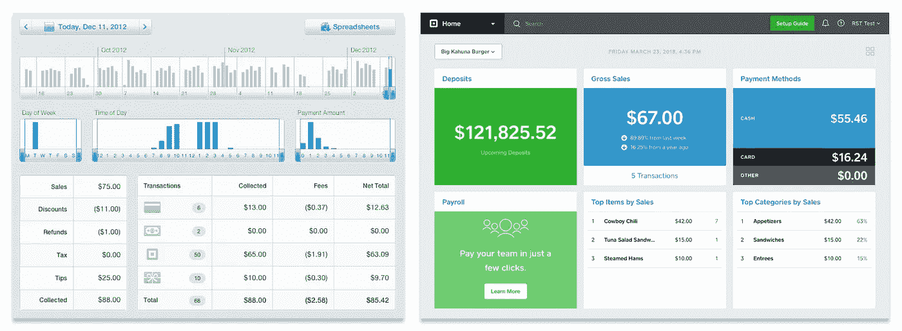
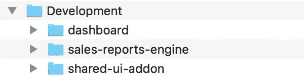
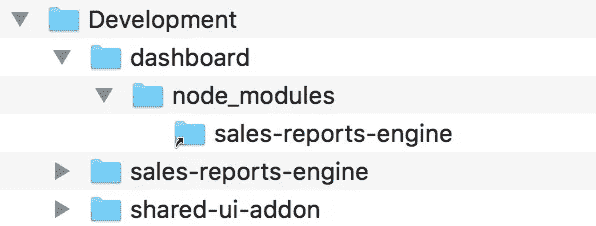
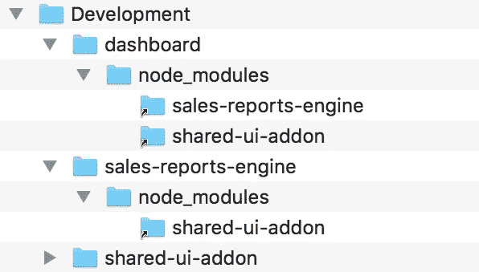
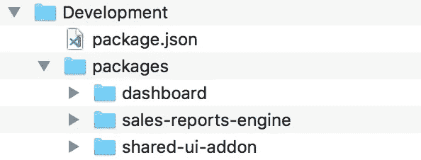
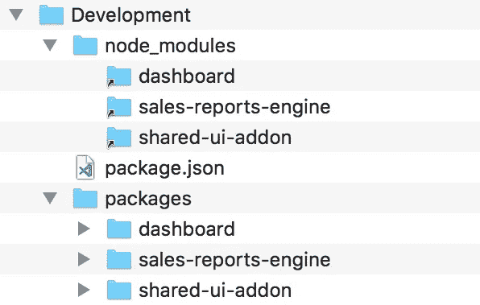

# 灰烬和纱线工作空间

> 原文：<https://medium.com/square-corner-blog/ember-and-yarn-workspaces-fca69dc5d44a?source=collection_archive---------2----------------------->

> 注意，我们已经行动了！如果您想继续了解 Square 的最新技术内容，请访问我们在 https://developer.squareup.com/blog[的新家](https://developer.squareup.com/blog)

Square 有几个 Ember web 应用，Square Dashboard 是最老最大的。最初的 commit 被丢进了历史的垃圾箱，但我被告知它始于 2011 年，是 Sproutcore 2.0(Ember 的前身)上的一个简单的销售报告应用程序。今天，它是一个 Ember 3.0 应用程序，有报告、客户管理、发票、员工工时记录卡等等。几乎每个月都有 100 名 Square 工程师接触代码库，我们每天都进行生产部署。



Square Dashboard circa 2012 versus Square Dashboard in the near future

将如此多的功能构建到一个应用程序中，使我们能够快速开发新产品和修复错误。直到去年年底，我们没有其他选择——我们使用的是定制的基于 Rails 的构建管道，不理解 Ember 应用程序。但是应用程序的规模是一个沉重的负担:构建和 CI 时间非常慢，并且代码库对新的和经验丰富的开发人员来说都是令人生畏的。

我们在 12 月 1 日完成了向 Ember CLI 的迁移，并且我们开始将 monolith 分解成 Ember 特有的 NPM 包，称为[插件](https://ember-cli.com/extending/#developing-addons-and-blueprints)和[引擎](http://ember-engines.com)，原因有二:

*   插件和引擎允许我们模块化代码库，并在逻辑域之间创建边界，使所有权更加清晰，并允许我们在团队之间共享代码，而不会创建依赖关系的老鼠窝。
*   引擎支持[延迟加载代码](http://ember-engines.com/guide/lazy-loading)，这意味着我们的商家不会下载应用程序的一部分代码，直到他们需要它。

然而，分解应用程序并不是万能的。如果我们简单地将代码从应用程序转移到单独的 NPM 包中，如下所示:



A working directory with three folders: “dashboard”, “sales-reports-engine”, and ”shared-ui-addon”. The latter could contain components and utilities used by both the app and the engine.

…将附件和引擎安装到仪表板上，如下所示:

```
{
  "name": "dashboard",
  "devDependencies": {
    "sales-reports-engine": "^1.0.0",
    "shared-ui-addon": "^1.0.0"
  }
}
```

…跨包同时开发代码会非常痛苦。默认情况下，NPM 和 Yarn 会在包之间复制文件。如果你在`sales-reports-engine`中改变了一个文件，并想在`dashboard`中看到它的反映，你必须完全重新安装引擎包。


#headdesk (from [https://giphy.com/gifs/fml-headdesk-frustrated-cvHSpGveXf5rG](https://giphy.com/gifs/fml-headdesk-frustrated-cvHSpGveXf5rG))

我们想要的是在不妨碍每个人的开发体验的情况下拆分应用程序的方法——特别是当我们鼓励工程师将大部分时间花在开发插件和引擎上，而不是添加到主应用程序上。

# npm 链接

一个解决方案是使用 [npm link](https://docs.npmjs.com/cli/link) ，一个将包符号链接在一起的工具。做着完全一样的事情。)使用它相当简单:

```
**>** cd sales-reports-engine
**>** npm link**success** Registered "sales-reports-engine".
**info** You can now run `npm link "sales-reports-engine"` in the projects where you want to use this module and it will be used instead.**>** cd ../dashboard
**>** npm link sales-report-engine**success** Using linked module for "sales-reports-engine".
```

运行这些命令后，您会在`dashboard`包的`node_modules`文件夹中看到一个指向引擎文件夹的符号链接:



The “dashboard” package now has a symlink to the “sales-reports-engine” code in its node_modules folder.

这种结构允许 Dashboard 在开发过程中直接从您的工作副本`sales-reports-engine`中访问文件。

但是，如果您想一次看到所有三个包的变化，这是不够的。你真正想要的是:



Tying everything together requires symlinks all over the place.

这种安排需要大量的`npm link`命令来构建，尤其是当我们有三个以上的包时。就我个人而言，我从来没有可靠地让`npm link`工作——这个工具工作正常，但是我不停地交换命令或者忘记我是否已经运行了它们。

还好有更好的办法！🙌

# 纱线工作空间

对工作空间[的支持于 2017 年 8 月在 Yarn](https://yarnpkg.com/blog/2017/08/02/introducing-workspaces/) 中推出，我们发现自版本 1.3.2 以来，该功能稳定且易于使用。从 Ember CLI 3.1 开始(现在是测试版)，工作区和 Ember 是最好的朋友！

要设置好一切，您需要将您的包移动到一个“工作空间根目录”中，并有自己的`package.json`文件:



The “packages” folder could be named anything, but it’s a common folder name in other monorepos like Babel and React.

工作区根目录`package.json`的内容非常简单:

```
{
  "private": true,
  "workspaces": [
    "packages/*"
  ]
}
```

现在，当您在工作区根目录中的任何地方运行`yarn install`时，Yarn 将发现包之间的依赖关系，并将符号链接提升到顶层`node_modules`文件夹:



Yarn workspaces organize all the necessary symlinks in a top-level node_modules folder.

**没有第二步！大多数在 Dashboard 上工作的工程师可能没有意识到这正在发生。**

*如果你想知道更多关于包如何在顶层* `*node_modules*` *文件夹中找到它们的依赖关系，节点文档* [*解释查找算法*](https://nodejs.org/api/modules.html#modules_loading_from_node_modules_folders) *。*

## 回购插件呢？

Ember CLI 最初的同步开发插件的解决方案是 [in-repo 插件](https://ember-cli.com/extending/#in-repo-addons)，它从来不需要任何`npm link`诡计。我们有几个不使用它们的理由:

*   In-repo 插件不能有自己的测试套件。测试文件进入主机应用程序。我们希望我们的测试像我们的应用程序代码一样解耦。
*   我们希望能够发布某些插件，供 Square 上的其他 Ember 应用程序使用。In-repo 插件不是真正的 NPM 包，所以它们不能自己发布。
*   类似地，**如果对他们的产品有意义的话，我们希望允许团队在未来脱离 monorepo** 。一旦他们的代码在一个“真正的”插件中，有了自己的依赖项和测试套件，他们就可以毫不费力地将文件转移到另一个存储库中。

*注意:命名是困难的——我们的“真正的”插件在同一个 git 存储库中，所以它们不是“in-repo”插件吗？*🤯为了区分这两种模式，我们在 Yarn 工作空间中使用术语“monorepo addon”来表示插件。

## 有什么问题吗？

不尽然！你必须在 **Ember CLI ≥ 2.18** 上才能使用 Yarn workspaces，Ember 才能工作(Edward Faulkner 的 commit [对原因有很好的解释](https://github.com/ember-cli/ember-cli/commit/9a35faf169d46f6d428043de132d4ff6b2a54709#diff-392bb207fea8bcbeb4a084bb445f7cc7))。

如果你使用 Ember CLI ≤ 3.1，像`ember install`这样的命令将默认使用 NPM，但这可以通过添加`--yarn`标志来弥补:

```
ember install ember-animate --yarn
```

(我们自己的 Timothy Park [在 3.1 中发布了补丁](https://github.com/ember-cli/ember-cli/pull/7492)来解决这个问题！)

## 迁移到 Yarn 工作空间

如果你遵循以下三个步骤，你会非常幸运:

*   将您现有的`yarn.lock`文件从原来的应用程序文件夹移动到 Yarn workspace 根目录。
*   按照[纱线文档](https://yarnpkg.com/en/docs/workspaces#toc-how-to-use-it)中的描述，在锁文件旁边创建新的`package.json`文件。
*   跑`yarn install`。

如果你不移动原来的锁文件，Yarn 将创建一个新的锁文件，并升级你所有的传递依赖。这可能会导致意外的破损。

将我们的应用程序切换到 Yarn 工作空间是我们在现代化代码库的过程中做出的最具影响力的决定之一。不再是一个巨大的应用程序，我们现在有了一个(稍微)更小的应用程序和十几个组织良好的插件和引擎，使用起来更好。**如果你有一个整体的应用程序，可能会在它自身的重量下开始弯曲，我强烈建议试试 Yarn workspaces。**

*又及一个额外的亲提示:* `*yarn upgrade-interactive*` *和* `*yarn outdated*` *工作* ***异想天开*** *在一个纱线工作区内。*💯