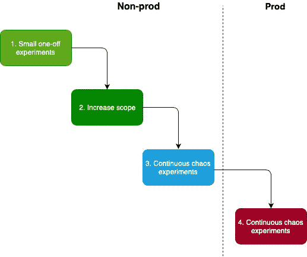

# 拥抱混乱…工程

> 原文：<https://medium.com/capital-one-tech/embrace-the-chaos-engineering-203fd6fc6ff7?source=collection_archive---------8----------------------->

## 混沌工程导论

# **什么是混沌工程？**

作为 Capital One 的一名架构师，我每天都要处理复杂的问题。我们不断完善我们的软件交付最佳实践，混沌工程一直是我关注的焦点。

根据[的混沌原理](https://principlesofchaos.org/?lang=ENcontent):

> *混沌工程是一门在系统上进行实验的学科，目的是建立对系统承受生产中动荡条件能力的信心。*

这是很多重要的词汇，但是我喜欢把混沌工程看作是应用弹性的“秘密顾客”。就像秘密购物者被企业用来揭露客户服务的问题一样，混沌工程也被用来揭露应用程序中的漏洞和弱点。例如，一个秘密购物者被送到一家商店，以不可预测的方式行事，并观察客户服务代表将如何处理愤怒的客户。在一项混沌工程测试中——通常称为混沌实验——一名工程师故意将不可预测性注入他们的系统，以观察它如何应对中断。

混沌工程是一种灵活的弹性方法，是对传统测试的补充。就像敏捷软件开发一样，你创建一个产品，听取用户的反馈，并迭代地进行改进，其核心混沌工程遵循相同的过程。

混沌工程不是要引入大爆炸故障，比如整个 AWS 区域变得不可用(尽管这可能发生，你应该为此做好准备)。它更可能关注更常见的问题，如磁盘空间或内存不足。从注入小故障开始，观察您的系统如何反应，并修复任何发现的问题。随着你扩大范围和运行更多的混沌实验，你的系统将迭代地变得更有弹性。

有许多不同类型的混沌实验可以在您的应用程序和基础设施上进行，但它们通常分为三大类:

1.  资源:你的系统如何处理资源高峰？例如，CPU、内存、I/O、磁盘空间等。
2.  **状态:**如果您的基础设施的状态发生变化，会发生什么情况？例如，关闭服务器、终止 Docker 容器、改变系统时间等。
3.  **网络:**你的应用如何处理网络问题？例如，数据包丢失、网络延迟等。

# **测试和混沌实验的区别**

你可能会问自己，这和传统的测试有什么不同？在混沌工程中，主要的焦点是使用*实验*而不是测试。但是实验和测试有什么区别呢？不同之处在于，测试侧重于针对特定条件验证**预测的行为**，而实验侧重于将故障注入到系统中**以产生关于它可能如何失败的新知识**。

将失败注入到一个系统中会以不可预知的方式扩散开来，所以把你的组件和过程看作一个系统。您不是在测试一个特定的特性，而是在观察组件集合如何一起响应一个不可预测的变化。这种思维方式需要一种新的思维方式，但是它会让你对你的产品处理中断的能力有信心。

测试让我们走了一段路，但是复杂性使得不可能验证每一个场景。这就是混沌实验可以帮助你发现未知的未知。

例如，测试将检查对 CPU 密集型操作的请求是否在 5 毫秒内响应，但混沌实验是一种假设，即当系统被多个高 CPU 使用率和低 CPU 使用率的请求淹没时，它会适当地将工作负载定向到具有足够 CPU 的执行器。

# **为什么你需要混沌工程**

所以你创造了一个牙刷交换，祝贺你！当您只有 11 个用户(几乎一半是家庭用户)时，很容易吹嘘您的系统的稳定性。我也经历过，相信我。如果你的网站关闭了，这没什么大不了的，因为没有人真正使用它。

但谁知道共享经济如此强劲！现在，全球有成千上万的用户在优化他们的牙刷使用。随着规模的扩大，你的应用会面临一系列全新的企业问题。

因为您关心用户体验，所以您将系统设置为在东部和西部地区运行以减少延迟。一切都运行良好，网站也在稳步发展。然后有一天，某个地区发生了故障，所有流量都自动路由到一个地区。您已经设置了自动扩展(已经过测试)，但是您没有准备好处理过去分布在一个区域中的两个区域之间的所有流量。因为已经达到了自动缩放的极限，所以应用程序逐渐停止。你所有最好的计划都是一团糟。

你的 100%测试覆盖率只测试了你知道要测试的东西；但是，在你的用户出现并开始按下按钮之前，那些潜伏在黑暗中的未知又是怎么回事呢？只有在 2 月 29 日满月期间，组件 A 调用组件 B，组件 B 调用组件 C 时，未知才会出现？

应用程序会很快变得复杂，尤其是在企业范围内。最终将某个产品发布到生产环境需要做大量的工作，在经历了构建、测试和部署之后，故意试图“破坏”它可能看起来是违反直觉的。

大型企业，尤其是那些受监管行业的企业，需要比一般的站点更加防中断。因此，像医疗保健或金融这样的受监管行业应该将混沌工程作为其弹性工作的一部分，以帮助在故障变成停机之前解决故障。

将问题注入到您的实际应用程序中最初可能看起来很可怕，但这正是您应该做的。关键是一步一步来。我鼓励你和你的团队将混沌工程作为你交付实践的一部分，但是记住从小处着手，随着你的舒适程度的提高而扩大范围。请不要在没有准备好的系统上运行混沌实验。

# **混沌工程如何入门？**

混沌工程的圣杯是在生产中运行混沌实验。但是不要期望马上到达那里。

我通常推荐这样的采用框架:

1.  **非生产环境中的小型一次性实验**。选择一些低影响的东西并测量/观察。这里的主题是学习、修正和迭代。
2.  **递增范围**。以此为契机，提高您的应用弹性，完善您的工程和运营实践。你的监控怎么样？如果出现问题，您了解恢复步骤吗？这也是完善您的事件管理的好时机。
3.  **非 prod 中的连续混沌实验。**现在你已经准备好将实验整合到你的 CI/CD 流程中了(你很有可能正在使用它，否则在你考虑混沌工程之前先这么做)。将混沌实验与其他形式的测试(例如端到端、性能、负载等)一起构建到您的开发周期中。).目标应该是使用您学到的知识来提高您的系统弹性，并进一步完善您的操作和工程实践。
4.  **prod 中的连续混沌实验。**随着对您的解决方案处理故障能力的信心增加，您将开始转变对中断的看法。在非生产环境中成功运行之前，不要在生产环境中进行混沌实验。这可能需要一段时间，但最终目标应该是开始慢慢地将混沌实验整合到生产环境中。就像在非 prod 中一样，从小实验开始，观察。了解你的系统如何反应，并相应地适应。到目前为止，您应该已经启用了深度监控和实时警报，以通知您由用户或您的混沌实验引起的任何问题。确保您有一种回滚的方法，以防出现意外情况。*我重复一遍，要有后备计划。*

如果你已经走了这么远，混沌工程就是你的一部分。干得好！

# **什么工具可以让你在混沌工程上领先一步？**

既然您已经有了一个将混沌工程应用到您的应用程序中的框架，我建议您看看现有的情况。有许多开源产品可以让你马上上手，还有一些有趣的服务可以利用。

*   猴军(混沌猴，孔)——来自的工具套件，用于提高对随机实例/区域故障的弹性。
*   由网飞/谷歌“混乱校友”发起的失败即服务(是的，这是一件事)
*   [PowerfulSeal](https://github.com/bloomberg/powerfulseal) —彭博开源工具，给 Kube 集群增加了混乱。

关于混沌工程的一些附加资源:

*   [混沌工程](https://www.oreilly.com/library/view/chaos-engineering/9781491988459/) -图书
*   [混沌工程原理](https://principlesofchaos.org/?lang=ENcontent) —现场
*   [实用混沌工程故意破坏事物，使其更能抵御失败](https://www.youtube.com/watch?v=w_Y6C0QgmL0) —混沌工程深度讲座

*披露声明:2020 资本一。观点是作者个人的观点。除非本帖中另有说明，否则 Capital One 不隶属于所提及的任何公司，也不被这些公司认可。使用或展示的所有商标和其他知识产权是其各自所有者的财产。*