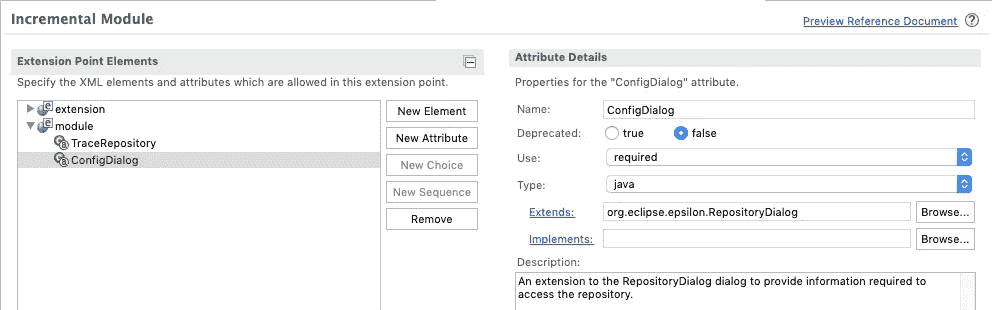

# 用 Guice 增强 Eclipse 的扩展点

> 原文：<https://medium.com/quick-code/empower-eclipses-extension-points-with-guice-e75a7e4526bd?source=collection_archive---------3----------------------->

Eclipse Equinox 是 OSGi 核心规范的一个实现，它允许 Eclipse 应用程序动态地安装、激活、停用、更新和/或卸载扩展/增强应用程序功能的组件和服务(插件)。一个*插件*是一个模块化的、自包含的单元，它提供了一个可以在 Eclipse 应用程序中使用或者被其他插件使用的 API。插件可以提供对 Eclipse 应用程序 UI 的增强(例如，附加的菜单、按钮、对话框等)，可以提供允许用户执行任务的 Java 类(例如，提交到 VCS 存储库、运行单元测试、将 web 应用程序部署到服务器等)。)或者两者都有。此外，插件可以提供扩展点，因此用户可以通过添加缺少的/附加的功能来扩展插件。例如， [Mylyn](https://www.eclipse.org/mylyn/) 插件定义了扩展点，允许用户连接到开箱即用的任务服务。

# 扩展点

简单地说，扩展点定义了一个插件和其他希望扩展其功能的插件之间的契约。这通常包括一组必须配置的参数和/或实现特定接口(也支持类扩展)的类的限定名。扩展插件必须提供所有这些信息。在运行时，Equinox api 可用于查找哪些插件扩展了特定的扩展点，检索参数值并实例化适当的类。


上图展示了如何定义一个简单的扩展点。这个扩展点允许插件贡献它们自己的 API 实现，该 API 是在类 org . eclipse . epsilon . imoduletracerepository 中定义的。假设我们想提供一个可以处理文本文件的实现和另一个可以处理数据库的实现。为了访问它们中的每一个，需要一组不同的信息；例如，对于文件，路径/位置就足够了，对于数据库，我们可能需要 url、登录凭证和目标数据库。因此，每个实现都需要一个单独的配置对话框来提供必要的信息。我们可以通过向我们的扩展点添加另一个属性来解决这个问题，通过它也提供了要使用的特定配置对话框，如下图所示。



# 管理扩展点

扩展点信息存储在扩展点模式中(带有*的 xml 文件)。exsd* 扩展名)，它们是从插件的 *plugin.xml* 元数据文件中引用的。这意味着，尽管在创建扩展点时，内容辅助或类选择工具帮助我们挑选现有的类，*扩展/实现了*信息以纯文本形式存储。这样做的最大后果是扩展点方案中的信息与 java 代码脱节。因此，诸如更改类名或包之类的重构会破坏扩展点。然而，在扩展插件加载到 Eclipse 应用程序之前，这个错误不会出现。

此外，扩展点有许多需要提供的文档。因为模式不是主要代码库的一部分，所以更容易让这些信息变得陈旧(或者根本不提供)。此外，添加/删除 API 变得非常耗时。创建新元素/属性，定义其属性，指向正确的类，添加描述，更新扩展点文档…此外，扩展点成为 API 的固有部分，在确定是否需要主要、次要或修补程序时，必须考虑对其进行任何更改。

# 依赖注入拯救

理想情况下，我们希望定义一次扩展点，并尽可能少地改变它们。这需要我们预见可能的扩展点，并为它们做好准备。实际上，直到添加了新的特性/功能，并且随着应用程序架构的改变，我们才能够确定需要什么扩展点。例如，在我们广泛介绍的插件中，我们可能会先发制人地防范其他类型的存储库……但是如果我们也想允许扩展插件来贡献工厂、任务管理器等，该怎么办呢？

***一个利落的办法，IMHO，就是通过依赖注入来解决这个。***

[Guice](https://github.com/google/guice) 是 Google 开发的依赖注入框架。

> …注入只是一种设计模式。核心原则是*将行为与依赖解析*分开。

也就是说，类不再负责查找它们执行所需的对象，这些应该在构造时提供。Guice 框架处理“构造期间的供应”(也称为注入)，你需要做的就是 **a)** 告诉 Guice 它负责注入什么依赖关系(通过注释)以及 **b)** 在注入期间使用什么实现。后者是通过扩展 **AbstractModule** 类来完成的。

如果我们将所有依赖解析委托给 Guice，这意味着我们可以极大地简化我们的扩展点。怎么会？在前面的例子中，我们可以改变我们的扩展点来接受扩展 Guice 的 AbstractModule 的类。也就是说，扩展插件提供了一个绑定所需实现的 Guice 模块。

# 把所有的放在一起

我将假设我们修改了基本代码，现在 IModuleTraceRepository 和 friends 是通过注入提供的。然后，我们更改扩展点以接受 AbstractModule:


The TraceRepository implementation is replaced by a Guice module that can provide all bindings.

接下来，扩展插件可以提供自己的 AbstractModule 实现:

```
**public** **class** MyTraceGuiceModule **extends** AbstractModule {@Override
**protected** **void** configure() {
    bind(IModuleTraceRepository.**class**).to(MyModuleTraceRepo.**class**);
}
```

并在扩展配置中提供它。

现在，如果将来我们需要其他类型的存储库，可能是工厂或其他实现，我们不需要更改扩展点定义，扩展插件只需要添加更多绑定:

```
**public** **class** MyTraceGuiceModule **extends** AbstractModule {@Override
**protected** **void** configure() {
    bind(IModuleTraceRepository.**class**).to(MyModuleTraceRepo.**class**);
    bind(IModelTraceRepository.**class**).to(MyModelTraceRepo.**class**);
    bind(IElementFactory.**class**).to(MyElementFactory.**class**);
    ...
}
```

这仍然没有解决文档的问题。如果扩展点定义中列出了所需的绑定，那么这些信息可能会在一段时间后变得陈旧。解决这个问题的一个方法是为您自己的 AbstractModule 扩展提供列出所需绑定的 Javadoc 注释。此外，这个类可以有一个方法，该方法可以检查是否已经提供了所有需要的绑定，并发出警告/异常以通知开发人员。大致如下:

```
class YourModule extends AbstractModule {@Override protected void configure() { }

  void validateBindings(Injector injector) {
    Set<Class<?>> reqInterfaces = **new** HashSet<>(
      Arrays.*asList*(
        IModuleTraceRepository.**class,** IModelTraceRepository.**class,** IElementFactory.**class,
        ...));** req.removeAll(injector.getAllBindings().keySet().stream()
      .map(k -> k.getTypeLiteral().getRawType())
      .collect(Collectors.*toSet*()));
    if (!req.isEmpty()) {
      throw new IllegalStateException("Missing bindings: " + req);
    }
  }
}
```

# 结局

Guice 注入可以简化您的扩展点管理。试试吧，让我在下面的评论中知道它的进展如何。

[](https://www.buymeacoffee.com/KinoriTech)