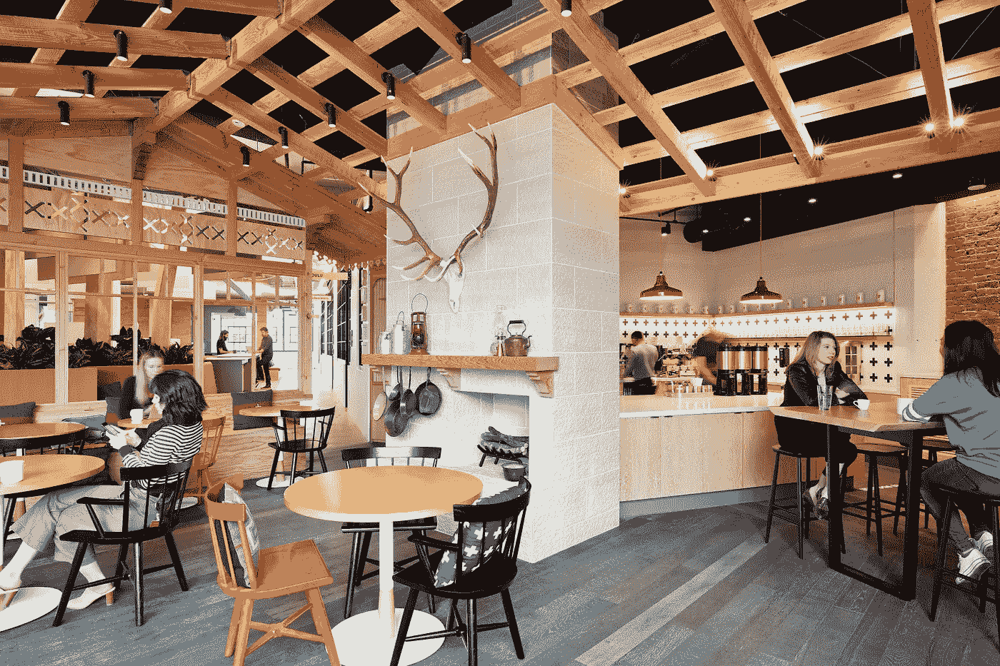
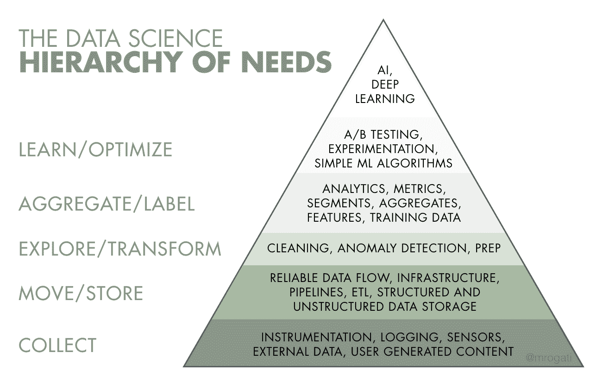
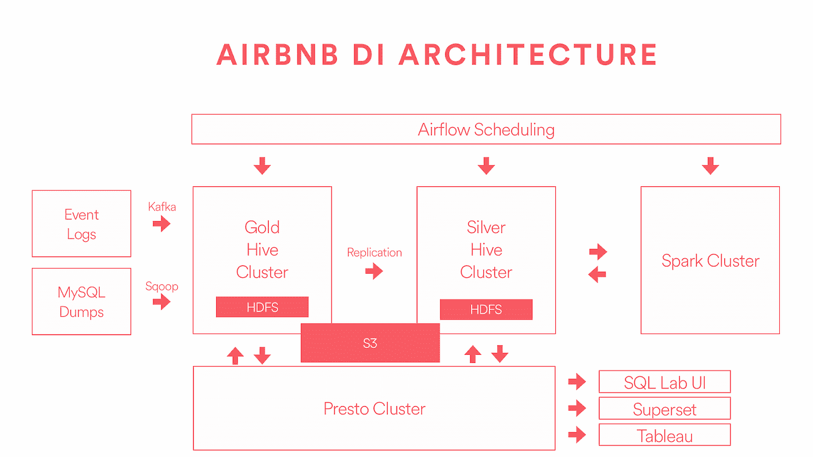

# 通过工程教育增强数据科学

> 原文：<https://medium.com/airbnb-engineering/empowering-data-science-with-data-engineering-education-ef2acabd3042?source=collection_archive---------2----------------------->

## 工程教育使数据科学家能够更好地与工程互动，并确保更高的数据质量。

**作者:** [*杜*](/@michelle.du)***[*冯志杰*](/@jtfeng)***

****

**Our brand new kitchen on the 2nd floor of 888 Brannan St.**

**自从两年前在 Airbnb 推出[数据大学](/airbnb-engineering/how-airbnb-democratizes-data-science-with-data-university-3eccc71e073a) (Data U)以来，我们的数据教育项目已经朝着我们的总体愿景取得了重大进展，即让每一位员工都能做出基于数据的决策。迄今为止，来自数据科学&工程组织的 55 名志愿者教员已经向数千名课程参与者教授了 400 多门课程。这些课程中教授的内容有助于为组织中无数员工提供基于数据的决策基础。**

**虽然数据大学对我们员工的数据技能产生了重大影响，并正在建立一种植根于数据的文化，但我们已经发现，除了 Data U 产品之外，还需要针对团队的培训，以满足特定职能部门和业务部门的独特需求。上个月，我们与我们的体验业务部门和公共政策团队分享了我们的“T20”数据密集型培训。在本帖中，我们分享了我们在提升数据科学团队的工程技能以提高其整体效率方面的经验。它在内部收到了很好的反馈，我们希望与更广泛的社区分享我们的经验。**

# **为什么要给数据科学家配备工程教育？**

**消费技术行业的数据科学家正在一个移动/网络产品和数据基础设施变得越来越复杂的环境中工作。因此，如果不精通工程的某些方面，几乎不可能有效地执行数据科学功能。**

**Airbnb 的数据科学团队认为，让团队具备工程视角对于产生高质量的数据以及改进我们记录和运行实验的方式是非常有益的。下面关于*数据科学需求层次的图表*生动地展示了坚实的数据工程基础对于构建有效的度量、分析、实验和机器学习系统是多么重要。**

****

***Figure 1: The pyramid of data needs* [*illustrated by Monica Rogati*](https://hackernoon.com/the-ai-hierarchy-of-needs-18f111fcc007)**

**我们推出的解决方案是工程授权数据科学(EEDS)计划。该计划的目标是使数据科学家具备专门针对数据系统设计、数据质量改进和生产力的工程知识。我们设计了 EEDS 计划，希望解决以下挑战:**

****1。Airbnb 数据平台上的知识是条块分割的。**关于如何跨平台生成、存储和计算数据，我们的端到端文档或培训非常有限:**

*   **数据科学家缺乏背景知识，这使得在事件发生时或共享关于数据平台的功能请求时传达反馈变得非常困难**
*   **工程知识的不足通常会导致数据处理效率低下、计算资源使用不当以及分析或模型结果有问题**
*   **对数据的不完全理解意味着数据科学家要花费大量时间进行特别调查**

****2。新数据科学家通常不具备 Airbnb 工程系统的足够知识来预见和预防登录中的上游问题**，即使他们可能在下游数据问题上有很多经验。**

****3。内部软件包和工具的文档和教程有时是有限的/孤立的。**我们通过在 Airpy(一个 Python 工具包，用于从 Airbnb 数据源访问、提取、操作和绘制数据)和 rbnb(一个 R 函数和 R 包的集合，对于在 Airbnb 实践数据科学至关重要)等内部包中自动化常见任务，创造了许多优势。但是，创建用户定义函数(UDF)、编码最佳实践以及为数据产品创建快速演示站点的技巧可能会让更多人受益。**

****4。没有适合 Airbnb 独特生态系统的第三方教育资源**，我们可以直接利用它们进行数据工程和数据科学教育。**

**我们相信这些挑战在科技公司中普遍适用，我们强烈认为我们通过 EEDS 计划获得的解决方案和知识应该与更广泛的数据科学界分享。**

# **EEDS 项目的学习目标**

**考虑到这些挑战，我们建立了**工程支持的数据科学**计划，以解决我们面临的挑战，并用基本的工程知识提升我们的数据科学家的技能。该课程持续了整整两天，包含几个学习目标:**

*   ****帮助数据科学家更深入地了解整个数据系统**，以便在诊断实验结果和实施数据产品时更好地与工程师合作。**
*   ****让数据科学家能够利用现代日志记录基础设施**，以及如何使用简单的 SQL 查询访问这些数据。**
*   ****传播自动化、数据产品和 ML 方面的最佳实践**—确保数据科学家了解如何编写简单、可读、高性能和可维护的代码，以提高生产率和算法代码质量。**

# **EEDS 格式和内容**

**为期两天的项目包括一系列 30-60 分钟的会议，以讲座和研讨会的形式，介绍 Airbnb 的工程平台、设计原则和数据科学的最佳实践。数据科学与会者深入了解 Airbnb 的数据系统，数据是如何生成/存储/计算/监控的，以及内部生产力工具提示。**

**该计划的教员包括:**

*   **工程师和技术项目经理是数据基础设施、端到端数据系统、日志记录、计算框架、监控、异常检测和警报系统方面的专家。他们大多来自我们的基础设施工程团队。**
*   **对数据基础设施、数据产品、机器学习或自动化工具建立了坚实的理解和使用案例的数据科学家。**

**目前的课程涵盖 6 个核心领域:**

*   ****Airbnb 的数据系统**是 Airbnb 数据基础设施的速成班，涵盖了数据科学家的考虑事项。这有助于数据科学家更好地了解数据如何流动以及潜在的断点在哪里。这还可以防止数据管道中断，并改善跨数据平台的问题交流。**
*   ****计算框架**是关于计算可观察性和最佳实践的会议。这有助于数据科学家理解计算资源分配，以及在 Airbnb 编写一般查询时的注意事项。**
*   ****日志最佳实践**是关于日志最佳实践&模式设计的会议，随后是深入的演示和实践研讨会。这有助于确保数据生成的质量，并减少下游所需的 ETL 工作。**
*   ****实验**概述了实验报告框架(我们的实验平台)，以及如何使用它来监控实验。这有助于数据科学家了解框架支持的所有功能，以及如何交付设计良好的实验，产生可靠的实验结果，以更好地支持产品开发。**
*   ****异常检测**是异常检测框架的概述。这有助于数据科学家了解如何使用我们的内部异常检测框架来构建一致且可扩展的异常事件监控解决方案，从而允许用户在此类事件发生时及早采取措施。**
*   ****生产力研讨会**是一个实用工具技巧的实践研讨会。一个例子是如何用 Java 和 Python 创建自己的 Hive 用户定义函数(UDF)。这有助于提高源自 SQL 的 MapReduce 作业的效率。**
*   ****ML 工具研讨会**是一系列关于使用 Airbnb 的 ML 平台 [Bighead](https://conferences.oreilly.com/strata/strata-ny-2018/public/schedule/detail/69383) 构建 ML 模型的实践研讨会。了解如何有效利用平台和工具以及如何避免常见缺陷，有助于数据科学家在构建 ML 模型时提高工作效率和成功率。**

**Airbnb 的**数据系统**和**记录最佳实践**课程是整个课程的基础。它们非常有帮助，因为它们建立了对 Airbnb 数据生态系统的基本理解(如下图 2 ),以及数据科学家如何通过牢记最佳实践来帮助提高数据质量。**

****

**Figure 2: A high-level illustration of the Data Infrastructure at Airbnb**

# **结论**

**截至今天，已有超过 50 名 Airbnb 数据科学家参加了培训，我们收到了关于 EEDS 项目的大量反馈。超过 90%的学生认为这是对他们时间的有效利用，他们学到了一些新的东西，对他们的日常工作有帮助。**

**EEDS 项目也为 Airbnb 创造了巨大的影响力。教授数据和工程方面的最佳实践帮助我们确保了前期设计的高数据质量，从而帮助我们避免了日后修复问题。此外，该计划提供关键知识，使数据科学与工程有效合作。最后但同样重要的是，我们在员工成长和继续教育方面的投资为我们的数据科学家提供了宝贵的知识，这些知识将伴随他们的整个职业生涯。**

**Airbnb 在投资员工和为每个人提供学习方面有着传统。EEDS 计划的目标是数据科学家，它与我们更广泛的数据教育计划[数据大学](/airbnb-engineering/how-airbnb-democratizes-data-science-with-data-university-3eccc71e073a)紧密相连。在新员工有机会试用 Airbnb 的数据和工具后，它还通过深入研究该角色的技术方面来丰富我们的数据科学入职计划。该课程的参与者分享说，该材料帮助他们与其他职能部门(如数据工程、数据基础设施和产品工程)建立了更多的共鸣，并促进了更好的跨职能部门协作。**

**我们希望我们的知识可以帮助其他组织扩大其内部教育工作，使数据科学家能够在技术环境中做更好的工作。我们在此分享的课程不仅为业内的数据科学家提供学习建议，也为那些希望加入的人提供学习建议。了解在科技行业和传统行业(如统计、研究等)担任数据科学家所需的额外技能。将有助于弥合差距，并鼓励我们领域的更大多样性。展望未来，EEDS 现在是 Airbnb 数据大学定期课程的一部分，随着我们平台和工具的发展，我们将继续迭代内容。**

# **确认**

**我们要特别感谢— *Elena Grewal、Ricardo Bion* 对该计划的大力支持； *Gurer Kiratli、Lauren Chircus、Gabe Lyons、Reid Andersen、Alice Beard、Varant Zanoyan、Alfredo Luque、Andrew Hoh、马婷婷、陈坚、王昊、Mihajlo Grbovic、Pai Liu、Cindy Chen、David Dolphin、Jingjing Duan* 感谢他们成为我们优秀教师团队的一员，感谢他们不断完善我们的课程内容&； *Ellen Huynh* 提供有用的反馈，帮助组织项目；以及*整个数据科学团队*的支持和反馈。我们还要感谢*纳文·西瓦南达姆、曾晓涵*和*杰米·斯托伯*对校对工作的大力帮助！**

**Airbnb 一直在寻求优秀的人加入我们的团队！如果您有兴趣在 Airbnb 发展您的职业生涯，请查看我们在数据科学和分析领域的[空缺职位](https://www.airbnb.com/careers/departments/data-science-analytics)，并发送您的申请！**