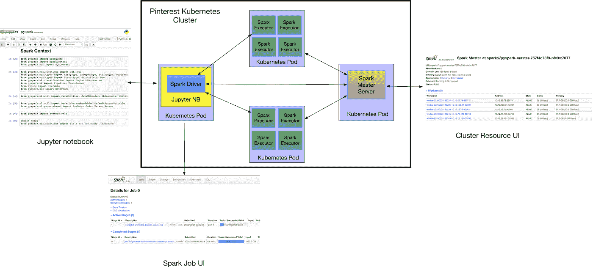
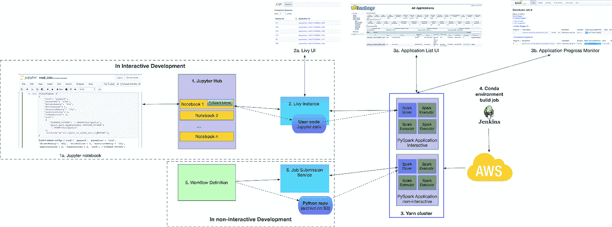
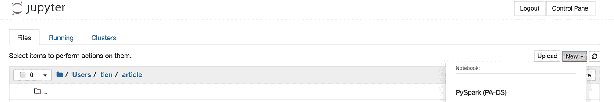
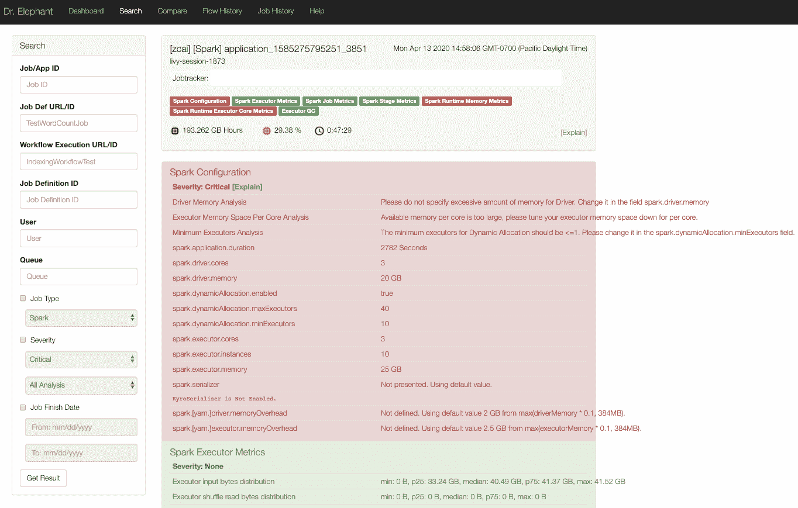
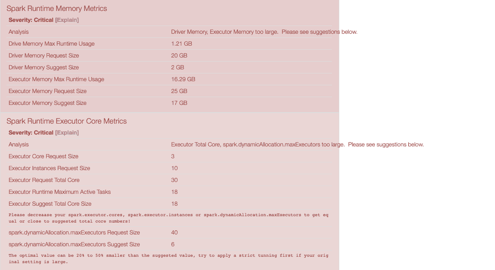
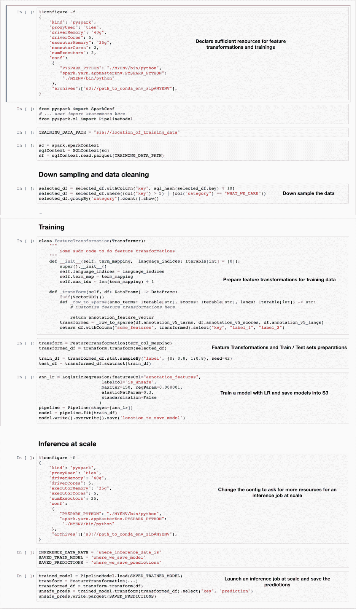

# 通过 PySpark 为 Pinterest 数据科学家和机器学习工程师提供支持

> 原文：<https://medium.com/pinterest-engineering/empowering-pinterest-data-scientists-and-machine-learning-engineers-with-pyspark-f41b0d1dd1b8?source=collection_archive---------0----------------------->

Tien T. Nguyen |机器学习平台，Jingge Zhou |机器学习平台，Zirui Li |数据处理平台

Pinterest 的数据科学家和机器学习工程师发现自己在现有工具上遇到了重大挑战。Hive 和 Presto 是易于访问的大规模数据转换工具，但是复杂的逻辑很难用 SQL 编写。一些工程师在 Cascading 或 Scala Spark 作业中编写复杂的逻辑，但这些作业有一个陡峭的学习曲线，需要更多的时间来学习和构建作业。此外，数据科学家和机器学习工程师经常在小规模的笔记本环境中训练模型，但他们缺乏执行大规模推理的工具。

为了应对这些挑战，我们(机器学习和数据处理平台工程师)构建并生产了 PySpark 基础设施。PySpark 基础设施为我们的用户提供了以下功能:

*   在允许试验新包的隔离环境中，使用熟悉的 Python 语言和库编写逻辑。
*   从我们的 JupyterHub 部署进行快速原型开发，使用户能够交互式地尝试功能转换、模型想法和数据处理工作。
*   与我们的内部工作流系统集成，以便用户可以轻松地将他们的 PySpark 应用程序生产为预定的工作流。

# PySpark 在 Kubernetes 上作为最低可行产品(MVP)

我们首先使用 [Spark 独立模式](https://spark.apache.org/docs/latest/spark-standalone.html)在 Pinterest Kubernetes 基础设施上构建了一个 MVP PySpark 基础设施，并针对用户反馈进行了测试。

**Figure 1\. An overview of the MVP architecture**

基础设施由执行不同任务的 Kubernetes 吊舱组成:

*   Spark Master 管理集群资源
*   工人——产生星火执行者的地方
*   分配给每个用户的 Jupyter 服务器

当用户从这些 Jupyter 服务器启动 PySpark 应用程序时，Spark 驱动程序在与 Jupyter 相同的 pod 中创建，而请求的执行器在 worker pods 中创建。

这个架构让我们的用户第一次体验到了 PySpark 的强大功能。数据科学家能够快速掌握 Python UDFs，转换要素，并使用万亿字节的数据对张量流模型进行批量推断。

然而，这种体系结构有一些限制:

*   Jupyter 笔记本和 PySpark 驱动程序共享资源，因为它们在同一个 pod 中。
*   驱动程序的端口和地址在配置中是硬编码的。
*   用户在每个指定的 Jupyter 服务器上只能启动一个 PySpark 应用程序。
*   每个用户/团队对 Python 的依赖是很困难的。
*   资源管理限于所有用户的 FIFO 方法(没有定义队列)。

随着对 PySpark 需求的增长，我们开发了基于 Yarn、Livy 和 Sparkmagic 的生产级 PySpark 基础设施。

# 生产级 PySpark 基础设施

**Figure 2: An overview of the production architecture**

在这个架构中，每个 Spark 应用程序都运行在 YARN 集群上。我们使用 **Apache Livy** 在我们的内部 JupyterHub、Spark 应用程序和 YARN cluster 之间进行代理。在 Jupyter 上， **Sparkmagic** 提供了一个 PySpark 内核，将 PySpark 代码转发给正在运行的 Spark 应用程序。 **Conda** 为每个应用提供隔离的 Python 环境。

通过这种架构，我们提供了两种开发方法。

**互动开发:**

1.  用户创建一个包含他们需要的 Python 包(如果有的话)的 conda 环境 zip。
2.  从 JupyterHub，他们用 Sparkmagic 的 PySpark 内核创建了一个笔记本。
3.  在笔记本中，他们声明所需的资源、conda 环境和其他配置。Livy 在纱线集群上启动了一个 Spark 应用程序。
4.  Sparkmagic 将用户的 Jupyter 细胞(通过 Livy)发送到 PySpark 应用程序。Livy 将结果代理回 Jupyter 笔记本。

请参见随附的图片(见附录)了解 Jupyter 笔记本的完整注释示例。

**非交互式开发**(临时和生产工作流程运行):

1.  Pinterest-internal *作业提交服务*充当了 YARN 集群的网关。
2.  在开发中，用户的本地 Python 代码库被打包到一个档案中，并提交以启动 YARN 中的 PySpark 应用程序。
3.  在计划的生产运行中，将提交生产版本的归档文件。

# 利益

该基础架构为我们提供了以下优势:

1.  Jupyter 笔记本和 PySpark 驱动程序之间没有资源共享
2.  没有硬编码的驱动程序端口和地址
3.  用户可以启动许多 PySpark 应用程序
4.  高效的资源分配和隔离，通过积极的动态分配实现高资源利用率
5.  支持每个用户的 Python 依赖性
6.  资源问责
7.  PySpark 工作分析的大象博士

# 技术细节

**Pinterest JupyterHub 集成 *:*** (好处#1，2，3)

我们让 Sparkmagic [内核](https://github.com/jupyter-incubator/sparkmagic)在 Jupyter 中可用。当内核被选中时，由 ZooKeeper 管理的配置会加载所有必要的依赖项。

我们设置了 Apache [Livy](https://livy.apache.org/) ，它提供了一个从 Jupyter 到 YARN cluster 和 PySpark 应用程序的 REST API 代理。

**一个纱线集群:(**效益#4)

*   **高效的资源分配和隔离。**我们使用[公平调度器](https://hadoop.apache.org/docs/r2.4.1/hadoop-yarn/hadoop-yarn-site/FairScheduler.html)定义了一个队列结构，以确保专用资源，并且在某些条件下(例如，在等待至少 10 分钟之后)是可抢占的，但是一部分不可抢占的资源将被保留给设置了 minResource 的队列。调度程序和资源管理器日志用于管理集群资源。
*   **高资源利用率的积极动态分配策略**。我们设置了一个策略，PySpark 应用程序最多持有一定数量的执行器，并在它们不需要时自动释放资源。该策略确保资源循环更快，从而提高资源利用率。

**Python 依赖管理:**(好处#5)

用户可以尝试各种 Python 库(例如不同的 ML 框架)，而无需要求平台工程师安装它们。为此，我们创建了一个 Jenkins 作业，根据一个需求文件打包 conda 环境，并在 S3 上将它归档为 zip 文件。PySpark 应用程序使用“— archives”启动，将 zip 文件与所有执行器一起广播给驱动程序，并重置“PYSPARK_PYTHON”(针对驱动程序)和“spark . yarn . appmasterenv . PySpark _ PYTHON”(针对执行器)。这样，每个应用程序都可以在一个隔离的 Python 环境中运行，并且需要所有的库。

**与 Pinterest-内部职位提交服务(JSS)集成:**(好处#6)

为了生产 PySpark 应用程序，用户可以利用内部工作流系统进行调度。我们提供了一个工作流模板来集成作业提交接口，以指定要使用的代码位置、参数和 Python 环境工件。

**自助工作绩效分析:**(福利#7)

我们派生了开源的 [Dr. Elephant](https://github.com/linkedin/dr-elephant) ，并添加了新的试探法，用各种运行时指标(执行器、作业、阶段等)来分析应用程序的配置。该服务提供调优建议，并提供如何正确编写 spark 作业的指南。这项服务减轻了用户调试和排除故障的痛苦，提高了速度。而且避免了资源浪费，提高了集群稳定性。下面是一个性能分析的例子。

**Figure 3: An overview of Dr. Elephant**

# 影响

PySpark 现已在我们的产品分析和数据科学以及广告团队中广泛使用。

*   训练:用户可以使用 mllib 或任何 Python 机器学习框架(如 TensorFlow)对任何大小的数据进行迭代训练模型。
*   推理:用户可以测试和生产他们的 Python 代码进行推理，而不需要依赖平台工程师。
*   即席分析:用户可以根据需要执行各种即席分析。

此外，我们的用户现在可以自由探索各种 Python 依赖项，并使用 Python UDF 处理大规模数据。

**确认**

感谢(EM，机器学习平台团队)、(EM，数据处理平台团队)、Tais(我们的 TPM)、Pinterest 产品分析和数据科学组织(Sarthak Shah、、、Dan Lee、Ladi Ositelu)、计算平台团队(张哈利、June Liu)、数据处理平台团队(Zaheen Aziz)、Jupyter 团队(Prasun Ghosh —技术负责人)的支持和合作*。*

## **附录—我们用例的一个例子(附录):**

下面是一个例子，展示了我们的用户如何训练一个模型，并在他们的 Jupyter 笔记本上用 PySpark 大规模运行推理逻辑。我们在每个单元格中留下解释。

