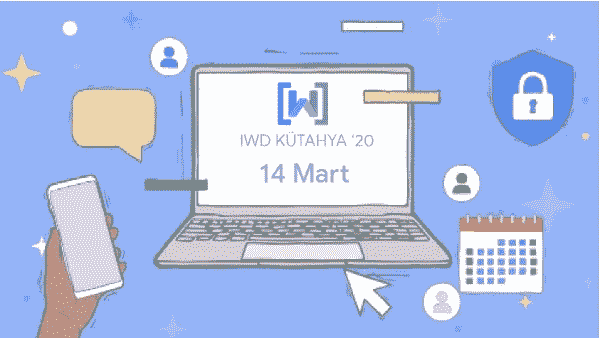
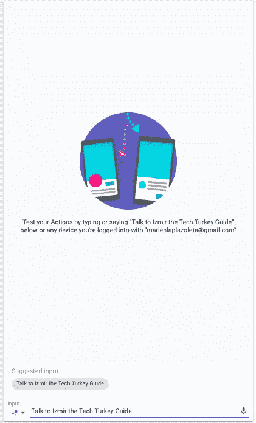

# 通过谷歌助手和人工智能赋予女性权力@IWD 安卡拉和库塔哈亚 2020👩‍💻🤖

> 原文：<https://medium.com/google-developer-experts/empowering-women-through-google-assistant-artificial-intelligence-iwd-ankara-k%C3%BCtahya-30fd06a34fbb?source=collection_archive---------6----------------------->

在纪念 2020 年国际妇女节的特别版中，我们将与 600 多名土耳其科技女性分享研讨会:**通过谷歌助手& NLP 模型赋予女性权力。**

Unsplash: Christina @ wocintechchat.com

第一项活动将于 3 月 14 日在库塔哈亚举行，届时将邀请 150 多名女性技术人员参加；第二项活动将于 3 月 21 日在安卡拉举行，由女性技术人员在安卡拉举办，500 多名女性技术人员将了解如何为谷歌助手创建操作，以及如何使用自然语言处理(NLP)模型来解决女性群体面临的挑战。

IWD Kütahya 2020: [https://www.meetup.com/GDG-Kutahya/events/268220415/](https://www.meetup.com/GDG-Kutahya/events/268220415/)

这一系列活动旨在让更多女性社区进入人工智能和机器学习领域，并支持她们继续学习科学、技术、工程和数学(STEM)职业。我们的目标是重新思考土耳其的人工智能教育，以鼓励科技行业的性别多样性，并通过提供技术工作来帮助缩小性别薪酬差距；新技能和能力。

IWD Ankara 2020: [https://www.meetup.com/GDGAnkara/events/268276284/](https://www.meetup.com/GDGAnkara/events/268276284/)

在本次会议中，我将分享有关土耳其语的语音识别、文本分类和语音界面的资源，以及您如何通过语音命令和文本交互以类似人类的对话方式与虚拟代理进行交互，理解用户所说和键入的内容，同时我们可以帮助用户使用助手完成工作。此外，与会者将通过研讨会构建自己的解决方案，以解决其女性社区中的本地挑战，并了解更多有关 Google 与消息平台、G Suite 以及许多其他产品和 API 的不同集成的信息。

嘿，谷歌，让我们开始吧！

1.  去 Github repo 下载**I**[**wd turkey 2020 . zip**](https://github.com/leoaiassistant/IWDTurkey2020)文件。

2.现在转到[对话流控制台](http://console.dialogflow.com/)中的项目

3.用 zip 文件恢复项目。

4.项目包括意向；`'meetups';``'mentors';`

5. <add>= '[>20&& <=2000]’; training phrases per Intent, for example on 【 【 【 and in the intent 【 【 【 【</add>

6\. The project has the Entities (Text Classifiers); $socialguide and $topic which allow our action to create a decision tree based on the topics of interest of each user.

7\. Define training phrases and the Action invocations types: [1)显式调用:](https://developers.google.com/assistant/discovery/explicit)当用户告诉助手他们明确地想要使用您的动作时发生。 [2)隐式调用:](https://developers.google.com/assistant/discovery/implicit)当助手选择调用您的操作而用户没有通过名称调用它时发生。

在这个动作上，指定包含训练短语的意图，如`'Hey Google, ask Izmir the Tech Guide in Turkey when is the next Hackathon in Ankara/Kütahya/Istanbul/Turkey'`，这将触发应用程序中的“深度链接”动作，允许用户通过特定功能进行调用。

8.现在让我们来试试这个动作，进入 Dialogflow 控制台的 integrations 部分，点击 Google Assistant 集成设置<add>当用户通过名称请求应用程序时触发的特定意图；`'meetups';` `'mentors';` `'studygroups';`</add>

[https://console.actions.google.com/u/0/project/**你的 _ 项目 _ ID**/模拟器](https://console.actions.google.com/u/0/project/sheets2-1f924/simulator)

9.在 Google Assistant 目录中发布您的操作；对于这一步，你需要添加:简短和完整的描述你的行动，样本调用，小标志，开发人员姓名和电子邮件，使用条款和隐私政策，为你的行动，选择一个类别和其他可选设置。

此外，你需要提供定位，表面功能，公司详情，品牌验证(如网站，Android 应用程序)，以实现跨平台的功能，

11.Beta & Alpha 测试人员、发布和应用程序审查:一旦您的操作经过测试，您就可以准备 por 生产，并可以提交审查:然后您将收到一封电子邮件，其中包含完整的审查。

12.政策和指导方针:您阅读了概述关键政策和指导方针的[发布清单](https://developers.google.com/assistant/console/publish#prepare)。

现在，您可以继续训练您的动作，并与外部 API(如 Google Calendar、Sheets 等)集成，您还可以向您的代理添加新的渠道，如消息应用程序。

🗣️🤖车间见！

*//免责声明:观点是我个人的，与公司或他们的节目无关。每位 Google 开发者专家对他们的服务完全负责，不隶属于 Google，也不代表 Google 提供服务。客户对其使用的服务(如果有)负全责。* ***此代码为示例，不应用于任何潜在的生产工作量。*** *//*