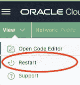

# 在 OCI 云壳中模拟 ARM 架构

> 原文：<https://medium.com/oracledevs/emulating-arm-architecture-in-oci-cloud-shell-d5774d2b95cb?source=collection_archive---------7----------------------->


Photo by Quang Nguyen Vinh: [https://www.pexels.com/photo/shell-on-sea-beach-6872201/](https://www.pexels.com/photo/shell-on-sea-beach-6872201/)

# OCI 云壳是什么？

[OCI 云壳](https://docs.oracle.com/en-us/iaas/Content/API/Concepts/cloudshellintro.htm)这么好用，这么强大，很容易想当然！在您的 OCI 控制台中，通过单击云壳图标(位于屏幕的右上角)可以看到它:


Opening OCI Cloud Shell (upper-right of OCI Console)

OCI 云 Shell 预装了管理 OCI 环境并与之交互所需的大量工具和实用程序，包括:

*   OCI CLI
*   码头工人
*   库贝特尔
*   饭桶
*   将（行星）地球化（以适合人类居住）
*   大蟒
*   …更多！

参见 [OCI 云外壳文档](https://docs.oracle.com/en-us/iaas/Content/API/Concepts/cloudshellintro.htm)了解更多关于这个伟大资源的内容。

# 多架构测试的挑战

在 OCI 云外壳中模拟不同的 CPU 架构，即 ARM 架构，可能是可取的(纠正，必要的)。默认情况下，OCI 云壳提供了一个 x86_64 计算环境，您可以使用该环境与您的 OCI 帐户和其他资源进行交互。通过运行 *uname -p* 确认这一点:

```
cloudshell:~ (us-sanjose-1)$ uname -p
x86_64
cloudshell:~ (us-sanjose-1)$
```

有时候可能需要模拟 arm 架构，比如当您需要通过 Cloud Shell 构建多架构容器映像(或者专门针对 ARM 的容器映像)时。因为云壳与 OCI 紧密结合，所以它是创建一次性容器图像并上传到 OCI 容器注册中心的绝佳地点。因为它是 x86_64 架构，所以需要仿真来模拟和构建 arm 容器映像(或执行其他基于 ARM 的计算活动)。

> 注意:我并不提倡使用云 Shell 来构建生产容器映像之类的东西。这对于实验来说更有用。生产工作负载应该使用 [OCI DevOps](https://docs.oracle.com/en-us/iaas/Content/devops/using/home.htm) 实现自动化！再次回到我们的一次性实验用例，让我们看看如何在 OCI 云壳中模拟 ARM

举个简单的例子，让我们看一个在云壳中会失败的基本 Dockerfile。遵循您的云 Shell 实例:

```
cloudshell:~ (us-sanjose-1)$ mkdir multi_arch_test
cloudshell:~ (us-sanjose-1)$ cd multi_arch_test
cloudshell:multi_arch_test (us-sanjose-1)$ nano Dockerfile
```

将以下内容粘贴到文件中:

```
FROM container-registry.oracle.com/os/oraclelinux:8-slim
RUN microdnf update
CMD echo "Hello world!"
```

键入 CTRL+x，键入 y，然后按 enter 键(将文件保存为 *Dockerfile* )。

现在继续尝试构建容器:

```
docker build --pull --platform arm64 -f Dockerfile -t test:v1.0.0 .
```

你会注意到它失败了。您应该会看到如下所示的内容:

```
cloudshell:multi_arch_test (us-sanjose-1)$ docker build --pull --platform arm64 -f Dockerfile -t test:v1.0.0 .
Sending build context to Docker daemon  2.048kB
Step 1/3 : FROM container-registry.oracle.com/os/oraclelinux:8-slim
Trying to pull repository container-registry.oracle.com/os/oraclelinux ... 
8-slim: Pulling from container-registry.oracle.com/os/oraclelinux
Digest: sha256:abc123...
Status: Image is up to date for container-registry.oracle.com/os/oraclelinux:8-slim
 ---> fe659acbc8d5
Step 2/3 : RUN microdnf update
 ---> Running in 9ec24c4a4bbc
exec /bin/sh: exec format error
The command '/bin/sh -c microdnf update' returned a non-zero code: 1
cloudshell:multi_arch_test (us-sanjose-1)$
```

这里发生的事情是，我们试图在 x86_64(又名 amd64)平台上运行 aarch64(又名 arm64)映像(以及相关的二进制文件)。这是行不通的(不管怎么说，开箱即用)。

# 救援竞赛！

我们的云 Shell 会话位于 x86_64(又名 amd64)环境中，但是我们需要构建/部署 aarch64(又名 arm64)架构。谢天谢地，我们有办法解决上面遇到的问题。像 [qemu-user-static](https://github.com/multiarch/qemu-user-static) 和 [qus](https://github.com/dbhi/qus) 这样的解决方案让我们可以模拟不同的硬件架构。让我们使用 qemu-user-static，在 OCI 云 Shell 中运行以下代码:

```
docker run --rm --privileged multiarch/qemu-user-static --reset -p yes
```

现在再次尝试构建示例容器:

```
cloudshell:multi_arch_test (us-sanjose-1)$ docker build --pull --platform arm64 -f Dockerfile -t test:v1.0.0 .
Sending build context to Docker daemon  2.048kB
Step 1/3 : FROM container-registry.oracle.com/os/oraclelinux:8-slim
Trying to pull repository container-registry.oracle.com/os/oraclelinux ... 
8-slim: Pulling from container-registry.oracle.com/os/oraclelinux
Digest: sha256:abc098932...
Status: Image is up to date for container-registry.oracle.com/os/oraclelinux:8-slim
 ---> fe659acbc8d5
Step 2/3 : RUN microdnf update
 ---> Running in zyx345
Downloading metadata...
Downloading metadata...
Package                                                  Repository           Size
Upgrading:                                                                        
 oraclelinux-release-8:8.6-1.0.6.el8.aarch64             ol8_baseos_latest 84.1 kB
   replacing oraclelinux-release-8:8.6-1.0.5.el8.aarch64                          
Transaction Summary:
 Installing:        0 packages
 Reinstalling:      0 packages
 Upgrading:         1 packages
 Obsoleting:        0 packages
 Removing:          0 packages
 Downgrading:       0 packages
Downloading packages...
Running transaction test...
Updating: oraclelinux-release;8:8.6-1.0.6.el8;aarch64;ol8_baseos_latest
Cleanup: oraclelinux-release;8:8.6-1.0.5.el8;aarch64;installed
Complete.
Removing intermediate container abc123...
 ---> bbc9c6bdfb14
Step 3/3 : CMD echo "Hello world!"
 ---> Running in xyz789...
Removing intermediate container abc456...
 ---> 1dea891c90b9
Successfully built abc789...
Successfully tagged test:v1.0.0
cloudshell:multi_arch_test (us-sanjose-1)$
```

有用！我要警告你，上面的容器构建很慢……这就是它在模拟其他平台时的样子(经常会有性能上的影响),但是它*确实*工作。

现在继续运行容器(为什么不呢？):

```
docker run -it --rm test:v1.0.0
```

您应该会看到如下所示的内容:

```
cloudshell:multi_arch_test (us-sanjose-1)$ docker run -it --rm test:v1.0.0
Hello world!
cloudshell:multi_arch_test (us-sanjose-1)$
```

如果您发现想要一个干净的 OCI 云 Shell 会话，而不启用仿真，只需点击*查看*(屏幕的左上角)，然后*重启*:



Restarting OCI Cloud Shell

请记住，云 Shell 会话是短暂的，在两次使用/会话之间，只有您的主目录会被保留。这意味着当您启动一个新的云 Shell 会话时，您需要再次启用模拟。没什么大不了的，只是要记住一些东西。

# 包装它

OCI 云壳是超级强大的，预装了许多工具，使工作与 OCI 超级容易。能够在 Cloud Shell 中模拟 ARM 开辟了许多可能性，可以使生活变得更加轻松，特别是在使用和支持多架构(x86_64 和 aarch64 实例)环境时。

大家来说说吧！点击，加入我们的[开发者公共松弛频道。](https://bit.ly/devrel_slack)