# En litt lengre introduksjon til tastaturer

> 原文：<https://medium.com/compendium/en-litt-lengre-introduksjon-til-tastaturer-6d8ad008e32a?source=collection_archive---------0----------------------->

Her forleden dukket favorittspørsmålet mitt opp på twitter:

Som selverklært tastaturentusiast er det lite som er bedre enn å komme over noen som vil vite mer om tastaturer. Endelig noen som ikke enda er lei av å høre om formfaktorer, brytere og tastehetter!

Dessverre er det ikke alltid mulig å ha den lage gode tastatursamtalen. Kanskje må man hjem til middag, komme seg tilbake til arbeidsplassen å forsøke å gjøre noe produktivt, eller som i dette tilfellet: Man sitter på hver sin ende av Internett.

For å bøte på dette, har jeg satt sammen denne posten, hvor jeg går gjennom litt om hva mekaniske tastaturer er og hvordan de er bygget opp.

# Hva er et mekanisk tastatur?

I takt med at hardware ble billigere gjennom 80 og 90 -tallet, fant man enklere måter å produsere tastaturer på, og endte opp med billige tastaturer i plast, hvor tastetrykk registreres ved at man presser sammen kontakter i en gummimembran. Dette var lurt økonomisk, men gjorde at man endte opp med tastaturer som ikke er optimale å bruke.

Mekaniske tastaturer er et begrep som brukes om tastaturer som ikke er bygget på denne måten. Typisk er man opptatt av at bryterne som registrerer tastetrykk er mer sofistikerte, uten at det er helt lett å definere hva som gjør de mekaniske.

I det store og hele er det egentlig ikke så viktig hva som er mekanisk og ikke, det man er opptatt av er bra tastaturer.

En lenger forklaring på hvorfor det ikke er så lett å definere mekaniske tastaturer.

## Hvorfor skal jeg bry meg om tastaturer?

Mange av oss har datamaskinen som sitt viktigste arbeidsverktøy, og tilbringer store deler av dagen vår foran en skjerm, et tastatur og en mus. Hvis gode verktøy gjør arbeidet hyggeligere, burde det være store muligheter for å gjøre arbeidsdagen litt lysere med et bedre tastatur.

## Hvordan skaffer jeg meg et bra tastatur?

**Kjøpe et ferdig mekanisk tastatur** Mekaniske tastaturer har hatt en oppsving over flere år. Tastaturer til dataspill var først ute, men etter hvert har det kommet flere alternativer som er mer rettet mot de som trenger noe til jobb. Dermed har det blitt rimelig greit å få fatt i et nytt mekanisk tastatur på nett eller hos en av de store elektronikkjedene.

**Finne et gammelt tastatur** Tastaturer er litt spesielle i data-sammenheng. Mens de fleste andre typer hardware fort blir utdatert, har tastaturet vært ganske uendret de siste 40 årene. Man kan ta et tastatur fra 80-tallet, koble det rett inn i PS/2-porten (eller via en liten konverter), og bruke det på akkurat samme måte som om tastaturet var produsert i år.

Datautstyr var også relativt dyrere før, noe som gjorde at man hadde økonomisk rom til å lage mer påkostede tastaturer. Dermed er det mulig å finne mange spennende gamle tastaturer.

**Bygge et tastatur selv** En annen ting som gjør tastaturer litt spesielle, er at det er en av de enkleste komponentene knyttet til en datamaskin. Dette gjør at det er et ganske stort “gjør det selv”-miljø rundt tastaturer.

Alt fra å kjøpe inn ogsette sammen ferdige komponenter, til å lodde brytere, frese kabinett, og programmere firmware er mulig.

## Kan du fortelle mer om hvordan et mekanisk tastatur er bygget opp?

Gjerne! Under er det fire seksjoner som forklarer hva formfaktor, brytere, tastehetter, kabinett, monteringsplate og kretskort er for noe.

# Formfaktor

Formfaktoren på tastaturet bestemmer hvor stort tastaturet er, hvor mange brytere det har, og hvor de er plassert på tastaturet. Det vi i dag tenker på som vanlig fysisk format, ble introdusert av IBM på midten av 80-tallet med tastaturet [Model M](https://en.wikipedia.org/wiki/Model_M_keyboard) .

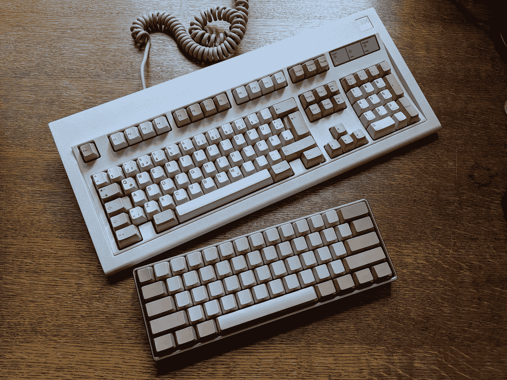

To tastaturer med forskjellig fysisk format. Det øverste er et fullstørrelse “IBM Model M” tastatur (100%), mens det nederste er et 60% “V60” tastatur.

I dag produseres tastaturer produseres i flere forskjellige formfaktorer, og under en en gjennomgang av de vanligste formfaktorene.

## Fullstørrelse, TKL og 60%

Fullstørrelse, eller 100%, er det de fleste tenker på når man snakker om et vanlig tastatur. Fullstørrelse tastaturer kan ha tastene organisert etter ISO-format eller ANSI-format. ISO-formatet er det som er brukt blant annet i Norge og Europa generelt, mens ANSI blant annet brukes i USA.

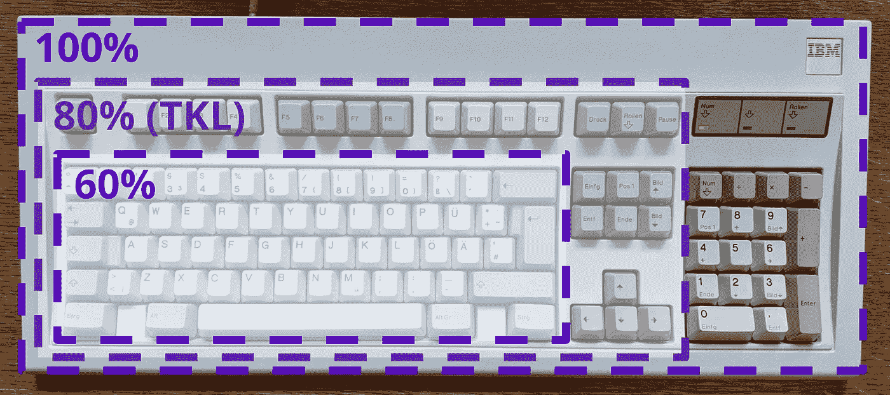

100%, 80% og 60% er de mest vanlige fysiske formatene, men det finnes mange andre.

TKL (fra tenkeyless), eller 80%, er en annen populær formfaktor. Mange bruker ikke den dedikerte tall-blokken med taster på høyre side av tastaturet, og foretrekker et mindre tastatur som frigjør mer plass på pulten til mus og musematte. TKL-tastaturer kommer også i ISO og ANSI -format,

De siste årene har flere fått opp øynene for enda mindre formfaktorer enn TKL. 60% er et eksempel på dette. Her dropper man dedikerte F-taster, piltaster og navigasjonstaster. I stede er disse tastene typisk tilgjengelig ved bruk av en funksjonstast (Fn), sånn som ofte er tilfellet på bærbare datamaskiner.

## Eksotiske formfaktorer

Det finnes mange andre formfaktorer utover fullstørrelse, TKL og 60%. En typisk variant er formfaktor mellom TKL og 60%. Det kan være TKL-tastaturer hvor tastene er plassert tettere sammen, eller 60%-tastaturer hvor man også har piltaster.

For de som synes 60% er for stort, finnes også 40% som blant annet [Planck-tastaturet](https://olkb.com/planck) . I tillegg finnes det flere mer eller mindre ergonomiske varianter. Her vil man blant annet finne formfaktorer hvor tastaturet er splitter i to separate deler. [Ergodox](https://ergodox-ez.com/) er et eksempel på et sånt tastatur.

Felles for de mer eksotiske formfaktorene er at man ofte må legge ned litt tid i å bli vant til formfaktoren.

# Brytere

Det er montert en bryter under hver tast i tastaturet som er ansvarlig for å registrere tastetrykk. I tillegg har bryteren stor innvirkning på hvordan det føles å trykke ned en tast, og hvilken lyd tastaturet lager.

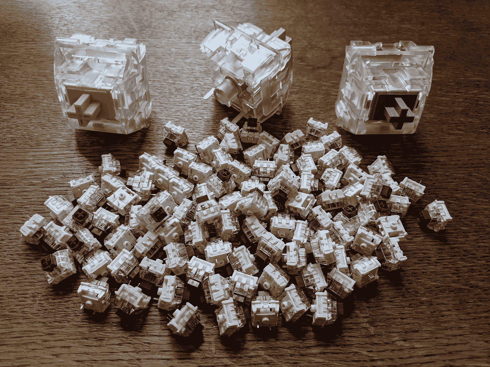

Brytere i vanlig størrelse foran, og tre store demonstrasjonsbrytere i 400% størrelse bak.

Bryterne i et vanlig tastatur er ganske små. For bedre å kunne vise frem de ulike detaljene i en bryter, skal vi se på noen demonstrasjonsbrytere som er fire ganger større enn vanlige brytere.

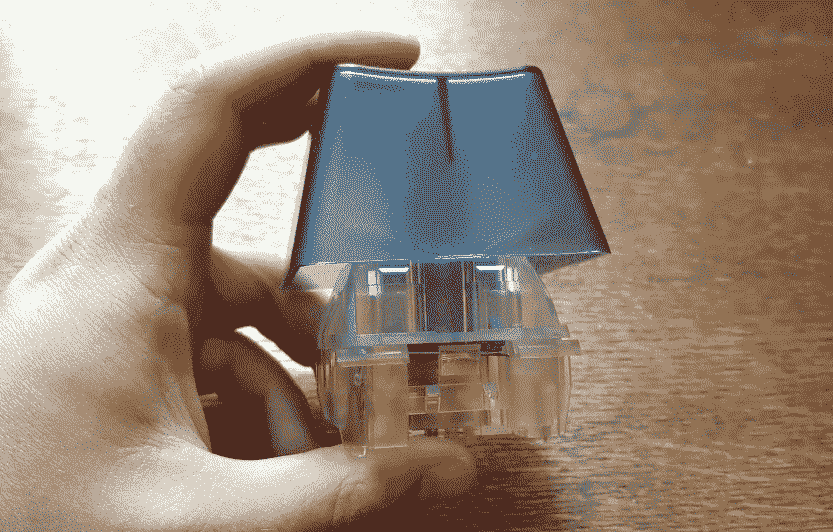

En kjempestor tast med tastehette og bryter sett fra siden.

## MX-inspirerte brytere

[Cherry GmbH](https://en.wikipedia.org/wiki/Cherry_(keyboards)) er et tysk firma som produserer de aller mest brukte mekaniske tastaturbryterne. Disse bryterne kalles gjerne MX-brytere, eller Cherry MX.

Brytere med MX-inspirert konstruksjon lages også av andre produsenter, som f.eks. [Razer](https://deskthority.net/wiki/Razer_switch) og [Kailh](https://deskthority.net/wiki/Kailh_PG1511_series) . Disse bryterne er stort sett like de som produseres av Cherry, men med annen fargekoding og noe variasjon.

Stort sett alle mekaniske tastaturer man finner i vanlige elektronikkbutikker, og en stor del av entusiastbutikkene, bruker Cherry MX eller MX-inspirerte brytere.

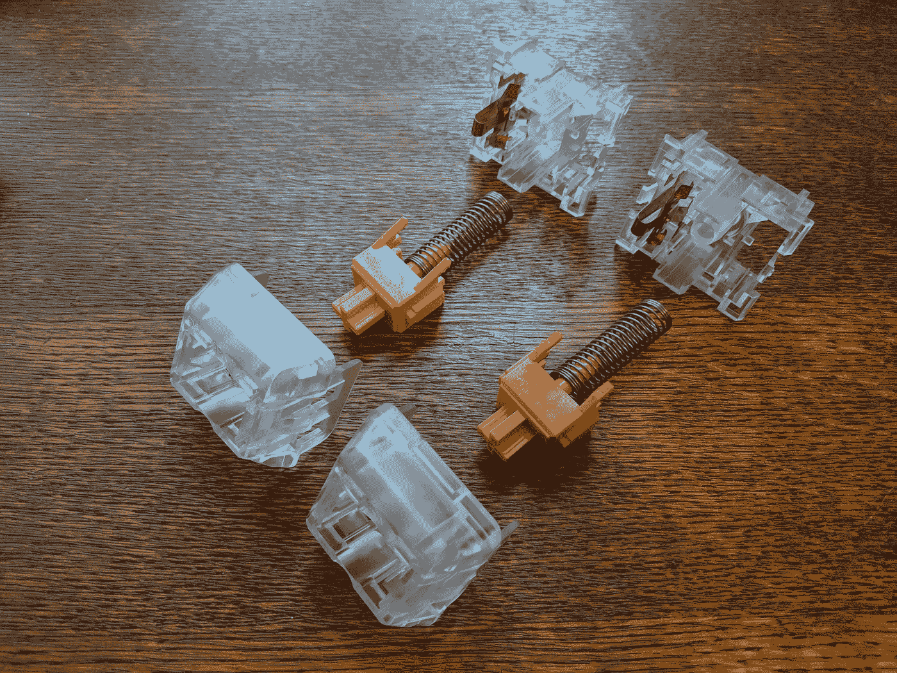

To demonterte MX-inspirerte brytere fra samarbeidsprosjekt mellom Kailh og NovelKeys.

En MX-bryter består av en bryterstamme som er montert i et bryterhus på toppen av en spiralfjær. I tillegg er det montert en elektrisk kontakt i bryterhuset som bryterstammen kobler til og fra.

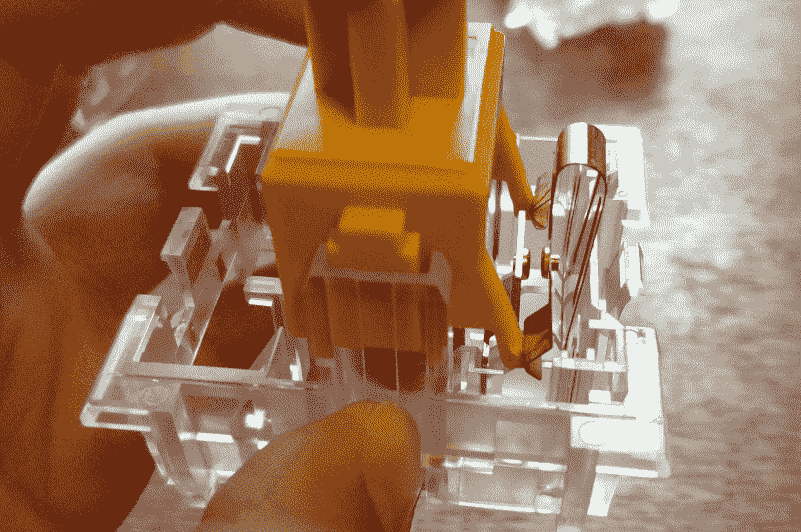

Lineær tastaturbryter i aksjon. Legg merke til hvordan de to tindene på den gule stammen aktiverer den elektriske kontakten.

Når man trykker ned bryteren, komprimerer bryterstammen spiralfjæren, og to tinder på stammen aktiverer den elektriske kontakten.

Legg merke til at den elektriske kontakten aktiverer lenge før bryterstammen treffer bunnen av bryterhuset. Dette er en egenskap ved mekaniske brytere som ikke finnes i vanlige tastaturer med membranbrytere, og er en egenskap som man gjerne hevder gjør bryteren mer behagelig å trykke på.

## Lineære, taktile og klikkete MX-brytere

Brytere kan kategoriseres i tre kategorier, avhengig av hvor mye taktil (følbar) og auditiv (hørbar) tilbakemelding bryteren gir på at den har blitt aktivert.

Lineære brytere gir ingen taktil og auditiv tilbakemelding på at de har blitt trykket ned, utover at bryteren “bunner ut” når bryterstammen treffer bunnen av bryterhuset. De mest vanlige lineære MX-bryterne er MX rød og sort.

Taktile brytere gir en taktil respons på at bryteren har blitt aktivert. I en MX-bryter skjer dette ved at tindene på bryterstammen har en liten “hump” som man må presse kontakten over før den aktiveres. Dette oppleves som et lite “knepp” i tasten når man trykker den ned.

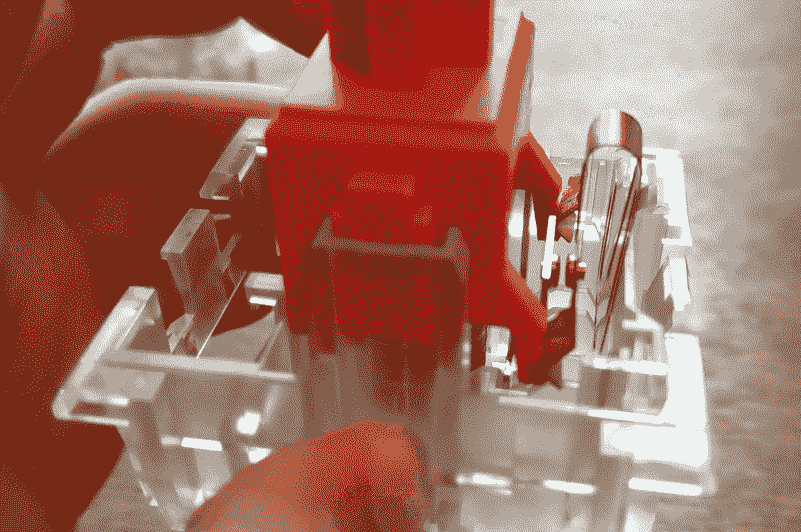

Taktil tastaturbryter i aksjon. Legg merke til at tindene på den taktile bryteren har en liten “hump” som påvirker hvordan det føles å trykke ned bryteren.

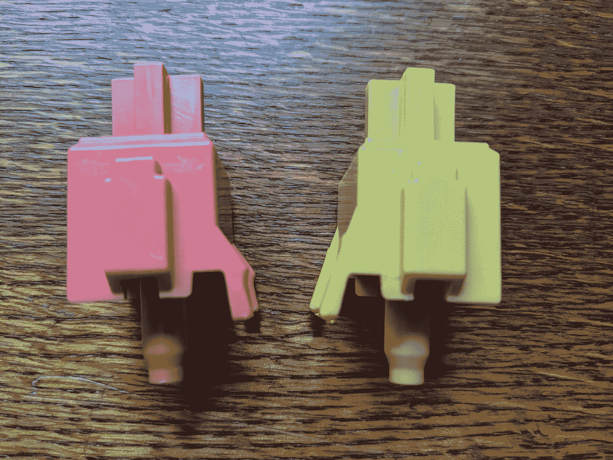

Taktil bryterstamme med “hump” til venstre, og lineær bryterstamme til høyre.

Klikkete brytere gir både en taktil og auditiv tilbakemelding når bryteren aktiveres. I en klikkete MX-bryter genereres den taktile responsen på samme måte som i en taktil bryter, mens den auditive responsen genereres ved at en del av bryterstammen er montert løst, og denne kastes ned mot bunnen av bryterhuset når stammen beveger seg over “humpen”.

Selv om klikkete brytere lager mest lyd, kan det være greit å være klar over at både lineære og taktile brytere også lager noe lyd.

Cherry markerer sine brytere med farge avhengig av om de er lineære, taktile eller klikkete. MX rød og MX sort er de mest vanlige lineære bryterene, MX brun og MX klar er de mest vanlige taktile bryterne og MX blå og MX grønn er de mest vanlige klikkete bryterne. Dette er ikke de samme fargene som er på demonstrasjonsbryterne. Her er den lineære bryteren gul, og den taktile bryteren rød/oransje.

Valg av lineære, taktile og klikkete brytere er i stor grad smak og behag. Typisk brukes lineære brytere mer til dataspill, da det kan være noe lettere å trykke ned den samme tasten raskt flere ganger etter hverandre. Taktile og klikkete brytere er ofte foretrukket av programmerere og andre som skriver mye på tastaturet, da den taktile tilbakemeldingen gjør det lettere å skrive uten at man trenger å trykke tasten helt ned, noe som belaster fingrene litt mindre.

I åpent landskap er det mange som velger en taktil bryter i stede for en klikkete bryter, da denne lager mindre lyd. MX brun er ofte en god start hvis man kjøper et mekanisk tastatur til en typisk kontorjobb.

## Vekting

Styrken på spiralfjæren påvirker hvor hard bryteren er å trykke ned. Typisk måles vektingen i hvor mange gram som må til for å aktivere bryteren, og de mest vanlige bryterne ligger et sted mellom 45–55 gram.

En bedre metode for å få oversikt over vekting og taktilitet i en bryter er å tegne opp kraft/forskyvning i et diagram. Da ser man bedre hvordan vektingen forandrer seg gjennom tastetrykket. [Input Club](https://input.club/the-comparative-guide-to-mechanical-switches/) har en god samling med diagrammer for ulike brytere. Her kan man for eksempel se kraft/forskyvning tegnet opp for [Cherry MX brun](https://input.club/the-comparative-guide-to-mechanical-switches/tactile/cherry-mx-brown/) .

## Noen alternativer til MX-brytere

[Alps Electric](https://en.wikipedia.org/wiki/Alps_Electric) er et japansk firma som konkurrerte med Cherry i tastaturmarkedet på 80 og 90 -tallet. De produserte en konkurrerende bryterteknologi kjent som [ALPS-brytere](https://deskthority.net/wiki/Alps_SKCL/SKCM_series) . Disse bryterne er kjent for god lyd og sterk taktil respons, men produseres dessverre ikke lenger. Heldigvis produserer det canadiske firmaet [Matias](https://matias.ca/switches/click/) et lite utvalg ALPS-inspirerte brytere og tastaturer.

IBM produserte lenge egne tastaturer, og utviklet flere egne brytere, blant annet [“buckling spring”-bryterne](https://deskthority.net/wiki/IBM_buckling_spring) som ble brukt i Model M tastaturet. Disse bryterne har også sterkere taktil respons enn MX-brytere. I tillegg er de vektet en god del tyngre enn det som er vanlig i dag. [Unicomp](https://www.pckeyboard.com/) en versjon av dette tastaturet som er mulig å få tak i.

Topre Corporation er et annet japansk firma som er kjent for å produsere tastaturbrytere. Deres bryter, kjent som Topre-bryteren, er primært tilgjengelig i tastaturer de produserer selv. Bryteren er kjent for en mer avrundet taktil tilbakemelding enn MX-bryterne.

# Tastehetter

Tastehettene er montert på toppen av bryterne, og sammen utgjør bryter og tastehette en tast. Tastehettene er typisk utstyrt med bokstaver og symboler som viser hva som er funksjonen til hver tast.

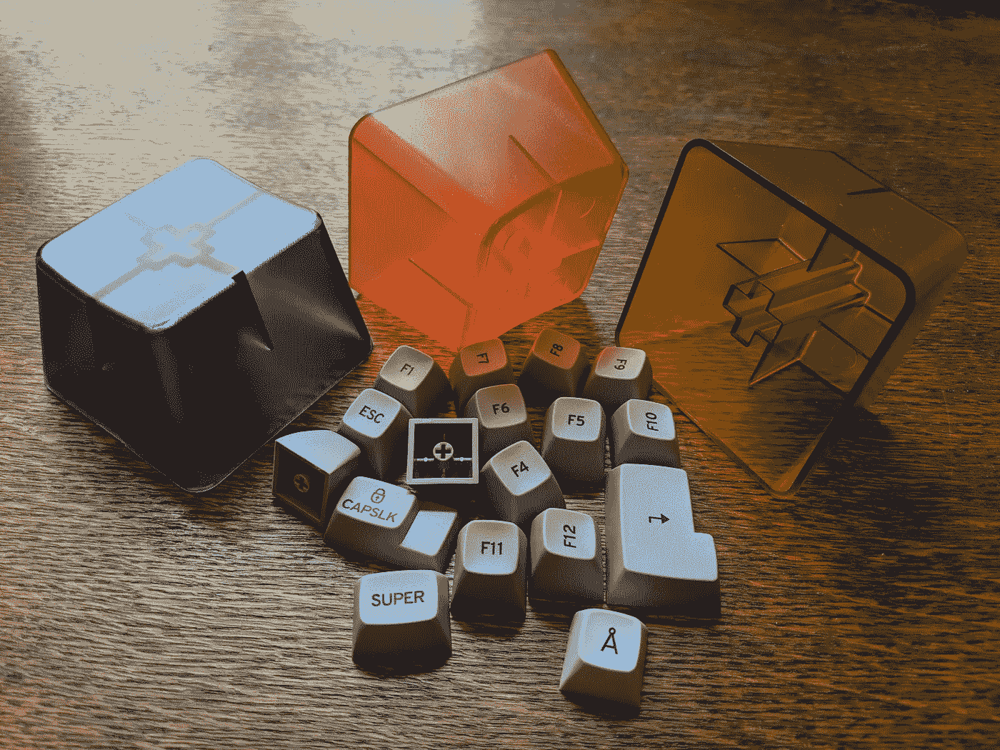

Tastehetter i vanlig størrelse foran, og i 400% størrelse bak.

## Profil

Profilen bestemmer den fysiske formen på tastehettene. Her skiller man overordnet mellom flate profiler og profiler med kontur.

OEM er den vanligste profilen, og er en profil med kontur. Sett fra siden vil toppen av tastehetten forme en konkav, noe som gjør at tastene følger kurven til fingrene litt mer naturlig.

En populær flat profil er DSA. De fleste laptop-tastaturer og Apple sine tastaturer produseres også med en flat profil.

## Materialvalg

De alle fleste tastehetter produseres i [ABS](https://snl.no/ABS-plast) -plast. ABS er lett å [sprøytestøpe](https://snl.no/spr%C3%B8ytest%C3%B8ping) til en ferdig tastehette, men er en litt mykere plasttype, så teksturen på tastehettene slites gjerne bort etter lengre tids bruk.

[PBT](https://snl.no/polybutylentereftalat) er en annen plasttype som brukes til tastehetter. Denne er vanskeligere å sprøytestøpe, men er hardere, så teksturen på tastene bevares bedre over tid.

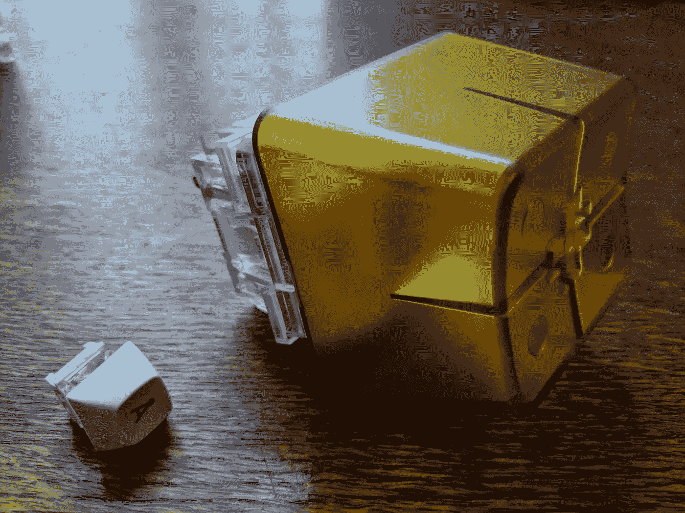

Tastehetter montert på brytere.

## Tykkelse

Tastehetter produseres i forskjellige tykkelser. Tynnere tastehetter er billigere, og typisk finner man tastehetter med tykkelse på rett under millimeteren. Tykkere tastehetter gir gjerne en litt annen tastefølelse, og gjør lyden til tastene noe mørkere.

## Påføring av tegn

Tegne på tastehettene kan påføres med mange forskjellige teknikker. De billigste er stemplet på, eller gravert inn med laser. Dyrere tastehetter kan ha støpt inn tegnene, eller ha de påført med blekk som trekker inn i plastikken i tastene. Hvilken teknikk som er brukt for å påføre tegnene har mye å si for hvor lang tid det tar før tegnene slites av tastehetten.

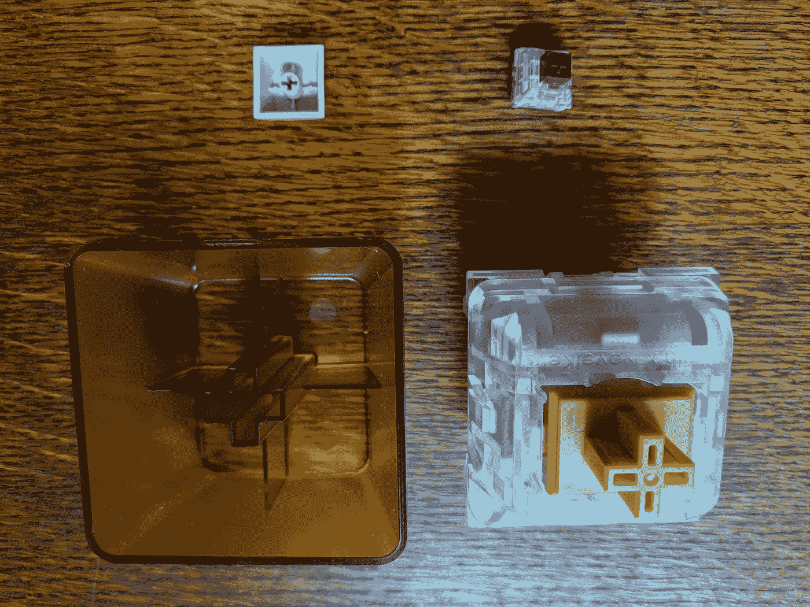

Den vanligste formen på bryterstammer er “MX-krysset”.

## Kompatibilitet med brytere

De aller fleste tastehettene produserer sånn at de er kompatible med bryterstammen til MX-brytere. Det betyr at har man et tastatur med MX-lignende brytere, kan man enkelt bytte ut tastehettene.

# Kabinett, monteringsplate og kretskort

I tillegg til brytere og tastehetter, har mekaniske tastaturer typisk kabinett, monteringsplate og et kretskort, eller annen elektronikk som lar datamaskinen og tastaturet snakke sammen. Dette er typisk ikke noe man kan variere på når man kjøper et ferdig tastatur, men kan være nyttig å vite litt om når man sammenligner ulike tastaturer, eller hvis man vil bygge et tastatur selv.

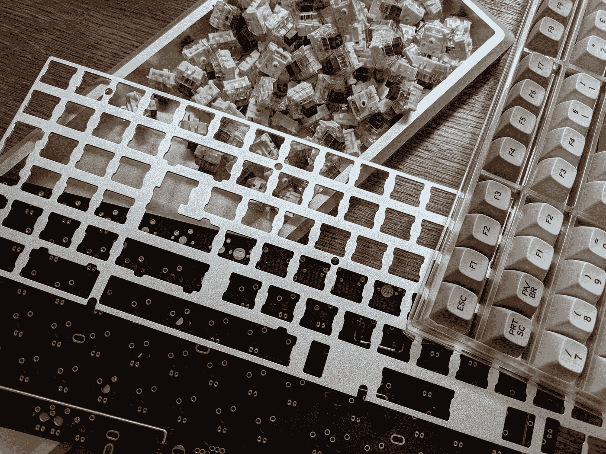

Brytere, tastehetter, kabinett, monteringsplate og kretskort til et tastaturprosjekt.

## Kretskort

Bryterne er koblet på et kretskort som har jobben med å gjøre om elektriske signaler fra bryteren til signaler som datamaskinen kan forstå.

Ofte snakkes det om hvor mange taster man kan trykke ned samtidig, uten at tastaturet stopper å registrere tastetrykkene (typisk beskrevet som key rollover som i 2KRO, 5KRO eller NKRO). Dette er gjerne ikke så viktig som man kan få inntrykk av, og spesielt ikke hvis man snakker om tastatur som ikke primært er ment for dataspill.

På kretskortet finner man gjerne også påmontert dioder som kan lyse opp tastaturet. Her finnes det mange varianter, alt fra enkelt hvitt lys, til animerte RGB-farger.

Kretskortet kan også inneholde funksjonalitet som lar brukeren programmere hva ulike taster eller tastekombinasjoner skal gjøre. Dette kan variere fra makroer som programmeres inn via tastekombinasjoner på selve tastaturet, konfigurasjon som gjøres i proprietær software på datamaskinen, eller at tastaturet støtter en åpen firmware som [QMK](https://docs.qmk.fm/#/) .

## Monteringsplate

Bryterne kan være montert direkte på kretskortet, eller de kan være montert i en monteringsplate av metall. Bruk av monteringsplate er typisk å foretrekke, da det typisk gjør tastaturet stivere. En stiv monteringsplate gjør også den taktile responsen fra tastene mer kontant.

## Kabinett

Alle delene av tastaturet monteres i et kabinett. Typisk monteres kabinettet i to deler rundt tastaturet, eller monteringsplaten skrus ned i kabinettet fra en side. Kabinettet kan være utformet i mange forskjellige materialer.

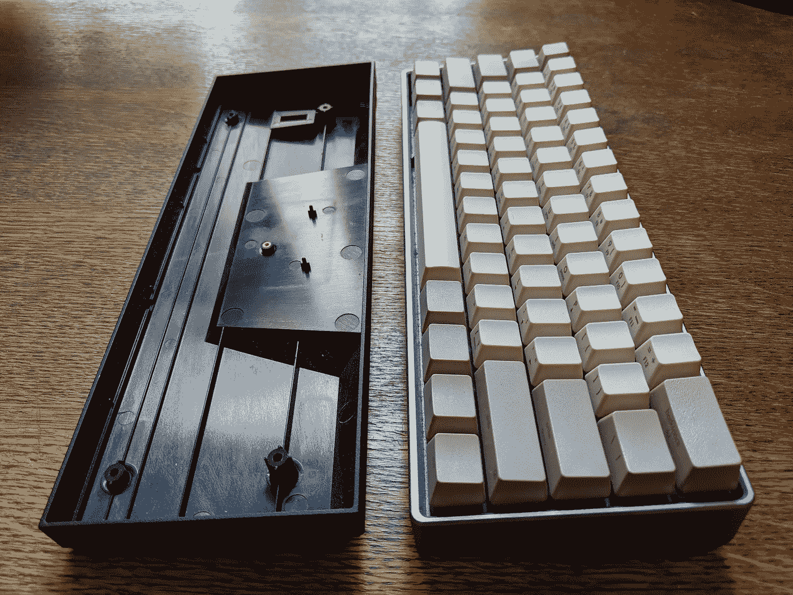

Kabinett i plast til venstre, og tastatur montert i kabinett av aluminium til høyre.

De fleste tastaturer har et kabinett av plast. Plast er lett og bidrar til å dempe vibrasjoner fra tastene sånn at de ikke forplanter seg ned i pulten. Utforming og tykkelse på plasten vil ha en del å si for hvor stivt et plastkabinett er.

Et kabinett i metall vil gjøre tastaturet stivere og tyngre. Dermed blir tastefølelsen enda mer kontant, og tastaturet vil i svært liten grad bevege seg på pulten mens man skriver. En ulempe er at et kabinett i metall gjerne forsterker lyden av tastene, noe som kan være plagsomt hvis man jobber i åpent landskap.

Det er også mulig å finne tastaturer med kabinett i tre. Disse kabinettene vil typisk være en del stivere enn kabinetter i plastikk, og gir et distinkt varmt utseende.

# Hvor kan jeg finne ut mer om tastaturer?

Er du interessert i nye tastaturer og DIY, er [r/MechanicalKeyboards](https://www.reddit.com/r/MechanicalKeyboards/) på reddit og forumet [geekhack](https://geekhack.org/index.php) et greit sted å ta en titt. Er du interessert i eldre tastaturer, er [Deskthority](https://deskthority.net) et forum med mye informasjon og aktivitet.

> Håper du lærte noe nytt om tastaturer, og får gleden av et godt tastatur fremover! Hyl ut på twitter @_teodoran hvis du har spørsmål eller kommentarer til denne posten.