# 启用融合应用作为身份提供者的联盟

> 原文：<https://medium.com/oracledevs/enable-federation-with-fusion-apps-as-identity-provider-1ca6d795659c?source=collection_archive---------4----------------------->

这是我撰写的系列博客中的第二篇，旨在解释 Oracle 融合应用程序与 PaaS 服务的身份集成，使用身份云服务来实现服务之间的单点登录。这是这个系列的博客列表

1.  [了解集成架构——融合应用与平台服务](/@amit.gokhru/understanding-the-integration-architecture-fusion-application-with-platform-services-9b8297594873)
2.  [启用融合应用作为身份提供商的联盟](/@amit.gokhru/enable-federation-with-fusion-apps-as-identity-provider-1ca6d795659c)
3.  [启用身份云服务作为身份提供商的联盟](/@amit.gokhru/enable-federation-with-identity-cloud-service-as-identity-provider-36e80d2bc4ec)
4.  [在融合应用和身份云服务之间设置用户和角色同步](/@amit.gokhru/setting-up-users-and-roles-synchronization-between-fusion-apps-and-identity-cloud-service-70dcf2144107)
5.  [调用 Fusion Apps rest 端点的三脚 OAuth 流。](/@amit.gokhru/3-legged-oauth-flow-to-invoke-fusion-apps-rest-endpoints-5fc6b0b7b059)

在这篇博客中，我将解释我们如何配置融合应用和 IDCS 之间的联合，以实现融合应用和 IDCS 支持的 PaaS 服务之间的单点登录，其中融合应用的内部 IDM 将作为身份提供商，IDCS 作为服务提供商。我们还将看到如何在融合应用程序和 IDCS 之间启用 Oauth 信任，以利用 IDCS Oauth 令牌进行 web 服务调用。在不希望利用 IDCS 的高级功能，并且集成的唯一动机是使用平台服务扩展现有 FA 环境以实施自定义扩展的情况下，您可能希望将 FA 配置为身份提供商。最终的拓扑看起来会像-

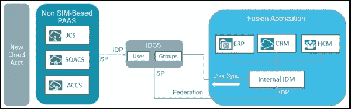

让我们从分为 3 个步骤的配置开始

1.  IDCS 配置— IDCS 管理员
2.  融合应用配置— Oracle 支持
3.  激活和测试— IDCS 管理员

以下是官方文档— [通过 Oracle 身份云服务支持 Oracle 销售云、Oracle 全球人力资源云、Oracle ERP 云联盟和 OAuth Trust】](https://cloud.oracle.com/developer/solutions?tab=tasks&solutionguid=OCPSI-GUID-53C8A800-3DC3-48F0-930E-11797185406B)

(请注意，Fusion Apps 的 URL 和屏幕截图是第 12 版)

# **IDCS 配置**

1.  从 URL 下载融合应用的 IdP 元数据(传统云账号中的 FA rel 12)——[https://【Id-Domain](https://[Id-Domain)。login.us2.oraclecloud.com/fed/idp/metadata
2.  在 IDCS 控制台中将 FA 配置为 IdP

*   登录到 IDCS 管理控制台
*   点击左上角的汉堡菜单，点击"安全" >在左边选择"身份提供者"，点击"添加 SAML IDP "将融合应用添加为 IDCS 的身份提供者
*   提供名称和描述，然后单击“下一步”

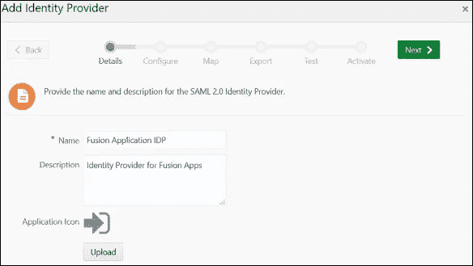

*   导入在步骤 1 中下载的融合应用程序 IDP 元数据

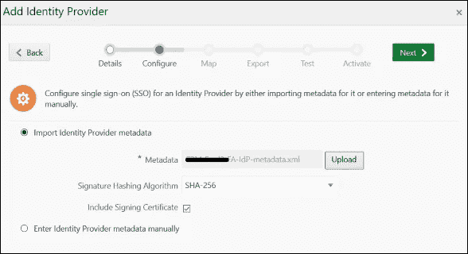

*   在身份提供者和 IDCS 之间映射用户属性

身份提供者用户属性= "名称 ID "

Oracle 身份云服务用户属性= "用户名"

请求名称 ID 格式= "未指定"

点击“下一步”

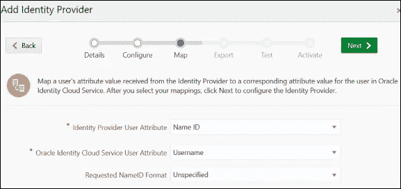

*   从提供的“下载”按钮下载“服务提供商元数据”文件、签名和加密证书

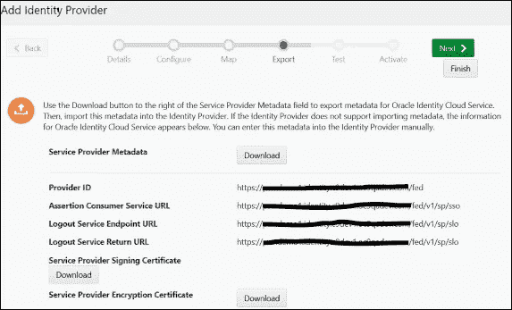

*   单击“完成”。您将看到列表中新添加的身份提供者处于停用状态。

*   这就完成了 IDCS 管理控制台中的身份提供者配置。

3.为融合应用程序创建 Oauth 资源。需要将此 Oauth 资源作为“允许的范围”添加到 Oauth 客户端中，以获得给定范围的访问令牌。

*   登录 IDCS 管理控制台>单击“应用程序”选项卡>“添加”

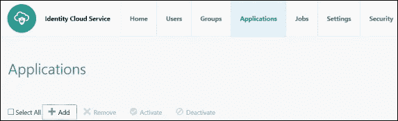

*   在应用程序向导中，选择“可信应用程序”

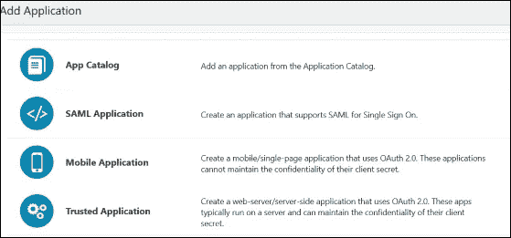

*   在“应用程序详细信息”页面上，提供应用程序名称和描述，然后单击下一步
*   跳过客户端配置，然后单击“下一步”
*   选择单选按钮“立即将应用程序配置为资源服务器”,将融合应用程序 API 路径配置为 OAuth 资源

提供“主要受众”= FA 端点的主机

提供“辅助受众”= FA 端点的辅助主机

单击“允许范围”上的“添加”,添加主要和次要受众的允许范围

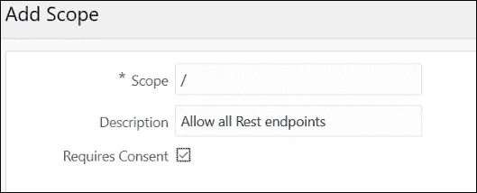

*   查看受众和允许的范围，然后单击下一步。您可以添加特定的 API 作为作用域，然后为那些允许的作用域请求访问令牌。当您添加“/”作为允许的范围时，请确保在请求访问令牌时使用“受众”+“/”作为范围。

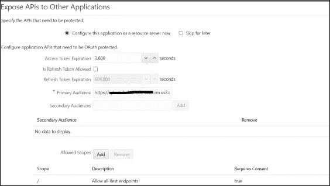

*   取消选中“强制授权”并单击“完成”。

4.为融合应用程序创建 Oauth 客户端

*   登录 IDCS 管理控制台>单击“应用程序”选项卡>搜索在上述步骤中创建的应用程序
*   选择“立即将此应用程序配置为客户端”并提供以下详细信息

允许的授权类型—“客户端凭据”和“JWT 断言”

安全性—保持复选框未选中

单击完成

记下客户端 ID 和客户端密码

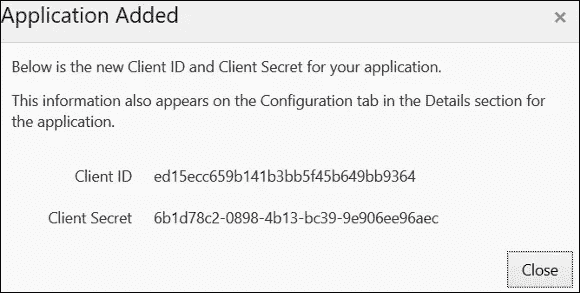

单击激活以激活应用程序。

5.从 [https:// < IDCS](https://%3cIDCS) 实例主机> /获取颁发者名称和令牌端点。众所周知的/IDC 配置

*   打开上面的 URL，复制“发行者”值和“令牌 _ 端点”值

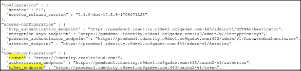

6.文件服务请求 Oracle 支持配置融合应用程序并提供以下信息

*   联盟的方向——融合应用作为身份提供商，IDCS 作为服务提供商
*   步骤 2 中下载的 IDCS 服务提供商元数据
*   步骤 2 中下载的签名和加密证书
*   名称 ID 格式值= "未指定"，名称 ID 值= "uid "
*   第 5 步中的发行人名称
*   按照步骤#5 的 IDCS 令牌端点
*   融合 Id-域和数据中心详细信息
*   创建的 OAuth 客户端的客户端 id 和证书

# **融合 App 配置**

Oracle 技术支持将处理服务请求，以在融合应用程序中配置联盟和 Oauth 信任，并以成功完成作为响应，同时为您提供一个证书文件

# **激活和测试**

IDCS 管理员将通过以下步骤激活并测试融合应用程序和 IDCS 之间的联盟-

1.  IDCS 管理员将登录到 IDCS 管理控制台
2.  测试并激活联盟

*   点击“安全”>在左边选择“身份提供者”
*   从 FA IdP 提供商操作菜单中，单击“测试”来测试设置。这将打开融合应用程序登录页面。

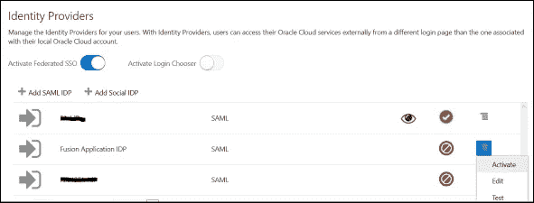

*   要在登录页面中显示 IDP，请使用新添加的身份提供者配置 IDP 策略
*   如果身份提供者尚未激活，请将其激活。保持选择器登录禁用，以支持混搭用例。

3.将 Oauth 客户端设为可信客户端

*   搜索前面创建的 Oauth 客户端，点击名称进入详细信息页面
*   单击“配置”选项卡，“客户端配置”
*   客户端类型—受信任
*   证书—从支持部门导入 FA 签名证书
*   单击完成

这完成了融合应用和身份云服务之间的联合和 Oauth 设置，使您能够实现融合应用和支持 IDCS 的平台服务之间的单点登录，以及使用 IDCS 访问令牌的融合 web 服务调用。

下一步—在融合应用和身份云服务之间设置用户和角色同步

*本文所表达的观点是我个人的观点，不一定代表甲骨文的观点。*