# 启用身份云服务作为身份提供商的联盟

> 原文：<https://medium.com/oracledevs/enable-federation-with-identity-cloud-service-as-identity-provider-36e80d2bc4ec?source=collection_archive---------1----------------------->

这是我撰写的系列博客中的第三篇，旨在解释 Oracle 融合应用程序与 PaaS 服务的身份集成，使用身份云服务来实现服务之间的单点登录。这是这个系列的博客列表

1.  [了解集成架构——融合应用与平台服务](/@amit.gokhru/understanding-the-integration-architecture-fusion-application-with-platform-services-9b8297594873)
2.  [启用融合应用作为身份提供商的联盟](/@amit.gokhru/enable-federation-with-fusion-apps-as-identity-provider-1ca6d795659c)
3.  [启用身份云服务作为身份提供商的联盟](/@amit.gokhru/enable-federation-with-identity-cloud-service-as-identity-provider-36e80d2bc4ec)
4.  [在融合应用和身份云服务之间设置用户和角色同步](/@amit.gokhru/setting-up-users-and-roles-synchronization-between-fusion-apps-and-identity-cloud-service-70dcf2144107)
5.  [调用 Fusion Apps rest 端点的三脚 OAuth 流。](/@amit.gokhru/3-legged-oauth-flow-to-invoke-fusion-apps-rest-endpoints-5fc6b0b7b059)

在这篇博客中，我将解释我们如何配置融合应用和 IDCS 之间的联合，以实现融合应用和 IDCS 支持的 PaaS 服务之间的单点登录，其中融合应用的内部 IDM 将作为服务提供商，IDCS 作为身份提供商。我们还将看到如何在融合应用程序和 IDCS 之间启用 Oauth 信任，以利用 IDCS Oauth 令牌进行 web 服务调用。在希望利用 IDCS 的多因素身份验证、社交登录和与第三方 SAML 提供商的联盟等高级功能的情况下，您可能希望将 IDCS 配置为身份提供商。最终的拓扑将会是这样的

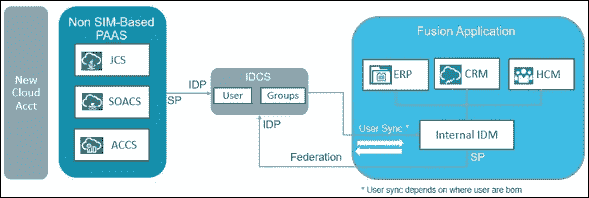

让我们从分为 3 个步骤的配置开始

1.  IDCS 配置— IDCS 管理员
2.  融合应用配置— Oracle 支持
3.  激活和测试— IDCS 管理员

以下是官方文档— [通过 Oracle 身份云服务支持 Oracle 销售云、Oracle 全球人力资源云、Oracle ERP 云联盟和 OAuth Trust】](https://cloud.oracle.com/developer/solutions?tab=tasks&solutionguid=OCPSI-GUID-53C8A800-3DC3-48F0-930E-11797185406B)

(请注意，Fusion Apps 的 URL 和屏幕截图是第 12 版)

# IDCS 构型

1.  从 [https:// < IDCS](https://%3cIDCS) 实例主机> /获取颁发者名称和令牌端点。众所周知的/IDC 配置

*   打开上面的 URL，复制“发行者”值和“令牌 _ 端点”值

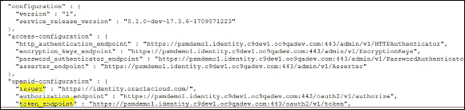

2.从 URL(传统云账户 FA rel 12)——[https://【Id-Domain](https://[Id-Domain)]获取融合应用服务提供商元数据文件。【login.us2.oraclecloud.com/fed/sp/metadata 号

3.从 FA 环境 URL 获取租户名称和域名。在这个示例环境 URL 中， **eeho** 是租户名称，[**us2.oracle.com**](http://us2.oracle.com/)是域名:[https://eeho.hcm.us2.oraclecloud.com/hcmCore](https://eeho.hcm.us2.oraclecloud.com/hcmCore)

4.在 IDCS 管理控制台中将融合应用程序配置为服务提供商

*   登录 IDCS 管理控制台，点击“应用程序”选项卡和“添加”

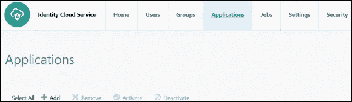

*   点击**应用目录**

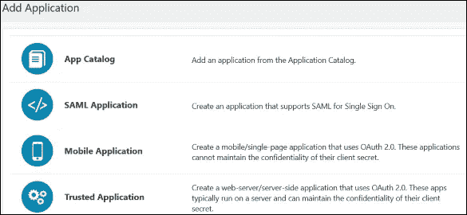

*   搜索 Oracle 融合管理软件，然后点击**添加**。

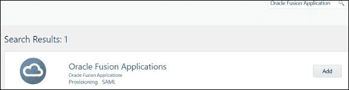

*   选择要为 SSO 启用的融合支柱，并提供步骤 3 中的租户名称和域名，然后单击“下一步”

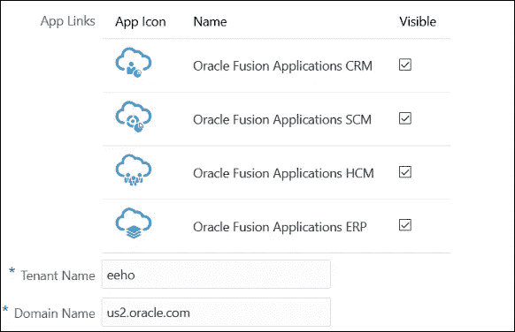

*   从步骤 2 中下载的融合应用 SP 元数据文件中获取实体 ID

打开 FA SP 元数据

找到包含在 EntityDescriptor XML 元素中的 entityID XML 属性(例如:<entitydescriptor id="”id-6wBqfqu3lAOooHG3n666jh0vgqM-”" entityid="”<a" class="ae jl" href="https://login.us2.oraclecloud.com/fed/idp" rel="noopener ugc nofollow" target="_blank">https://login.us2.oraclecloud.com/fed/idp"…/>)</entitydescriptor>

*   创建 X.509 签名证书

打开在步骤 2 中下载的 FA SP 元数据文件

将<x509certificate>定位在<keydescriptor use="”signing”">下方。</keydescriptor></x509certificate>

将<x509certificate>和</x509certificate>之间的值复制到文本文件中。

在文件的开头添加--BEGIN 证书--。

在文件末尾添加--结束证书--。

保存并将文件扩展名更改为**。cer** 。

例如:

———开始证书———

miicvtcab 6 gawibagi…..

— ——结束证书——

*   输入实体 ID 并上传融合应用程序的签名证书

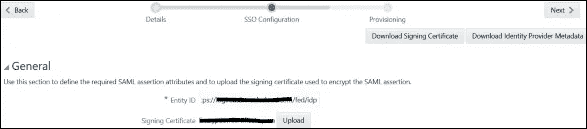

*   下载签名证书和身份提供者元数据并另存为文件，单击“下一步”，然后单击“完成”
*   **如果用户在 FA 中被配置并同步到 IDCS** ，则进入 SSO 配置→认证&授权，取消选中授权复选框。救援
*   保持应用程序不激活

5.为融合应用程序创建 Oauth 资源。需要将此 Oauth 资源作为“允许的范围”添加到 Oauth 客户端中，以获得给定范围的访问令牌。

*   登录 IDCS 管理控制台>单击“应用程序”选项卡>“添加”

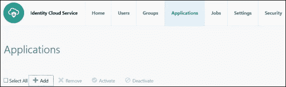

*   在应用程序向导中，选择“可信应用程序”

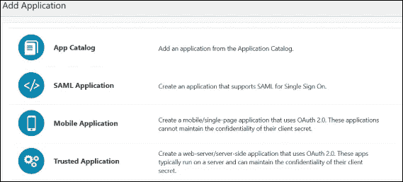

*   在“应用程序详细信息”页面上，提供应用程序名称和描述，然后单击下一步
*   跳过客户端配置，然后单击“下一步”
*   选择单选按钮“立即将应用程序配置为资源服务器”,将融合应用程序 API 路径配置为 OAuth 资源

提供“主要受众”= FA 端点的主机

提供“辅助受众”= FA 端点的辅助主机

单击“允许范围”上的“添加”,添加主要和次要受众的允许范围

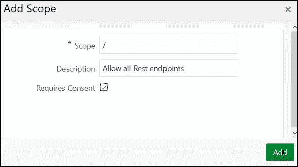

查看受众和允许的范围，然后单击下一步。您可以添加特定的 API 作为作用域，然后为那些允许的作用域请求访问令牌。当您添加“/”作为允许的范围时，请确保在请求访问令牌时使用“受众”+“/”作为范围。

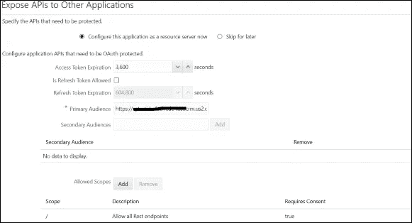

取消选中“强制授权”并单击“完成”。

6.为融合应用程序创建 Oauth 客户端

*   登录 IDCS 管理控制台>单击“应用程序”选项卡>搜索并打开上面创建的应用程序
*   选择“立即将此应用程序配置为客户端”并提供以下详细信息

允许的授权类型—“客户端凭据”和“JWT 断言”

安全性—保持复选框未选中

单击完成

记下客户端 ID 和客户端密码

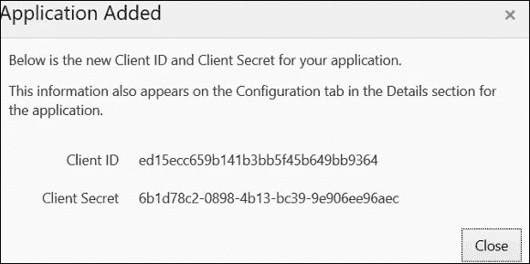

单击激活以激活应用程序。

7.文件服务请求 Oracle 支持配置融合应用程序并提供以下信息

*   联盟的方向——融合应用作为服务提供商，IDCS 作为身份提供商
*   下载的 IDCS 身份提供者元数据
*   下载的签名证书
*   NameID 和电子邮件地址将用于 SSO
*   发行人名称
*   IDCS 令牌端点
*   融合 Id-域和数据中心详细信息
*   创建的 OAuth 客户端的客户端 id 和密码

# 融合应用配置

Oracle 技术支持将处理服务请求，以在 Fusion Application 中配置联盟和 Oauth 信任，并以成功完成作为响应，为您提供一个证书文件。

# 激活

IDCS 管理员将通过以下步骤激活融合应用程序和 IDCS 之间的联盟

1.  启用 SSO

*   进入 Oracle 身份云服务管理控制台，选择应用程序，搜索之前创建的 Oracle 融合应用程序，点击进入详细信息页面
*   点击**激活**，然后点击**激活应用**。Oracle Identity Cloud Service 显示一条确认消息。

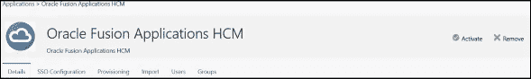

2.将 Oauth 客户端设为可信客户端

*   搜索前面创建的 Oauth 客户端，点击名称进入详细信息页面
*   单击“配置”选项卡，“客户端配置”
*   客户端类型—受信任
*   证书—从支持部门导入 FA 签名证书
*   单击完成

这完成了融合应用和身份云服务之间的联合和 Oauth 设置，使您能够实现融合应用和支持 IDCS 的平台服务之间的单点登录，以及使用 IDCS 访问令牌的融合 web 服务调用。

下一步—在融合应用和身份云服务之间设置用户和角色同步

*本文所表达的观点是我个人的观点，不一定代表甲骨文的观点。*