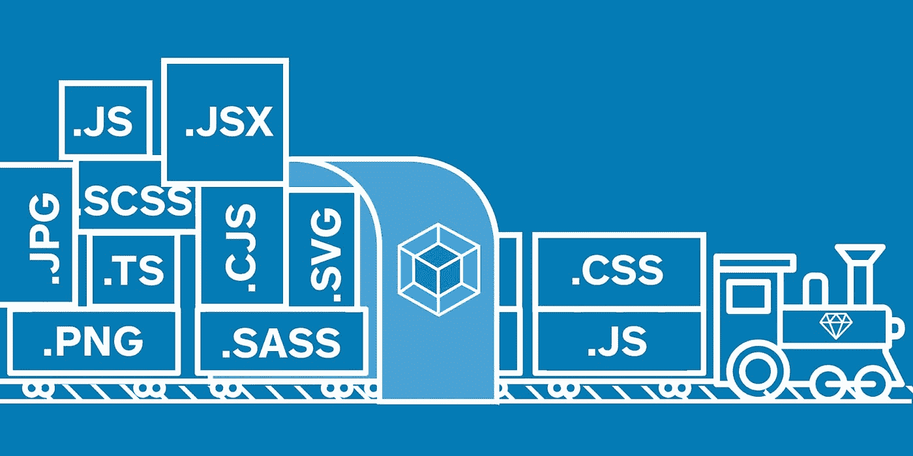

# 使用 Webpack(er)在 Rails 中启用现代 JavaScript

> 原文：<https://medium.com/square-corner-blog/enabling-modern-javascript-in-rails-with-webpack-er-fd4a1b8dd0c6?source=collection_archive---------0----------------------->



> 注意，我们已经行动了！如果您想继续了解 Square 的最新技术内容，请访问我们的新家[https://developer.squareup.com/blog](https://developer.squareup.com/blog)

当我在 2016 年加入 Caviar 时，我完全被 React 和所有关于构建模块化系统的好东西所吸引。jQuery 不再是街区里最酷的孩子了。NPM 是获得任何缺失的依赖的地方。随着 Babel 等编译器帮助旧浏览器支持新语法，ES6 开始获得更多关注。

我很高兴听到鱼子酱使用反应！我可以看到自己用承诺和酷的新语法构建组件。只使用过 Node，很容易找到与 JavaScript 相关的解决方案。想要在旧浏览器上使用 ES6，还是想要在工作时检查代码的 linter？没问题，Webpack 支持你。那是在我对 Rails 约定一无所知之前。

# JavaScript: Rails 被忽视的兄弟

另一方面，众所周知，Rails 更喜欢约定而不是配置。这意味着它对如何处理 JavaScript 有强烈的意见。具体来说，Rails 有自己的资产打包库，称为“链轮”,它没有预先配置来解决 NPM 依赖性。相反，jQuery 和少量由 Gems 包装的流行 JavaScript 库是可用的。最重要的是，Rails 附带的语言是 CoffeeScript，它正在失去对日益流行的 ES6 语法的青睐。

前端资产的 Rails 设置当然可以工作，但是从节点设置来看，架构感觉很旧，各个部分看起来没有很好地结合在一起。路径解析很难配置，而且有一些非常奇怪的方式来包含依赖关系。由于`node_modules`不是开箱即用的，如果你想包含一个供应商依赖，你必须寻找一个 Gem，或者手动下载依赖，并把它放在`vendor/assets/javascripts`目录中。然后，供应商库可以通过链轮特殊指令处理器，如`//=require jquery`，包含到基本`application.js`清单文件中。这对于在浏览器的全局上下文中实例化的传统依赖关系来说很好，但是如果您需要预处理代码或使用 CommonJS，事情就会变得很糟糕。要求模块的语法变得臃肿，因为除了 JavaScript `require`之外，还需要通过链轮包含模块。

链轮能够通过从左到右读取扩展来预处理 JS 代码。因此，如果您想处理一些 Rails 环境，然后将 CoffeeScript 处理成普通的 JS，那么您会有一个类似于`*.js.coffee.erb`的扩展。最重要的是，为了支持 React，我们使用了`react-rails`，它允许通过添加`*.js.jsx`来处理 React 文件，所以现在有了`*.js.jsx.coffee`(幸运的是我们在 JavaScript 中没有经常编译 Rails 数据)。但是等等，还有呢！如果您想使用 CommonJS require 语法，您必须安装另一个名为链轮-commonjs 的 Gem，它要求您为要用 Javascript require(…)语法处理的文件添加`*.module*`扩展名。这意味着我们几乎所有的 React 文件都以`*.module.js.jsx.coffee`结尾😰。

在 Rails Asset Pipeline 的指导下工作使得实现模块化代码库变得困难，因为它将开发人员限制在旧的整体依赖上。在 React 中使用 jQuery 通常是不被允许的，但是我们确实没有任何方法可以合理地填充承诺或获取。这限制了我们使用过时的编码方法，我们将来不得不重构这些方法。当使用像 React 这样的视图库时，没有 NPM 是一个巨大的障碍，因为通常的做法是通过可用的 NPM 依赖项来“构建自己的框架”。

这个公式缺少的组件是一个像 Webpack 这样的构建工具。众所周知，Webpack 很难配置，但是一旦安装完毕，它就是 JavaScript 社区中最通用的资产打包库。通过 Webpack 加载器和插件，你可以实现树抖动、代码分割、热模块重载、ES6 编译和代码林挺等等。问题是没有用 Rails 安装 Webpack 常规方法。我们考虑过像`react_on_rails`这样的库，但是设置它需要大量的重构，我们负担不起。

# 输入 Webpacker

幸运的是，Rails 社区也发现了对 Webpack 的需求。他们推出了兼容 Rails 4.2+的`Webpacker` gem。开箱即用，Webpacker 生成应用开发、试运行和生产环境最佳实践的配置。这立即与我们的部署管道一起工作，因为它被预先配置为遵循 Rails 约定。具体来说，它将构建过程与`rake asset:precompile`联系起来。这为我们节省了大量处理配置文件的时间，让我们可以将注意力集中在重构和移植代码上。

# 迁移过程

理想情况下，最好能留出大量时间来进行迁移。事实上，我们仍然有许多功能要发布，在一个不会立即给公司的成功带来回报的项目上花费时间并不总是容易的。尽管如此，我认为控制我们的技术债务并向现代堆栈发展是很重要的。因此，我们在迁移中采用了增量方法，在一段时间内加载两个应用程序包。为了节省时间，我们专注于纯重构，在第一次通过时解决不太理想的更改，以便我们不会破坏任何特定的拉请求。

我们首先开始移动明显的模块化组件；在我们的代码库中，它是 React 组件。由于新代码会定期添加，因此不中断其他工程师的工作流程非常重要。尽管 Webpacker 的默认 Javascript 目录位于`app/javascript`中，但我通过`resolve.modules`属性重新配置了 Webpack，将旧路径`app/assets/javascripts`作为根路径。现在我们的文件中使用的相对路径是有效的，但是我们必须做一些调整来处理长文件扩展名。

为了处理我们的文件扩展名，Webpack 需要将长扩展名视为单个扩展名。我将所有不同的扩展组合添加到了`resolve.extensions`数组中。接下来，我必须对现有的加载器进行一些调整。Webpacker 附带了通过 Babel 编译 Coffeescript 和 React 的加载器，但没有将两者结合起来，也没有处理我们特殊文件扩展名的能力。为了实现这一点，我添加了以下加载程序。

```
module.exports = {
  test: /(\.module)?\.js(\.jsx)?\.coffee$/,
  exclude: /node_modules/,
  use: ['babel-loader', 'coffee-loader']}
```

如果一个文件的扩展名与在`test`属性中指定的正则表达式匹配，它将从左到右应用在`use`中指定的加载器。

迁移页面加载时执行的旧 Javascript 资产相当简单。您可以使用`require.context`指定整个目录作为解析路径的基本上下文。遍历上下文中的每个路径并解析文件将实例化代码。

```
const context = require.context(‘global’);
context.keys().forEach(context);
```

一旦通过 Webpack 配置正确处理了路径解析，就可以安全地将 Webpack 成功编译的文件迁移到传统的`app/javascript`目录。迁移文件和重命名扩展名被留在最后一步，以减少其他工程师的困惑。

最后，我们使用 Yarn 代替 Rails bundler 或者通过供应商目录重新安装了我们的供应商依赖。由于依赖关系通常是使用链轮在全局上下文中实例化的(而 Webpack 将只包含您显式注入的依赖关系)，您将需要遍历每个文件以找到模块使用的`require`依赖关系。除非您有一个脚本来注入依赖项，否则这可能非常耗时。作为替代，无论何时发现某个变量，如`moment`或`React`，都可以使用`ProvidePlugin`来要求依赖关系。这样做的缺点是，您正在向代码库引入魔法，而不是明确在任何给定的文件中使用了哪些依赖项。

# 立即改进

一旦迁移完成，就会有一些立竿见影的效果。Webpack 的生产配置将自动缩小您的应用程序包，并对您的资产名称应用哈希，以使浏览器中的缓存资产无效。您可以进一步为您的供应商和入口包设置一个单独的块，因为供应商文件很少更改。

使用 Webpack，您还可以用加载器设置林挺和 ES6 编译。ES6 已经附带了 Webpacker，所以您可以立即开始使用新的语法。需要注意的是，您可能需要包含`presets`来启用 React 编译。ESLint 也像安装和配置`eslint-loader`一样简单。

如果您觉得您的包变得太大，您可以设置`BundleAnalyzer`来可视化您正在拉入的依赖项。这可以帮助您识别重复的依赖项，或者找到您拆分成较小块的依赖项，以便在需要时动态导入。

Webpacker 还附带了`webpack-dev-server`，这是一个节点服务器，可以在开发时编译包。这不仅是调试代码的有用工具，还可以启用热模块替换来提高生产率。热模块替换将在不刷新页面的情况下重新加载任何前端代码更改，节省了开发人员往返服务器的麻烦。Caviar 使用`react-rails`来安装来自多个元素的组件，这使得启用 HMR 变得特别棘手，因为没有单一的应用程序容器组件。您可以使用`react-rails-ujs`挂载方法来启用 React 热加载，而不是设置`react-hot-loader`。

```
function initReactRailsContext() {
  const componentRequireContext = require.context(‘containers’, true);
  ReactRailsUJS.useContext(componentRequireContext);
  // convert the component names passed into react_component
  // from pascal-case to snake-case for the file names to be resolved
  const originalGetConstructor = ReactRailsUJS.getConstructor;

  ReactRailsUJS.getConstructor = function (reqctx) {
    return originalGetConstructor(_.snakeCase(reqctx));
  };
  return componentRequireContext;
} const componentRequireContext = initReactRailsContext();
if (module.hot) {
  module.hot.accept([componentRequireContext.id](http://componentrequirecontext.id), () => {
    initReactRailsContext();
    ReactRailsUJS.mountComponents();
  });
}
```

如果没有合适的工具，很难跟上前端开发不断发展的步伐。Webpack 使 Caviar 能够更高效地生产我们的产品，让我们的工程师能够构建最好的食品订购平台。自从迁移到 Webpack，我们已经能够[去除](https://decaffeinate-project.org/)我们的代码并转移到 ES6+语法。此外，我们还能够将 Enzyme 等库集成到我们的测试套件中，这是一个声誉良好的测试库，很难通过 Rails 资产管道安装。尽管有其他方法可以通过 Rails 或其他构建工具来完成上述任务，但我发现 Webpack 是解决各种前端需求的一站式商店。

有了 Webpack，我们可以利用 NPM 上的各种工具。我们的团队现在专注于减少我们为客户提供的应用捆绑包。如上所述，我们正在积极研究使用[react-loaded](https://github.com/jamiebuilds/react-loadable)在组件级动态服务资产。虽然本文没有讨论，但是 Webpack 也能够捆绑 CSS 资产。使用像 [PurifyCSS](https://www.npmjs.com/package/purifycss) 这样的工具，可以消除像 Bootstrap 这样的框架产生的无用 CSS。所有这些努力都是为了给我们的用户建立一个高性能和愉快的网络体验。

感觉饿吗？参观 trycaviar.com，在你附近最好的餐馆点餐。