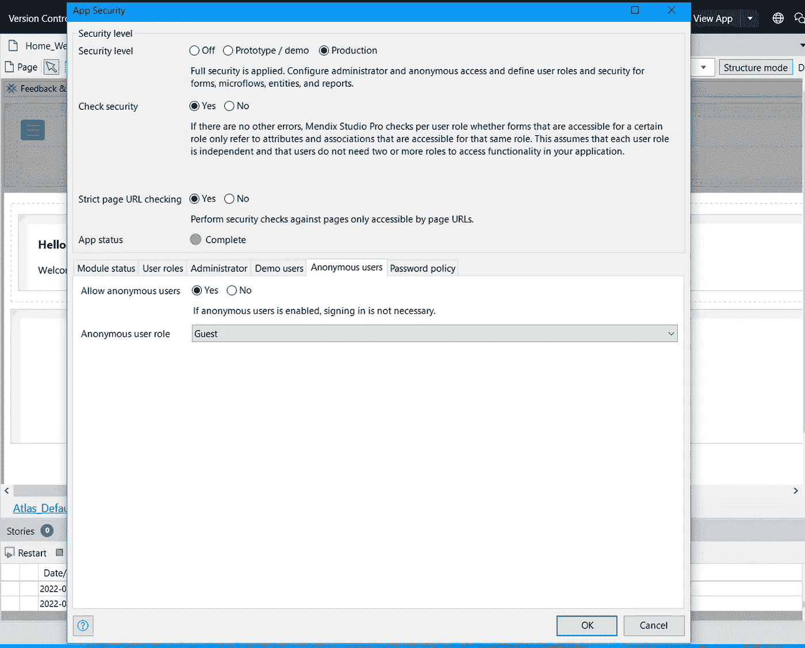

# 启用安全性和添加登录页面

> 原文：<https://medium.com/mendix/enabling-security-and-adding-a-login-page-ba092a82f09b?source=collection_archive---------0----------------------->

Hello Mendix - Enabling security and adding a Login Page

# 你好，门迪克斯——第二部分

## 这是 Hello Mendix 系列的继续——在这个系列中，我解释了 Mendix 开发的要点，并试图尽快填补您的知识空白。

## 在本系列的第 2 部分中，我将向您展示如何在您的 Mendix 项目中启用安全性；包括两种不同的方法来添加登录页面到您的应用程序。

Hello Mendix part 2, youtube video

## 选项 1-通过将应用程序的安全级别设置为生产，使用默认的 login.html 页面

在 **Studio Pro** 中，点击应用浏览器窗格中的**项目安全**。将您的安全级别设置为**生产**。这将自动启用默认登录页面。

App security overview inside Mendix Studio Pro

现在，单击确定并运行您的应用程序。在浏览器中导航到该应用程序后，它会将您引导到一个登录页面，该页面需要用户名和密码来验证用户。

The Auto Generated Login.html Page generated by Mendix Studio Pro

这是你的应用程序的默认**login.html**页面，可以在你的应用程序目录中找到，**在主题文件夹**中。如果你愿意，你可以修改这个 HTML 文件来匹配你的应用程序的外观或实现 SSO，但这将按原样工作——开箱即用。

> 通过将“Accounts_Overview”页面添加到应用程序的导航中，您可以作为管理员创建和管理用户帐户。

## 选项 2 —允许匿名用户并创建自定义登录页面

第二个选项是使用所见即所得在 studio pro 中构建一个页面，供访客用户登录。为此，我们需要再次打开项目安全设置。

转到**用户角色**选项卡，单击新建创建一个名为“**来宾**的新角色。

App security overview inside Mendix Studio Pro — Setting Security Level to Production

现在，我们可以转到匿名用户的选项卡，并将允许匿名用户设置为是。然后在下面的下拉列表中选择我们的客人用户角色。

App security overview inside Mendix Studio Pro — Allowing anonymous users

我们必须设置我们的导航，以确保客人用户被定向到一个页面，他们可以登录并成为认证用户。打开位于安全下方的导航窗口，并在基于角色的主页上单击编辑。单击新建并选择来宾，然后单击选择目标。在这里，我们可以选择用户角色应该被定向到的页面。选择我的第一个模块，单击“新建”并选择“创建页面”。给页面起一个名字，比如 Login_Web，选择登录模板，然后单击 ok。

Create a new page wizard in Mendix Studio Pro

现在差不多完成了，只需在左边的属性窗口中定义“visible for ”,记住在这里选择 guest，然后运行你的应用程序来测试它。

Select the Module Roles window for the new page in Mendix Studio Pro

完成后，您的 Responsive profile 角色库主页应该类似于下面的屏幕截图。

Role-Based home pages overview inside the Navigation editor for Mendix Studio Pro, configured to direct anonymous users to the login page

请记住，在测试时，您可以使用演示切换器小部件来快速更改用户角色。要创建登录凭据，管理员需要导航设置以允许访问 Accounts_Overview 页面，或者您可以为您的来宾用户创建注册流程。

## 阅读更多

 [## 应用安全性

### 1 应用内安全性介绍，您可以打开或关闭整个应用的安全性。您还可以配置安全性…

docs.mendix.com](https://docs.mendix.com/refguide/project-security/)  [## 演示用户

### 1 简介演示用户是对应用程序中存在的每个用户角色的演示。您可以使用演示用户来测试…

docs.mendix.com](https://docs.mendix.com/refguide/demo-users/)  [## 密码策略

### 1 简介您可以指定密码的要求数量。这些要求将在创建时应用…

docs.mendix.com](https://docs.mendix.com/refguide/password-policy/)  [## 设置导航结构

### 一旦你创建了一些页面，你想给用户访问它们的能力。最简单的方法是…

docs.mendix.com](https://docs.mendix.com/howto7/general/setting-up-the-navigation-structure/)  [## 安全性

### 1 简介 Mendix 中的安全性有两个方面:您希望不同的人看到您的应用程序的不同部分…

docs.mendix.com](https://docs.mendix.com/refguide/security/) 

*来自发布者-*

*如果你喜欢这篇文章，你可以在我们的* [*中页*](https://medium.com/mendix) *找到更多喜欢的。对于精彩的视频和直播会话，您可以前往*[*MxLive*](https://www.mendix.com/live/)*或我们的社区*[*Youtube PAG*](https://www.youtube.com/c/MendixCommunity/community)*e .*

*希望入门的创客，可以注册一个* [*免费账号*](https://signup.mendix.com/link/signup/?source=direct) *，通过我们的* [*学苑*](https://academy.mendix.com/link/home) *获得即时学习。*

有兴趣加入我们的社区吗？加入我们的 [*松弛社区频道*](https://join.slack.com/t/mendixcommunity/shared_invite/zt-hwhwkcxu-~59ywyjqHlUHXmrw5heqpQ) *。*