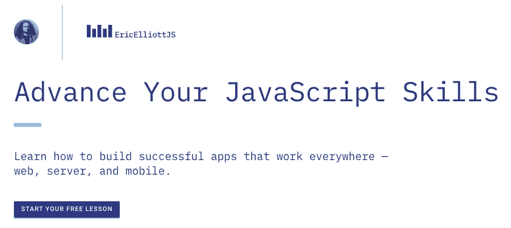

# JavaScript 封装

> 原文：<https://medium.com/javascript-scene/encapsulation-in-javascript-26be60e325b4?source=collection_archive---------0----------------------->


Photo: [Tanakawho — A Lotus Bud](https://flickr.com/photos/28481088@N00/186324803/) ([CC BY-NC 2.0](https://creativecommons.org/licenses/by-nc/2.0/))

***更新:****2022 年 9 月为类私有字段支持。*

封装是对数据和作用于该数据的方法的捆绑，从而限制从捆绑之外对该数据的访问，或者如 Alan Kay 所描述的，“本地保留、保护和隐藏状态过程”在 OOP 中，这意味着一个对象私有地存储它的状态，只有对象的方法有权改变它。

如果你想改变封装状态，你不要伸手直接变异一些对象的道具。相反，你在对象上调用一个方法，并且*也许*对象会通过更新它的状态来响应。例如，如果您使用 Redux 构建一个应用程序，而不是直接操作视图的数据模型，那么您可以将一个名为 *action object* 的消息发送到数据存储。Redux 控制处理消息的时间和方式。该消息的定时和处理受到精确控制，以便创建可预测的、确定性的状态更新。给定相同顺序的相同消息，Redux 将总是产生相同的状态。

同样，当您想要用`useState`或`setState`更新 React 组件状态时，这些更改不会直接操作组件状态。相反，它们可能会将在渲染周期完成后应用的潜在状态更改排入队列。你不直接设置 React 的组件状态；React 有。

# 为什么要封装？

在 20 世纪 60 年代和 70 年代，程序员努力解决由于试图在以不确定性序列运行的不同操作之间共享相同的存储器资源而导致的时序依赖性和资源冲突。他们还因为需要将代码耦合到程序状态的特定数据结构表示而感到沮丧。

在 20 世纪 70 年代，艾伦·凯从伊凡·苏泽兰的画板论文中受到启发，该论文于 1961 年至 1963 年在麻省理工学院开发，而 Simula 于 20 世纪 60 年代由奥利·约翰·达尔和克利斯登·奈加特在挪威计算中心开发。Alan Kay 参与了 ARPAnet 的研究和设计，拥有科学和数学背景，并对细胞如何被膜封装并通过信息传递进行通信特别感兴趣。

所有这些想法一起形成了 OOP 的基础:封装和消息传递。

共享可变状态的问题在于，如果您的输入状态依赖于其他指令的输出状态，并且出现任何类型的并发，就会产生竞争条件。如果你改变指令被调用的顺序，就会改变结果。在排序中混入任何一种不确定性，结果都是混乱的:不可预测、不可证明、看似随机的应用程序状态。有时候很管用。有时候不会。

封装是解决这个问题的一种方法。

封装还解决了另一个有趣的问题。假设您有一个需要处理的数据集合。一种方法是首先决定表示数据的数据结构。如果您从实现细节(比如说一个数组)开始，并且使用它的所有东西都知道它的结构，并且可以创建与数据结构的紧密耦合，这使得以后很难更改该实现。如果您最终想要将数组换成流、树或其他数据结构，该怎么办呢？如果什么都知道实现，可能就晚了。

但是，当我们将这些实现细节封装在一个公共接口之后，然后所有使用该对象的东西都只通过它的公共接口来这样做时，以后更改实现细节就更容易了。举例来说，假设您有一个存储数字的数据结构，您需要一种将存储的值乘以 2 的方法:

```
// Only works for arrays
const doubleAllImperative = data => {
  const doubled = [];
  for (let i = 0, length = data.length; i < length; i++) {
    doubled[i] = data[i] * 2;
  }
  return doubled;
};// Same as above, but works for anything with the
// map operation.
const doubleAllInterface = data => data.map(x => x * 2);const box = value => ({
  map: f => box(f(value)),
  toString: () => `box(${ value })`
});console.log(
  doubleAllInterface([2,3]), // [4, 6]
  doubleAllInterface(box(2)).toString(), // box(4)
);
```

封装可能是一个强大的工具，能够帮助您防止由共享可变状态导致的错误，还可以减少组件和它们所依赖的数据结构之间的紧密耦合。它帮助你遵守软件设计的至少三个关键原则:

1.  避免共享可变状态。“非确定性=并行处理+可变状态”——Martin oder sky，Scala 编程语言的设计者
2.  **“程序是一个接口，而不是一个实现。”** —四人帮，[《设计模式:可复用面向对象软件的要素》](https://www.amazon.com/Design-Patterns-Elements-Reusable-Object-Oriented/dp/0201633612/ref=as_li_ss_tl?ie=UTF8&linkCode=ll1&tag=eejs-20&linkId=7445122e05ad99f1761daaeb75239e4f&language=en_US)
3.  需求中的一个小变化应该使得软件中相应的小变化成为必要。 — N. D. Birrell，M. A. Ould，[《软件开发实用手册》](https://www.amazon.com/Practical-Handbook-Software-Development-ebook/dp/B01DM2859K/ref=as_li_ss_tl?ie=UTF8&linkCode=ll1&tag=eejs-20&linkId=d47c3f2ec4505eb596bd974446104041&language=en_US)

# JavaScript 中的惯用封装

当 Brendan Eich 在 1995 年发布的那决定性的 10 天里开发 JavaScript 时，他心中有两个想法:

*   浏览器中的方案
*   看起来像 Java

Scheme 是一种函数式编程语言 LISP 的一种方言，LISP 是一种可以追溯到 1958 年的优雅的小语言。因为 Scheme 支持非常灵活的高阶函数和闭包，所以它能够超越自身的重量。

Java 是一种基于类的面向对象语言。从 Java 中，JavaScript 得到了构造函数、(最终)类的概念，以及`new`关键字(以及其他东西)。

Brendan Eich 从 Self 编程语言中偷偷引入了第三个主要灵感——原型，这使得 JavaScript 的继承概念比它的类似名称但在其他方面很遥远的表亲 Java 更加强大和灵活，但那是[的另一个故事](/javascript-scene/master-the-javascript-interview-what-s-the-difference-between-class-prototypal-inheritance-e4cd0a7562e9)。

23 年过去了，这个范式大熔炉还是有点被误解。其中一个常见的误解与封装有关。

在讨论 JavaScript 中对象的惯用封装之前，我首先要解决一个常见的约定，它不是一种健壮的封装形式。很久以前，在很多 JavaScript 开发人员了解到[闭包](/javascript-scene/master-the-javascript-interview-what-is-a-closure-b2f0d2152b36)之前，一些 JavaScript 开发人员注意到 JavaScript 对象(以及后来的类)没有包含私有属性的机制。

在[之前，类实例的私有字段](https://github.com/tc39/proposal-class-fields)(ECMAScript 2022 中可用，并由当前所有主流浏览器实现)，无法在 JavaScript 中为对象创建私有属性。一些开发人员决定通过在私有属性和方法前面加上下划线来表示私有属性和方法，而不是依靠闭包，闭包已经在 JavaScript 中支持真正的数据隐私，这已经成为一种公认的(尽管有些尴尬和有争议)惯例。

这是有问题的，原因有多种:

**突破性变化:**内部属性和方法往往比公共属性和方法变化更频繁。对于许多人来说，带下划线前缀的方法，例如`myComponent._handleClick`指的是他们不希望 API 用户直接调用的方法。相反，它们只在内部使用，因此，如果它们的实现发生变化，或者被完全删除，那些开发人员不会认为这是一个突破性的变化。

对用户来说不幸的是，许多新开发人员并不知道下划线前缀的约定，所以可能还是会使用这些属性。有经验的开发人员通常知道它的意思，但是认为，“我知道我在做什么”，所以无论如何都要使用它们——特别是如果它为当前的问题提供了一个明显的解决方案。换句话说，很多人忽略了这个惯例，这导致了更多不必要的突破性变化。

**泄露的实现细节:**还记得上面的例子吗，我们开始只支持数组，但是现在我们想把我们的支持扩展到流？嗯，如果您的用户可以直接访问底层数据结构，他们可能会创建对这些数据结构的依赖，所以第一次遇到流时，他们会对代码中断感到惊讶。

**扩大黑客的攻击面:**特别是在公共 API 上，添加任何超出使用代码所需的表面 API 都会扩大攻击者可利用的表面。软件安全最重要的原则之一是将攻击面限制在绝对必要的范围内。如果您真的只想在内部使用某个东西，那么它就不应该对外公开。

自文档化代码:你的公共 API 应该尽可能的自文档化。做到这一点的一个方法是只公开那些您打算让您的用户使用的方法和属性。这样，用户就不会尝试使用不受支持和没有文档记录的方法。如果你使用下划线约定，你依赖于用户知道它的意思并且理解你不打算让他们使用它。如果使用封装，就不用担心这个问题。他们不能使用他们没有权限的东西。

# JavaScript 中的真正封装

当然，正如功能人群所知，JavaScript 一直支持真正的数据封装。在 JavaScript 中声明私有数据非常容易。

## 使用闭包

```
const createCounter = () => {
  // A variable defined in a factory or constructor function scope
  // is private to that function.
  let count = 0;return ({
    // Any other functions defined in the same scope are privileged:
    // These both have access to the private `count` variable
    // defined anywhere in their scope chain (containing function
    // scopes).
    click: () => count += 1,
    getCount: () => count.toLocaleString()
  });
};const counter = createCounter();counter.click();
counter.click();
counter.click();console.log(
  counter.getCount()
);
```

特权方法是一种可以访问包含函数范围(也称为词法环境)内私有数据的方法。特权函数和方法可以基于引用访问包含函数的变量，即使包含函数已经返回。这些引用是活动的，因此如果包含函数中的状态发生变化，每个可以访问该引用的特权函数都会发生变化。换句话说，当我们调用`counter.click()`时，它改变了`counter.getCount()`看到的值。

甚至可以使用[函数混合](/javascript-scene/functional-mixins-composing-software-ffb66d5e731c)来继承私有状态。

## 使用私有字段

自 ECMAScript 2022 起，JavaScript 规范中就提供了私有字段，并且主流浏览器对私有字段的支持已经有一段时间了，所以您很有可能会这样做:

```
class Counter {
  #count = 0

  click () {
    this.#count += 1;
  }
  getCount () {
    return this.#count.toLocaleString()
  }
}const myCounter = new Counter();myCounter.click();
myCounter.click();
myCounter.click();console.log(
  myCounter.getCount()
);
```

比起使用类和新的类字段规范，我仍然更喜欢使用[工厂函数](/javascript-scene/javascript-factory-functions-vs-constructor-functions-vs-classes-2f22ceddf33e)和真正的隐私[基于闭包的封装](/javascript-scene/master-the-javascript-interview-what-is-a-closure-b2f0d2152b36)，但是如果你真的需要封装，闭包和类字段都比下划线好得多，因为它们不依赖于约定，而是执行真正的封装。

*感谢 Rob Palmer @robpalmer2 指出 ECMAScript 规范从 2022 年开始正式采用类实例私有字段。*

# 后续步骤

EricElliottJS.com 的成员可以获得这些课程的视频版本，还可以观看我构建真正的应用程序，获得视频快速提示，以及网络广播记录和其他好东西的存档。



[开始你在 EricElliottJS.com 的免费课程](https://ericelliottjs.com/premium-content/lesson-pure-functions)

***埃里克·艾略特*** *是一位科技产品和平台顾问，著有* [*【作曲软件】*](https://slack-redir.net/link?url=https%3A%2F%2Fleanpub.com%2Fcomposingsoftware) *，*[*EricElliottJS.com*](https://slack-redir.net/link?url=http%3A%2F%2FEricElliottJS.com)*和*[*devanywhere . io*](https://slack-redir.net/link?url=http%3A%2F%2FDevAnywhere.io)*，也是 dev 团队的导师。他为 Adobe Systems、* ***、Zumba Fitness、*** ***【华尔街日报、*******【ESPN、*******BBC、*** *和顶级录音艺人包括***【Usher、【Metallica】****

**他和世界上最美丽的女人享受着与世隔绝的生活方式。**