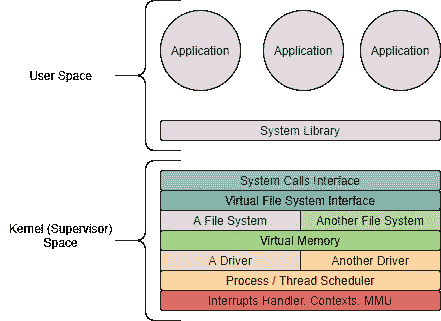
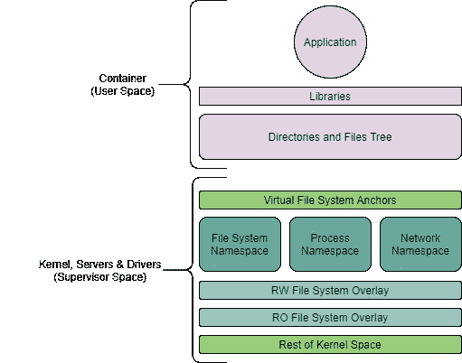
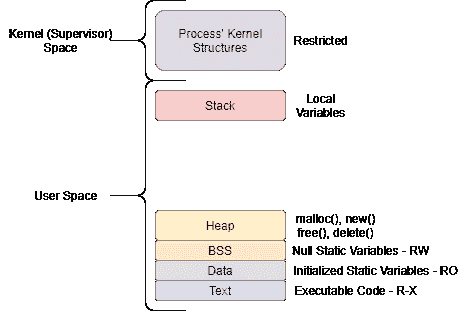
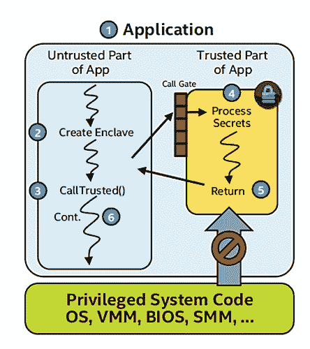
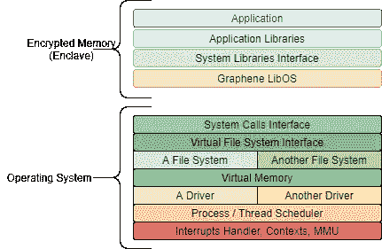

# 利用 SGX 加密您的应用内存

> 原文：<https://medium.com/globant/encrypting-your-application-memory-with-intel-sgx-8796de2afc5c?source=collection_archive---------1----------------------->

> 你能控制你的物联网设备吗？你对他们的安全投资了吗？还是他们会反对你？

*Image source: Le musée du Bastion Jean Cocteau (Menton, France)*

# 介绍

在本文中，我们将讨论由英特尔开发的名为软件保护扩展(SGX)的技术，操作系统如何发展以减少权限提升问题，英特尔 SGX 有哪些记录在案的潜在漏洞，以及如何使用库操作系统将您的应用移植到英特尔 SGX。

# 软件保护扩展

英特尔在 2015 年推出了第六代 CPU 架构中的[软件防护扩展](https://www.intel.com/content/www/us/en/architecture-and-technology/software-guard-extensions.html) CPU 指令代码，称为 [Skylake](https://software.intel.com/sites/default/files/managed/c5/9a/The-Compute-Architecture-of-Intel-Processor-Graphics-Gen9-v1d0.pdf) 微架构。这些指令代码提供了用户空间应用程序或操作系统定义私有和加密内存区域(RAM)的能力。这些私有内存区域不能被任何其他用户空间进程或特权级进程读取，比如内核空间线程。

CPU 负责加密这些内存区域，并在必须读取该内存区域时在同一个 CPU 内核中动态解密，从而保护被检查的进程代码。

这项英特尔 SGX 技术并不独特，因为 AMD 推出了一项名为[安全加密虚拟化](https://developer.amd.com/sev/) (SEV)的类似技术，该技术为分配给虚拟机的所有内存提供加密，避免虚拟机管理程序读取这些内存区域。

目前，对于云基础设施工作负载，微软 Azure 提供了一个名为[机密计算](https://azure.microsoft.com/en-us/solutions/confidential-compute/)的产品，使应用程序 SGX 可以在这个资源上运行。

# 用例

SGX 可用于多种用例，例如:

*   **密钥管理**:加密存储区可用于帮助管理加密密钥，并提供类似于硬件安全模块的功能。
*   **区块链**:它有助于提高交易处理、共识和智能合同的隐私性和安全性。
*   **安全隔离**:为敏感数据的多方计算提供额外的私密性。
*   **边缘计算**:帮助保护物联网设备和云基础设施之间的通信。
*   **数字钱包**:它提供了一种帮助确保支付和交易安全的防御手段。
*   **通信和消息传递**:帮助确保发送方和接收方之间的通信安全。

要使用 SGX 并实现一个加密的内存区域，应用程序必须以说 SGX 语的方式编写。要做到这一点，需要理解用户应用程序和操作系统是如何相互作用的。

# 一个关于操作系统的故事…

操作系统已经改进了它们的实现，使它们更加安全，并防止应用程序读取其他应用程序的内存。操作系统在 CPU 指令的帮助下尽力提供经典的保护机制——如果 CPU 架构提供的话。然而，SGX 提供了经典操作系统设计所不能提供的更加增强的安全机制。

## 整体系统

操作系统开发中实现最多的设计之一是单片方法，其中有两个分离:英特尔 x86 架构中第三个保护环中的用户空间；和运行在零保护环中的内核空间或管理程序。

Separation of User Space and Supervisor Space

这种设计方法是实现最多的方法之一，它是为 Linux、FreeBSD 和其他类似 Unix 的操作系统设计的。通过这种实现，操作系统负责将应用程序数据分离到不同的内存区域，并且不允许任何应用程序看到内存中另一个应用程序的内容。当在应用程序或操作系统结构中发现漏洞时，该漏洞可以升级到管理空间，并能够读取内存中的任何数据，访问任何机密。

这个实现中的内存根本没有加密，它只是依赖于标准的特权语义。例如，一个专注于安全性的用户空间应用程序请求为操作系统内核分配特定大小的内存，该应用程序自行加密所请求的内存空间，并最终在不再需要它或应用程序存在时释放它，当该应用程序执行此操作时，可能会有几个竞争条件和可利用阶段，它们可能会读取加密内存的内容。

操作系统已经发展到使用隔离技术为应用程序提供安全性。其中一种技术是轻量级虚拟化，现在正在大量使用。

## 轻量级虚拟化

轻量级虚拟化并不新鲜，但随着 Linux 中的 Docker 引擎的出现，它变得越来越流行。这种实现允许通过使用操作系统内核提供的名称空间将不同的用户空间进程隔离在它们自己的沙箱中。

Separation of Containers and Operating System

在所描述的实现中，鼓励不要重写应用程序来提供预期的自然行为，同时保持与当前操作系统设计的兼容性。这些实施并没有提供 SGX 所提供的更安全的机制。

## 操作系统如何为应用程序提供虚拟内存管理？

几个操作系统为它们的用户空间应用程序提供了相同的虚拟内存管理机制，为它们提供了内存堆栈模型:

Structure of process stack in virtual memory

所有的用户空间应用程序都试图在请求时分配和释放内存(就像 C 语言的应用程序一样，带有传统的 malloc()和 free()函数和相关函数),或者使用垃圾收集器动态分配和释放内存。在内存释放时，在某些情况下，当另一个用户应用程序可以从另一个应用程序读取释放的内存区域时，可能会出现漏洞，甚至在内核空间也会出现这种情况。在修复发现的漏洞时，有多项工作正在进行中，以使操作系统和应用更加安全，但这些修复仅在漏洞发现后应用，没有万无一失的机制来主动减少这些攻击，这正是 SGX 英特尔公司试图解决的问题。

# 英特尔 SGX 是如何工作的？

应用中的 SGX 机制是将执行代码分成两个主要部分:不安全部分和安全部分。

*Image source: Intel*

不安全(不可信)部分和安全(可信)部分之间的交互如下:

1.  应用程序由可信和不可信部分组成。
2.  应用程序运行并创建一个 enclave，该 enclave 位于可信内存中。
3.  可信函数被调用；enclave 内部运行的代码以明文形式查看数据，拒绝外部访问数据。
4.  可信函数处理 enclave 中的数据。
5.  可信函数存在；enclave 数据保留在可信内存中。

enclave 中的数据在内存中加密，并由 CPU 动态解密。内核或管理程序都不能读取 enclave 的内容，因为它们在内存的这个区域是加密的，当请求时在 CPU 中是不加密的。

## 你怎么能信任一个支持 SGX 的应用程序呢？

SGX 设计为只有 enclave 受处理器信任，其他不受处理器信任，因此操作系统、Enclave 之外的应用和虚拟机管理程序被视为敌对，因此它们无法执行任何 CPU 指令来解密 Enclave 并查看其内容。但是，你怎么能相信一个实际上将秘密存储在飞地中的应用程序呢？这就是证明机制发挥作用的地方。

[证明](https://software.intel.com/content/www/us/en/develop/topics/software-guard-extensions/attestation-services.html)功能是一种在 Enclave 之间提供安全通信(本地证明)或提供信任链以验证 Enclave 已验证且未被篡改(远程证明)的方式。当 enclave 初始化时，它可以向服务器发送报告，服务器可以验证该报告是否由 SGX 指令集生成，从而建立信任链。供应商可以请求将英特尔添加到认证实施列表中，这样用户就可以完全确认相关软件没有被恶意软件篡改。

# 我可以在 SGX 飞地运行我最喜欢的应用程序吗？

简短的回答是否定的，长的回答是“视情况而定”。为了将应用程序移植到 SGX，如果技术上可行的话，必须在应用程序的源代码中重写几个部分。这些部件必须与英特尔的 SGX 软件开发套件相连接才能运行。许多流行的服务应用与 SGX 完全不兼容，因为它们是在 SGX 存在之前设计的，所以它们有自己的安全实现，所以移植它们将需要大量的重新设计工作。

这就是一个库操作系统能帮上忙的地方。

## 石墨烯 SGX 库操作系统

库操作系统是一种软件，它提供一个经典操作系统所提供的所有服务的抽象，例如库形式的系统调用接口或网络堆栈，一个用户空间应用程序可以将它们链接起来，以提供可以作为一个二进制文件部署的操作系统映像。

使用石墨烯 SGX 库操作系统，应用程序在编译时与其链接，然后加载平台适配层，该适配层负责 Enclave 初始化，以在其中运行整个应用程序。

Separation of process inside an SGX Enclave and Operating System

石墨烯 LibOS 具有以下优势:

*   它允许在 SGX 飞地内运行几乎任何应用程序，无需修改
*   系统调用在 Enclave 内部实现
*   增强可信计算基础

# 那么，英特尔 SGX 真的安全吗？

SGX 在处理器级别提供了一个新的安全层，提高了应用的安全性，但它并不是绝对可靠的。记录了不同的漏洞。

*   **内存腐败攻击**。当发生缓冲区溢出时，调用中的例程返回地址被可执行区域中的例程地址替换，绕过不执行位功能(如果存在),就会发生这种情况。这可以通过在支持 SGX 的程序中启用地址空间布局随机化(ASLR)来解决。
*   **未初始化的内存**。当有一个内存页面尚未被操作系统初始化，允许操作系统在 enclave 中注入数据时，就会发生这种情况。这被称为 SGX 出血，可以通过在内核空间启用[地址空间布局随机化](https://en.wikipedia.org/wiki/Address_space_layout_randomization) (ASLR)来解决。
*   **页表攻击**。当操作页表时会发生这种情况，因此会观察到页面访问模式。这可以通过在编译时改进 SGX 的可信执行环境来解决。
*   **缓存攻击**。当试图访问处理器中的缓存和非缓存数据时会发生这种情况。由于飞地与其他进程共享处理器缓存，该漏洞是由 SGX 设计的，因此没有关于它的修正，尽管这种攻击很难完成。
*   **分支阴影**。利用易受攻击的 SGX SDK，编译的应用程序具有暴露 Enclave 外部数据的影子代码。这可以通过更新 SGX SDK 和更新英特尔微码来解决。
*   **排锤攻击**。故障 DRAM 模块会发生这种情况，影响 enclave 所在的内存，然后阻塞处理器。这可以通过更新 DRAM 模块硬件来解决。

# 你的电话！

如上所述，SGX 在硬件层面提供安全解决方案，以提供可信计算基础。和所有基于硬件的技术一样，它给软件开发带来了一些新的挑战。幸运的是，有像石墨烯 SGX 操作系统库这样的解决方案可以帮助简化软件移植到这项技术。重要的是要记住，SGX 有一些记录在案的漏洞，因此拥有一个基于安全第一的良好软件开发实践可以帮助减少漏洞，即使最终您决定完全不使用 SGX 而采用另一种方法。

# 参考

这些都是用来写这篇文章的参考资料，按已知的安全攻击和技术分类。

## 攻击和漏洞

与英特尔 SGX 相关的上述安全漏洞的链接

[https://github.com/jaebaek/SGX-Shield](https://github.com/jaebaek/SGX-Shield)
[https://arxiv.org/pdf/1710.09061.pdf](https://arxiv.org/pdf/1710.09061.pdf)
[https://github.com/sslab-gatech/t-sgx](https://github.com/sslab-gatech/t-sgx)
[https://dl.acm.org/doi/10.1145/3065913.3065915](https://dl.acm.org/doi/10.1145/3065913.3065915)
[https://www . usenix . org/system/files/conference/usenix security 17/sec 17-lee-sangho . pdf](https://www.usenix.org/system/files/conference/usenixsecurity17/sec17-lee-sangho.pdf)
[https://taesoo.kim/pubs/2017/jang:sgx-bomb-slides.pdf](https://taesoo.kim/pubs/2017/jang:sgx-bomb-slides.pdf)

## 制品

[https://software . Intel . com/content/www/us/en/develop/topics/software-guard-extensions . html](https://software.intel.com/content/www/us/en/develop/topics/software-guard-extensions.html)

格洛邦特