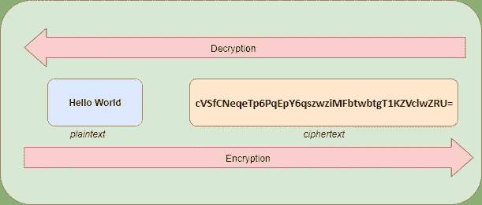
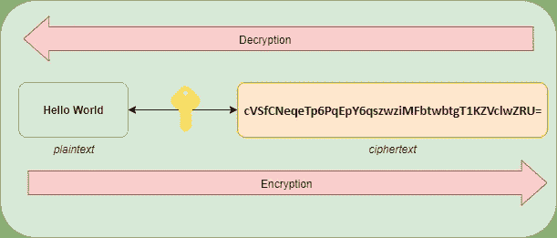
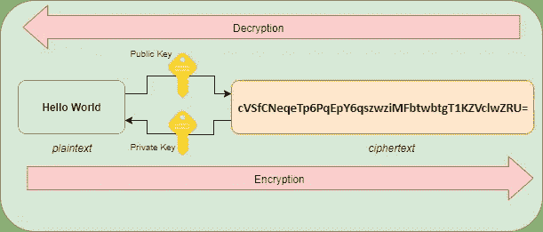

# 探索云中的加密

> 原文：<https://medium.com/version-1/encryption-in-the-cloud-7728db83af56?source=collection_archive---------1----------------------->

安全性是每个 IT 项目中的一个基本考虑因素。有一些技术、习惯和加密级别可以针对超出合理风险程度的攻击提供保护。

**那么，为什么组织如此担心云中的安全性呢？**

本文旨在提供云中加密的基本指南和概述，探索关键概念以及如何确保数据安全。

# 理解云中加密的关键概念

最简单的形式是，加密是使信息不可读的行为，从而防止对内容的未经授权的访问。它用于确保数据安全，防止数据被泄露。

加密可用于静态数据(以数字形式永久存储的数据，如对象存储或数据库)，也可用于传输中的数据(通过私有或公共网络传输的数据)。

使用加密时，需要理解一些概念:

● **解密**是加密的逆过程。它读取加密文本，并利用加密密钥将其转换为可读文本

● **密码术**是保护静止或传输中的信息通信的实践。加密和解密是密码学的组成部分

● **明文**是人类可读的文本，但不涉及任何加密过程

● **明文**是正常的可读信息，如“hello world”。这些数据可以很容易地被人类读取或被技术处理。明文是指加密或解密过程之前或之后的信息

● **密文**是加密过程的结果文本。它以加密的形式存在，人类无法阅读

● **加密密钥**是用于将明文数据转换成密文的随机字符串。它们是用加密或解密文本的算法(密码)创建的

*How plaintext is converted into ciphertext during the encryption process and how the reverse process of decryption transforms ciphertext into plaintext.*

# 让加密发挥作用

有两种主要的加密类型:对称和非对称。

对称加密，如 AES、DES、RC 和 Blowfish，使用一个加密密钥来加密和解密信息。对称密钥通常用于静态数据。

使用对称加密的优点是快速和简单。

Symmetric encryption. A single key is used to encrypt and decrypt information.

相反，对于非对称密钥或“公钥加密”(通常用于传输中的数据)，公钥用于加密信息，私钥用于解密。这自然增加了任何希望破坏系统的人的复杂性。

非对称加密技术的一些常见示例是 RSA 和 DSA。可以使用 ssh-keygen 或 PuTTYgen 等工具创建密钥对。

Asymmetric encryption. A public key can be used to encrypt information while a private key can be used to decrypt the information.

为了增加另一层安全性，可以利用信封加密来避免明文中的密钥。这是使用主密钥或密钥加密密钥(KEK)加密数据密钥的过程，使得数据密钥本身难以泄露。

# 管理加密密钥

加密密钥生命周期流程应通过使用(定期更新的)加密密钥来实施。

美国国家标准与技术研究所(NIST)将加密密钥有效的时间称为“加密期”。

NIST 有一个推荐的加密密钥生命周期策略，其中包含密钥可以存在的状态列表。它描述了每个关键状态的用途，以及在其生命周期中允许的从当前状态到关键状态的转换。

**定义的阶段有:**

● **预激活** —密钥已经创建，并且不用于加密

● **激活** —密钥有效，用于加密以保护信息

● **暂停** —该键未激活，可能正用于事件调查。它可以恢复到活动、受损或停用状态

● **停用** —密钥不能用于加密。它可能仍然需要，因此可以恢复到活动状态

● **泄露** —密钥被认为可通过未授权访问获得，不能用于加密

● **销毁** —钥匙已经销毁，不再需要。该项的审计记录和一些元数据可能仍然存在

云安全联盟(CSA)指出，有 4 种管理密钥的主要方式:

● **虚拟应用/软件** —设备或软件密钥管理器

● **云提供商服务** —云提供商提供的 KMS

●**HSM/设备** —一个物理安全模块，可以在内部部署，也可以在云中部署

● **混合**——其他选项的组合，例如使用 HSM 和基于软件的 KMS

密钥轮换可以通过使用云提供商或第三方提供的密钥管理服务(KMS)来实现。它们能够自动或手动转换密钥状态，并生成新的加密密钥。

# 云中的 KMS

云 KMS 为不想管理底层密钥管理硬件和基础设施的云用户提供了许多功能。KMS 的优势如下所示:

● **可用性** —利用云提供商平台确保关键基础设施高度可用。密钥缓存可用于改善延迟

● **客户密钥** —允许云用户创建和管理他们自己的密钥，因此，提供了执行用户需求的灵活性

● **集成** —与云提供商服务集成，简化加密密钥在任何平台即服务(PaaS)资源中的使用

使用云 KMS 会有一些限制，比如密钥请求的大小和数量。可能还有一些主密钥出口限制。一些限制可以通过在数据传输到云中之前在本地加密数据以及自行管理加密密钥生命周期的某些方面来克服。

一个**云访问安全代理(CASB)是**一个位于云用户和云提供商或云应用之间的服务。他们可以提供多种安全服务，例如监控、警报和安全策略实施。

CASBs 提供加密管理服务，并与 KMS 或 HSM 集成。CASB 管理服务在多环境架构中非常有用，它提供了单一的信息视图。

# 要加密的数据

尽可能对所有数据进行加密是至关重要的，这可以确保对关键信息应用一个强大的安全层。有两种主要的加密类型，对称和非对称。使用的加密类型必须根据信息评估和需要保护的信息的用途来决定。

云中有许多服务可以用来支持加密和密钥管理。它们具有密钥访问、生命周期管理、缓存和可用性等优势。许多提供硬件安全模块的使用，这可能是法规要求。

启用加密可以像在 web 控制台中检查标记一样简单。但是，组织的加密策略应该在收集了规划、管理和要求之后形成。

随着组织的发展，多云服务的使用往往会随之增长，这增加了其架构的攻击范围和加密密钥被泄露的可能性。如果你真的非常重视客户在云中的安全性，那么在提供任何保证之前，你必须了解一些基础知识。

**关于作者**

*Sat Gainda 是* [***版本 1***](https://www.version1.com/) ***、*** *的云解决方案架构师，致力于利用创新云系统的企业级项目。敬请关注中版 1，了解更多来自 Sat 的* [*云贴子*](https://www.version1.com/introduction-to-serverless/) *。*