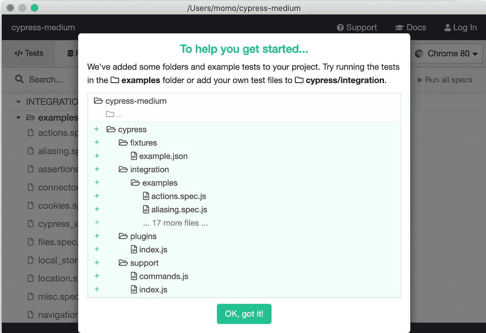
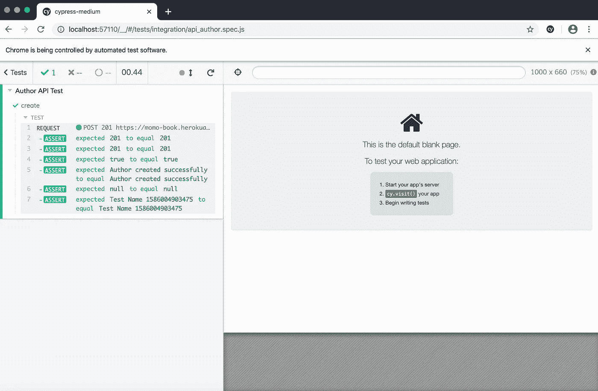
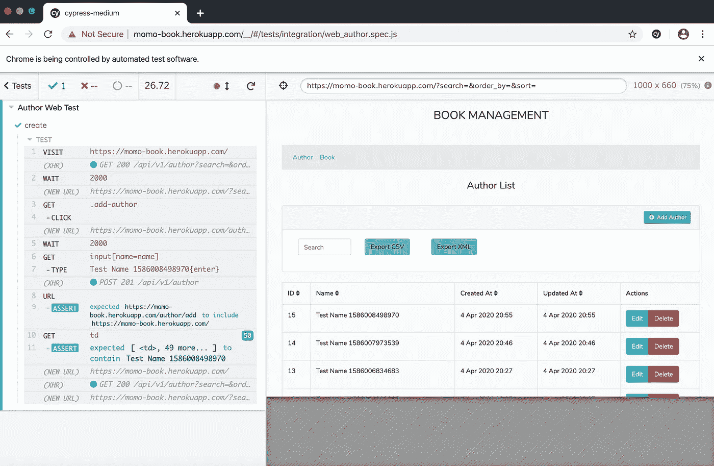

# 使用 Cypress 对 API+Web 进行端到端(E2)测试

> 原文：<https://medium.easyread.co/end-to-end-e2-testing-api-web-with-cypress-95b57f4fa921?source=collection_archive---------0----------------------->


Photo by [pixabay.com](https://pixabay.com/photos/typing-computer-desk-hoe-office-849806/)

大家好！仍然与我再次见面分享一些经验，尽管或关于软件工程领域相关技术的意见。今天，我将分享我使用 Cypress for API & Web 进行自动化端到端(E2E)测试的经验。

不久前，我们的前端工程师 guy ( [Budi Prakosa](https://medium.com/u/b3ee13e6c83d?source=post_page-----95b57f4fa921--------------------------------) )对他的 web 应用程序特性进行了自动化测试。他是一个非常独特的人，喜欢研究任何事情，这就是为什么我的朋友们称他为教授，哈哈！(抱歉 Iyok！).

我开始对他带给我们的想法感兴趣，并想知道更多关于这方面的事情。框架是柏树！它是基于 Javascript 的！你可以在[https://www.cypress.io/](https://www.cypress.io/)找到官方页面

在了解了 Cypress 之后，我意识到我们也可以用它来做 E2E 测试 API！有趣的是，我们可以对我们做的每个测试案例进行录像。太牛逼了！因为我们的 QA 团队有时会对每个测试用例进行视频录制来证明结果。而重要的事情是赛普勒斯的代码容易理解。

好的，让我们开始技术部分。我将展示一些 Cypress 代码来做 API 和 Web 测试。从 Cypress page 来看，它们支持多个操作系统，请确保您使用了以下最低要求:

*   **macOS** 10.9 及以上*(仅限 64 位)*
*   **Linux** Ubuntu 12.04 及以上，Fedora 21 和 Debian 8 *(仅限 64 位)*
*   **Windows** 7 及以上版本

如果使用`npm`安装 Cypress，他们支持:

*   Node.js 8 及以上版本

在您通过了这些需求之后，让我们开始构建项目:

```
cd /your/project/path
npm install cypress --save-dev
```

尝试使用以下命令打开 cypress UI:

```
./node_modules/.bin/cypress open
```



Picture 1 Cypress UI

如果你得到和上图一样的输出，这意味着你成功地创建了 Cypress 项目。有一些默认的测试用例，你可以运行所有的规范或者点击其中一个测试用例来查看 Cypress 是如何工作的。默认情况下，我们应该将测试用例放在集成文件夹中。它位于:

```
/your/project/path/cypress/integration
```

您可以更改测试用例的位置，但是您应该在您的根项目`cypress.json`中创建 JSON 文件，该文件包含以下配置:

```
{
    "integrationFolder": "your/custom/path"
}
```

但是在这种情况下，让我们在默认路径上进行！

我们将在这个测试用例中使用我的简单 API。swagger 文档可以在以下网址找到:[https://momo-book.herokuapp.com/api/documentation](https://momo-book.herokuapp.com/api/documentation)

用于创建数据的 Author API 似乎适合这一部分。为名为`api_author.spec.js`的例子创建测试用例文件，代码如下:

听起来简单易读，对吧？我们将设法破译密码。 ***形容*** 一开始就被批为节度使。并且， ***它*** 将是我们的测试用例，我们可以为测试用例命名。对于这个例子，我们为 author 编写了一个成功创建的数据。 ***Const，*** 如果你正在使用 Javascript，也许你已经熟悉了这种类型。它只是用来定义变量的值。最后，我们用 ***cy.request*** 进行 API 调用，填充方法、URL、主体、头，并断言您期望的结果。Cypress 已经封装了 expect 函数，用于将结果与您的期望相匹配。你可以在他们的官方页面上看到详细的功能。然后，您可以尝试重新运行 UI，并尝试测试您的测试用例。结果将如下面的图 2 所示。



Picture 2 Cypress API Test

接下来，我们将尝试测试 Web！我们将从这个 URL[https://momo-book.herokuapp.com/](https://momo-book.herokuapp.com/)使用我的简单 CRUD web 应用程序，并尝试作者创建数据表单！

用 Cypress 代码为名为`web_author.spec.js`的例子创建测试用例文件，如下所示:

类似于前面的解释，让我们来分解不同的功能。因为这是网络测试，我们把用户访问网络应用时的行为。我们应该了解流程是如何工作的。

在这个作者案例中，首先我们应该打开列表页面，单击 add 按钮，填写表单，提交数据，然后我们将被重定向到列表。因此，上面的 Cypress 代码表示数据流，如访问、等待、点击获取、类型获取、url 包含和包含获取。

如果您运行测试用例，结果将如下面的图 3 所示。



Picture 3 Cypress Web Test

最后，我们完成了 API 和 Web 测试！你可以自己尝试其他场景。啊，为了录制视频，您只需用以下命令运行 cypress:

```
./node_modules/.bin/cypress run
```

你可以自动在这个路径上找到视频:

```
/your/project/path/cypress/videos
```

厉害吧！！？？下面是我的 github 知识库中所有 API 和 Web 的测试案例，你可以查看细节！

[](https://github.com/moemoe89/e2e-cypress) [## moe moe 89/e2e-赛普拉斯

### E2E 测试赛普拉斯有趣的项目(API 和网络)。使用我的简单图书管理应用程序的 API 和 Web 演示…

github.com](https://github.com/moemoe89/e2e-cypress) 

希望你喜欢它，我很高兴如果这篇文章对你有用！自动化测试快乐！

谢谢大家！