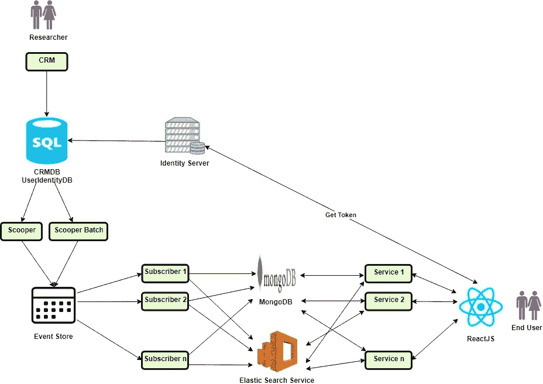

# 端到端测试自动化— SQL Server、事件存储、MongoDB、ElasticSearch、React

> 原文：<https://medium.com/quick-code/end-to-end-test-automation-d6608d26154d?source=collection_archive---------0----------------------->

Clicked in my society in Pune, Maharashtra, India

一个想法是用下面的组件为产品建立端到端的测试自动化。

**组件**--

1.CRM——研究人员输入数据。

2.Microsoft SQL Server — 2 个数据库

a.CRMDB

b.用户标识数据库

3.Scooper —从 CRMDB 获取数据并放入事件存储的组件

4.订阅者——监听事件存储的组件，它从事件存储中获取数据并将其推送到 MongoDB 和弹性搜索中

5.中间层——从 MongoDB 和弹性搜索中提取数据并以 Rest apis 的形式发送到前端的服务。

6.前端——研究人员输入的要显示的数据。

**Architecture**

**建筑**—

1.研究人员将数据输入客户关系管理系统。

2.因此，数据存储在 Microsoft SQL Server 数据库— CRMDB 中

3.在步骤 2 中提到的 CRMDB 中创建专用表，其中在 CRMDB 的原始模式中输入的数据以事件源的格式存储。

4.Scooper / Batch Scooper 在步骤 3 中从 CRMDB 的专用表中提取数据，并将其推送到事件存储。

5.订阅者从事件存储中获取数据，并将其推送到 MongoDB 和 Elastic Search。

6.另一方面，有一个面向服务的架构，其中每个服务从弹性搜索中获取数据，并以 Rest apis 的形式将数据提供给前端。

7.前端是一个单页面应用程序，它使用 Rest apis 发送的数据并呈现页面。

8.有一个专用的身份服务器，它管理用户作为订阅的一部分可以访问的所有应用程序的用户身份。保存与用户身份相关的详细信息的数据库存在于步骤 2 中提到的 Microsoft SQL Server 数据库中。

**技术栈**—

1.独家新闻/订户/服务-。网络核心

2.活动商店—[https://eventstore.org/](https://eventstore.org/)

3.MongoDB—[https://www.mongodb.com/](https://www.mongodb.com/)

4.弹性搜索—[https://www.elastic.co/](https://www.elastic.co/)

5.https://reactjs.org/

6.亚马逊 EC2—[https://aws.amazon.com/ec2/](https://aws.amazon.com/ec2/)

7.团队城市—[https://www.jetbrains.com/teamcity/](https://www.jetbrains.com/teamcity/)

**功能测试挑战**—

1.验证数据完整性，即在 CRM 中输入的数据正确地保存在弹性搜索和 MongoDB 中。

2.验证弹性搜索& MongoDB 中的数据是否正确显示在前端。

**端到端测试自动化**—

**先决条件**—

从 CRMDB 中的表导出行，其中数据以事件源格式存储在 Sql 文件中。

**自动化工作流程**--

1.从 CRMDB 中的表中删除现有行，其中数据以事件源格式存储。

2.从事件存储中删除事件。

3.清除 MongoDB 和弹性搜索。

4.将最新的模式应用于 CRMDB 和更新的存储过程。

5.将先决条件中的 Sql 文件(步骤 1)插入 CRMDB 的表中，其中数据以事件源格式存储。

6.当事件开始流经事件存储库时，验证是否没有任何事件进入事件存储库的暂停队列。

7.验证事件存储中是否没有正在进行的事件。

8.等到 CRMDB 中表的所有行(其中数据以事件源格式存储)和事件存储中的事件都为 0 时。

9.触发测试用例的执行。

**测试**–

***数据完整性测试*** —这些测试验证 CRMDB 中以事件源格式存储数据的表中的数据是否已通过中间组件 Scooper、事件存储和订户，并已到达 MongoDB 和 Elastic Search。

***Api 测试*** —这些测试验证 Api 端点是否以前端预期的格式发送数据。

***UI 测试*** —这些测试是验证业务用例的功能测试。

**自动化技术栈**

***Api 自动化***--

a.[https://mochajs.org/](https://mochajs.org/)

b.[https://www.npmjs.com/package/supertest](https://www.npmjs.com/package/supertest)

***UI 自动化***—

a.[https://jasmine.github.io/index.html](https://jasmine.github.io/index.html)

b.[https://www.protractortest.org/#/](https://www.protractortest.org/#/)