# 使用 Lint 在 Android 上实施最佳实践

> 原文：<https://medium.com/capital-one-tech/enforcing-best-practices-on-android-with-lint-f9931cd23b28?source=collection_archive---------5----------------------->

## 通过构建时实施推动开发人员开发更好的代码

似乎每年 Android 最佳实践的前景都会发生巨大的变化，我们的代码也趋向于跟随这种趋势。然而，每次改变都会留下大量代码，你可能会称之为*“旧的做事方式”*，或者更糟糕的是，*“****糟糕的*** *做事方式。”毫无疑问，在某些情况下，继续用老方法做事的诱惑会出现；作为人类，我们倾向于选择阻力最小的道路，坚持我们已经知道的东西，而不是学习新的东西。*

那么我们如何鼓励开发者以正确的方式做事呢？至少，我们如何 ***防止*** 开发者以错误的方式做事？您可能会建议简单地废弃我们不再使用的组件或类，这使得在 IDE 中使用它没有吸引力。

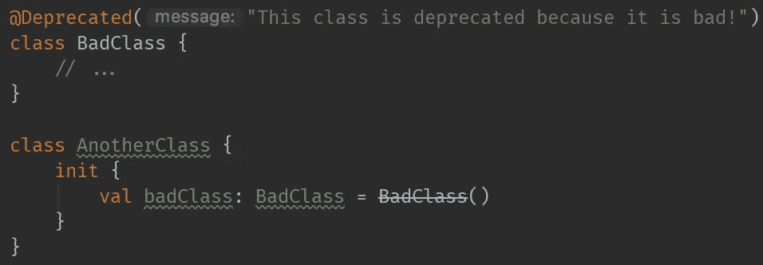

这种方法的问题在于它不是由编译器强制执行的。如果我不在乎它用起来难看，如果我的代码评审员也不在乎(或者如果他们只是错过了评审中的反对意见)，那么新的和不良的代码将被交付到产品中。即使有一种方法可以禁止这种行为，我也只想阻止被否决的代码在新的 T21 代码中使用，而不是旧的代码。你可以在这里看到关于为什么这不是一个好主意的讨论。

[Android Lint](https://developer.android.com/studio/write/lint) 帮助我们解决了上述所有这些令人头疼的问题，因为它配备了扫描您的代码并针对您的代码报告自定义错误(或警告)的能力，同时还能够升级、降级、忽略和基准**针对您的代码报告的问题。**

为了更清楚地理解这一点，我们将举一个简单的例子，这个例子的灵感来自我在 Capital One 为我们的 Android 旗舰应用程序代码库编写的一条规则。这条规则禁止在`AndroidManifest.xml`中的`activity`元素上使用`[configChanges](https://developer.android.com/guide/topics/manifest/activity-element#config)`属性。为什么？这个属性可能会被错误地使用，以避免处理活动中的配置更改，这可能会导致糟糕的用户体验。因为事后修复这个问题通常是很重要的，所以我们希望在团队解决这些问题之前，防止将来再出现这种情况，同时保留现有的使用。

值得注意的是，这个用例在没有 lint 的情况下比上面介绍的用例更难解决，因为我们不拥有`android:configChanges`属性，所以不支持弃用。

## 编写规则:阻止 ActivityRestart

*意图:不鼓励使用* `AndroidManifest.xml` *中的* `android:configChanges` *属性，并强制开发者以“正确”的方式处理配置变更。*

***有一个 Github 存储库，可以在这里找到*******，它包含了我们将在下面编写的规则的所有代码。****

*为了设置场景，下面是我们希望禁止的代码:*

*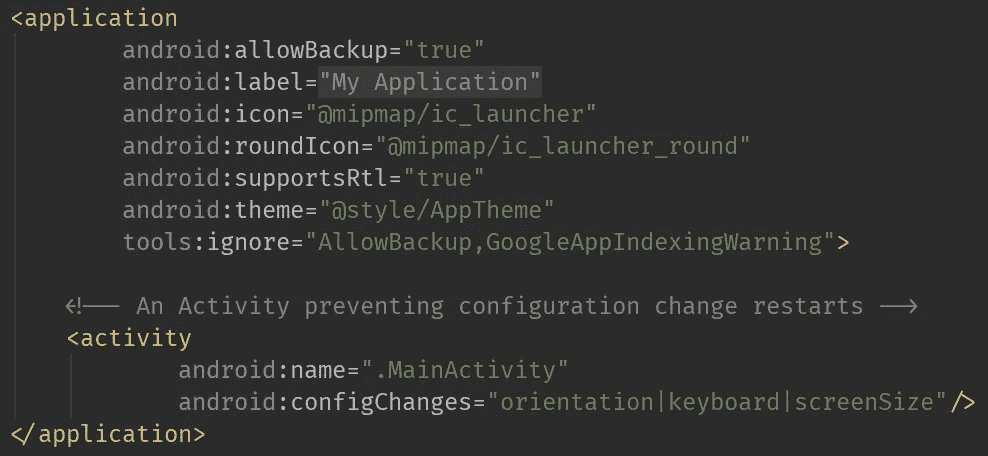*

*当开发人员向清单中添加具有该属性的类时，我们会向他们显示一个错误，并解释为什么不鼓励这种做法，以及他们应该做些什么来解决这个问题。*

*让我们从将下面的依赖项添加到一个新的 java 库模块开始(不过我们将使用 [Kotlin](https://kotlinlang.org/) 🎉)所以我们可以使用 lint APIs。请注意关于 lint 依赖项版本的注释。*

*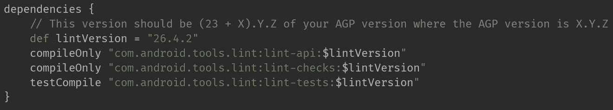*

*为了编写 lint 规则，我们需要编写一些代码:*

*   ***检测器:**这就是“检查”违反我们规则的地方。lint 扫描项目时会调用`Detector`中的方法。我们称我们的为`PreventingActivityRestartDetector`。*
*   *这是我们要检查的`Issue`。在我们的例子中，我们的`Issue`将被称为`PreventingActivityRestart`，并在使用`android:configChanges`属性的`AndroidManifest.xml`中的`activity`元素上被报告。*
*   ***IssueRegistry** :这个类为 lint 提供了我们想要扫描项目的`Issue`。在这个例子中，我们将把`PreventingActivityRestart` `Issue`添加到`IssueRegistry`中，告诉 lint 我们想要检查是否违反了那个`Issue`。*

*首先，让我们编写负责报告那个`Issue`的`Detector`。*

*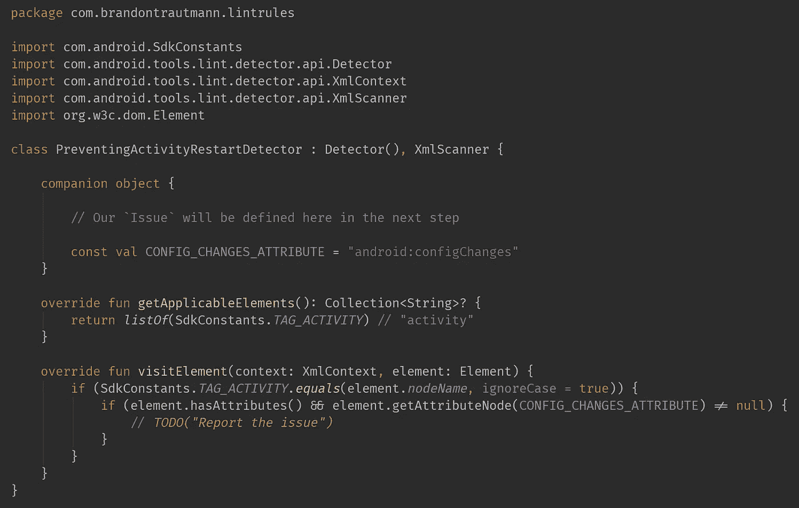*

*我们的`PreventingActivityRestartDetector`从`Detector`扩展而来，这样我们可以将它传递给 lint，并在清单被扫描时得到通知(如何发生将在下面描述)。它还实现了`XmlScanner`，这是一个包含我们需要覆盖的方法的接口，以使我们的`Detector`能够处理 XML 文件。我们从中扩展的`Detector`类是`abstract`，包含了我们将被`XmlScanner`强制实现的功能。因为我们扩展了`Detector`，所以我们可以通过实现适当的方法来挑选我们感兴趣的代码片段。*

*在这种情况下，我们对访问 XML 元素`activity`感兴趣，所以我们从`getApplicableElements()`返回它。当发现具有该名称的`element`时，我们希望得到通知，这样我们就可以做些什么，所以我们覆盖了`visitElement()`。在该方法中，我们将决定是否要报告`Issue`(定义如下)。在这种情况下，我们总是会这样做，但是在更复杂的规则中，如果周围的来源根据您的业务逻辑表明您不应该这样做，您可以决定不这样做。*

*接下来，让我们写出我们要报告的`Issue`:*

*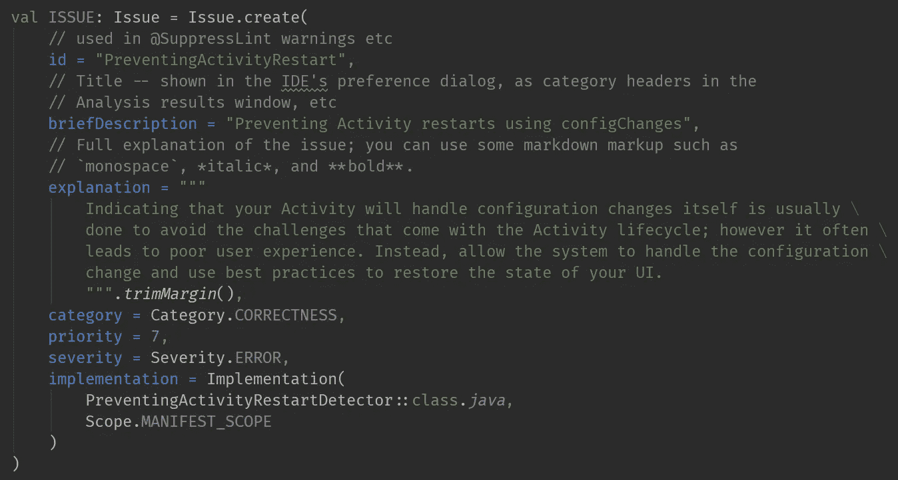*

*`Issue`上的大多数字段都是不言自明的。在大多数情况下，只要看一下字段类型的源代码，就可以澄清您可能有的任何问题。*

*也就是说，我不爱的领域之一是`Priority`。范围是 1-10，这就留下了一个非常宽的任意取值范围。这个字段实际上只在处理 lint 基线时使用(您可以生成一个文件来告诉 lint 忽略现有的问题，这对从头开始很有用)，所以问自己的最好问题是:*“当我有时间清理现有的问题时，这个* `Issue` *有多重要？”**

*正确处理的一个关键字段是`Implementation`字段，因为它包含`Detector`的`Class`和`Scope`。lint 使用那个`Scope`将你的`Detector`应用到你的项目中的某些类型的文件，如果你做得不对，你的`Detector`上的`visitX()`方法将永远不会被调用。如果您在调试测试时看到这种行为，请仔细检查您的`Scope`！对于我们的自定义规则，我们使用`Scope.MANIFEST_SCOPE`，根据`Scope`源代码，它是一个:*

> **用于仅受清单影响的探测器的范围设置**

*换句话说，使用这个`Scope`确保我们的`Detector`能够访问项目中的`manifest`文件。*

*既然已经定义了`Issue`，我们可以在`visitElement()`中报告它*

*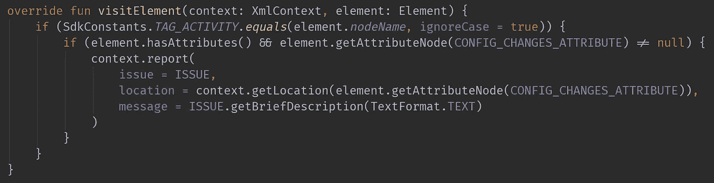*

*您可能注意到`report()`方法接受了一个`message`，我选择简单地重用了`Issue`的简要描述字段。在查看了与 [Android Gradle 插件](http://www.androiddocs.com/tools/building/plugin-for-gradle.html)一起发布的内置规则的源代码后，似乎这个`message`字段是一个很好的地方，可以传达特定于您所报告的违规实例的信息。当`Issue`可以以多种方式出现时，这很有帮助。*

*我们的`Issue`非常简单，所以我选择重复使用我们的通用消息。*

*最后，我们把我们的`Issue`加到一个`IssueRegistry`上。*

*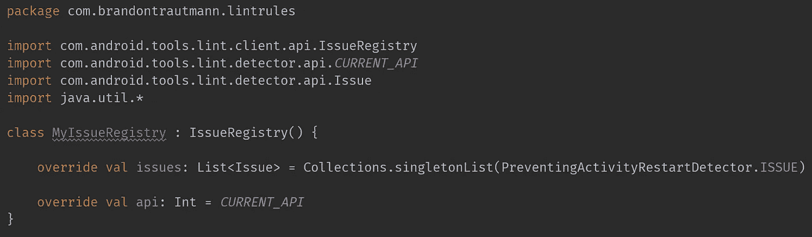*

*`IssueRegistry`是 lint 将获取我们的自定义规则的地方。我们不会在代码中使用这个类，但是在下面的`build.gradle`中定义`jar`任务时，我们会使用这个类的限定路径。*

*通过在这里覆盖`api` `val`并返回`CURRENT_API`，我们表明我们的规则已经在当前的 lint API 上测试过了。*

*在我们确信我们的规则有效之前，我们需要测试它。测试 lint 规则完全按照您想象的方式进行。我们编写违反规则的代码，并断言我们期望 lint 报告的警告。*

*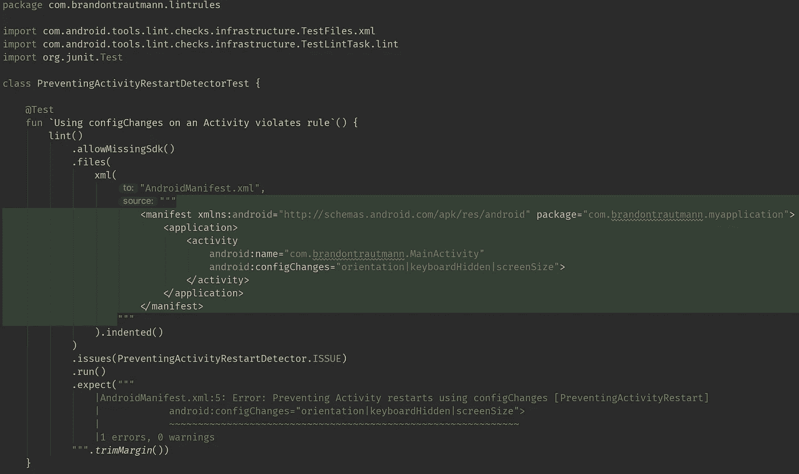*

*Pro tip: Use the indented() method on your TestFile for syntax highlighting.*

*为了确保 lint 规则的可靠性，我们还需要确保测试负面和边缘情况。*

## *发布规则*

*为了让我们的新规则成为 lint 分析的一部分，我们需要将它发布到 lint.jar，在运行`lint`任务时使用它。*

*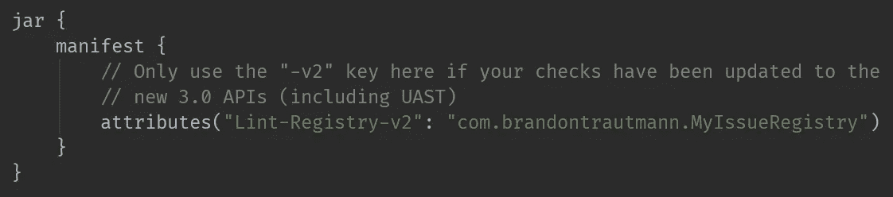*

**注意，这只是 lint 规则模块* `build.gradle` *的一个片段，其余的* `build.gradle` *都在上面链接的 Github 资源库中。**

## *导入规则*

*我们的规则现在起作用了(我们确信这一点，因为我们进行了测试！)，所以还是让它进入项目吧。有几种方法可以做到这一点，但我建议将 lint 规则放在一个模块中，与代码库中的其他模块放在一起。*

*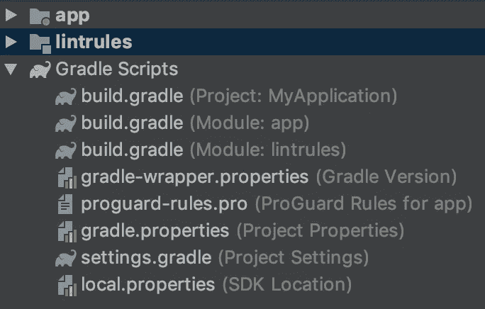*

**Project structure with lint rules in their own module**

*有了这个设置，我们可以简单地构建 lint 规则模块，并使用`lintChecks`配置来指示我们希望在哪里应用规则。*

*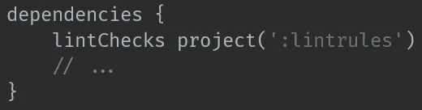*

*为了确保我们的新规则被实际使用，我们可以运行`./gradlew -q app:dependencies --configuration lintChecks`并确保`lintChecks`配置包含我们的定制 lint 规则。*

*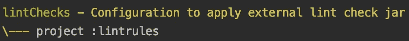*

*这表明 lint 正在使用我们的项目来分析声明该配置的模块。为了更直观地证明我们编写的规则正在通过`IssueRegistry`发布，我们可以使用像 [JD-GUI](https://github.com/java-decompiler/jd-gui) 这样的工具反编译在`/app/build/intermediates/lint_jar/global/prepareLintJar`找到的 lint.jar。我们应该看到我们的`IssueRegistry`包含了我们添加的规则。*

## *实施最佳实践*

*既然我们的规则已经被编写、发布和导入，我们需要修复所有违反规则**或**的情况，为规则创建一个基线。Lint 将忽略基线中的违规，直到我们有时间解决它们。这很容易通过在我们的`build.gradle`的`lintOptions`块中定义一个基线文件来完成。*

*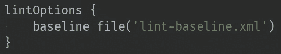*

*下一次 lint 运行时，它将为我们创建这个基线文件，并且该次运行的所有违规都将被放入该文件中。*

**注意基线的创建将导致一个失败的构建，以确保基线不是意外创建的(否则您将会无意中忽略违规)。**

*创建基线后，lint 将使用该文件来避免报告基线化的`Issue`。如果我们*仅*想要基线化我们的定制规则，我们可以在创建基线之前将`check "PreventingActivityRestart"`添加到`lintOptions`块中。Lint 将只寻找那个特定的`Issue`，并将违反它的情况放入基线中。但是我们需要记住在创建初始基线后删除那一行，否则 lint 只会检查那个`Issue`。*

*希望这篇文章能给你信心，让你开始自己的定制 lint 规则之旅，走向更卫生的代码！*

**披露声明:2019 首创一。观点是作者个人的观点。除非本帖中另有说明，否则 Capital One 不隶属于所提及的任何公司，也不被这些公司认可。使用或展示的所有商标和其他知识产权是其各自所有者的财产。**