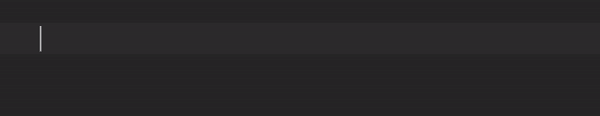
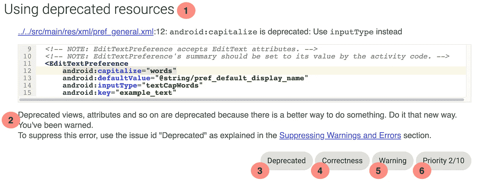
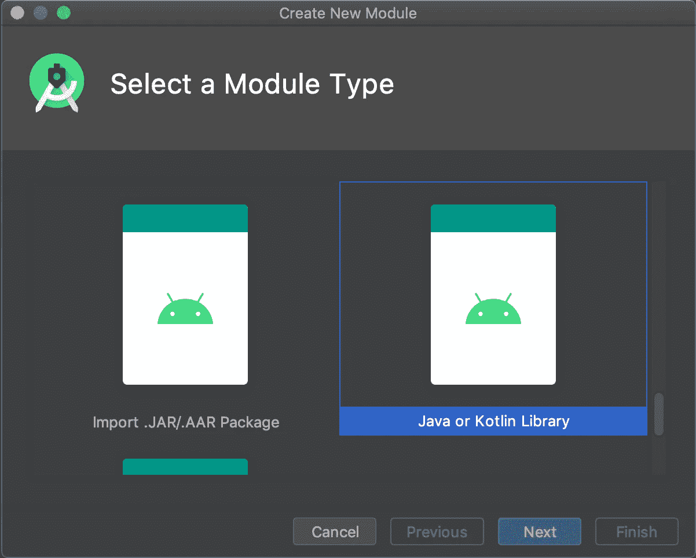

# 用 Lint 执行团队规则👩‍🔧

> 原文：<https://medium.com/google-developer-experts/enforcing-team-rules-with-lint-159b3ba74678?source=collection_archive---------3----------------------->

Photo by [Robin Jonathan Deutsch](https://unsplash.com/@rodeutsch?utm_source=medium&utm_medium=referral) on [Unsplash](https://unsplash.com?utm_source=medium&utm_medium=referral)

几个月前，我的团队达成了一项协议，当在代码中的任何地方留下一个 TODO 时，我们需要始终提供几样东西:

*   应该处理待办事项的人
*   离开待办事项的日期
*   关于需要做什么的评论或解释

但是记忆会褪色，有时人们会忘记。所以我做了一个活模板，让大家更容易坚持规则。一个简单的 ALT+ENTER 和 tada，有 TODO 模板供您填写:

Custom template in action

如果你想知道更多这是如何做到的，我[在这里](https://zarah.dev/2020/03/06/live-templates.html)写了关于实现一个实时模板的文章。

一切似乎都很好，但几个月后我注意到，即使我们有模板，人们偶尔会忘记✨✨填写它。

我们可以不断提醒人们使用模板，但我不想成为那个一遍又一遍说事情的讨厌的人。如果我们把这个团队规则融入到开发人员的工作流程中不是更好吗？因此，我开始思考，为什么不编写一个自定义的 Lint 规则来消除人工干预，让工具完成它的工作呢？

# 一个好主意

Lint 是一个静态分析器，内置的规则非常棒！它们有助于识别我们代码中的常见问题(忘记[调用](https://android.googlesource.com/platform/tools/base/+/studio-master-dev/lint/libs/lint-checks/src/main/java/com/android/tools/lint/checks/CallSuperDetector.kt) `[super()](https://android.googlesource.com/platform/tools/base/+/studio-master-dev/lint/libs/lint-checks/src/main/java/com/android/tools/lint/checks/CallSuperDetector.kt)`)、可能的错误(忘记[约束视图](https://android.googlesource.com/platform/tools/base/+/studio-master-dev/lint/libs/lint-checks/src/main/java/com/android/tools/lint/checks/ConstraintLayoutDetector.kt))或潜在的优化(检测[透支](https://android.googlesource.com/platform/tools/base/+/studio-master-dev/lint/libs/lint-checks/src/main/java/com/android/tools/lint/checks/OverdrawDetector.java))，并给我们机会立即纠正它们。

这些规则是灵活的。我们可以挑选哪些我们想[排除在运行](https://developer.android.com/studio/write/lint#config)之外，我们可以选择[如果出错就让构建失败](https://developer.android.com/studio/write/lint#gradle)，我们甚至可以[确定一个要忽略的特定问题](https://developer.android.com/studio/write/lint#snapshot)。

有很多精彩的演讲概述了 Lint 的历史、理念和特性，特别是来自 KotlinConf 2017 的 Tor Norbye 的[演讲。](https://youtu.be/p8yX5-lPS6o)

Lint 已经存在了一段时间，对编写我们自己的 Lint 检查的支持*也已经存在了一段时间*，所以肯定有一些参考资料，对吗？来自 Droidcon NYC 2017 的 John Rodriguez [做了一个很好的概述，来自 Android Dev Summit 2019](https://www.droidcon.com/media-detail?video=329360652) 的 Alan Viverette 和 Rahul Ravikumar [做了一个很有启发性的演讲。](https://www.youtube.com/watch?v=jCmJWOkjbM0&vl=en)

他们让这看起来很容易。**肯定** *我*能做这个。💃

# 最糟糕的主意

事实证明这很容易……如果你知道自己在做什么的话。哦，妈妈，我不知道我在做什么。

安卓工具网站看起来被遗弃了🙈。示例规则是基本的，但是除了帮助我弄清楚如何设置之外，它并没有告诉我任何事情。

但是 Zarah，你说，为什么不直接复制平台上的呢？我做了，而且有几百个。要弄清楚先看哪一个是势不可挡的。

我向你保证，如果有人在大约三个月后再让我这样做，我会完全忘记我做了什么或者我是如何做到的(老实说，我仍然不明白它实际上是如何工作的)🤷‍♀).公平的警告:我会不断地喊出我不理解或只是猜测的事情。

我们开始吧。🙇‍♀

# 变得舒适

在深入研究代码之前，我们需要理解一些关键概念。Lint 由**问题**和**检测器**提供燃料。

**问题**识别我们想要强调为错误或潜在错误来源的实现。从一份报告中摘录，让我们从这个角度来分析这个问题:

一个问题具有:

*   1 -简要描述:出错原因的总结
*   2 -解释:提供为什么认为这是一个问题的详细信息。您还可以建议可能的修复方法，或者提供相关文档的链接。
*   3 - ID:问题的唯一标识符。这是开发人员用来禁止报告此问题的，即进入`@Supress`的内容
*   4 -类别:标识可以存储该问题的区域。有各种各样的[可用类别](https://cs.android.com/android-studio/platform/tools/base/+/mirror-goog-studio-master-dev:lint/libs/lint-api/src/main/java/com/android/tools/lint/detector/api/Category.kt;l=90;drc=e48839385a9fd74f17265029dbdac3ef05c0cec6)，涵盖了从`A11Y`(可访问性)到`INTEROPERABILITY_JAVA`(从 Java 调用 Kotlin 时的问题)到`TYPOGRAPHY`的领域。
*   5 -严重性:这影响如何处理这个问题，可以是几个选项中的一个[，其中`FATAL`是最严重的(构建被中止，nopes 退出)。如果在他们的`build.gradle`文件中遇到带有`lintOptions.isAbortOnError = true`的`ERROR`，用户可以强制构建失败。](https://cs.android.com/android-studio/platform/tools/base/+/mirror-goog-studio-master-dev:lint/libs/lint-api/src/main/java/com/android/tools/lint/detector/api/Severity.kt)
*   6 -优先级 1 到 10 之间的数字，10 表示最高优先级

**检测器**完成繁重的工作并找出问题所在。他们可以查看几乎任何类型的文件——清单？✔️，资源文件？️✔️·格雷档案？✔️

单个检测器可以识别任意数量的相关问题，并且可以单独报告每个问题。

注意 Lint 以一个[预定义的顺序](https://cs.android.com/android-studio/platform/tools/base/+/mirror-goog-studio-master-dev:lint/libs/lint-api/src/main/java/com/android/tools/lint/detector/api/Detector.kt;l=52;drc=7465b820deacf7e7acc4e93d5f73a73633b7bfcb)调用所有现有的检测器。这意味着，如果 Lint 规则需要检查 Kotlin 和 XML 文件中的某些内容(比如资源使用)，检查的执行顺序很重要。

# 安装

我们的习惯规则需要一个家；他们的家是一个新的模块。右击你的项目，选择`New > Module`，然后选择`Java or Kotlin Library`

在新创建的`build.gradle`文件中，添加 Lint 的依赖项。(注:我用的是[科特林 DSL](https://docs.gradle.org/nightly/userguide/kotlin_dsl.html) )

我们 Lint 旅程的下一段将会是漫长而危险的。因此，让我们在这里快速休息一下，确保观看上面链接的谈话，⏸继续关注本系列的下一篇文章，在那里我们终于可以编写我们自己的探测器了！

*原载于 2020 年 11 月 18 日*[*https://zarah . dev*](https://zarah.dev/2020/11/18/todo-lint.html)*。*