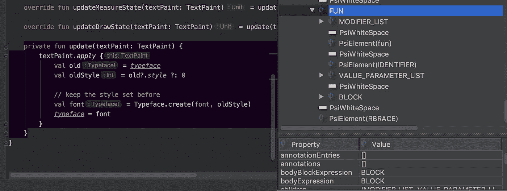
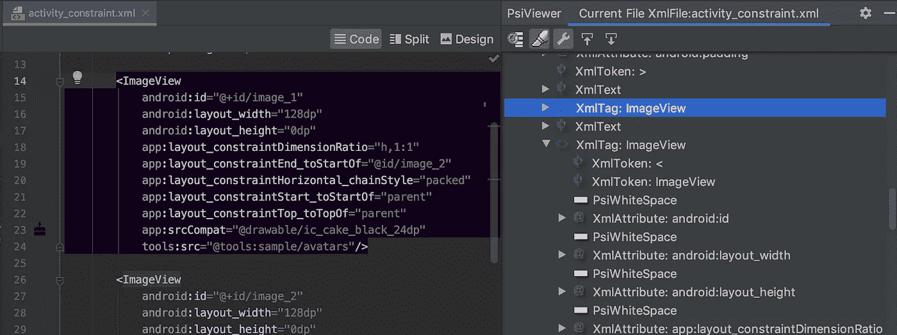
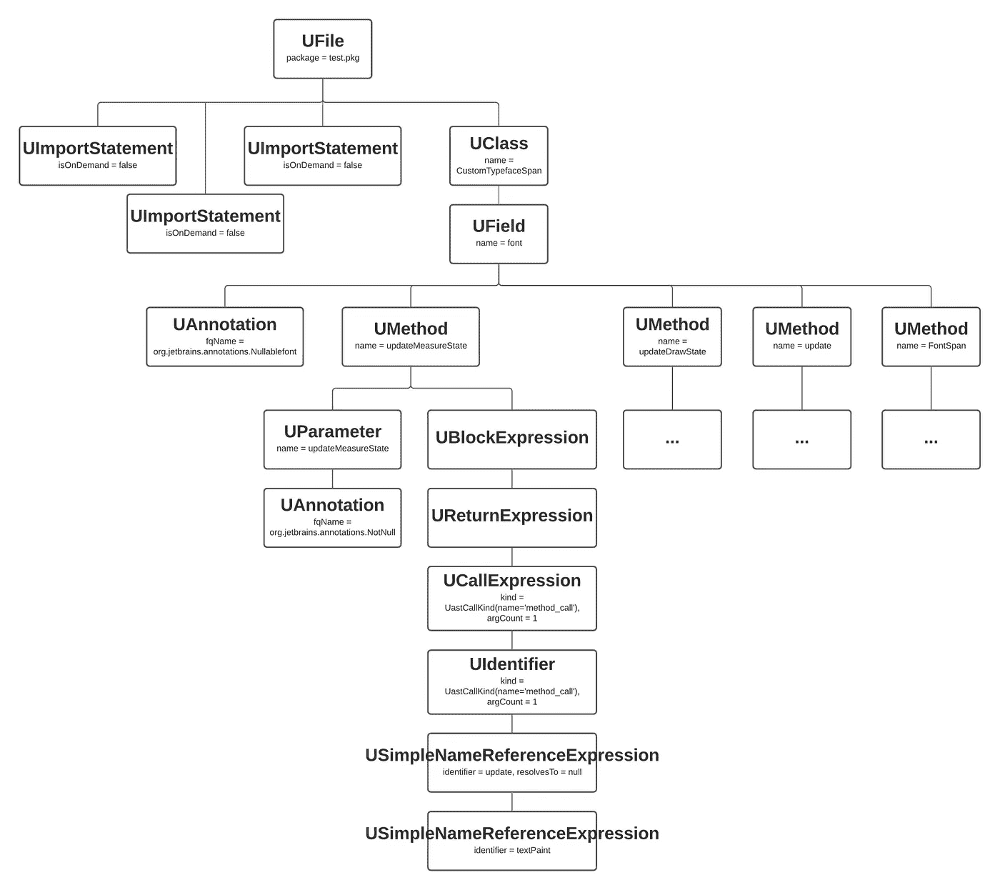
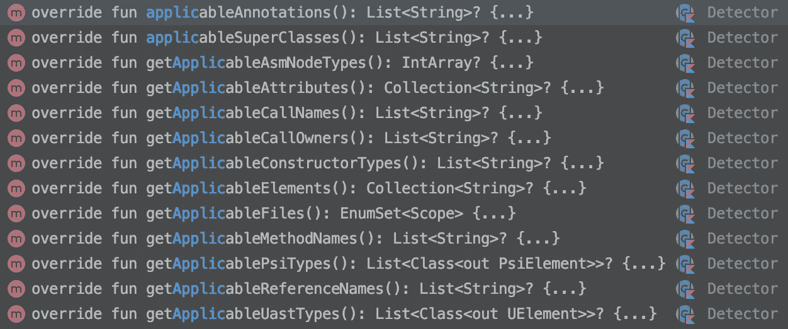
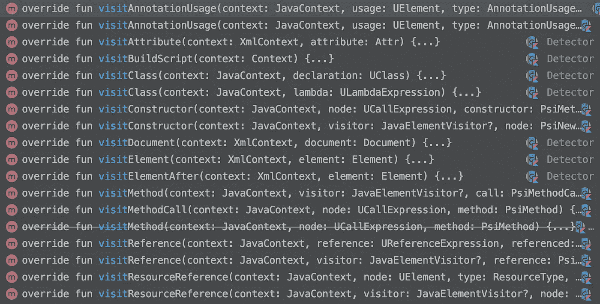
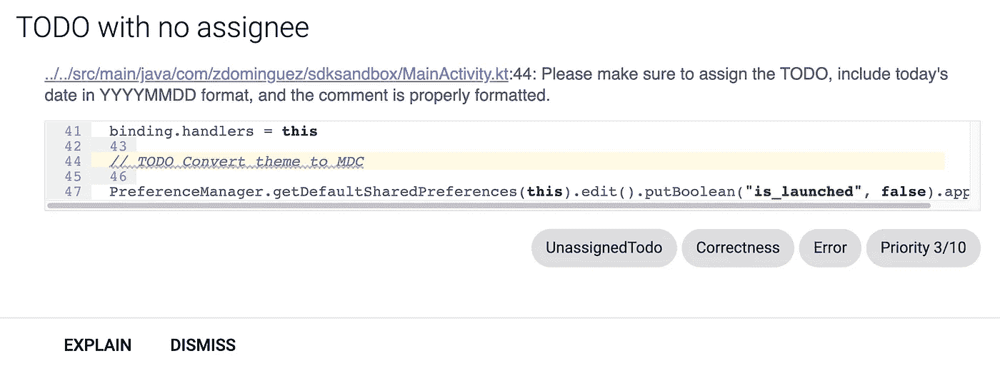

# 用 Lint 执行团队规则:🕵️探测器

> 原文：<https://medium.com/google-developer-experts/enforcing-team-rules-with-lint-detectors-%EF%B8%8F-ccd30739229?source=collection_archive---------2----------------------->


Photo by [Michael Longmire](https://unsplash.com/@f7photo?utm_source=medium&utm_medium=referral) on [Unsplash](https://unsplash.com?utm_source=medium&utm_medium=referral)

几个月前，我的团队达成了一项协议，当在代码中的任何地方留下一个 TODO 时，我们需要始终提供几样东西:

*   应该处理待办事项的人
*   离开待办事项的日期
*   关于需要做什么的评论或解释

我创建了一个[实时模板](https://zarah.dev/2020/03/06/live-templates.html)来支持遵守这条规则，但是为什么不更进一步，将这条规则集成到我们的日常工作流程中呢？

在这篇文章中，我们建立在我们已经开始的的[基础之上。](https://zarah.dev/2020/11/18/todo-lint.html)

现在我们已经设置好了模块，我们可以开始编写检测器了。

正如[之前提到的](https://zarah.dev/2020/11/18/todo-lint.html)，探测器为我们的定制规则做了大量的工作。为此，它必须发挥几个作用:

*   寻找相关的位置
*   在这些位置查找问题(如果有)
*   向用户报告任何发现的问题
*   如果可能，建议问题的修复方法

我们将依次了解这些角色。

# 接受皮棉🏛

在我们深入研究检测器之前，理解一点 Lint 术语是有用的。我花了很长时间才明白，这真的很令人沮丧。说根本没有文档不是骗人的，没有一个地方我可以链接到。这里的很多信息都是我从所有关于 Lint 的演讲、帖子和数小时的研究中拼凑出来的。

在处理探测器时，大多数事情都涉及到称为 UAST 或 PSI 的东西。为了便于说明，让我们从弗洛里纳·芒特内斯库的要点中选取这个样本文件:

## 磅/平方英寸(pounds per square inch)

```
package com.zdominguez.sdksandbox

/*
 * Copyright (C) 2018 The Android Open Source Project
 *
 * Licensed under the Apache License, Version 2.0 (the "License");
 * you may not use this file except in compliance with the License.
 * You may obtain a copy of the License at
 *
 *      http://www.apache.org/licenses/LICENSE-2.0
 *
 * Unless required by applicable law or agreed to in writing, software
 * distributed under the License is distributed on an "AS IS" BASIS,
 * WITHOUT WARRANTIES OR CONDITIONS OF ANY KIND, either express or implied.
 * See the License for the specific language governing permissions and
 * limitations under the License.
 */

import android.graphics.Typeface
import android.text.TextPaint
import android.text.style.MetricAffectingSpan

/**
 * Span that changes the typeface of the text used to the one provided. The style set before will
 * be kept.
 */
open class CustomTypefaceSpan(private val font: Typeface?) : MetricAffectingSpan() {

    override fun updateMeasureState(textPaint: TextPaint) = update(textPaint)

    override fun updateDrawState(textPaint: TextPaint) = update(textPaint)

    private fun update(textPaint: TextPaint) {
        textPaint.apply {
            val old = typeface
            val oldStyle = old?.style ?: 0

            // keep the style set before
            val font = Typeface.create(font, oldStyle)
            typeface = font
        }
    }
}
```

PSI 或**P**program**S**structure**I**interface,[传统上由 IntelliJ](https://jetbrains.org/intellij/sdk/docs/basics/architectural_overview/psi.html) 用来通过*元素*对源文件进行建模。PsiViewer 插件在帮助你形象化这意味着什么方面非常有用。

我喜欢把 PSI 看作文件的蓝图。它显示了每一个元素，包括空格和括号(它甚至可以告诉你是左括号还是右括号！)



PSI for the `CustomTypefaceSpan` Kotlin file



PSI for an XML file

## UAST

UAST 是由 Jetbrains 创建的，用来描述 Java 和 Kotlin 语法树。一个[语法树](https://en.wikipedia.org/wiki/Abstract_syntax_tree)显示了我们代码的层次结构，说明了代码将通过*节点*遵循的所有规则和构造。



Partial UAST for the `CustomTypefaceSpan` Kotlin file

在处理 UAST 时，我们并不真的关心我们看到的是 Java 文件还是 Kotlin 文件。相反，我们在代码中看到了逻辑分支。

## PSI vs UAST

我花了一段时间来理解这些概念，最后我用宜家的比喻来理解它。UAST 就像你在目录上看到的照片。它描述了家具是什么——一个带白色拉钮的抽屉柜，一个搁板，还有一种特殊的门。另一方面，PSI 就像是家具的组装说明。拿这块木板，在这里装一个螺丝，在那里装一个螺栓。

# 继续吧，扎拉

让我们继续制作我们的探测器:

```
import com.android.tools.lint.detector.api.Detector

@Suppress("UnstableApiUsage")
class TodoDetector : Detector() {
}
```

`Detector`是所有检测器的基类。它被标记为`@Beta`，所以我在那里添加了`@Suppress`注释来确认，是的，我知道这可能会中断。

`Detector`非常通用(除了`[ResourceXmlDetector](https://cs.android.com/android-studio/platform/tools/base/+/mirror-goog-studio-master-dev:lint/libs/lint-api/src/main/java/com/android/tools/lint/detector/api/ResourceXmlDetector.java)`)，如果我们能够指出我们需要什么特定的检测器，我们可以从 Lint 中得到更多。根据我们需要在什么类型的事物上运行我们的规则，我们可以使用一些专门的接口:

出于 TODO 检测器的目的，我们需要实现`SourceCodeScanner`接口，因为我们想查看 Java 和 Kotlin 文件:

```
@Suppress("UnstableApiUsage")
class TodoDetector : Detector(), SourceCodeScanner {

}
```

# 具体来说

还有一个术语，大多数关于 Lint 的演讲都提到了很多，那就是“访问”。我还没有看到这个术语的确切定义，但据我所知，这就是我们所说的 Lint 到达特定 UAST 节点或 PSI 元素的行为。

这意味着，如果我们想要查看某个方法的用法，我们需要“访问”方法并弄清楚那里是否存在问题。如果我们想编写一个规则来检查布局文件中的约束，那么我们可能需要“访问”XML 属性和值。

事实上，在 Lint 中有一种适当的方式来具体说明我们希望访问哪些位置。为此，提供了几种方法。请注意，大多数**和**都以`get`开头，但并不是所有的都以`get`开头。😅



Available getApplicable* methods

不管我们的检测器实现哪种类型的`*Scanner`接口，所有这些方法都是可用的，因为它们都在基类`Detector()`中。我们需要确保至少实现这些方法中的一个，以向 Lint 发出信号，表明我们关心这些位置。

因为我们想看看评论，最适合我们用例的是`getApplicableUastTypes()`。

接下来，我们需要指定我们要寻找哪种特定的 UAST 节点。有一种 UAST 型，听起来正是我们需要的类型。

但是有一点需要注意——如果我们查看样本文件生成的 UAST，`UComment`根本就没有出现！然而，我们*确实*通过 PsiViewer 看到了一个`[PsiComment](https://upsource.jetbrains.com/idea-ce/file/idea-ce-4682003011bb42ffdb872d081e79d300bb393d17/platform/core-api/src/com/intellij/psi/PsiComment.java)`存在。

如果我们向后(向上)穿越 UAST？)，我们最终到达了`UFile`，它包含了一个注释可能存在的所有地方。太好了，让我们继续使用它作为我们关心的 UAST 类型。

```
@Suppress("UnstableApiUsage")
class TodoDetector : Detector(), SourceCodeScanner {
    override fun getApplicableUastTypes(): List<Class<out UElement>> {
        return listOf(UFile::class.java)
    }
}
```

# 接收回调

既然我们已经告诉 Lint 我们关心什么样的位置，我们需要告诉它让我们知道它是否遇到那个位置。

同样，我们有许多选择。注意**他们中的大部分**都是以`visit`开头，但不是所有的都是。😅 😅



Available visit*** methods

事实上，从名字来看，这些都不符合我们的需求。既然我们选择了我们关心的 UAST 类型，我们需要的实际上叫做`[createUastHandler()](https://cs.android.com/android-studio/platform/tools/base/+/mirror-goog-studio-master-dev:lint/libs/lint-api/src/main/java/com/android/tools/lint/detector/api/Detector.kt;l=543;drc=7465b820deacf7e7acc4e93d5f73a73633b7bfcb)`。我们的下一个任务是创建这个处理程序:

```
override fun createUastHandler(context: JavaContext): UElementHandler {
    return TodoScanner(context)
}
```

## 一个非常重要的旁注🛑

记住每个`getApplicable*`方法映射到一个相应的`visit*`方法是很重要的。

让我们以 Lint 上的 [ADS 2019 演讲为例。我们想创建一个规则，防止用户在应用程序的任何地方调用`Log.wtf()`。在其中，它们覆盖了`getApplicableMethodNames()`，因此要覆盖的相应回调方法是`visitMethodCall()`。](https://youtu.be/jCmJWOkjbM0?t=734)

类似地，如果我们想查看 XML 属性，我们可以覆盖`getApplicableAttributes()`和相应的`visitAttribute()`回调。亚历克斯·洛克伍德在这个样本项目中展示了这一点。

再次检查你是否使用了正确的组合是非常重要的，因为 Lint 不会告诉你是否使用了错误的组合(也就是说，一切仍然可以编译)。我没有找到任何关于`getApplicable*`对`visit*`的映射的文档，但这是我从实验中收集到的:

# 实现扫描仪

我觉得理解`get*`和`visit*`方法之间的关系是值得的，因为在实现我们的处理程序时，同样的原则也适用。

当我们定义我们的检测器时，我们告诉 Lint 我们想要观察 UAST 类型的`UFile`，因此我们必须在我们的扫描器中实现适当的回调:

```
class TodoScanner(private val context: JavaContext) : UElementHandler() {

    override fun visitFile(node: UFile) {

    }
}
```

对于我们在`getApplicableUastTypes()`中提供的每个 UAST 类型，我们也应该有相应的`visit*`实现。我不会在这里列举它们，因为✨有很多✨，但是这次 Lint 实际上帮助了你！

例如，如果我们说:

```
override fun getApplicableUastTypes(): List<Class<out UElement>> {
    return listOf(UMethod::class.java, UClass::class.java, UFile::class.java)
}
```

我们需要在扫描仪中实现`visitMethod`、`visitClass`和`visitFile`。如果 Lint 遇到了特定的 UAST 类型，但找不到合适的回调，它会在运行时告诉您。

如果你和我一样不知道可能的 U 值是多少或者文件的 UAST 是什么样子，那么在这一点上想出该怎么做是很有挑战性的。不幸的是，据我所知没有 UastViewer，探索这个领域的唯一方法是通过传统的方式。

```
override fun visitFile(node: UFile) {
    val nodesString = node.asRecursiveLogString()
    println(nodesString)
}
```

这将为您提供一个字符串，其中包含正在分析的文件的完整 UAST 结构。

# 找茬

现在，我们对正在发生的事情有了更好的理解，让我们继续实现我们的扫描器的灵魂:

```
override fun visitFile(node: UFile) {

    val allComments = node.allCommentsInFile
    allComments.forEach { comment ->
        val commentText = comment.text

        // Ignore regular comments that are not TODOs
        // If we find a TODO that does not follow the convention, show an error
        if (commentText.contains("TODO", ignoreCase = true) && !isValidComment(
                commentText)) {
            reportUsage(context, comment)
        }
    }
}
```

`isValid`方法检查评论是否遵循我们的团队规则:

```
private fun isValidComment(commentText: String): Boolean {
    val regex = Regex("//\\s+TODO-\\w*\\s+\\(\\d{8}\\):.*")
    return commentText.matches(regex)
}
```

如果没有，请将此报告为问题。

# 负责任的报道📢

当我们发现一个违反合同的评论时，我们希望给用户一个清晰的定义，告诉他们哪里出了问题，如何解决问题。

还记得我们在上一篇文章中谈到的[的剖析吗？让我们用这些知识来定义我们的问题:](https://zarah.dev/2020/11/18/todo-lint.html)

```
val ISSUE: Issue = Issue.create(
    id = "UnassignedTodo",
    briefDescription = "TODO with no assignee",
    explanation =
    """
        This check makes sure that each TODO is assigned to somebody.
    """.trimIndent(),
    category = Category.CORRECTNESS,
    priority = 3,
    severity = Severity.ERROR,
    implementation = IMPLEMENTATION
)
```

`Issue.create()`需要的最后一个参数是`[Implementation](https://cs.android.com/android-studio/platform/tools/base/+/mirror-goog-studio-master-dev:lint/libs/lint-api/src/main/java/com/android/tools/lint/detector/api/Implementation.java)`，它将报告的问题与负责发现该问题的检测器进行映射。

一个`Implementation`需要一个——它告诉 Lint 我们的实现对什么类型的文件感兴趣。

```
private val IMPLEMENTATION = Implementation(
    TodoDetector::class.java,
    Scope.JAVA_FILE_SCOPE
)
```

这个命名确实有误导性，但是`JAVA_FILE_SCOPE`意味着在运行 Lint 时，Java 和 Kotlin 文件都将被考虑到我们的规则中。

这意味着在我们实施的这个阶段，这些信息需要兼容是绝对关键的:

✔️:我们为探测器实现的接口

✔️被覆盖的`getApplicable*`方法

✔️被覆盖的`visit*`方法

✔️(因为我们使用 UAST 类型)在我们的`UElementHandler`中覆盖了`visit*`方法

✔️`Scope`问题的落实

# 我朋友的一点帮助

通过帮助用户解决问题，我们可以帮助他们从我们的自定义 Lint 规则中获得更多价值。Lint 允许我们提供一个 quickfix 选项，用户可以按 SHIFT+ALT+ENTER(或者 ALT+ENTER 然后 ENTER)并应用我们提出的更改。

对于我们的检测器，我们希望正确格式化注释。

```
// TODO This is an improperly formatted comment
```

像上面这样的注释会被我们的检测器标记为格式不正确(记住我们寻找的是`TODO`字符串)。要修复它，我们需要添加用户名和今天的日期。幸运的是，这让我们很容易做到:

```
// Look for the instance of the "TODO" literal
val oldPattern = Regex("TODO|todo")

// Our proposed fix concatenates the user's name
// and today's date in the correct format
val replacementText = "TODO-${System.getProperty("user.name")} " +
    "(${
        LocalDate.now()
            .format(DateTimeFormatter.ofPattern("yyyyMMdd"))
    }):"

val quickfixData = LintFix.create()
    .name("Assign this TODO")
    .replace()
    .pattern(oldPattern.pattern)
    .with(replacementText)
    .robot(true) // Can be applied automatically.
    .independent(true) // Does not conflict with other auto-fixes.
    .build()
```

既然我们已经创建了问题、实现和 quickfix，剩下的惟一事情就是告诉 Lint 在哪里指出遇到了问题。提供准确的位置很重要，因为这将告诉 ide 在哪里显示错误:


以及在 Lint 报告中的何处放置红色曲线:



对于这条规则，我可以突出显示完整的注释。我们现在可以完成我们的`reportUsage`方法了:

```
private fun reportUsage(
    context: JavaContext,
    comment: UComment
) {
    context.report(
        issue = Companion.ISSUE,
        location = context.getLocation(comment),
        message = "Please make sure to assign the TODO, include today's date in YYYYMMDD format, and the comment is properly formatted.",
        quickfixData = quickfixData
    )
}
```

我们终于完成了我们的探测器！💪

这真是一场彻头彻尾的头脑风暴。编写我的第一个 Lint 规则确实是一个挑战，有一段时间我确实盯着屏幕周期性地对着任何人大喊大叫。好在我们都在家工作。😅

在本系列的下一篇文章中，我们将编写一些测试，如果一切顺利，我们将实际使用我们的检测器！敬请期待！

*原载于 2020 年 11 月 19 日*[*https://zarah . dev*](https://zarah.dev/2020/11/19/todo-detector.html)*。*