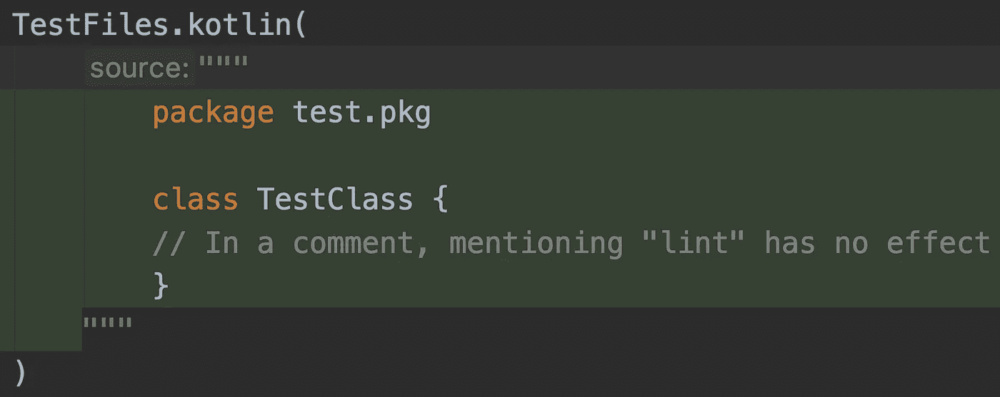
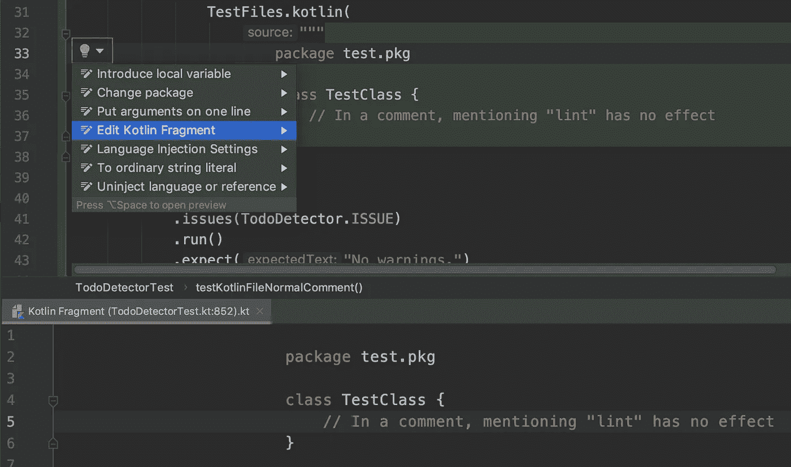
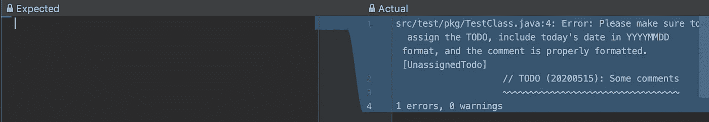

# 用 Lint 执行团队规则:测试

> 原文：<https://medium.com/google-developer-experts/enforcing-team-rules-with-lint-tests-7e538a294445?source=collection_archive---------4----------------------->


Photo by [Henry Be](https://unsplash.com/@henry_be?utm_source=medium&utm_medium=referral) on [Unsplash](https://unsplash.com?utm_source=medium&utm_medium=referral)

几个月前，我的团队达成了一项协议，当在代码中的任何地方留下一个 TODO 时，我们需要始终提供几样东西:

*   应该处理待办事项的人
*   离开待办事项的日期
*   关于需要做什么的评论或解释

我创建了一个[实时模板](https://zarah.dev/2020/03/06/live-templates.html)来支持遵守这条规则，但是为什么不更进一步，将这条规则集成到我们的日常工作流程中呢？

我们之前已经看到:

对我们的自定义 Lint 规则进行测试非常重要。我们不希望 Lint 错误地标记错误。这会导致挫败感，用户可能会关闭我们的规则。

# 提供文件💁

Lint 检查在文件上运行，所以对于我们的每个测试用例，我们需要提供模拟文件。

Lint 提供了一个 API，允许我们内联创建这些模拟文件。

```
TestFiles.java(
    """
        package test.pkg;
        public class TestClass1 {
            // In a comment, mentioning "lint" has no effect
         }
    """
)TestFiles.kotlin(
     """
        package test.pkg
        class TestClass {
            // In a comment, mentioning "lint" has no effect
        }
    """
```

我使用[原始字符串](https://kotlinlang.org/docs/reference/basic-types.html#string-literals)，这样我就不用担心转义特殊字符。

它也给了我们非常好的语法高亮！



此外，如果你从提示中选择“编辑 Kotlin 片段”，Android Studio 将打开一个文件编辑器。您在此编辑器中所做的任何更改都会立即反映在您的`TestFile`中。相当酷！



# 我们去做测试吧🔬

我们测试用例的入口是[testlintask](https://cs.android.com/android-studio/platform/tools/base/+/mirror-goog-studio-master-dev:lint/libs/lint-tests/src/main/java/com/android/tools/lint/checks/infrastructure/TestLintTask.java)。我们需要为其提供以下内容:

*   我们要检查的文件
*   我们正在测试的问题
*   预期结果

```
@Test
fun testKotlinFileNormalComment() {
    TestLintTask.lint()
        .files(
            TestFiles.kotlin(
                """
                    package test.pkg

                    class TestClass {
                        // In a comment, mentioning "lint" has no effect
                    }
                """
            )
        )
        .issues(TodoDetector.ISSUE)
        .run()
        .expect("No warnings.")
}
```

注意，我们可以选择使用`expect("No warnings.")`或`expectClean()`。

对于我们预计会发生错误的测试用例，我们需要输入 Lint 输出的文本(即类似于您在运行`.gradlew :app:lintDebug`时在控制台中看到的内容)。最棘手的是字符串必须与*完全匹配*，包括曲线的位置。

最简单的方法是向`expect()`传递一个空字符串，让测试失败。然后，您可以将错误信息复制粘贴到您的测试中。



Retrieving the message for an error scenario

我为检测器编写了一些测试，包括 Java 和 Kotlin 文件、不正确的日期格式和“TODO”大小写。你可以在这里找到所有的。

# 将这一切结合在一起🤝

既然我们已经编写了测试，现在终于是时候将 Lint 规则集成到我们的应用程序中了！

首先，我们需要创建我们的`[IssueRegistry](https://cs.android.com/android-studio/platform/tools/base/+/mirror-goog-studio-master-dev:lint/libs/lint-api/src/main/java/com/android/tools/lint/client/api/IssueRegistry.kt)`,让 Lint 知道我们的自定义规则。我们还需要提供一个 API 值；对于自定义规则，我们可以使用 Lint API 定义的常量。

```
@Suppress("UnstableApiUsage")
class IssueRegistry : IssueRegistry() {
    override val issues: List<Issue> = listOf(
        TodoDetector.ISSUE
    )

    override val api = CURRENT_API
}
```

然后，我们通过在一个`META-INF/services/`文件夹下创建一个具有完全限定名称的文件来注册我们的`IssueRegistry`:🙌

```
src/main/resources/META-INF/services/dev.zarah.lint.checks.IssueRegistry
```

大多数帖子提到添加这个注册表就足够了，我可能做错了什么，但是我发现对于我的项目，我仍然必须通过将它添加到我的`build.gradle.kts`文件来将我的`IssueRegistry`包含在清单中:

```
tasks {
  jar {
    manifest {
      attributes(
          "Lint-Registry-v2" to "dev.zarah.lint.checks.IssueRegistry"
      )
    }
  }
}
```

我们已经设置好了一切，现在是时候使用我们的自定义 lint 规则了！在您希望应用规则的模块中，在`dependencies`闭包中添加一个`lintChecks`条目，构建您的项目，一切都应该准备好了！🏃‍♀

```
dependencies {
    lintChecks project(':checks')
}
```

# 看到它的实际应用📽️

终于！我们已经到了旅程的终点！这是我们的探测器:


Custom lint rule with quickfix

这个 Lint 系列的源代码是 Github 上的[(](https://github.com/zmdominguez/sdk_sandbox/tree/main/checks)[diff](https://github.com/zmdominguez/sdk_sandbox/pull/25))。🙇‍♀

我在做这个任务的时候学到了很多东西。

正如我在 Twitter 上提到的，几乎没有任何公开的文档。我看过的演讲对我来说太深奥了(例如，我需要在点击之前理解 PSI 和 UAST 是什么，大多数演讲甚至都没有定义它们)。

有很多尝试和错误，所以。很多。猜测。这非常令人沮丧。感谢麦克·伊文斯耐心地指导我一小时又一小时地进行结对编程。如果他不帮忙，我都不知道从何说起。当然，我可以从样本中复制粘贴，但是我想知道为什么事情是这样做的——这就是我学习的方式。

我可能在写这些帖子的时候做了错误的假设🤷‍♀:但同样，没有文件，所以这是我能做的最好的。😅

无论如何，我想说的是，我通常只看到其他人工作的最终成果，有时我不禁感到嫉妒——为什么他们觉得这超级容易，而我却在这里哭，因为我什么都不懂？我需要提醒自己，沮丧是可以的，慢慢学习是可以的，寻求帮助是可以的。

# 进一步阅读(和/或观看)📖

如果您想了解更多，这里有一些关于 Lint 和自定义 Lint 规则的资源:

- [按风格编码:采用自定义 Lint 规则的静态分析，Android Dev Summit 2019](https://youtu.be/jCmJWOkjbM0) (艾伦·维韦雷特、拉胡尔·拉维库马尔)
- [采用 Android Lint 的 Kotlin 静态分析](https://youtu.be/p8yX5-lPS6o) (Tor Norbye)
- [Lint API 源代码](https://cs.android.com/android-studio/platform/tools/base/+/mirror-goog-studio-master-dev:lint/libs/lint-api/src/main/java/com/android/tools/lint/detector/api/)
- [AndroidX 文档](https://cs.android.com/androidx/platform/frameworks/support/+/androidx-master-dev:docs/LINT.md)
- [Android Lint 检查演示](https://github.com/alexjlockwood/android-lint-checks-demo)(亚历克斯·洛克伍德)
- [lint-dev 谷歌组【T11](https://groups.google.com/g/lint-dev)

*原载于 2020 年 11 月 20 日*[*https://zarah . dev*](https://zarah.dev/2020/11/20/todo-test.html)*。*