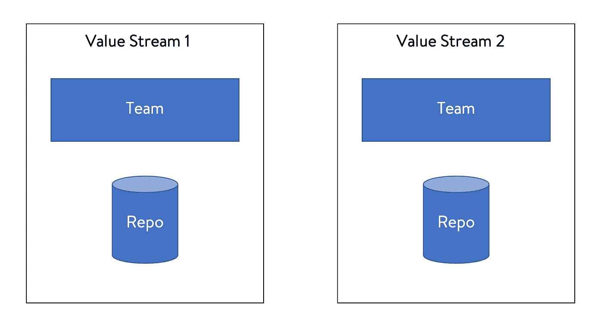
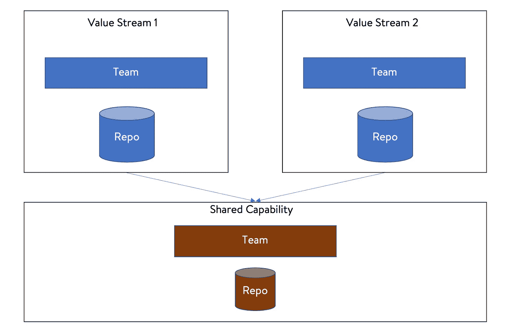
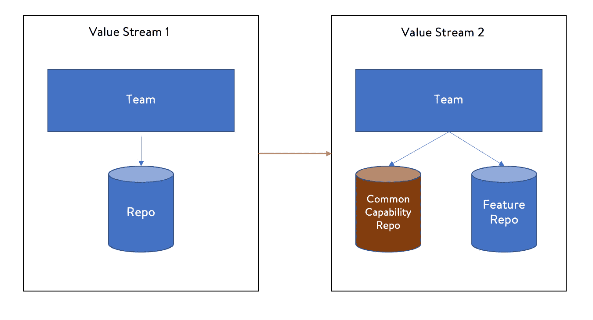
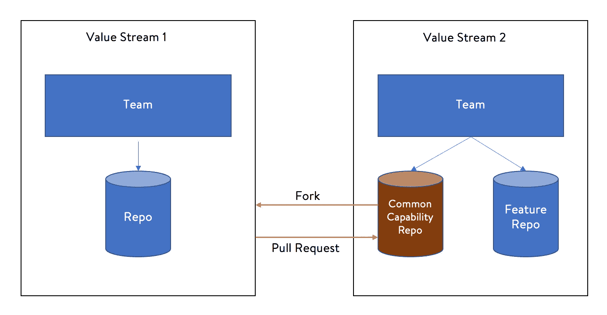
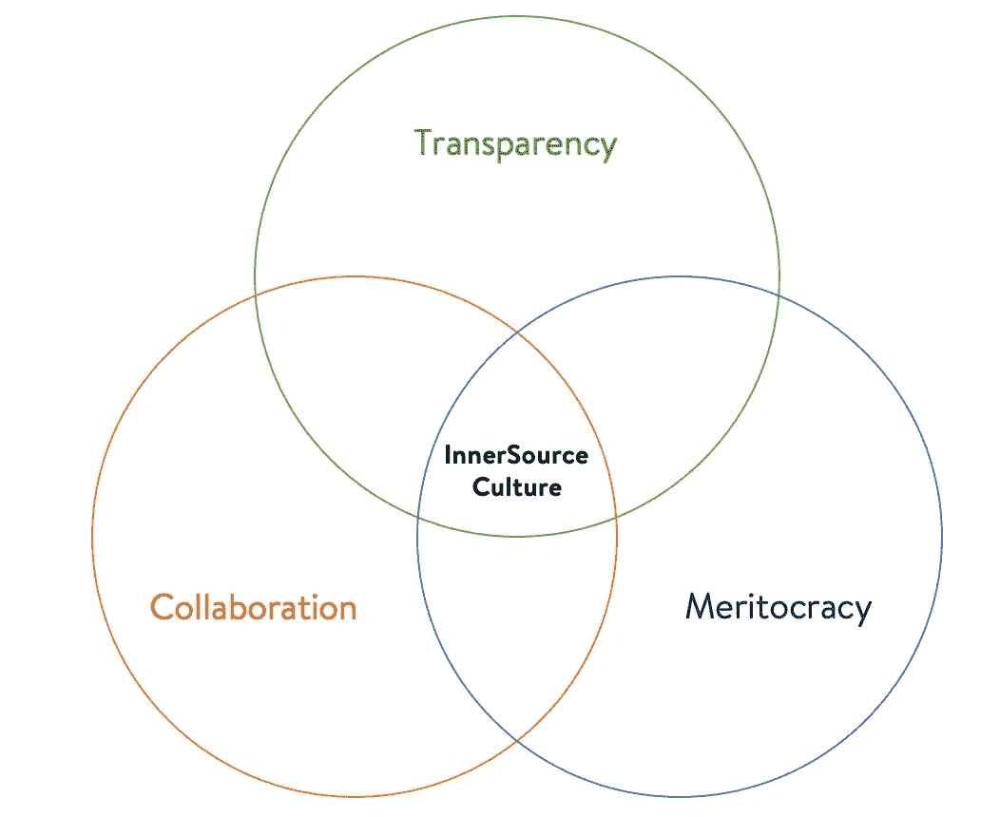

# 用内源文化加速工程

> 原文：<https://medium.com/walmartglobaltech/engineering-acceleration-with-innersource-culture-5dfaeab32921?source=collection_archive---------0----------------------->

InnerSource culture @ Walmart Global Tech

> “我们都在一起工作；这就是秘密。”
> 
> **~萨姆·沃尔顿**

组织团队交付大型企业产品是大多数领导者在工作中面临的最大挑战之一。团队结构可以决定产品交付的速度，也可以塑造企业组织的工作文化。有各种方式来组织团队；例如，层级结构、职能结构、矩阵组织、混合组织等。

价值流/垂直团队总是实现以业务为中心的快速交付，因为他们在管理依赖性方面的摩擦最少&没有单一的瓶颈。业务、产品、工程和设计在一个团队中，从想法到设计到开发再到发布，快速前进。决策和优先级划分在竖井中进行，速度快得多。

以下是工程团队和代码库(简称*repo*)如何在垂直价值流中组织的简化版本:

Value Stream team & repos

各自的团队在他们的代码库中工作，没有工作重叠，并且独立发布。直到某个时候，这种方法都很有效。想象一下这样一种情况，两个业务 VS(价值流)需要共享能力；例如，电子商务市场上的用户帐户因两个或更多不同原因暂停，由不同的工作价值流管理。现在有一个**重复**的问题。出于快速行动的动机，也因为决策是在筒仓中进行的，两个 VS 团队都将构建共同的能力，导致代码的重复、生产力的损失和资源的浪费，最终增加开发的成本。所以就有问题了！

在经典设置中，此问题有两种常见的解决方案:

1.  **将通用能力移动到水平平台:**

共享能力团队作为一个独立的团队工作，并构建跨多个价值流重用的公共能力。这避免了重复，因为单个代码库和服务可以解决多种业务功能。然而，这个模型打破了价值流团队的概念，因为共享团队不能直接与任何特定的业务需求保持一致。这还会导致新功能的优先级问题，因为不同的业务价值流在任何给定的时间点可能会有冲突的优先级。

2.**重用价值流团队构建的公共能力:**

公共能力可以由一个特定的价值流开发和维护，其他团队可以重用，而不是创建一个水平的非价值流团队。

Common capability managed by a VS

这种模型维护了所有权和交付的价值流结构，但是对于公共的可重用代码来说，同样存在优先级和资源冲突的问题。拥有公共代码的团队可能会成为瓶颈，导致业务需求交付缓慢和团队士气低落。

然而，有**第三种方法来解决这个问题**——多个价值流团队可以对单个公共能力报告做出贡献。下图显示了该模型的工作原理:

fork & pull request — internal open source model

在多个团队分叉并贡献于单个回购的情况下，这种模式“*开启了*一个独立代码贡献的代码回购。功能级别优先级可以由独立的 VS 团队管理，资源可以根据业务价值独立管理。团队间的合作从**特性请求转变为拉式请求。**

*如果你还在读这篇文章，你刚刚了解了* **InnerSource 的模型！**

“内部资源”这个术语是蒂姆·奥赖利在 2000 年创造的。根据定义-

> " **InnerSource** 是利用 [**开源**](https://en.wikipedia.org/wiki/Open-source_software) [**软件开发**](https://en.wikipedia.org/wiki/Software_development) 的最佳实践并在组织内部建立一种 [**类似开源的文化**](https://en.wikipedia.org/wiki/Open-source_model) 用于开发其非开源和/或**专有软件。"**

**如今，在全球许多大型技术驱动型企业中，内包是一种常见的做法。以下是内包的主要**优势**:**

1.  ****代码重用/利用**:内包实践避免了系统中的重复代码，允许在不同的以业务为中心的工程团队中利用通用的能力/框架/工具。**
2.  ****更好的质量**:内源采用的基础在于质量。随着自动化、代码评审、静态代码质量检查&回归套件的覆盖，产品质量变得更好。不止一个成员审查来自多个团队的代码。**
3.  ****创新**:围绕主题专业知识的筒仓被打破，允许跨团队的想法和跨参与内源项目的团队的产品和技术创新。**
4.  ****跨组织协作**:这种模式将团队的定义扩展到经理或领导的层级之外。来自不同小组/业务单位的团队成员在一个项目上合作，构建代码和成员在整个组织中的可见性。**
5.  ****人的参与**:人是内源文化的焦点。在信任、所有权和紧密团队合作的驱动下，内源文化提高了组织中人们的参与度和士气。这带来了志愿精神，同时继续关注团队的业务交付。**

**虽然 InnerSource 的好处显而易见，但它并不是免费的。从组织设置和采用的角度来看，都有各种各样的挑战。内源模式要求工作方式发生重大变化。相信*【单颈窒息】*失败的经典管理风格会对内源采纳有很高的阻力。如果处理不当，这种模型还会带来对安全问题的担忧、不受控制的分叉、拉请求队列、对维护工作的担忧等。这些问题可以通过将 InnerSource 视为一种文化以及实施新的领导风格&正确的治理级别来解决。**

****内源培养:****

**InnerSource 不是一个过程，而是一种*文化；要在一个组织内部建立一种文化，需要不同层面的投资。内源文化可以通过从高层领导到基层的 3 个基本原则和支持来建立。***

**下图显示了内源文化的 3 个基本**促成因素/原则**:**

****

**Principles & enablers of InnerSource culture**

1.  ****透明**:这一基本原则强化并促成了开放的心态。通过将正确的设计文档、详细的代码注释、开发人员指南放入代码和流程中，透明性被构建到代码和流程中，以实现自我启动，从而鼓励新人开始使用 fork 并理解代码。透明邀请*重用，*建立*质量*，通过*沟通*使*协作*。**
2.  ****协作**:协作建立在透明和沟通的基础上，通过多个团队共享的共同愿景和目标来实现。协作鼓励开发人员之间的反馈和对话，这使得社区的*感*在不同的面向业务的工程团队中传播。没有强烈的团体和协作意识，内源文化就无法持续。**
3.  ****精英管理:**如前所述，*人*处于内源文化的中心。只有在精英管理的环境中，内源文化才能繁荣和持续。反过来，这种文化也有助于推动精英管理，技术决策由技术专家做出，技术设计&架构不受组织边界的驱动。为了建立和维持内源文化，领导需要纯粹基于优点和影响，用“赢得的权威”&“榜样”来支持和培养人们。两个*供应商*(拥有&维护开放回购的团队)& *消费者*(重用&为开放回购做出贡献的人)都需要被表扬和奖励，以鼓励和滋养内源文化。**

> ***在* ***沃尔玛全球技术*** *我们做得很好。在最高级别的技术&商业评论中，我们展示、欢呼并奖励内部资源的采用。***

**总而言之，**内源文化是一种思维模式**，旨在实现无边界的工程加速，支持重用&杠杆，同时继续关注价值流中的业务价值创造。通过采用内部资源，领导者可以建立高度参与的垂直团队，而不用担心重复造成的浪费。虽然这个概念是几年前引入的，但随着各种可用的协作工具(例如，用于代码版本控制的 *git* ，用于文档编制的 *Confluence* ，用于问题跟踪的*吉拉*，用于沟通的 *Zoom/Teams* 等)的出现，这种文化最近在各种大型企业中被加速采用。**

*****参考文献及进一步解读:*****

1.  ***InnerSource*[*wiki*](https://en.wikipedia.org/wiki/Inner_source#:~:text=InnerSource%20is%20the%20use%20of,in%202000%20in%20his%20column.)**
2.  ***采用 InnerSource* [*图书*](https://paypal.github.io/InnerSourceCommons/assets/files/AdoptingInnerSource.pdf) *【免费 pdf】***
3.  ***InnerSource commons org*[*site*](https://innersourcecommons.org/)**
4.  **[*内源介绍*](https://resources.github.com/whitepapers/introduction-to-innersource/)**