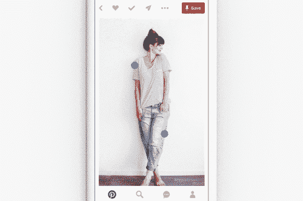
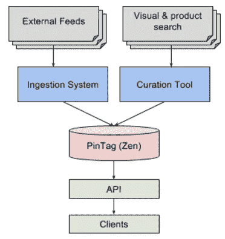
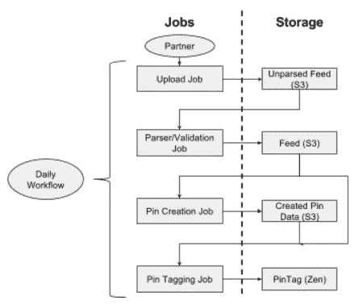
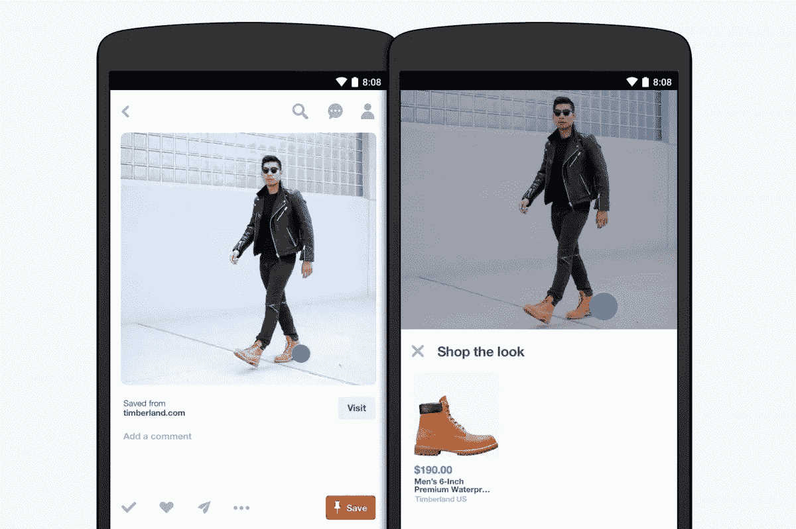
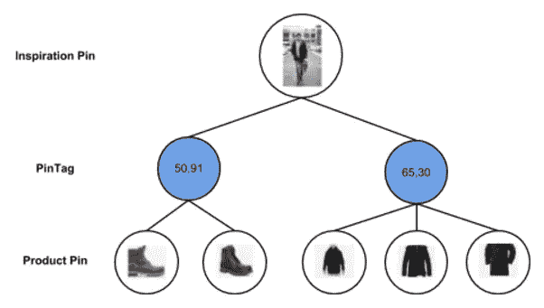
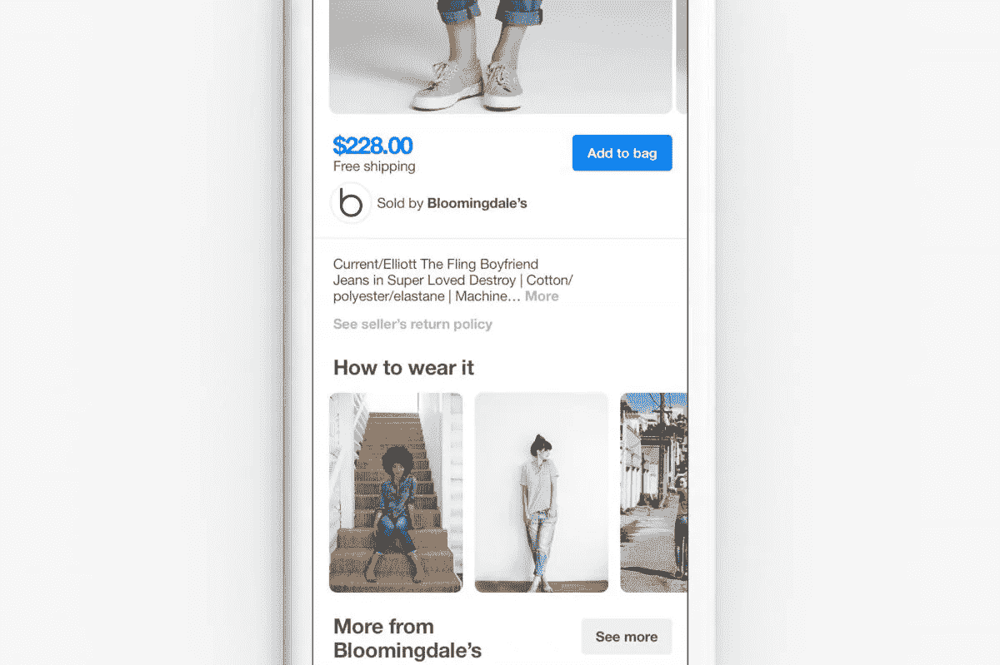
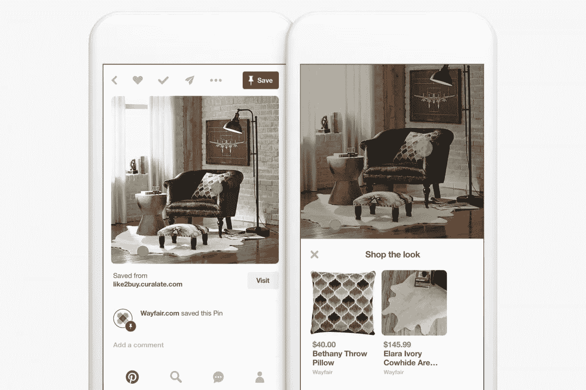

# 工程商店 Pinterest 上的外观

> 原文：<https://medium.com/pinterest-engineering/engineering-shop-the-look-on-pinterest-45bdfa7a8d03?source=collection_archive---------4----------------------->

作者 Wonjun Jeong | Pinterest 产品工程师

本周我们宣布了 [Shop the Look](https://engineering.pinterest.com/blog/introducing-future-visual-discovery-pinterest) ，这是一种购买家居产品和时尚胸针的新方式。随着超过 1.5 亿人每月在 Pinterest 上发现数十亿个想法，并且[55%的人](http://www.slideshare.net/kleinerperkins/2016-internet-trends-report?ref=http://www.recode.net/2016/6/1/11826256/mary-meeker-2016-internet-trends-report)使用该应用程序购物和计划购买，我们希望让灵感和行动变得比以往任何时候都更容易。Shop the Look 将我们的计算机视觉技术与人类策展相结合，向您推荐各种相关产品和风格，只需轻轻一点，您就可以为其注入活力。在本帖中，我们将分享我们是如何设计店铺外观的。

## 概观

我们建立了两种不同的技术来使 pin 内的产品可购买。首先，我们将解释我们如何将计算机视觉技术与人类监管结合起来，以帮助人们在 Pinterest 上购物。第二种方法是从内容网络中获取内容，并自动使 pin 中的产品可购买。

## 方法 1:将计算机视觉与人类监管相结合

利用我们的对象检测技术，我们建立了新的机器辅助策展工具，帮助将人类的品味与计算机视觉结合起来。给定一个时尚别针，我们使用对象检测来推断图像中包含产品的区域，并应用我们的视觉搜索技术来快速查找和解析数百万个产品，以便生成一组候选产品。

具有时尚专业知识的人类策展人确认候选产品中最相关的产品。然后我们可以在商店里推荐这些产品。

## 方法 2:获取第三方数据

为了让商店看起来更具可扩展性，我们为内容网络构建了一个 feed 摄取系统。现在，我们可以轻松获取包含图像链接、产品链接和 XY 坐标的外部信息。

我们的日常工作流程上传饲料文件到 S3 分析和验证饲料。我们将任何错误保存回 S3，以通知品牌和网络。通过处理后的 feed，系统代表内容网络创建 pin，并将他们的产品与人们可以在 Pinterest 上购买的 pin 进行匹配。之后，使用进给中的 XY 坐标在针内标记产品。我们的作业是幂等的，可以在任何时候重新运行，而不会导致重复的内容或特性中断。

有时品牌或网络不提供 XY 坐标。这是一个挑战，我们解决了使用我们的对象检测技术。首先，我们检测源图像中的对象和坐标。然后，我们将注释与在产品上执行的相同对象检测进行交叉匹配，并在源图像上为产品分配一个 XY 坐标。

## 数据模型

我们使用基于图形的模型构建商店外观。为了表示标签关系，我们创建了一个名为 PinTag 的节点，它包含 XY 坐标和一条带有给定时尚或家庭大头针的边。我们还创建了从 PinTag 到类似产品的不同引脚的边。这里有一个例子:

基于图形的解决方案允许我们构建更多有用的功能:

*   **如何佩戴:**不同的励志别针往往共用共同的产品。对于任何可购买的 Pin，我们可以很容易地查询反向来找到包含相同产品的灵感图像。这有助于品酒者找到更多的方法来设计围巾，穿最新的牛仔裤，或者让他们已经拥有的产品以新的方式为他们服务。

*   **别针共现:**商店外观和如何穿它都遍历图的宽度一次。如果我们遍历该图几次，我们就开始绘制产品之间的关系，以利用人工管理提供的准确数据。在未来，我们将能够推断出相似或互补的产品。这意味着我们可以推荐由搭配良好的单品组成的造型。

## 基础设施

我们在一个称为 Zen Canonical Pin 的专门 Zen 集群上构建了这个。Zen 是我们内部基于图形的存储系统，规范 Pin 是一种数据模型，表示共享相同链接和图像哈希的 Pin(就像上面的 Pin)。Zen Canonical Pin 给了我们两个主要好处。

*   **性能:**集群经过专门设计，通过高缓存可用性实现低读取延迟。该集群上的请求超过 400K QPS，同时提供大约 20 毫秒的 p99 读取延迟。这是至关重要的，因为商店的外观内容往往存在于我们最受欢迎的别针上。
*   **覆盖范围:**将这些数据存储在标准 Pin 表示中，可以放大我们整个产品的商店外观。每当一个大头针共享相同的图像签名和链接时，我们将使用购物外观内容点亮该大头针。这使得更多的针可购买，因此更容易发现一个商店的外观针。

一旦数据存储完毕，就可以开始服务了。我们为我们所有的平台——iOS、Android 和 web——建立了商店外观。

## 下一步是什么

早期的测试表明，与不逛商店的人相比，逛商店的人逛商店的次数多 3-4 次，逛商店的次数多 5 次，访问品牌网站的次数多 2-3 次。现在，我们正在向所有人推广这一体验，我们有几项即将推出的计划:

*   **用视觉搜索统一购物外观:**随着我们的计算机视觉精度的提高，我们可以指数级地扩大购物外观。我们希望将我们的视觉搜索体验与 Shop The Look 中的内容统一起来。
*   **增加价值:**我们希望将更多的内容网络和品牌带到平台上，帮助 Pinners 发现更多他们甚至不需要知道名字就能找到并购买的产品。

现在美国的 Pinners 也可以购买这种造型了。我们希望你[尝试一下](https://www.pinterest.com/discover/topics/4862118442542574756/)！

*鸣谢:本项目是与 Rocir Santiago、Joyce Zha、Rahul Pandey、Casey Aylward、科拉莉·萨宾、Cheryl Chepusova、Cherie Yagi、Kim O'Rourke、Anne Purves、Tiffany Chao、Aimee Bidlack、Aya Nakanishi、Tim Weingarten、Adam Barton 和田园合作的跨职能项目。全公司的人通过他们的见解和反馈帮助推出了这一功能。*