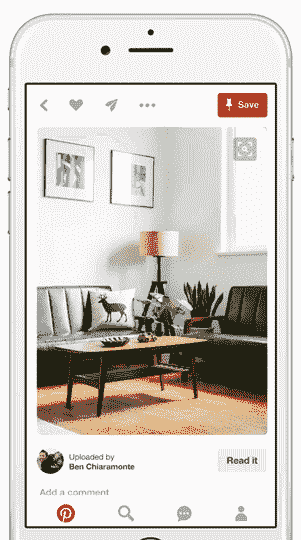

# Pinterest 浏览器扩展中的工程视觉搜索

> 原文：<https://medium.com/pinterest-engineering/engineering-visual-search-inside-pinterest-browser-extensions-90e7ed9d2b14?source=collection_archive---------4----------------------->

徐克雷| Pinterest 产品工程工程师

Pinterest 是一个视觉发现引擎，拥有全球 1.5 亿人保存的 1000 个创意。我们最近推出了[三种新方式](/@Pinterest_Engineering/introducing-the-future-of-visual-discovery-on-pinterest-48fb469b0d67#.36zfu48ui)，通过 [Lens BETA](/@Pinterest_Engineering/building-pinterest-lens-a-real-world-visual-discovery-system-59812d8cbfbc#.1l1w2ey1x) 、 [Shop the Look](/@Pinterest_Engineering/engineering-shop-the-look-on-pinterest-45bdfa7a8d03#.ydtsxr5xn) 和即时创意，在 Pinterest 上发现更多想法，并从你周围的世界中发现更多想法。今天，随着 Pinterest 浏览器扩展中视觉搜索的推出，我们将同样的视觉发现技术带到了整个互联网。这是第一次，你可以在 Pinterest 之外跨网络使用我们的视觉搜索技术。只需将鼠标悬停在你在网上看到的任何图片上，就可以找到相关的创意和产品，而无需离开你所在的网站。在本帖中，我们将分享如何在 Chrome 的 Pinterest 浏览器扩展中构建可视化搜索。

**开始**

Pinterest 浏览器扩展中视觉搜索的想法和最初原型始于大约两年前。在我们向 Pinners 推出[视觉搜索](/@Pinterest_Engineering/introducing-a-new-way-to-visually-search-on-pinterest-67c8284b3684#.tvn5nx9c6)之前，几名工程师和一名设计师头脑风暴出了可以应用我们视觉搜索技术的产品创意。浏览器扩展是我们最先提出的想法之一，并且已经有了原型。我们对这个概念感到兴奋，但决定首先在我们自己的应用程序中推出视觉搜索。从那以后，我们推出了新的视觉搜索功能，如实时[对象检测](/@Pinterest_Engineering/introducing-automatic-object-detection-to-visual-search-e57c29191c30#.buay8w6mr)，并对我们的技术进行了重大改进，包括改进我们的视觉模型，开发新的最先进的视觉信号，以及增加我们识别的对象数量。现在，我们推出了全网视觉搜索。

**为 Pinterest 之外的视觉搜索请求提供服务**

使用 Pinterest 浏览器扩展进行可视化搜索有两种方式。在你下载了 Chrome 浏览器的 [Pinterest 浏览器按钮后，只需将鼠标悬停在一张图片上，点击视觉搜索图标(放大镜)就能获得相关结果。您还可以通过右键单击页面来获得整个可见网页的结果。点击视觉搜索图标会触发一个流程，我们获取图像的 URL 并将其呈现在视觉搜索覆盖图中。当你右击页面进行搜索时，我们使用 Chrome 的](https://chrome.google.com/webstore/detail/pinterest-save-button/gpdjojdkbbmdfjfahjcgigfpmkopogic?hl=en)[*captureVisibleTab*](https://developer.chrome.com/extensions/tabs)*API 来截屏整个页面。这让我们可以直观地搜索非静态图像，如视频和 gif。但是， *captureVisibleTab* 只在后台脚本上工作，而不是处理所有 UI 的注入内容脚本。我们使用 Chrome 的消息传递 API 将截图数据 URI 发送到我们的内容脚本，调整其大小，并在网页上的视觉搜索覆盖图中显示为图像。所有这一切都是实时发生的，只需几分之一秒。*

*为了设置可视搜索裁剪选择器界面，您可以围绕图像中的任何内容移动搜索框并调整其大小，我们调整了图像或屏幕截图的大小，以适应可用的页面高度，并且不超过可用页面宽度的 50%。我们将调整后的图像绘制为 HTML 元素的背景，并用包含裁剪选择器的透明画布覆盖它。当我们最初显示视觉搜索覆盖图时，我们选择了大约 90%的图像，从边缘向内动画显示选择器，这样 Pinner 就可以清楚地看到发生了什么。*

*在后台，我们将原始图像绘制到隐藏的画布中，并使用 canvas.context.getImageData 将其转换为数据:URI。为了减少延迟，我们将图像大小调整为视觉模型所需的最小大小。Pinner 完成作物选择后，我们将数据:URI 以及选择器的顶部、左侧、高度和宽度值发送到我们的后台脚本，这样我们就知道要搜索什么以及在哪里查找。在我们的后台脚本中，我们将数据:URI 转换成一个 blob，并通过 XMLHttpRequest 将所有数据发送到我们的 API。*

*我们总是在加载时搜索初始选择，所以有一些结果(希望还有一些注释)可以使用。搜索结果以 Pin 对象的形式从 API 返回。我们在一个看起来很熟悉的 Pinterest 网格中将它们呈现为图钉，可以立即保存或再次通过搜索运行，就在页面上。我们还将悬停搜索按钮添加到当有人单击浏览器按钮时在页面上找到的图像中，以帮助使视觉搜索更容易被发现。*

**

***API 层***

*在 API 层，我们需要做两件主要的事情:将图像从客户端上传到一个临时的 S3 商店，并将图像发送到我们的视觉搜索服务。在我们的一位工程师将它们并行化之前，这些任务一直是依赖的、连续的任务，大大减少了延迟。*

*出于性能原因，我们会暂时存储该图像。在初始搜索中，我们将原始图像和裁剪坐标一起上传到 API，API 会发回一个图像链接。对于第二次和随后的搜索，我们将这个链接与新的顶部、左侧、高度和宽度值一起重复返回到 API，因此我们不必继续发送原始图像数据，这将是非常浪费的。*

***未来计划***

*有了这个更新，您现在可以使用 Pinterest 视觉发现技术在我们的应用程序中、在网络上以及在世界各地寻找创意。这只是一个开始。以下只是路线图中的几件事:*

*   *我们将把实时[物体检测](/@Pinterest_Engineering/introducing-automatic-object-detection-to-visual-search-e57c29191c30#.buay8w6mr)引入到浏览器扩展中，以在我们的应用中并行视觉搜索体验。这使 Pinners 能够简单地点击我们识别的对象并获得结果，而不是手动识别和定位图像中的对象。*

**

*   *我们希望扩展到视觉上相似的搜索结果之外，向您展示如何将想法变为现实，类似于我们对 Lens 结果的方法。例如，如果输入的图像是鳄梨，我们想向您展示比其他鳄梨更多的信息，包括健康益处、食谱以及如何种植它们。*
*   *我们将把视觉搜索带到我们所有的浏览器扩展中。首先，我们今天将在全球范围内推出针对 Chrome 的 [Pinterest 浏览器按钮的视觉搜索。](https://chrome.google.com/webstore/detail/pinterest-save-button/gpdjojdkbbmdfjfahjcgigfpmkopogic?hl=en)*

*如果您对解决此类计算机视觉挑战感兴趣，请加入我们的行列！*

****致谢:*** *艾伯特·佩雷拉、安德鲁·翟、克里斯蒂娜·林、德米特里·基斯柳克、徐克蕾、肯特·布鲁斯特、纳韦恩·加维尼、帕特里克·歌德、史蒂文·沃林、史蒂文·拉姆库马尔、蒂芙尼·赵、托尼奥·阿卢塞马**