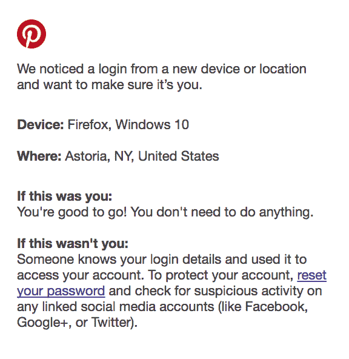
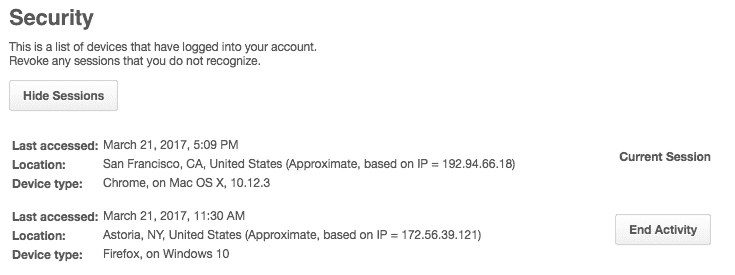
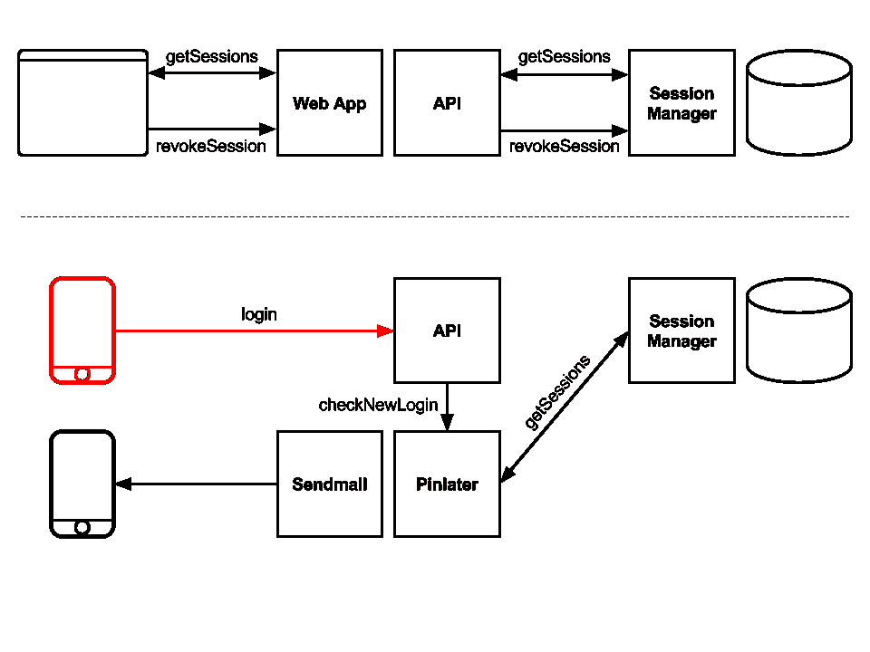

# 通过登录电子邮件和撤销会话增强 Pinner 安全性

> 原文：<https://medium.com/pinterest-engineering/enhancing-pinner-security-with-login-emails-and-revoking-sessions-b5a7ec3de29d?source=collection_archive---------4----------------------->

Amine Kamel，Cesena & Eric Zhang | Pinterest 工程师，安全

Pinterest 安全团队的任务是确保超过 1.75 亿人的账户安全。我们最近增加了另一层保护来保护 Pinners 的帐户。现在，从新设备或位置登录将触发电子邮件通知，并且可以从[用户设置页面](https://www.pinterest.com/settings/)查看和撤销所有活动会话。

在这里，我们将描述支持新功能的系统架构。

## 新功能

现在是上午 11:30，我收到来自 Pinterest 的电子邮件，通知我有一个来自纽约的新登录。等等，什么！？我在旧金山的办公室工作——这次登录肯定不是我发的。

我访问我的[设置](https://www.pinterest.com/settings/)下的新“安全”部分，查看我的活动会话。在这里，我可以通过单击“结束活动”按钮来删除不想要的会话。由于这是一个新的登录，我选择更改我的密码，这将自动重置我的所有会话。

## 它是如何工作的

这里是系统架构的概述，用户设置页面在顶部，电子邮件通知系统在底部。如您所见，两者都依赖于一个名为会话管理器的后端服务。

## 会话管理器

这两个特性的核心是会话管理器，它负责存储和验证用户会话。它是一个 Java 服务，由 API 通过一个节俭接口访问，以验证每个请求的会话(每秒 150k+)。会话管理器总是能够撤销会话，但是这是我们允许 Pinners 使用它的第一次。

## 用户设置页面

通过直接连接到会话管理器端点的 API 调用，添加了检索和撤销活动会话的新功能。

## 电子邮件通知

在每次登录时(每天几百万次)，API 会向我们的 PinLater 服务发送一个异步作业(这是[开源的](/@Pinterest_Engineering/open-sourcing-pinlater-an-asynchronous-job-execution-system-d8ec4e39859a#.94oh2smlx))。执行时，该作业检索所有会话的列表，并评估登录事件是否来自新设备或 IP 地址。如果是，作业会向帐户所有者发送一封电子邮件。

## 保护 Pinterest

随着新登录的电子邮件通知以及查看和撤销活动会话的能力，安全性首次出现在 Pinterest 应用程序中，我们非常兴奋。敬请关注我们团队和 Pinterest Engineering 的更多更新！

在 Pinterest 或其他地方，你是否有撤销未知或不想要的会话的直接经历？如果是这样，我们希望收到您的来信。在下面的评论里告诉我们，或者在 Twitter 上找到我们 [*@0x0ece*](https://twitter.com/0x0ece) *、*[*@ ericzhang 401*](https://twitter.com/ericzhang401)*。*

*鸣谢:这些功能是跨团队的成果。非常感谢 Ali Altaf、Jean Aurambault、Steve Cohen、约翰·埃根、Kevin Grandon、Devin Lundberg、Vamsi Ponnekanti、Ryan Reid 和 Web & API 团队的所有帮助和指导。*