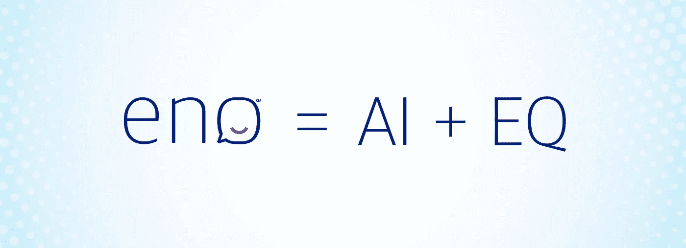
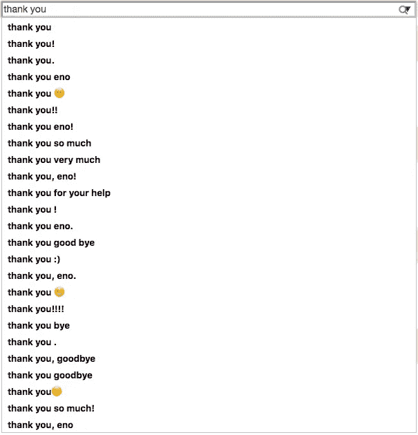
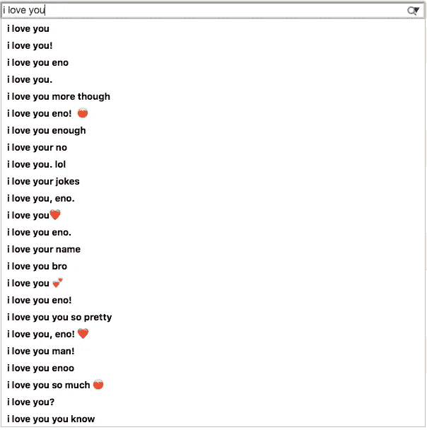

# Eno = AI + EQ:设计一个能够识别情绪并做出反应的金融人工智能

> 原文：<https://medium.com/capital-one-tech/eno-ai-eq-3d939a2f6a7b?source=collection_archive---------3----------------------->

第一资本公司副总裁 Steph Hay&对话设计主管

倒回一年。想象一下，一群人坐在一个房间里思考一个问题:**顾客会信任一个聊天机器人，和它谈论他们的钱吗？**

六个月后，这个团队试图通过[在奥斯汀的 SXSW 推出 Eno](/capitalonedesign/designing-eno-848add41abf8)——美国银行推出的第一个自然语言短信聊天机器人——来回答他们的人类学问题。

Eno 是一个性别中立的机器人，它理解表情符号，[有一个背景故事](https://www.capitalone.com/onefocus/becoming-a-bot/)引导它的性格怪癖，并愿意放弃偶尔的双关语。在过去六个月的整个试点过程中，Eno 团队学到了几件令人信服的事情，这些事情增强了“具有情商的人工智能”的力量，这是斯科特·卡普(对话式人工智能产品总监)在一天的会议上创造的一个短语，是对话式界面特有的。

## 人机交互中的情感

多年来，我们在 GUI 的按钮命名中反映了感激。无论你是在自动取款机上还是在手机界面上，你都可能看到按钮标签上写着“谢谢”或“不，谢谢”。这是编剧兼设计师有意识的决定，在互动中加入礼貌。它在某些情况下令人愉快，在另一些情况下令人不快(特别是当你感到沮丧的时候)，但是它的意图通常是真实的。

因此，当我们推出 Eno 时，我们不确定一旦 Eno 处理完客户的请求，客户会如何回应。他们能不能别说话了，走开？如果 Eno 没有他们需要的答案呢？毕竟，我们没有强迫他们回应……这是一个自然语言界面中的开放式对话。

**令人惊讶的是(也让我们团队高兴的是)，在 Eno 与客户进行的前 10，000 次对话中，“谢谢您”出现在短信最多的前三个短语中。**这有多种形式，从“谢谢”或“tx”到更极端的例子——心形表情符号、纸屑，甚至求婚。

无论在什么情况下，客户似乎都会对 Eno 表示感谢——不仅仅是当 Eno 实质性地提供信息时，比如在快速交换中提供余额或进行信用卡支付。当 Eno 回答个人问题或使用上述双关语时，人们会说谢谢。当一句“你照亮了我的一天”出现时，它不会在团队中丢失；那是真人，不请自来，对 Eno 客气。*表示感谢。*

这种感谢 Eno，或对 Eno 说再见，或告诉 Eno“我爱你”的模式——无论用例、对话长度或一段时间内的对话次数——都是一个信号，表明我们正在实现比事实正确更伟大的东西(尽管这绝对至关重要)。作为一个代表我们公司价值观的角色，Eno 的热情、谦逊和亲和力也引起了我们的共鸣。

对于我们的团队来说，这是积极的动力和学习，我们致力于继续培养 Eno 的情商(EQ ),因为我们在组合中添加了更多的对话。保持这种情感联系至关重要。

## 顾客用表情符号进行银行交易

客户可以通过短信向 Eno 发送任何形式的“余额”来获得他们账户的快速报告他们也可以通过向 Eno 发送钱袋或$表情符号或纯文本$来获得相同的信息。

事实证明，客户和他们的银行之间的短信行为与客户和他们的社交圈之间的短信行为没有太大的不同；他们使用表情符号的频率和使用“平衡”这个词的频率差不多这教会了我们的团队，客户不只是学习新的银行交互模式，而是应用他们已经使用的模式。

表情符号传达了简短的短信语言(钱袋)和情感(心或波)，这意味着我们正在学习新的沟通方式，这些方式已经适应了人们在该渠道的行为模式。

因此，这开启了一个全新的可能性探索世界，其他人也同样认为表情符号的力量是一种自然的速记，可以在交谈中促进新的 UX 互动。

因此，随着 Eno 现在对数百万 Capital One 客户开放业务，体验背后的团队很高兴能够继续重新想象客户如何与 Capital One 就他们的资金进行沟通的旅程；继续推进尽可能自然、无障碍和无摩擦的通信边界——所有这些都由具有情商的人工智能 Eno 提供支持。

**了解更多 Eno，在这里** **报名** [**。**](https://www.capitalone.com/applications/eno/)

*Eno 并不适用于所有银行客户。*

*以上观点为作者个人观点。除非本帖中另有说明，否则 Capital One 不属于所提及的任何公司，也不被其认可。使用或展示的所有商标和其他知识产权都是其各自所有者的所有权。本文为 2017 首都一。*