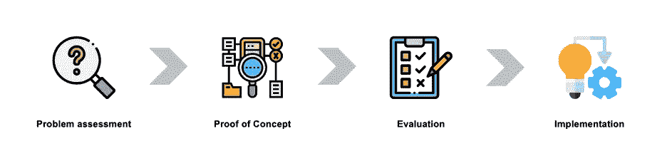
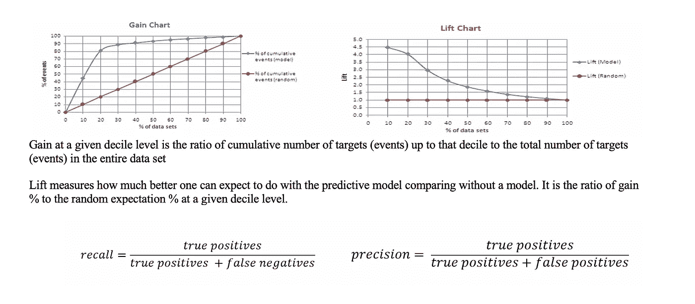

# 丰富预先存在的数据，构建更轻便、更紧凑的模型！

> 原文：<https://medium.com/walmartglobaltech/enrich-your-pre-existing-data-and-build-lighter-and-compact-models-976540093f54?source=collection_archive---------9----------------------->

Picture credit: [PixaBay](https://pixabay.com/)

## **评估数据科学组织内供应商的指南**

利用数据科学和数据智能已经渗透到几乎每个业务领域，为决策提供支持。然而，每家公司可能捕获的数据类型以及支持复杂数据模型的基础架构都存在限制。这篇博文探讨了公司如何利用外部供应商提供的数据智能来丰富他们预先存在的数据收集，以及构建更轻便和紧凑的模型。本文还介绍了在聘用外部供应商之前对其进行评估的过程。

***供应商数据有什么好处？***

诸如电子商务商家之类的产品或业务所有者可以仅访问与他们的生态系统内的活动相关的内部数据。但是，访问此生态系统之外的客户行为和信息可以提供不同的视角。这种附加信息与现有数据收集一起通常会提高要素智能。

> 添加外部供应商数据特别有利于帮助对精简文件或产品上的新客户做出决策

这是因为外部数据供应商通常会建立从 omni 渠道(如银行、电子商务、社交媒体等)收集的数据联合体。尽管如此，不同供应商提供的数据类型各不相同。一些供应商简单地提供原始数据，而许多其他供应商执行特征工程和/或基于他们的内部机器学习模型提供分数。通常，拥有复杂业务模型的供应商会要求商家在利用其服务时共享其数据，以丰富前者的财团。

***商家如何从市场上的各种外部数据供应商中进行选择？***

在过去的几年中，笔者参与了面向电子商务支付风险管理的供应商评估，并从供应商研究、概念证明、评估、比较到入职全程指导。以下是该流程的要点:

# **问题评估:**

**步骤 1:** 在联系供应商之前，应进行问题评估并充分了解数据需求和业务目标。这有助于商家缩小搜索范围。

**第 2 步:**一旦了解了目标和数据需求，便会根据商户政策、内部入职流程要求、预算等标准对供应商进行初步评估。应该进行。业务部门应参与此评估流程。筛选这些供应商时要记住的一些要点:

*a .了解供应商的客户群以及他们是否与商家的客户相匹配*

*b .供应商的年龄和地位以及所提供的产品*

*c .供应商声誉或对其提起的任何法律诉讼*

*d .有时，供应商的产品依赖于与商家竞争的技术提供商，应在 POC 阶段之前就商家关注的问题进行沟通*

**第 3 步:**在开始下一步之前，概念验证阶段和评估的成本应由业务部门最终确定和批准。 ***此外，还应进行任何隐私和合规性评估，尤其是在涉及敏感信息的情况下。***

# **概念验证:**

**步骤 4:** 接下来，开始概念验证流程。数据科学或分析团队根据商家的政策准备加密数据集，并与所有接受评估的供应商共享。值得注意的是，数据集应该 ***包括每个条目的标识符*** ，以将其链接回原始记录或其他记录。此外，数据集应该 ***包含每个条目的时间戳*** (事件发生的时间)。商家不应该在数据集中包含性能等机密信息。

**步骤 5:** 厂商应该 ***返回时间点数据*** 以时间戳为准(当天或之前)。这是因为概念验证的目的是评估在特定交易或数据输入发生时提供的供应商数据，以模拟供应商的实时响应。

# **评价:**

*一旦供应商将数据集附加上自己的数据情报并返回给商家，接下来的步骤是什么？*

**第六步:**一般来说，有三种主要的方法来评估供应商的数据:

I .检查现有模型/解决方案的性能 或基本 KPI 的 ***提升，同时直接使用供应商的数据***

二。将现有模型/解决方案与供应商数据的特征工程相结合，并检查性能或基本 KPI 的任何提升。可以通过评估 ***提升/增益图以及解决方案的*** 精度和召回率的提高来衡量这种性能提升:

> 请注意，由于生成现有模型和新供应商数据的变量之间可能存在高度相关性，商家在与基准绩效进行比较时可能会观察到绩效下降，这并不罕见

三。**的数据覆盖率或响应率也是一个要考虑的关键性评价指标。与其他供应商相比，选择数据覆盖率高的供应商总是很有吸引力的。**

**四。应进行 ***投资回报分析/计算*** 以评估收益或绩效提升是否值得在供应商入职时进行投资**

****步骤 7:** 应与工程团队讨论 ***附加 SLA*** ，因为供应商实时提供响应需要时间。毕竟，商家不希望供应商实时集成对客户体验产生负面影响。**

****步骤 8:** 供应商提供的 ***技术支持*** 在最终确定供应商之前，应讨论实施**

# ****实施:****

****第 9 步:**最终确定供应商后，在投入生产前，首先将供应商数据纳入 stage 环境中进行全面的端到端测试总是有益的。所有相关的利益相关者都应该参与到这个过程中来，以确保他们没有任何错误。**

****第 10 步:**一旦供应商集成完成且数据上线，商家应继续监控并 ***设置报警呼叫*** ，以防供应商的响应因技术问题或中断而下降。**

> **最后，每隔几个月持续评估供应商数据的价值是一个很好的实践。定期与相关供应商联系，从他们的角度了解客户行为的新观察是一种有益的做法。**

**在这个以数据为中心的世界里，一个运行良好的数据丰富流程是为产品提供成功客户体验的基础。在这个数据驱动的时代，有许多供应商提供对地理、行为、财务等各种数据的访问。但是，设计正确的数据丰富策略和选择合适的供应商是使这一过程真正为一个人的业务需求和目标增值所不可或缺的。**