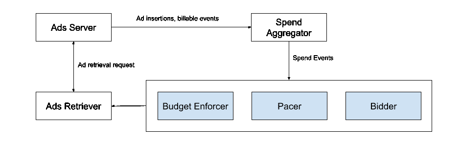
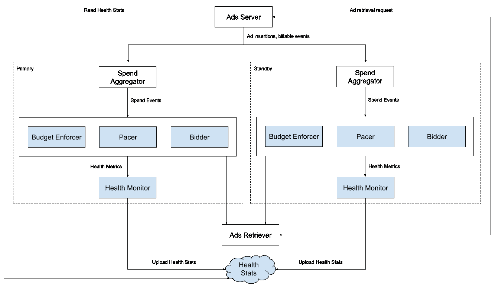
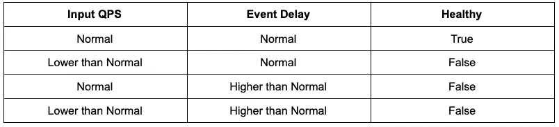
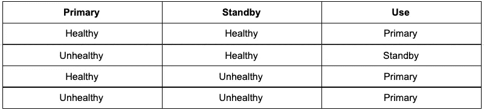
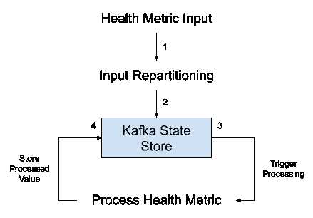
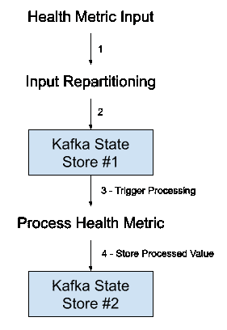

# 确保广告实时流服务的高可用性

> 原文：<https://medium.com/pinterest-engineering/ensuring-high-availability-of-ads-realtime-streaming-services-ea3889420490?source=collection_archive---------1----------------------->

sreshta Vijayaraghavan | Ads 索引平台技术主管

在过去几年里，Pinterest 广告业务在广告商和用户两方面都增长了数倍。随着我们扩大收入规模，我们必须:

*   在一天中平稳地分配广告客户支出
*   避免超出广告商每日/终生预算的过度支出
*   最大化广告商价值

# 背景

为了实现这些目标，我们维持 3 个低延迟和高正常运行时间要求的实时流服务。以下是它们如何协同工作的概述:

Fig. 1\. Simplified overview of the Ad systems interaction. The Ads Server retrieves ads and sends insertion / billable events to the Spend Aggregator, which sends the attributed Spend Events to the 3 real-time streaming services.

*   **广告服务器:**一组服务，为用户提供最相关的广告，并记录收到的相关插入和可收费事件，如广告印象和广告动作
*   **消费聚合器:**一个基于 [Flink](https://flink.apache.org/) 的流媒体服务，它实时接收一系列插入和可收费事件，聚合它们，并发出一系列归因于各自广告商的消费事件
*   三个[基于 KafkaStream](https://kafka.apache.org/documentation/streams/) 的实时流媒体服务:
*   **1)预算执行者:**防止*超出广告商每日/终身预算*的过度支出。接收支出事件的实时流，并根据广告客户的日常/终身预算和当前累计支出停止广告客户支出
*   **2)步行者:**确保*广告人平稳度过一天*。接收支出事件的实时流，并根据总预算和当前累计支出调整全天的广告支出
*   **3)投标人:**确保我们*为广告主*提供最大回报。从 Pacer 接收实时事件流，并根据绩效、总预算和当前累计支出动态调整一天的广告客户出价
*   **广告检索器:**检索具有可用预算(基于由预算执行者执行的上限)的合格广告，这些广告可以在一天的当前时间显示(基于来自步行者的动态控制器)，并且有机会从整个广告语料库中赢得拍卖(基于来自出价者的动态出价)。关于如何建立广告语料库的更多细节，请参见[这篇文章](/pinterest-engineering/how-ads-indexing-works-at-pinterest-99b4796f289f)

# 挑战

由于预算执行者、定标者和投标人在确保我们检索并向用户提供最佳广告方面发挥着至关重要的作用，我们需要以低延迟和高正常运行时间来维护这些服务。如果做不到这一点，可能会导致 Pinterest 失去两个机会:

1.  **超额投放:**当我们达到预算时，不限制广告客户的支出可能会导致超支，因为我们 a)不能向广告客户收取超出其预算的费用，b)可以在这些时段插入其他有效的广告
2.  **交付不足:**没有在一天中以最佳值定步调或出价可能导致广告没有完全花费当天的预算。因此，我们花费不足，失去了向用户展示更多特定广告的机会

实际上，考虑到大量事件和分布式系统故障的性质，很难保持这些服务 100%正常运行。

# 解决办法

为了解决这个问题，我们构建了一个高可用性(HA)模式，通过运行每个服务热-热的两个相同的管道，具有自动故障检测和切换机制。

Fig. 2\. Two identical pipelines (Primary and Standby) run in parallel for each real-time streaming service. Each receives events from a dedicated Spend Aggregator and emits Health Metrics to a Health Monitor service which uploads Health Stats to a distributed file used by the Ads Server.

如前所述，我们并行运行每个服务的主管道和备用管道。它们是热-热的，彼此完全隔离，通过在两个独立的 Kafka 服务器上运行它们来提供真正意义上的高可用性。两个管道之间的部署周期是交错的，以确保未捕获的错误代码不会同时发布给两个管道。因此，如果一个管道因事件而备份或失败，另一个管道将继续运行而不受影响。Health Monitor(另一个基于 KafkaStream 的轻量级应用程序)使用每个实时服务连续发出的“健康指标”,并定期(每隔 2-5 分钟)汇总这些指标以提供系统健康通知。

## **确定“健康”状态**

我们使用每项服务的两个指标来衡量运行状况:

1.  输入 QPS:表示服务每秒从支出聚合器接收的支出事件的数量
2.  事件延迟:表示消费聚合器生成消费事件的时间与消费服务收到消费事件的时间之间的延迟

健康监视器在窗口时间范围内聚集这两个指标，并向分布式配置文件(由 [Zookeeper](https://zookeeper.apache.org/) 支持)发出每个服务(预算执行者/定标者/投标人)的每个管道(主/备用)的健康指标。低于正常的输入 QPS 或高于正常的事件延迟表明服务摄入或支出聚合器排放出现故障，因此认为管道不健康。

## **自动管道切换**

Ads 检索器并行使用来自两个管道的每个服务的输出，而不考虑它们的健康状况。我们现在需要一种机制，让广告检索器知道哪个管道的值应该应用于检索到的候选广告，以便根据预算、节奏和出价对它们进行调整。

我们可以通过手动方式来实现。即，每当流水线被认为不健康时，它就在调用时警告工程师，然后工程师在 Ads 检索器上执行手动切换。但是，这增加了运营负担，尤其是如果这种情况发生在非营业时间。因此，我们决定更进一步，将这种转换自动化。

我们在 Ads 服务器上维护了一个轻量级的后台线程，它不断地从分布式配置文件中读取健康监视器发出的最新健康指标。在向 Ads 检索器发送检索请求之前，它会根据以下矩阵执行轻量级检查，以确定应该使用哪个管道的值，并将此元数据附加到检索请求中。广告检索器使用该元数据，并应用来自所摄取的相应管道的相应值。

## **避免触发器**

在启动的第一次迭代中，我们注意到，由于基于 KafkaStream 的应用程序的性质以及它们在出现故障时的恢复方式，系统偶尔会在很短的时间间隔内在使用主管道和备用管道之间来回切换。它大致遵循了这样的顺序:

1.  T0:检测到主服务器不正常->切换到备用服务器
2.  t0+2 分钟:检测到主服务器运行正常->切换到主服务器
3.  t0+4 分钟:检测到主服务器不正常->切换到备用服务器
4.  t0+6 分钟:检测到主服务器运行正常->切换到主服务器

这种在两个流水线之间切换的不断搅动导致了操作和呼叫负担。为了克服这个问题，我们在 Ads 服务器的自动切换库中实现了一个“宽限期”机制。宽限期确保管道在切换到它之前的最短持续时间内是健康的。即，在上面的例子中，除非检测到初级在一段持续的时间内(比如 10 分钟)是健康的，否则不会发生切换回，从而避免了所描述的触发器情形。

## **卡夫卡国商店重用 Bug**

在设置健康监控服务时，我们发现了一个棘手的 Kafka 流错误

**症状:**无论何时收到来自上游的最新健康指标，我们都会在健康监视器中观察到事件延迟的大峰值。即*(接收健康状况度量的时间—发布健康状况度量的时间)*非常高。

**潜在原因:**

1.  上游服务延迟:严密的监控和几个指标显示，上游服务在发出运行状况指标时没有延迟。因此这被排除了。
2.  Kafka 传播延迟:检查 Kafka 主题、经纪人和协调人显示没有可能导致堆积和延迟的备份事件。因此这被排除了。

**根本原因:**经过几轮深入的调试，我们意识到这是由于收到的事件和健康监视器内部处理的事件之间的恶性循环。

Fig. 3\. Prior to Fix: Health Metric input is repartitioned and stored in the Kafka State Store. This triggers processing and the processed value is stored back in the same State Store.

作为第一步，多分区健康状况度量输入流被重新分区成单分区事件流，以便以低资源消耗和基础架构成本进行更容易的内部处理。这个重新划分的事件流保存在内部的[状态存储器](https://docs.confluent.io/platform/current/streams/architecture.html#streams-architecture-state)中，然后触发一个流程循环。处理循环进行必要的计算，并将计算出的值存储回相同的状态存储中，该状态存储重新触发相同事件的循环处理。

由于 KafkaStream 应用程序的配置/设置方式以及 Kafka State Stores 内部缺乏简单的访问/可见性，这种重用途径并不明显。为了解决这个问题，我们明确地分离了用于存储重新划分的事件和已处理事件的状态存储。

Fig. 4\. After Fix: Health Metric input is repartitioned and stored in a Kafka State Store. This triggers processing and the processed value is stored in another State Store.

# 影响

Budget Enforcer 是第一个拥有这种自动故障检测和切换机制的用例。事实证明，它能以较低的维护和运营开销高效确保可靠性。尤其是在收入较高的假日期间，当传入事件量和广告支出通常较高时，这种高可用性框架对于确保广告商和用户的最佳体验至关重要。Pacer 和 Bidder 将紧随其后，该框架可扩展以支持未来所需的更多用例。

# 承认

非常感谢整个团队在构思、设计、实施和测试期间提供的所有反馈，以交付一个持久而强大的解决方案。特别感谢 *Shawn Nguyen，，Mingsi Liu，Chengcheng Hu，，Aniket Ketkar，Collins Chung，Timothy Koh* 的持续支持。

*要在 Pinterest 上了解更多工程知识，请查看我们的* [*工程博客*](https://medium.com/pinterest-engineering) *，并访问我们的*[*Pinterest Labs*](https://www.pinterestlabs.com/?utm_source=medium&utm_medium=blog-article&utm_campaign=vijayaraghavan-september-28-2021)*网站。要查看和申请空缺职位，请访问我们的* [*招聘*](https://www.pinterestcareers.com/?utm_source=medium&utm_medium=blog-article&utm_campaign=vijayaraghavan-september-28-2021) *页面。*