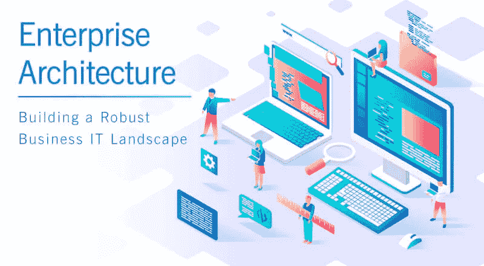

# 企业架构—构建强大的业务 IT 环境

> 原文：<https://medium.com/quick-code/enterprise-architecture-building-a-robust-business-it-landscape-e966edda102a?source=collection_archive---------0----------------------->

> "企业架构的目标是无边界的信息流，其中所有系统，包括 IT 和非 IT 系统，都可以互操作."—艾伦·布朗

今天，当技术已经在全球几乎所有的行业领域中证明了其至高无上的力量时，数字化似乎正在对企业架构(EA)产生巨大的影响。业务正在超越企业界限，IT 解决方案涵盖了企业、客户、利益相关者、生态系统等等。在这种时候，很难管理传统的整体框架。现在是时候制定一个流程，为规划和管理整个数字浪潮提供足够的空间。

带着这个概念，大约在 20 世纪 60 年代，企业架构开始起步。由 Dewey Walker 教授发起，由他的学生 John Zachmann 推进，企业架构进入了技术世界。在 20 世纪 80 年代的某个时候，企业意识到他们需要一个完美的计划方法来跟上快速发展的技术网络。这进一步推动了企业架构的发展，使其超越单纯的 IT，试图包含业务的所有重要组成部分。重点领域是已经处于数字化模式并需要无缝集成传统应用和流程的大型组织。

> “我们认为企业架构是我们用来全面描述和映射业务功能和业务需求并将它们与信息系统需求相关联的过程。”—托尼·苏格特

# 企业和架构——了解融合

术语“企业”不需要详细解释。基本上，它是一个组织或一组组织，专注于一组共同的目标，向客户提供某些产品/服务。该术语涵盖所有类型的组织，无论其部门、位置、规模如何，并包括所有负责的实体，如人员、程序、技术、数据等。

术语“架构”谈论任何系统的基本概念，包括环境、基础设施、元素之间的相互关系、设计原则和实现。

# 企业架构—简介

**一些众所周知的定义:**

> “企业架构(EA)是“一种定义良好的实践，用于进行企业分析、设计、规划和实施，在任何时候都使用综合的方法，以成功地开发和执行战略。企业架构应用架构原则和实践来指导组织完成执行其策略所必需的业务、信息、流程和技术变更。这些实践利用企业的各个方面来识别、激励和实现这些变化。”——[维基百科](https://en.wikipedia.org/wiki/Enterprise_architecture)
> 
> “企业架构(EA)是一个概念蓝图，它定义了一个组织的结构和操作。企业架构的目的是确定一个组织如何最有效地实现其当前和未来的目标。”— [TechTarget](https://searchcio.techtarget.com/definition/enterprise-architecture)
> 
> “企业架构(EA)是一门学科，通过识别和分析对期望的业务愿景和结果的改变的执行，主动地和整体地引导企业对破坏性力量的响应。EA 通过向业务和 IT 领导提供签名就绪的建议来交付价值，这些建议用于调整策略和项目，以实现利用相关业务中断的目标业务成果。EA 用于引导决策制定向未来状态架构的演进。”— [高德纳公司](https://www.gartner.com/it-glossary/enterprise-architecture-ea/)

以上三个定义说明了一切。艺电不仅涉足 IT 相关业务。它迎合了整个商业格局。基本上，企业架构师参与选择基本的优先级，并提供他们的专业知识来构建敏捷、灵活和健壮的解决方案。EA 从项目的开始就参与其中，直到项目的实施以及以后。

## 以下是 EA 对 SDLC 的影响:

*Courtesy:* [*https://commons.wikimedia.org/wiki/File:Enterprise_Architecture_Waterfall_Model.gif*](https://commons.wikimedia.org/wiki/File:Enterprise_Architecture_Waterfall_Model.gif)

## 一些流行的企业架构规划方法有

*   **联邦企业架构框架(FEAF)**
*   **开放集团架构框架(TOGAF)**
*   **Zach man 企业架构框架**

## 联邦企业架构框架(FEAF)

联邦企业架构是联邦政府的企业架构。它为战略、业务和技术管理的集成提供了一种通用方法，作为组织设计和绩效管理的一部分。

目标是为整个联邦政府组织和促进联邦信息的共享。

*   **开放式群体架构框架(TOGAF)**

TOGAF 提供了设计、规划、实现和治理企业 IT 架构的原则。它有助于通过系统的方法组织开发过程，旨在减少错误，保持预算，并与业务单位保持一致，以产生高质量的结果。

它于 1995 年问世，到 2016 年，80%的世界领先企业采用了这一框架。

*   **扎克曼企业架构**

Zachman 框架是一个逻辑结构，旨在提供企业的全面表示。它有助于从不同的角度查看企业及其信息系统，并显示企业的各个组件是如何关联的。

它作为一种主动的业务工具，可用于对组织的现有功能、元素和流程进行建模，并帮助企业管理变更。

# 企业架构的目标

*   促进信息、业务和技术的无缝流动
*   将人员、数据和技术结合起来，提供利益相关者之间内部关系的综合视图
*   采用最佳业务实践，确保提高效率、适当性和准确性
*   在整个企业中建立一个集成的 IT 环境，并与业务部门保持紧密联系
*   认可当前 IT 资产的配置、标准化、再处理和通用项目管理方法的分配
*   准备一张 IT 资源和业务流程的地图，并整合一套领先的意识形态

## 为什么企业架构在长期和短期内都是有益的？

EA 影响任何组织中的所有重要部门。以下是需要 EA 的一些关键原因:

*   **程序的统一** —它有助于增强不同解决方案和应用程序之间的互操作性。
*   **降低运营成本** —因为它可以实现所有系统的现代化，所以相关的成本因素肯定会显著降低。
*   **增加透明度**——由于所有流程都经过精心安排，并涉及所有利益相关方，因此所有人都非常了解这些工作。
*   **遵守新法规** — EA 可以帮助整个组织适应最新的规章制度。
*   **简化协作** —有助于部门间的有效沟通，从而帮助 HR 有效实施流程。
*   **有效的项目管理**——由于所有部门和流程都有良好的规划和遵循，项目管理变得更加容易。
*   **临时决策** —帮助整个企业做出正确而准确的决策
*   **增强对波动市场需求的灵活性** —变化是唯一不变的，EA 帮助调整以适应不断变化的市场条件
*   **低效率** —随着部门、流程、基础设施之间的良好沟通，低效率必然会大幅降低
*   **投资回报率最大化** —通过优化使用企业级资产和资源，投资回报率必将提高
*   **根据长期目标评估现有设置** —它确实有助于根据组织目标详细评估当前架构

# 企业架构的四个视角

对于 EA 来说，基础架构包含了架构的四个基本领域，这是所有业务部门的惯例。这些是:

*   **商业视角**

定义日常业务运营的程序和方法

*   **应用前景**

定义企业使用的过程和方法中的沟通

*   **信息视角**

划分基本信息，以便企业能够最大限度地利用

*   **技术视角**

定义企业使用的基础架构、体系结构、操作系统、硬件、编程和网络解决方案

# 企业架构师的角色

当我们大谈 EA 时，我们想到的第一个问题是谁将负责执行企业架构的任务。显而易见的答案是企业架构师。

**谁是企业架构师？他们是做什么的？他们的职责是什么？**

企业架构师在 EA 中扮演着关键的角色。该角色包括分析业务信息和流程，以便轻松有效地将它们与组织目标准确匹配。它还包括增强灵活性和耐用性，以应对即将到来的任何重大障碍。

工程架构师可以担任首席技术官、软件工程主管或首席信息官等职位。他们需要接受过 IT 行业的正规教育，在 Java、云计算、BI、大数据、系统架构、项目管理、面向服务的架构等各种技术方面至少精通十年。

职业经理人需要有发展软技能的实践经验，如合作技能、批判性分析、团队合作、领导力等。

## 企业架构师负责的角色和职责是:

*   建立架构策略和解决问题
*   处理复杂的开发项目
*   负责业务流程分析和设计
*   EA 相关活动的开发和流程实施
*   维护关键 EA 可交付成果
*   帮助企业管理团队提高业务交付
*   掌握进一步的技术和商业计划

**我们看到企业架构走向世界**

当我们看到技术接管世界，企业投入到技术池中，业务受到严重影响时，看到企业架构如何彻底改变业务格局是一件有趣的事情。影响大，获利多，影响长。拭目以待，看看影响有多大！

**注**:这篇文章之前发表在我们的博客上: [*这里*](https://www.spec-india.com/blog/enterprise-architecture/)