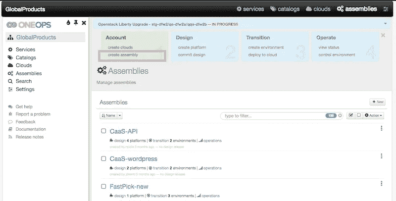
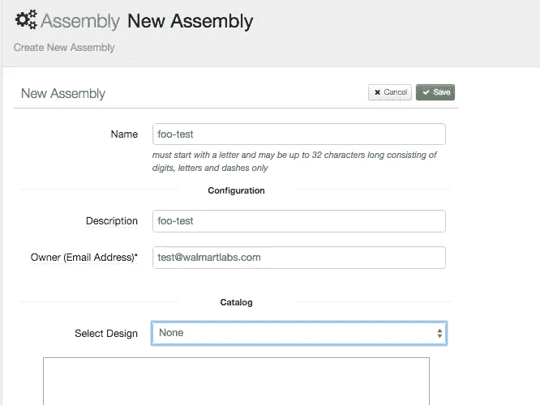
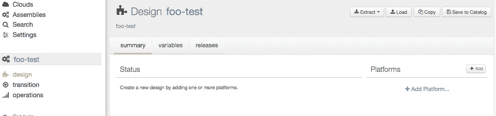
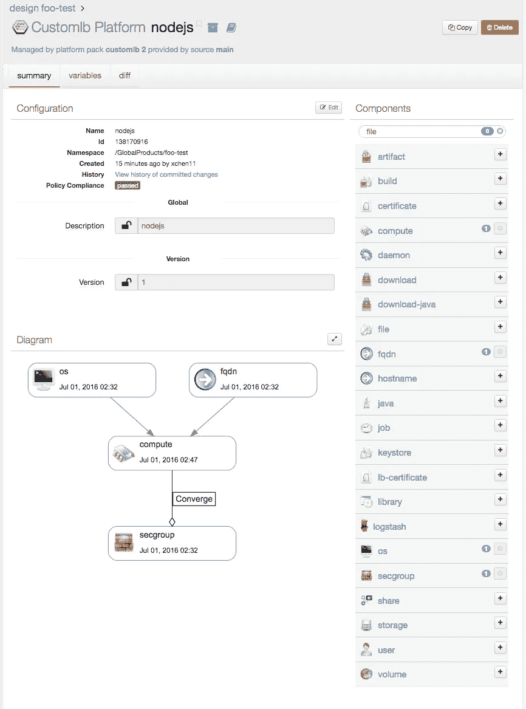
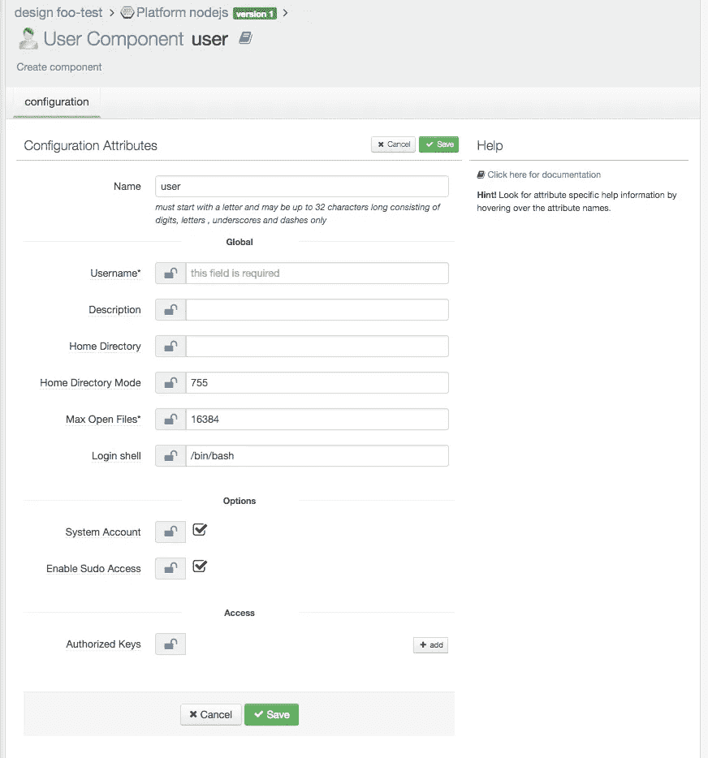
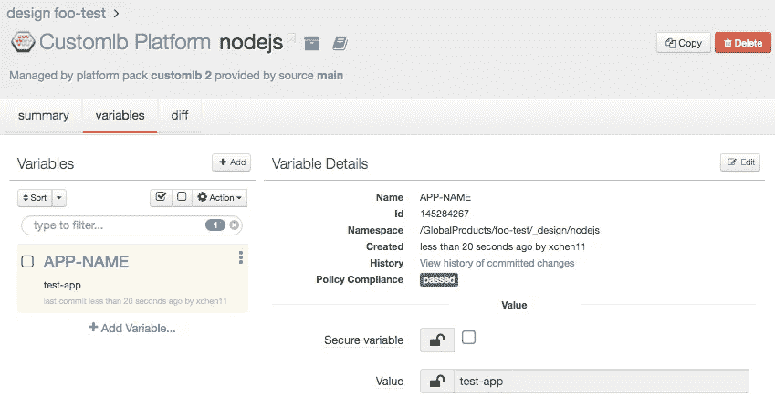
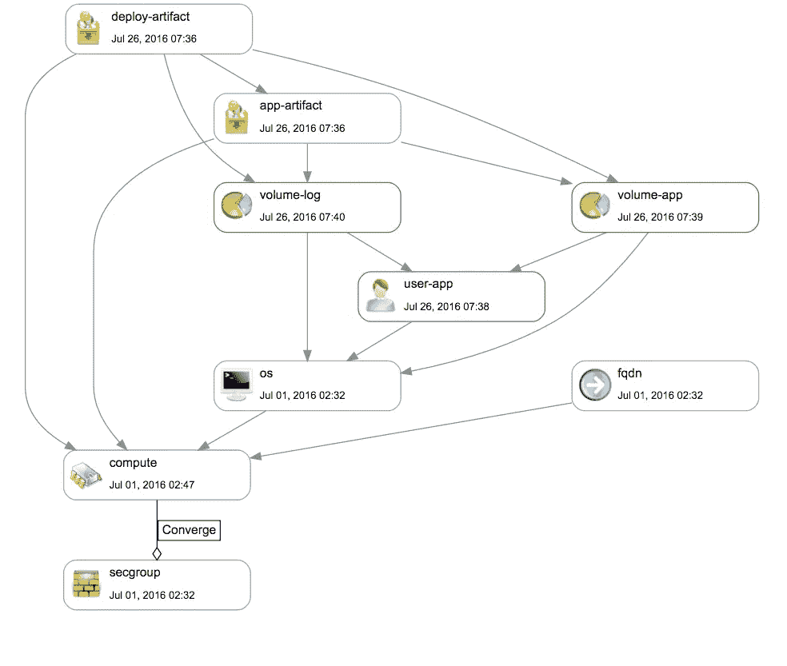

# OneOps 上的企业节点

> 原文：<https://medium.com/walmartglobaltech/enterprise-nodejs-on-oneops-f4bc7b1050cc?source=collection_archive---------2----------------------->

Image © 2015 [Victorgrigas](https://commons.wikimedia.org/wiki/User:Victorgrigas) [licensed](https://commons.wikimedia.org/wiki/File:Wikimedia_Foundation_Servers-8055_20.jpg) under the [Creative Commons](https://en.wikipedia.org/wiki/en:Creative_Commons) [Attribution-Share Alike 3.0 Unported](https://creativecommons.org/licenses/by-sa/3.0/deed.en) license.

# 介绍

在沃尔玛，我们一直在开发技术，以促进电子商务网站的发展。由 WalmartLabs 开发并支持的开源产品 OneOps 是一个让应用生命周期管理更加简单快捷的平台。当我们将 web 应用程序迁移到 [NodeJS](https://nodejs.org/en/) 时，我们发现 OneOps 是托管我们平台的自然选择。在这篇文章中，我将介绍一些 OneOps 特性，以及我们如何使用它们来实现 NodeJS 应用程序的托管、部署和持续集成(CI)。

# 什么是 OneOps？

OneOps 是由 WalmartLabs 开发和开源的应用生命周期管理(ALM)平台。更具体地说:

> OneOps 是一个云管理和应用生命周期管理平台，开发人员可以使用它来更快地开发和推出新产品，并在整个生命周期中更轻松地维护它们。OneOps 使开发人员能够在混合、多云环境中编写产品代码。

*关注 twitte* *r 上的* [*OneOps 获取新闻和更新。*](https://twitter.com/One_Ops)

# OneOps 功能

从用户的角度来看，OneOps 使用起来相当简单，无论是基于 Web 的交互式 UI 还是 REST APIs。在引擎盖下，OneOps 平台自动提供了许多好处，但我的重点将是面向用户的功能。

第一步是了解在 OneOps 上托管应用的生命周期阶段。有四个阶段:

*   ***汇编****——*一切的容器，就像 IDE 中的一个工作区。
*   ***设计*** *—托管应用的平台蓝图。*
*   ***过渡*** *—准备好你的部署蓝图和环境。*
*   ***操作*** *—监控您部署的应用。*

# 创建装配和设计

您可以相对快速地开始使用 OneOps。您需要做的第一件事是创建一个装配和设计。

使用用户界面，您可以在“组织”( organization)页面上快速创建集合。下面我将为 org *GlobalProducts* 创建一个新的装配。

OneOps 允许您将设计保存到目录中，并在创建新装配时重复使用。在这里，我从没有设计开始，来展示使用 UI 来创建一个全新的设计是什么感觉。下面是在设计屏幕上新创建的装配，它还没有平台。

添加新平台时，您需要选择一个包。OneOps 中的一个包是一个 Chef recipe，它指定了要添加到平台的 OneOps 组件。开箱即用，OneOps 附带许多专为不同需求设计的包。定制包是创建基本 Linux 平台的基础包。在下图中，它显示了 OneOps 支持的所有组件类型以及该平台包含的每个组件的数量。注意，基础平台包含 1 个*计算*，1 个 *fqdn* ，1 个 *os* ，1 个 *secgroup* 。您还可以获得一个包含组件及其依赖关系的漂亮的可视化图表。

从这里，您可以向平台添加其他组件，如存储卷和用户。用户非常重要，因为它允许您登录虚拟机。要添加新用户，单击+按钮并指定一个 Linux 用户，如下图所示。

现在是时候选择组件来实现 NodeJS 应用程序的部署流程了。候选者是*构建*或*工件*组件。在我说这些之前，我们先来看看需求。

# NodeJS 应用程序平台

不管托管环境如何，对于我们的 NodeJS 应用程序，有几个基本要求对我们很重要:

*   使用密封的二进制工件部署应用程序，该工件包含整个应用程序，包括 node_modules 目录。使用 Nexus 将工件发布到存储库中。
*   必须使用与构建密封二进制文件时相同的 NodeJS 版本来运行应用程序。不需要包含带有工件的节点二进制文件。相反，我们使用 NVM 来管理虚拟机上的节点二进制文件。
*   当部署应用程序工件时，我们可以从构建机器或 Nexus 中检索它。
*   为了避免公共或私有服务器影响我们的生产部署，我们从我们的私有 Nexus 服务器中检索软件包，包括 NodeJS 二进制文件。

OneOps 提供了足够多的现有组件类型来实现满足上述要求的平台。例如，工件组件被设计为从 Nexus 中检索一个包。这使得事情变得相当简单——只需在 OneOps 设计中创建一个工件组件。

接下来是部署和启动应用程序的脚本。OneOps 有一个*构建*组件，它允许我从 git repo 中检索文件。我最初用它来检索脚本，但后来发现甚至我们的 GitHub 服务器也不能成为生产依赖。所以我改为使用*工件*组件来检索部署脚本，因为我们的 Nexus 服务器可用性更高。

既然我已经决定了我的平台的组件，我们需要一个可以用于不同应用的单一设计。OneOps 变量为此提供了帮助。

# OneOps 变量

OneOps 平台的组件相当灵活。您可以轻松地添加、编辑甚至删除它们，但是通常对组件进行更改会更加复杂。为了实现简单的定制，OneOps 支持全局或设计级别的变量。您可以访问组件设置或脚本中的任何变量。用户可以快速更改变量来定制平台，而不必了解组件的内部。

Platform with a variable APP-NAME.

有了设计变量，创建设计所需的一切都在那里了。虽然您可以进行单一设计，但是一旦您需要对您的平台进行调整，您将希望有一个可重用的设置脚本，而不是通过 UI 手动调整。

# 安装脚本

创建新设计后，可以将其添加到全局目录中，从而能够使用相同的设计快速创建新的部件。但是，OneOps 中的目录功能不是很灵活。一旦将设计保存到目录中，就不容易查看设计中的内容，并且您不能拥有对设计所做更改的修订历史记录。

我决定在 Bash 中编写一个设置脚本，它可以使用 OneOps APIs 来创建新的组装、设计和平台。这里是 API 的一个引用。我使用 cURL 在 Bash 中编写脚本来进行 API 调用。回想起来，也许我应该使用 NodeJS，但当时 OneOps 文档处于不断变化之中，使用 cURL 可以让我很快尝试一些东西，所以它就被卡住了。随着时间的推移，该脚本已经更新了多次，它允许我们的开发人员快速创建新的 OneOps 组件，并为新的应用程序进行设计或只是进行实验。

# 部署脚本

对于 NodeJS 平台实现，我决定使用工件组件来检索应用程序和部署脚本。由于部署脚本在应用程序被检索之前无法运行，因此它依赖于应用程序工件组件。

为了实现部署脚本，我可以选择将它们开发成 OneOps 使用的 ruby 脚本，但是我决定使用 Bash 脚本，因为我已经很熟悉了，并且 OneOps 支持从组件执行 Bash 脚本。

部署脚本做了许多小事情，以确保虚拟机拥有运行应用程序所需的一切。以下是它执行的一些基本任务的列表:

*   安装和设置必要的软件，如 NodeJS 二进制文件、NGINX 和 PM2
*   确保先关闭应用程序的现有实例
*   生成启动和关闭脚本。
*   清理旧版本的应用程序
*   启动应用程序

脚本被压缩并上传到 Nexus。OneOps 组件在检索之后开始执行它。

# 完整的图片

现在，我们已经探索了 OneOps 提供的功能，这些功能允许我们建立一个平台来托管 NodeJS 应用程序。这是该平台的组件图。有一些小细节被遗漏了，但它有所有的要素。同样，这个图表是由 OneOps UI 生成的，它实际上是 UI 上的一个可点击的交互式图表。

任何开发人员都可以按照简单的说明，使用设置脚本在 OneOps 上创建一个新的程序集，以便将 NodeJS 应用程序部署到云环境中。

# 部署和操作

到目前为止，我们已经讨论了组装和设计阶段。接下来是过渡阶段。顾名思义，它基本上是一个过渡，作为将设计部署到特定环境的一个存放位置。在我们的云中，我们有*生产*、*试运行*和*开发*环境。过渡允许我们为每个环境镜像并持有设计的副本。每个副本都可以独立修改和定制。如果主设计被更新，它可以被拉进一个给定的转换中来更新它的副本。对于开发人员来说，他们的大部分活动都围绕着产品化阶段。当他们有一个新的构建要在开发环境中测试时，他们会去更新工件版本并启动部署。

将过渡部署到实际虚拟机后，将激活操作阶段。在此阶段，我们可以检查部署历史、虚拟机运行状况通知和虚拟机信息，如 CPU、RAM 和操作系统指标。

# 监视

我们的应用程序使用仪器进行详细分析，但 OneOps 还提供"[对照阈值持续跟踪指标。自动触发修复、替换、扩展或升级事件](http://oneops.com/benefits.html)。我们会定期收到报告虚拟机运行状况的电子邮件，如果有任何异常，我们会发出警报。当虚拟机变得不健康并停止运行时，我们会收到警报，OneOps 会自动触发修复过程并重新部署虚拟机。

# 连续累计

至此，我们在 OneOps 上的 NodeJS 平台已经可以运行了。我们的开发人员可以轻松地在云中创建他们自己的测试和开发实例，但是对于我们的正常开发过程，我们希望我们的构建能够自动部署成功的构建并开始功能测试。借助 OneOps APIs，这一切都可以通过自动化脚本实现。

我编写了另一个 Bash 脚本，它使用 OneOps 部署 API，并使通常通过 UI 完成的 OneOps 部署过程可以通过远程命令来完成。我们的 NodeJS 应用程序的构建工作使用这个脚本来自动启动部署和功能测试。

# 采用

在我们推出 OneOps NodeJS 平台后，我们有几十名开发人员在两周内试用了该平台，他们能够快速获得 NodeJS 环境的计算资源以进行学习和测试。我们的团队致力于将应用程序迁移到 NodeJS，能够快速设置多个开发和 QA 测试环境，以进行回归和持续集成。目前，我们有十几个应用程序正在开发中。每个团队都使用 OneOps UI 和[API](http://oneops.github.io/developer/references/)管理他们自己的云实例，并且每天都在多个集成周期中快速迭代。OneOps 平台的灵活性是帮助我们的开发人员实现快速周转的关键。

# 其他想法

OneOps 是一个功能丰富且灵活的平台。使用 OneOps 有许多固有的好处，包括我们的 NodeJS 迁移中没有利用的其他功能。例如，有一个 docker 包正在开发中。包开发通过对 Chef APIs 的本地访问提供了更多的灵活性。我们现在正致力于将我们的设计转换成原生 OneOps 包。

# 结论

OneOps 是由 WalmartLabs 开发和开源的云管理和应用生命周期管理平台。它是多功能的，具有许多“开箱即用”的功能，使在云中部署应用程序变得方便而灵活。我们已经成功地使用它在企业范围内将沃尔玛电子商务网站迁移到 NodeJS。