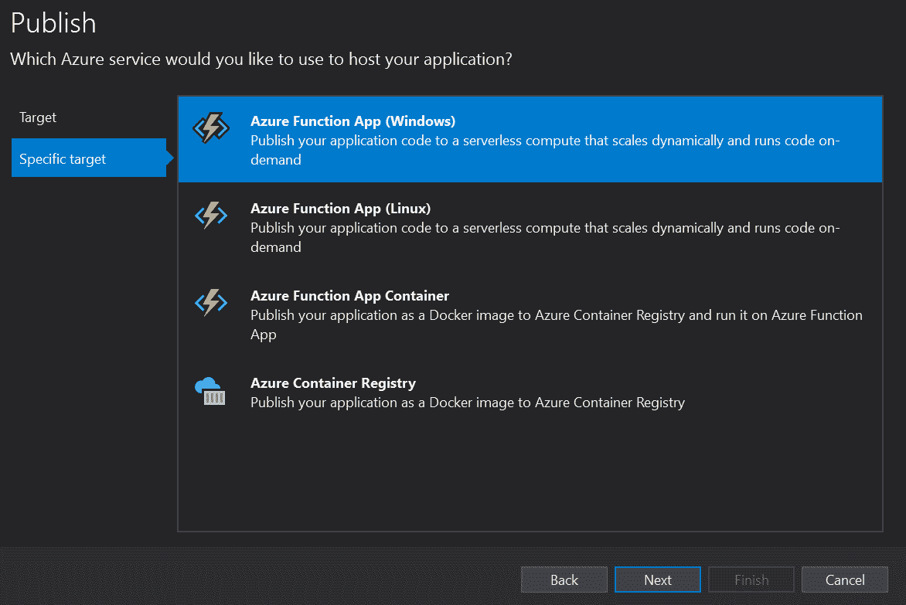

# 具有依赖注入的 Azure 函数上的实体框架

> 原文：<https://medium.com/globant/entity-framework-on-azure-functions-with-dependency-injection-77208c94a16?source=collection_archive---------0----------------------->

# 介绍

本文的目的是展示在 Azure 函数上使用实体框架，并通过依赖注入将数据存储在 SQL 数据库中作为后备存储。随着对 Azure 函数的[依赖注入支持的发布，在 Azure 函数中使用实体框架感觉更容易了。在软件工程中，**依赖注入**是一种技术，其中一个**对象接收它**依赖的其他对象**。这些其他对象称为依赖关系。在典型的“使用”关系中，接收对象称为客户端，传递(即“注入”)的对象称为服务。**](https://docs.microsoft.com/en-us/azure/azure-functions/functions-dotnet-dependency-injection)

# 背景

**提取、转换和加载(ETL)** 是一个常见的业务功能，通常对于不同系统之间的集成是必要的。ETL 工具的用例是公司将数据从遗留系统转移到更新的系统，以便与新的基础设施兼容。Azure 函数是专注于特定问题的小段代码，非常适合处理 ETL 之类的任务。本文演示了如何创建一个示例函数应用程序来读取 CSV 文件中的数据，然后使用 Azure 函数上的**实体框架**利用**依赖注入将数据存储到数据库中。**Azure Function 的依赖注入特性使得在 Azure Functions 应用中使用实体框架数据库上下文变得非常简单。

**本文涵盖以下几点:**

*   先决条件
*   示范
*   使用案例
*   结论
*   参考

# **先决条件**

下面是本文的先决条件:

*   [天蓝色为。NET 开发者](https://docs.microsoft.com/en-us/dotnet/azure/intro)
*   [天蓝色功能](https://docs.microsoft.com/en-us/azure/azure-functions/functions-overview)
*   [实体框架](https://docs.microsoft.com/en-us/ef/core/)

Azure 是一个云平台，旨在简化构建现代应用程序的过程。无论你选择完全在 Azure 中托管你的应用程序，还是用 Azure 服务扩展你的内部应用程序，Azure 都可以帮助你创建可伸缩、可靠和可维护的应用程序。

Azure Functions 是一个无服务器的解决方案，它允许您编写更少的代码，维护更少的基础设施，并节省成本。云基础设施提供保持应用运行所需的所有最新资源，而不是担心部署和维护服务器。

实体框架是一个开源的 ORM 框架。微软支持的. NET 应用程序。Entity Framework 使开发人员能够使用领域特定类的对象来处理数据，而无需关注存储这些数据的底层数据库表和列。

# 示范

以下是高级步骤:

1.  创建 Azure 函数项目
2.  参考必需的 Nuget 包
3.  设置依赖注入
4.  在本地测试 Azure 功能
5.  发布功能 App

**1。创建 Azure 功能项目**

第一步是在 Visual Studio 中创建新项目，并选择 Azure Functions 模板。这将为您提供创建 Azure 函数的框架结构。

在下一个窗口中，您可以选择您希望该功能成为的触发器类型，出于演示目的，我选择了一个计时器触发器，它将在使用 ncron 安排的指定时间运行。

**2。参考所需的 Nuget 包**

现在，为了使用依赖注入，您需要验证两件事:

1.  微软。NET.Sdk.Functions 至少是 1.0.28
2.  安装 Microsoft。Azure.Functions.Extensions 包来提供使用依赖注入的 API。

选择与版本兼容的正确版本号非常重要。你正在运行的网络。我在跑步。NET core 3.1，这就是我用过的。

我还参考了微软。azure . functions . extensions nu get 包，它让我们可以访问依赖注入特性。

我的数据库模式非常简单。下面是创建我用于测试的表的 SQL。

我还更新了我的 local.settings.json，添加了一个可以用于本地测试的连接字符串:

我已经为我的数据项实体和一个自定义 DbContext 创建了一个实体框架模型

**3。设置依赖注入**

为了为我们的函数应用程序设置依赖注入，我们在程序集上使用 FunctionsStartup 属性来指示一个启动类，它将在函数应用程序启动时运行。在从 FunctionsStartup 继承的那个类中，我们重写了 Configure 方法。这允许我们从配置中检索 SQL 连接字符串，并在服务中注册一个 DbContext，这将允许我们将 MyDbContext 注入到函数中。

依赖注入现在为我们提供了在类中定义函数的能力，这些类将它们的依赖注入到它们的构造函数中。因此，这里我定义了一个 MyTimerFunction 类，它的构造函数接受一个函数可以使用的 MyDbContext。

现在，我们已经准备好从 csv 文件中读取数据，并将数据插入数据库。下面我们从 csv 文件中读取数据并返回数据对象，然后使用之前定义的 MyDbContext 将这些数据对象插入到表中。

**4。本地测试 Azure 功能**

为了在本地调试定时器触发器的代码，我们需要添加下面的方法签名。

示例运行输出如下:

**5。发布功能 App**

一旦我们确定该功能按预期运行，我们就可以继续部署 Azure 功能了。您将需要根据所使用的内容修改连接字符串。出于演示的目的，我在 Azure 的 **Redhat 虚拟机上安装了 **SQL Express** ，并将其用作我的**数据库**。要部署 Azure 功能，右键单击项目并选择 publish。**

然后选择**目标**作为 **Azure** 并点击下一步。选择**具体目标**为**Azure Function App(Windows)**后接**订阅名称**和**您要部署功能 App 的资源组**。您可以使用现有的功能应用程序，也可以创建一个新的功能应用程序，然后单击完成。

对我来说，由于我在虚拟机上使用了 SQL Express，所以我必须允许来自功能应用程序可用的所有可能 IP 地址的流量通过 SQL 端口。为了获得所有 IP 地址的列表，我使用了下面的命令。你可以在这里阅读[。](https://docs.microsoft.com/en-us/azure/azure-functions/ip-addresses)

就是这样，你已经通过依赖注入成功地在 Azure 函数上使用了实体框架。

你可以点击查看示例代码[。](https://github.com/kunalborker/AzureFunctionWithEF.git)

# 使用案例

上述实现有许多应用。传统的方法通常包括设置专用的 FTP 服务器，然后部署计划的作业来解析文件并翻译它们以供业务使用。无服务器架构使这项工作变得更加容易，因为文件上传时可以触发触发器。另一个实时应用是利用 API 从第三方工具/应用中获取数据，这些第三方工具/应用不以指定的间隔/触发来保留数据，并存储它们以备将来使用。

# 结论

在这篇文章中，我们演示了如何将依赖注入 Azure 函数应用程序并将数据导入存储。在 Azure 函数中使用依赖注入的能力意味着可以使用经过验证的设计模式来更好地编写解决方案，以获得更好的可维护性和可测试性。

# 参考

*   [https://www . code project . com/Articles/5251396/Use-Azure-Functions-to-process-a-CSV-File-and-impo](https://www.codeproject.com/Articles/5251396/Use-Azure-Functions-to-process-a-CSV-File-and-impo)
*   [https://www . entityframework tutorial . net/code-first/configure-entity-mappings-using-fluent-API . aspx](https://www.entityframeworktutorial.net/code-first/configure-entity-mappings-using-fluent-api.aspx)
*   [https://www . SQL shack . com/logging-messages-from-azure-functions-to-azure-SQL-database/](https://www.sqlshack.com/logging-messages-from-azure-functions-to-azure-sql-database/)
*   [https://markheath.net/post/ef-core-di-azure-functions](https://markheath.net/post/ef-core-di-azure-functions)