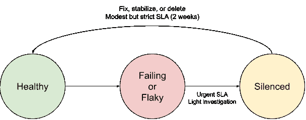
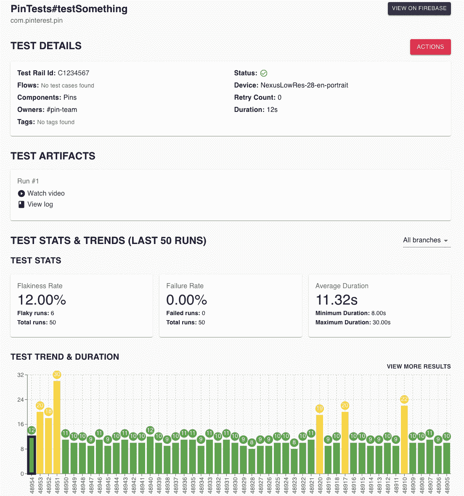

# 提前在 Pinterest 上提交 UI 测试

> 原文：<https://medium.com/pinterest-engineering/enviar-previamente-pruebas-de-iu-en-pinterest-f6a55506b64?source=collection_archive---------5----------------------->

Mansfield Mark | 移动测试工具、指标质量和测试工具的领导者

*这篇文章最初发表于 英语.Read the English version* [*here*](/pinterest-engineering/pre-submit-ui-tests-at-pinterest-556be1611be) *(T7 )*

# 摘要

在我们 [向左转](https://en.wikipedia.org/wiki/Shift-left_testing) 的努力中(在项目时间线上进行更早或向左转的测试),本博客解释了我们如何在分配到我们的 Android 或 iOS 存储库之前开始运行大量的端到端 UI 测试。该项目涉及用户界面测试,测试基础设施和开发人员生产力的仔细协调。

发货后,我们可以:

*   减少调查时间和故障排除
*   将我们的测试套件的传球率提高 <50 % a > 90%
*   启用我们的用户界面测试平台,以支持更多设备的测试

# 代码更改生命周期

我们将变更生命周期分为四个步骤:

1.  **代码审查:** 分享提取请求,引导反馈
2.  **装运前检查:** 示例:在应用于基本确认的提取请求中执行的单元测试、linters
3.  **发送*:** 差异被提交到主分支
4.  **发货后测试:** 示例:集成测试,版本编译

(*)一些组织在“提交”步骤中进行审核,而不仅仅是检测统一冲突,例如 Uber 的[SubmitQueue](https://eng.uber.com/research/keeping-master-green-at-scale/)。虽然这不在本出版物的范围内,但这些控件值得考虑作为运行测试的地方,尽管它们有自己的复杂性和变化。

# 动机

随着我们的用户界面测试集的增长,我们发现维护测试非常困难。通常,非关键路径上的故障没有得到及时解决,导致不可持续的后果。例如:

*   很多时候,纠正证据的人不是那些在不起作用的代码上工作的人。
*   通常,纠正证据的人在几天后,经过几次上下文的改变后,就来到了这份工作。
*   错误可以相互堆积,使解决方案复杂化并隐藏问题

一组包含许多失败测试的测试立即失去其价值。测试用例将由版本团队手动验证,否则将被忽略。随着测试集的恶化,检测到的回归较少,未来对 UI 测试的任何投资似乎都不那么有用。

用户界面测试是缓慢、昂贵和不稳定的。因此,它们通常在发货后的步骤中运行。这将它们从开发人员的关键路径中移除,并避免由于速度或不稳定性而导致的延迟。

本出版物记录了我们如何将 UI 测试集迁移到发送前 (T1) 而不是发送后 (T3)。此更改大大降低了我们的测试维护成本,并为我们的版本提供了更好的保护。

# 挑战 1:所有权

我们需要测试有一个绝对负责进行测试的团队。

业主们:

*   他们将监控警报渠道,以响应他们的测试问题
*   他们将决定如何修复测试,何时更新测试,何时删除测试等。

为了确保问责制,我们利用了**沉默**测试的能力,这意味着我们忽略了他们的失败。业主团队必须在两周内解决所有静音测试。****

****沉默测试意味着有人决定可以忽略这些错误。很多时候,这个决定是模棱两可的,作为一个明显过时的测试。否则,证据所有者必须对沉默的决定拥有最终发言权。****

****静默测试会创建一个生命周期,使您能够:****

*   ****快速缓解主分支中的错误,无需向前或向后校正****
*   ****用于在测试集中重置测试的确定性 SLA****

********

****Ciclo de vida de una prueba problemática****

# ****挑战 2:平衡速度和成本****

****我们对每个发布的差异运行测试。对我们来说,这意味着大约 2.5 场比赛的差异。我们还每小时从主分支运行一次测试,以充当状态检查。在 Pinterest 上,这相当于每周大约 700 次构建,每次构建 300 次测试。****

****在代码交付的关键路径上进行的测试意味着速度直接影响开发人员的速度。我们希望测试套件在合理的时间内(例如 30 分钟)继续运行,而不会产生过高的成本。****

## ****范围内的解决方案****

****我们注意到,我们的速度可以通过一系列简单的测试级解决方案来提高。****

*   ****测试等待时间的最小限制(5 分钟)****
*   ****快速失败(例如,如果出现问题,没有无限期等待或无限滚动)****
*   ****简化测试(如,深层链接直接到正在测试的页面,而不是导航到它)****
*   ****忽略静音测试输入(如果忽略,则无需再次运行)****

## ****并行化****

****并行运行测试对于提高速度至关重要。但是,在 300 个片段上运行 300 个测试通常非常昂贵。在并行化中,有许多工具可用于平衡测试速度和成本。****

## ****Android****

****我们通过一个名为[Flank](https://github.com/Flank/flank)的碎片整理工具在 Firebase 测试实验室中运行我们的 Android 测试。Flank 支持一个名为“ [Smart Flank](https://flank.github.io/flank/smart_flank/) ”的功能,该功能将基于历史运行数据进行智能碎片测试,以确保所有碎片同时完成。****

## ****关于 iOS****

****我们在 AWS EC2 上的 macOS 执行个体上使用名为 [bluepill](https://github.com/MobileNativeFoundation/bluepill) 的工具执行 iOS 测试。当模拟器争夺系统资源时,高度并行化会降低稳定性,从而导致不可预测的安全链和框架崩溃。为了弥补有限的并行性,我们在 bluepill 上创建了一个自定义调度程序[pinpill](https://github.com/rainnapper/bluepill/tree/mmark/pinpill),以便在完成测试时更有效地使用可用的模拟器。****

# ****挑战 3:开发者体验****

****运行交付后 UI 测试意味着许多开发人员在与 UI 测试及其结果进行交互时几乎没有经验。对证据的无知也意味着你可能会遇到与你的领域无关的证据。我们通过使用用户界面测试来投资于开发人员的体验,以最大限度地减少忽视和挫折。****

## ****净化****

****每个测试结果必须有可用的录像和录像。视频录制对于使用户界面测试更易于访问至关重要。****

****查找测试错误应该只需点击几下。在 Pinterest,我们有一个工具,可以收集一个版本的测试结果,并将其显示在一个地方。测试结果与显示:****

*   ****链接测试文物****
*   ****测试历史****
*   ****测试所有权信息(Slack 频道、团队)****
*   ****按钮来沉默测试****

********

****Captura de pantalla de una página de resumen de resultados de prueba de la herramienta interna de Pinterest.****

## ****支持与缓解****

******信息(T9)******

****我们的团队正在轮换,以帮助工程师了解阻碍交付的用户界面测试错误。我们提供办公时间,并留出时间来解决问题和相关问题。****

****记录工程师将要经历的所有关键场景,例如:****

*   ****何时沉默测试****
*   ****如何调查故障和常见错误****
*   ****如何控制假阴性,确定后续步骤并回收以前的运行。****

******缓存结果******

****在某些时候,工程师会被错误地锁定。提到的“回收”机制允许他们跳过不必要的重复。如果一个测试在编译中失败,并且被确定为 false-negative,那么该测试可以并且应该被静音。重复后,所有先前的失败将被静音,并且可以跳过完整的测试执行。****

****这有第二个目的,让团队负责他们的测试。如果测试中的错误突然爆发并阻止工程师,他们的测试将沉默并导致他们调查原因。****

# ****挑战 4:隔离主要故障分支****

## ****实验梯队****

****我们将每 30 分钟拍摄一次客户端 A/B 测试实验的快照,并合并到应用程序代码中。这在源控制中创建了一个密封的实验状态。****

****在这些更新之前运行测试时,我们会随着实验的增加和减少而运行“发货前”测试。我们建议阻止实验的斜坡,如果没有进行测试。****

****此模式应适用于任何将分离置于危险中的自动确认。****

## ****稳定性强制****

****Stability Enforcer 是一个工具,当测试显示出不稳定的迹象时,它会自动静音。例如,如果一个测试在过去的 20 次运行中变得 >20% 可疑,它将被静音;如果它不断失败,它将不会静音。****

****这有助于减轻监督问题的负担,并防止过多的错误落入开发人员之手。****

## ****监督****

****我们的警卫轮换系统在工作时间内监控主分支机构的所有故障。这些错误并不总是与特定的确认相关联,因此发货前测试并不总是可以避免这些错误。最常见的原因是 API 故障,服务器响应更改和工具故障。我们的团队帮助处理或解决这些问题,以最大限度地降低阻止开发人员的风险。****

# ****度量****

****为了确保测试集在测试更改和应用程序演变时保持良好状态,需要跟踪和维护一些关键指标。****

## ****主分支的传球率百分比****

****这是一个关键指标,它指示您以不恰当的方式阻止开发人员更改的频率。****

****我们建议您只计算在工作时间内运行的测试,以避免过夜或周末失败,并避免失败的成功率。****

****除了测试稳定性之外,它还衡量您的过程响应失败的有效性。****

## ****测试速度****

****我们建议使用 P90 以确保开发人员获得一致的体验,而不会让他们等待构建完成。我们最初的目标是端到端 30 分钟。我们相信可以通过增加投资来缩短时间。****

## ****沉默的测试****

****使用不稳定的测试集,许多测试可能会被静音。永远不要让很大一部分人沉默。大量的静音测试可能意味着:****

*   ****您的工程组织没有配备适当的工具或指南来编写稳定的测试。****
*   ****团队未能满足其 SLA 来解决错误****
*   ****很少有人进行过多的测试,他们可能不知道所有的事情。****

## ****证据数量****

****测试集将随着应用程序的复杂性而增长。跟踪测试集的大小将帮助您解决扩展和维护问题。****

****过多的用户界面测试通常不是一个好兆头。用户界面测试是检测明显故障的最后一道防线。但是,与其他类型的测试不同,它们过于缓慢和昂贵,无法为每次修改用户操作生成。****

# ****增加****

****从装运后到装运前的转变是生产力和周转的主要风险,因此应谨慎对待。我们建议以下阶段:****

## ****清理测试和过程****

****花几周时间非常勤奋地测试质量和可靠性。搜索并解决您在测试中遇到的所有问题。****

****尽快测试捕获和故障排除过程。切换到发货前后,负载将显着减少,并在其他设备之间分配,但您必须首先完成工作,以确保该过程正常工作。****

****联系以确保测试团队在进行发货前更改后了解更严格的 SLA。这使他们有机会提出担忧,删除证据等。****

## ****使能****

****它与少数团队合作,并对这些团队成员提交的差异运行发运前测试集。****

****编写通知或文档以告知工程师您的差异正在运行 UI 测试集,并将其链接到相关资源。****

****我们将启用阶段增加到所有差异的 10-15%,持续 2 周,然后再继续。****

## ****停用****

****就像航运强度一样,它创建了一种机制,以便在出现问题时避免测试。确保工程师了解此机制以及何时使用它。现在,您可以更改控件:对所有更改运行提前测试,并禁用提交后运行。****

****现在误差在阶段差异中,如果主分支稳定,您将失去可见性。主分支故障需要紧急处理,因为它们表明错误或中断。****

# ****结论****

****在此更改之前,我们很难将通过率保持在测试集的 50% 以上。这是一个不断赶上的游戏,发现问题,识别所有者和调试。我们现在接近传球率的 90%,守门员的负担要轻得多。****

****展望未来,我们还有很多工作要做。误报和缓慢的测试是开发人员速度的主要风险。以下是我们为下一步计划的一些事情:****

*   ****根据修改后的代码选择性地执行用户界面测试****
*   ****执行测试或控制 API 响应,以限制测试的变化****
*   ****处理测试错误日志,以检测基础设施层面的趋势和问题****

# ****致谢****

*   ****Alice Yang、Doruk Korkmaz、Freddy Montano、Jennifer Uvina、Joseph Smalls-Mantey、Matt Mo 和 Ryan Cooke,感谢他们帮助建立了 Pinterest 的测试基础设施来支持这个项目,并就如何设计我们的流程进行了无数次的讨论。****
*   ****Sha Sha Chu 和 Garrett Moon:感谢他们支持我们在 Android 和 iOS 设备上实施此更改,并为我们提供良好的开发者体验。****
*   ****负责[bluepill](https://github.com/MobileNativeFoundation/bluepill)和[flank](https://github.com/Flank/flank)创建使其成为可能的工具,并支持函数请求和错误。****
*   ****Firebase Community Slack (T5) 帮助调查和设计基础设施问题****

*****有关 Pinterest 工程的更多信息,请访问我们的*[*工程博客*](https://medium.com/pinterest-engineering)*,并访问*[*Pinterest Labs*](https://www.pinterestlabs.com?utm_source=medium&utm_medium=blog-article&utm_campaign=mark-march-11-2022&utm_content=spanish) *。要查看可用的机会并申请,请访问我们的*[*就业*](https://www.pinterestcareers.com?utm_source=medium&utm_medium=blog-article&utm_campaign=mark-march-11-2022&utm_content=spanish)*页面。(T19)*****