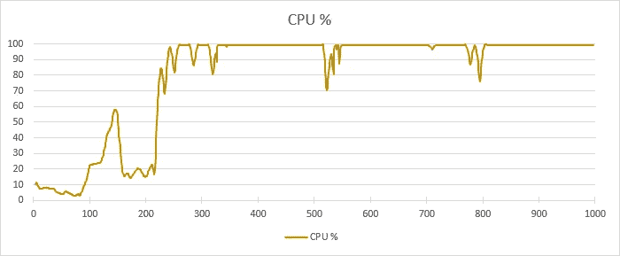
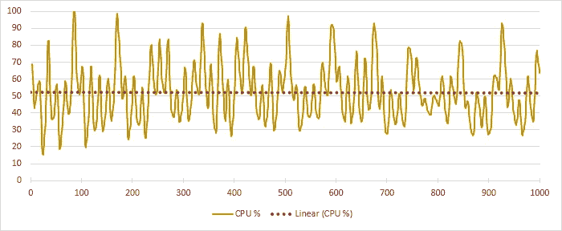

# 环境保证数据设计

> 原文：<https://medium.com/version-1/environmentally-assured-data-design-102803687b68?source=collection_archive---------9----------------------->

能耗与高效的应用程序和数据设计直接相关。做好这一点，你将**省钱**和**保护地球**。

一位客户想知道为什么他们的新数据库集群的消耗成本**极高**。基础设施具有很高的规格，但是在应用程序启动后不久，CPU 使用率就达到了 100%。它永远停留在这个水平:

分配更多的资源降低了使用率，但没有解决问题。CPU 使用率下降，但平均利用率仍在 52%左右:

CPU 使用率过高？一直吗？这不可能是对的。它每天 24 小时使用 1KW 的能量。他们消耗电力来运行工作负载和冷却房间。

## 这是怎么回事？

调查显示，应用程序**用户要求快速访问**他们的数据，并且不会容忍等待答案。架构师包括一个特性，它可以不断地重新构建那些应用程序视图，以防用户可能想要打开它们。

通过询问这种方法，很明显，与应用程序本身相比，数据架构和数据模型是次要的考虑因素。强力解决方案以**极高的能耗**为巨大代价提供了所需的性能水平。

## 如何解决:

在应用程序设计过程中，数据不是主要因素。**低效设计**和**不当缓解**导致能耗过大。

从环境(和财务)角度来看，我们必须**减少能源使用**，消除直接影响，并降低二手冷却成本。

糟糕的**查询规划**通常是类似约定的罪魁祸首，需要性能调优、数据模型改进和访问方法更新。

我们回顾了**数据访问模式**，结合**数据模型**，提出了对结构和查询层的更新。我们消除了持续的 CPU 使用问题，取而代之的是**在用户请求时提供对数据的快速访问**，满足了按需需求并**消除了重大的环境和财务成本问题**。

## 谁能帮忙？

主题领域是数据架构、数据建模、**性能调优**和应用程序开发。寻找一位数据专家，他可以在应用程序生命周期的正确时刻为您的设计提供信息。

**关于作者:** Jamie Steele 是 Azure 1.0 版的数据架构师。